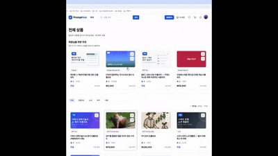
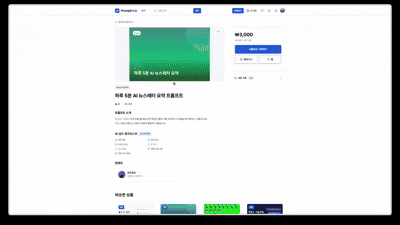
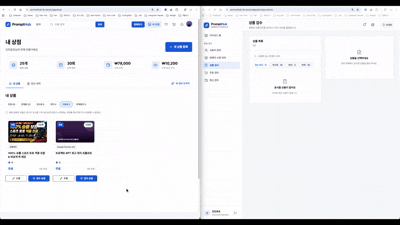
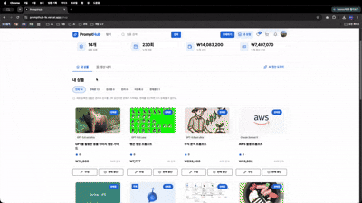

<div align="center">

  

</div>

# PromptHub

AI 프롬프트, 노션/PPT/엑셀 템플릿 등 디지털 상품을 사고파는 마켓플레이스 **PromptHub**의 백엔드입니다.
프로그래머스 백엔드 데브코스 파이널 프로젝트(팀 `3JMT`)로 제작 중이며, Spring Cloud 기반 MSA로 구성되어 있습니다.

## Table of Contents

- [Features](#features)
- [Tech Stack](#tech-stack)
- [Architecture](#architecture)
- [Run Locally](#run-locally)
- [API Reference](#api-reference)
- [Team](#team)
- [팀 / 기여 가이드](#팀--기여-가이드)
- [FAQ](#faq)
- [Demo](#demo)
- [License](#license)

## Features

- 회원가입/로그인, JWT(RS256) 기반 인증·인가, 판매자 전환
- 상품(프롬프트/노션/PPT/엑셀) 등록·조회·버전 관리(메이저/패치), 카테고리, 리뷰
- 위시리스트(찜)
- 장바구니, 주문 생성·취소
- Toss Payments 연동 결제·환불
- 정산 배치 처리 (Spring Batch, 판매자별 정산)
- 관리자 기능 (상품·정산 등 관리)

## Tech Stack

**Language**


**Framework**


**Persistence**


**Database**


**Messaging &amp; RPC**


**외부 연동**


**Infra &amp; DevOps**


**AI 개발 도구** (백엔드 런타임 연동 아님 — 코드 작성에 사용)


**License**


## Architecture


**서비스 구성** (모듈 / 포트 HTTP·gRPC / 역할)


| 모듈                   | 포트          | 역할                                                              |
| -------------------- | ----------- | --------------------------------------------------------------- |
| `discovery`          | 8761        | Eureka 서비스 레지스트리                                                |
| `config`             | 8888        | Config Server (native, `config/src/main/resources/configs/` 서빙) |
| `apigateway`         | 8000        | 진입점. JWT 검증, 라우팅, `X-User-Id`/`X-User-Role` 헤더 주입 (WebFlux)     |
| `user-service`       | 8081 / 9081 | 회원·인증(JWT 발급)·판매자·찜                                             |
| `product-service`    | 8082 / 9082 | 상품·카테고리·리뷰                                                      |
| `order-service`      | 8083 / 9083 | 주문·장바구니·Outbox Relay                                            |
| `payment-service`    | 8084 / 9084 | 결제(Toss Payments), 환불                                           |
| `settlement-service` | 8085        | 정산 (Spring Batch)                                               |
| `admin-service`      | 8086        | 관리자 기능                                                          |
| `common-module`      | -           | 공용 라이브러리 (예외, 에러코드, 공통 응답 래퍼)                                   |


**통신 방식**

- **외부 → 내부**: 클라이언트 → API Gateway(WebFlux) → JWT 서명 검증(RSA 공개키) → `X-User-Id`/`X-User-Role` 헤더 주입 → Eureka에서 `lb://{SERVICE-NAME}` 조회 후 라우팅
- **내부 동기 통신**: 서비스 간 gRPC(상품/판매자 정보 조회 등)
- **내부 비동기 통신**: Kafka (`order-events`, `product-events`, `payment-events` — 이벤트 종류는 payload의 `eventType` 필드로 구분, 예: `ORDER_PAID`, `PAYMENT_APPROVED`)
- **외부 연동**: payment-service → Toss Payments API

**인증/인가**: user-service가 로그인 시 JWT(RS256, `sub`+`epoch`만 포함)를 발급한다. API Gateway는 서명을 검증한 뒤 `roles`·`status`를 JWT 클레임으로 신뢰하지 않고 매 요청마다 내부 authorize API로 최신 값을 조회한다(forward-auth). 조회한 `status`가 `ACTIVE`가 아니면 Gateway 단에서 403 처리하고, `ACTIVE`면 `X-User-Id`, `X-User-Role`(BUYER/SELLER/ADMIN) 헤더를 다운스트림에 주입한다. 각 서비스는 JWT를 직접 파싱하지 않고 헤더만 신뢰한다.

**기동 순서**: `postgres` + `kafka` → `discovery` → `config` → 비즈니스 서비스 → `apigateway`. `docker-compose.yml`의 `depends_on`이 순서를 보장한다.

**배포**: 별도 운영(prod) 서버 없이 AWS EC2 2대에 직접 구축한 Kubernetes 클러스터(kubeadm, EKS 미사용)를 "개발서버"로 운영한다. `develop` 브랜치 머지 시 GitHub Actions(`cd-selfhosted-kubernetes.yml`)가 self-hosted runner를 통해 `prompthub` 네임스페이스에 배포하며, `main`은 완성 스냅샷을 태그(`v1.0.0` 등)로만 보존하는 동결 브랜치다.

## Run Locally

Clone the project

```bash
git clone git@github.com:prgrms-be-adv-devcourse/beadv6_6_3JMT_BE.git
cd beadv6_6_3JMT_BE
```

환경 변수 설정 ([`.env.example`](./.env.example) 참고)

```bash
cp .env.example .env
# .env에 실제 값 채우기
```

전체 서비스 기동 (Docker Compose)

```bash
docker compose --env-file .env up -d --build
```

`depends_on`이 기동 순서를 보장하므로 별도로 순서를 신경 쓸 필요는 없다. 개별 서비스만 IDE에서 띄우고 싶다면 `config` → `discovery` → 나머지 서비스 → `apigateway` 순으로 기동한다.

```bash
./gradlew :user-service:bootRun
```

## API Reference

각 서비스는 springdoc-openapi로 Swagger 문서를 제공하며, API Gateway가 `/{service-name}/v3/api-docs`로 각 서비스 문서를 프록시해 통합 Swagger UI에서 확인할 수 있다.

```
http://ec2-13-209-136-116.ap-northeast-2.compute.amazonaws.com/swagger-ui/index.html
```

## Team


| 이름           | 역할  | 담당                                                                                  | GitHub                                         |
| ------------ | --- | ----------------------------------------------------------------------------------- | ----------------------------------------------- |
| Minseo Kim   | 팀장  | Spring Cloud 기반 인증/인가, 콘텐츠 표절 탐지, PR 코드 리뷰, 시스템 설계 전반                                  | [@git-mesome](https://github.com/git-mesome)   |
| JongChan Lee | 팀원  | 비동기 분산 트랜잭션 및 주문·환불 시스템, Kafka·Redis·SSE 기반 실시간 멱등적 비동기 알림 파이프라인, Fluent Bit·ELK 기반 경량 분산 로그 수집 및 실시간 모니터링 | [@oxix97](https://github.com/oxix97)           |
| Taehyeon Ko  | 팀원  | 정산 배치 시스템 구축, Spring AI 챗봇 개발, AWS 클라우드 인프라 구축, K8s 클러스터 구축, CI/CD 파이프라인 구축                | [@TaetaetaE01](https://github.com/TaetaetaE01) |
| Jinpyo An    | 팀원  | Toss Payments 연동 결제 승인/환불 시스템 구축, Spring AI 기반 상품 자동 검수 시스템 구축                          | [@Jinpyo-An](https://github.com/Jinpyo-An)     |
| JiHeeKim     | 팀원  | 상품 도메인 설계 및 구현, Elasticsearch 검색 파이프라인 구축, 벡터 검색·OpenAI text-embedding 모델 연동             | [@jhkimm96](https://github.com/jhkimm96)       |

## 팀 / 기여 가이드

- **브랜치 전략 / 커밋 컨벤션 / 병합 전략**: [`.claude/rules/git-convention.md`](./.claude/rules/git-convention.md)
- **코드 컨벤션**: [클린 아키텍처](./.claude/rules/clean-architecture.md) · [도메인 모델](./.claude/rules/domain-model.md) · [Controller · 예외 처리](./.claude/rules/controller-exception.md) · [코드 스타일](./.claude/rules/code-style.md) · [Swagger 문서화](./.claude/rules/swagger.md) · [보안(시크릿 유출 방지)](./.claude/rules/security.md) · [Kafka 이벤트](./.claude/rules/kafka-event.md)
- 서비스가 자체 규칙을 두면(예: `product-service/.claude/rules/kafka-event.md`) 그 서비스에서는 그쪽이 우선한다.
- **이슈/PR 템플릿**: [Pull Request](./.github/PULL_REQUEST_TEMPLATE.md) · [Bug Report](./.github/ISSUE_TEMPLATE/bug_report.md) · [Feature Request](./.github/ISSUE_TEMPLATE/feature_request.md)

## FAQ

> **왜 마이크로서비스로 나눴나요?**

데브코스 파이널 프로젝트로, 서비스 분리·서비스 간 통신(gRPC/Kafka)·배포 자동화를 직접 구현해보는 학습 목적이 크다. 실서비스 트래픽 규모에 맞춘 분리는 아니다.

> **운영(prod) 서버가 따로 없는 이유는?**

포트폴리오/학습 프로젝트라 AWS EC2 2대에 직접 구축한 Kubernetes 클러스터를 "개발서버"로 운영한다. `develop` 머지 시 self-hosted runner가 해당 클러스터에 배포하며, `main`은 완성 스냅샷을 태그로만 보존한다. 브랜치 전략 배경은 `docs/records/plan/infra/adr-0005-develop-deploy-main-freeze(v).md`, K8s 아키텍처는 `docs/architecture/kubernetes.md` 참고.

> **API 경로에 `v1`, `v2`가 같이 있는 이유는?**

세미 프로젝트(`api/v1`, 완료)에 이어 최종 프로젝트를 `api/v2`로 재구현하는 중이라 과도기적으로 공존한다. `main`은 `v1` 완성 시점의 스냅샷으로 동결되어 있다.

## Demo

<table>
  <tr>
    <td align="center">
      <br />
      상품 검색
    </td>
    <td align="center">
      <br />
      주문·결제
    </td>
  </tr>
  <tr>
    <td align="center">
      <br />
      AI 상품 검수
    </td>
    <td align="center">
      <br />
      판매자 정산
    </td>
  </tr>
</table>

## License

[MIT](./LICENSE)