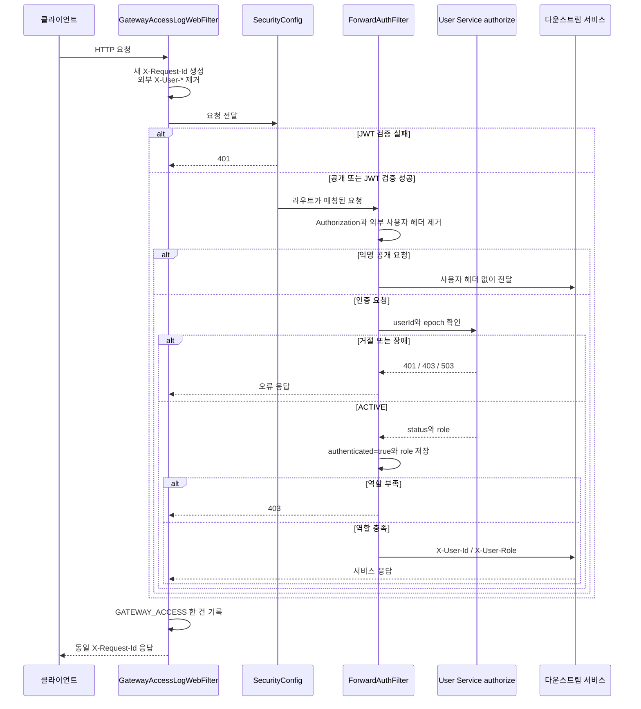

# API Gateway Structured Access Log Implementation Plan

> **For agentic workers:** REQUIRED SUB-SKILL: Use superpowers:subagent-driven-development (recommended) or superpowers:executing-plans to implement this plan task-by-task. Steps use checkbox (`- [ ]`) syntax for tracking.

**Goal:** API Gateway가 모든 비헬스 요청에 새 `X-Request-Id`를 전파하고, Security 401·미매칭 404·예외·취소를 포함한 요청 결과를 Logstash JSON access 이벤트 한 건으로 기록하게 한다.

**Architecture:** `Ordered.HIGHEST_PRECEDENCE`의 신규 `GatewayAccessLogWebFilter`가 전체 WebFlux 체인을 감싸 요청 컨텍스트와 종료 신호를 관리한다. 로그 모델 생성, client IP 추출과 SLF4J 출력은 각각 독립 컴포넌트로 분리하고, 기존 `ForwardAuthFilter`에는 헤더 정리와 인증 결과 attribute 기록만 추가한다.

**Tech Stack:** Java 21, Spring Boot 4.1.0, Spring Cloud Gateway Server WebFlux 5.0.2, Reactor 3.8.6, SLF4J 2.0.18, Logback 1.5.34, JUnit 5, AssertJ, Mockito, Jackson 3

## Global Constraints

- 작업 브랜치는 `feat/#538-gateway-structured-access-log`, worktree는 `/private/tmp/beadv6_6_3JMT_BE-issue-538`를 사용한다.
- `SecurityConfig`, Gateway 라우트 정의, `AuthorizeClient`, 공통 모듈과 다른 서비스는 수정하지 않는다.
- Gradle 의존성과 Fluent Bit·Logstash·Elasticsearch·Kibana·Kubernetes 설정을 변경하지 않는다.
- 기존 인증 분기와 역할 정책 판정 순서를 유지한다.
- `/actuator/health`, `/actuator/health/**`, `/liveness`, `/readiness`는 요청 ID 생성과 access 로그에서 제외한다.
- 외부 `X-Request-Id`는 새 UUID로 교체하고 외부 `X-User-Id`, `X-User-Role`은 신뢰하지 않는다.
- `Authorization`, Cookie, userId, query string, 요청·응답 body와 비밀값은 access 모델과 writer에 포함하지 않는다.
- access 필드는 JSON 최상위에 기록하고 Boot가 생성하는 최상위 `level`을 사용한다.
- 상태는 정상 응답 코드 또는 기본 200, `ErrorResponse`의 내장 HTTP status, 그 밖의 예외 500, 취소 499로 기록한다.
- 레벨은 정상 2xx·3xx `INFO`, 4xx `WARN`, 5xx `ERROR`로 기록한다. `ErrorResponse`는 내장 status의 레벨, 그 밖의 예외는 `ERROR`, 취소는 failure 존재 여부와 무관하게 `WARN`을 사용한다.
- 새 동작은 반드시 실패 테스트를 먼저 실행한 뒤 최소 구현으로 통과시킨다.

---

## File Map

### 새 production 파일

- `apigateway/src/main/java/com/prompthub/apigateway/logging/GatewayLogConstants.java`: 헤더명, attribute key와 고정 로그값
- `apigateway/src/main/java/com/prompthub/apigateway/logging/support/ClientIpResolver.java`: XFF·remote address 기반 client IP
- `apigateway/src/main/java/com/prompthub/apigateway/logging/GatewayAccessLog.java`: access 이벤트 불변 모델
- `apigateway/src/main/java/com/prompthub/apigateway/logging/GatewayAccessLogFactory.java`: exchange·종료 결과를 모델로 변환
- `apigateway/src/main/java/com/prompthub/apigateway/logging/GatewayAccessLogWriter.java`: SLF4J fluent key-value 출력
- `apigateway/src/main/java/com/prompthub/apigateway/logging/GatewayAccessLogWebFilter.java`: 요청 컨텍스트와 종료 생명주기

### 새 test 파일

- `apigateway/src/test/java/com/prompthub/apigateway/logging/support/ClientIpResolverTest.java`
- `apigateway/src/test/java/com/prompthub/apigateway/logging/GatewayAccessLogFactoryTest.java`
- `apigateway/src/test/java/com/prompthub/apigateway/logging/GatewayAccessLogWriterTest.java`
- `apigateway/src/test/java/com/prompthub/apigateway/logging/GatewayAccessLogWebFilterTest.java`
- `apigateway/src/test/java/com/prompthub/apigateway/logging/GatewayStructuredLoggingIntegrationTest.java`
- `apigateway/src/test/java/com/prompthub/apigateway/config/CorsConfigTest.java`

### 제한적으로 수정할 기존 파일

- `apigateway/src/main/java/com/prompthub/apigateway/filter/ForwardAuthFilter.java`
- `apigateway/src/test/java/com/prompthub/apigateway/filter/ForwardAuthFilterTest.java`
- `apigateway/src/main/java/com/prompthub/apigateway/config/CorsConfig.java`
- `apigateway/src/main/resources/application.yml`
- `apigateway/CLAUDE.md`
- `apigateway/docs/superpowers/specs/2026-07-23-gateway-structured-access-log-design.md`
- `apigateway/docs/superpowers/plans/2026-07-23-gateway-structured-access-log.md`
- `docs/architecture/spring-cloud.md`

---

### Task 1: 로그 상수와 Client IP 추출

**Files:**
- Create: `apigateway/src/main/java/com/prompthub/apigateway/logging/GatewayLogConstants.java`
- Create: `apigateway/src/main/java/com/prompthub/apigateway/logging/support/ClientIpResolver.java`
- Test: `apigateway/src/test/java/com/prompthub/apigateway/logging/support/ClientIpResolverTest.java`

**Interfaces:**
- Consumes: `ServerWebExchange`
- Produces: `ClientIpResolver#resolve(ServerWebExchange): String`
- Produces: `GatewayLogConstants`의 public 상수

- [ ] **Step 1: Client IP 규칙을 표현하는 실패 테스트 작성**

```java
package com.prompthub.apigateway.logging.support;

import java.net.InetSocketAddress;

import org.junit.jupiter.api.Test;
import org.springframework.mock.http.server.reactive.MockServerHttpRequest;
import org.springframework.mock.web.server.MockServerWebExchange;

import static org.assertj.core.api.Assertions.assertThat;

class ClientIpResolverTest {

    private final ClientIpResolver resolver = new ClientIpResolver();

    @Test
    void XFF의_마지막_유효_IP를_선택한다() {
        MockServerWebExchange exchange = exchange(
                MockServerHttpRequest.get("/")
                        .header("X-Forwarded-For", "203.0.113.10, 10.0.0.4")
                        .remoteAddress(new InetSocketAddress("192.0.2.50", 8080)));

        assertThat(resolver.resolve(exchange)).isEqualTo("10.0.0.4");
    }

    @Test
    void 오른쪽의_잘못된_XFF_값을_건너뛴다() {
        MockServerWebExchange exchange = exchange(
                MockServerHttpRequest.get("/")
                        .header("X-Forwarded-For", "203.0.113.10, 300.0.0.1, unknown, invalid.example")
                        .remoteAddress(new InetSocketAddress("192.0.2.50", 8080)));

        assertThat(resolver.resolve(exchange)).isEqualTo("203.0.113.10");
    }

    @Test
    void IPv6_literal을_선택한다() {
        MockServerWebExchange exchange = exchange(
                MockServerHttpRequest.get("/")
                        .header("X-Forwarded-For", "198.51.100.10, 2001:db8::7"));

        assertThat(resolver.resolve(exchange)).isEqualTo("2001:db8::7");
    }

    @Test
    void 유효한_XFF가_없으면_remote_address를_사용한다() {
        MockServerWebExchange exchange = exchange(
                MockServerHttpRequest.get("/")
                        .header("X-Forwarded-For", "unknown, invalid.example")
                        .remoteAddress(new InetSocketAddress("192.0.2.44", 8080)));

        assertThat(resolver.resolve(exchange)).isEqualTo("192.0.2.44");
    }

    @Test
    void XFF와_remote_address가_없으면_unknown을_반환한다() {
        MockServerWebExchange exchange = exchange(MockServerHttpRequest.get("/"));

        assertThat(resolver.resolve(exchange)).isEqualTo("unknown");
    }

    private static MockServerWebExchange exchange(MockServerHttpRequest.BaseBuilder<?> request) {
        return MockServerWebExchange.from(request.build());
    }
}
```

- [ ] **Step 2: 테스트가 구현 부재로 실패하는지 확인**

Run:

```bash
./gradlew :apigateway:test --tests "com.prompthub.apigateway.logging.support.ClientIpResolverTest"
```

Expected: `ClientIpResolver`를 찾을 수 없다는 `compileTestJava` 실패.

- [ ] **Step 3: 고정값과 IP 추출 최소 구현 작성**

`GatewayLogConstants.java`:

```java
package com.prompthub.apigateway.logging;

public final class GatewayLogConstants {

    public static final String REQUEST_ID_HEADER = "X-Request-Id";
    public static final String USER_ID_HEADER = "X-User-Id";
    public static final String USER_ROLE_HEADER = "X-User-Role";
    public static final String X_FORWARDED_FOR_HEADER = "X-Forwarded-For";

    public static final String REQUEST_ID_ATTRIBUTE = "prompthub.gateway.requestId";
    public static final String AUTHENTICATED_ATTRIBUTE = "prompthub.gateway.authenticated";
    public static final String USER_ROLE_ATTRIBUTE = "prompthub.gateway.userRole";

    public static final String EVENT_TYPE = "GATEWAY_ACCESS";
    public static final String SERVICE_NAME = "apigateway";
    public static final String ACCESS_MESSAGE = "Gateway access";
    public static final String UNKNOWN = "unknown";

    private GatewayLogConstants() {
    }
}
```

`ClientIpResolver.java`:

```java
package com.prompthub.apigateway.logging.support;

import java.net.InetSocketAddress;
import java.util.List;

import org.springframework.http.HttpHeaders;
import org.springframework.stereotype.Component;
import org.springframework.web.server.ServerWebExchange;

import static com.prompthub.apigateway.logging.GatewayLogConstants.UNKNOWN;
import static com.prompthub.apigateway.logging.GatewayLogConstants.X_FORWARDED_FOR_HEADER;

@Component
public class ClientIpResolver {

    public String resolve(ServerWebExchange exchange) {
        String forwarded = lastValidForwardedAddress(exchange.getRequest().getHeaders());
        if (forwarded != null) {
            return forwarded;
        }

        InetSocketAddress remoteAddress = exchange.getRequest().getRemoteAddress();
        if (remoteAddress == null || remoteAddress.getAddress() == null) {
            return UNKNOWN;
        }
        return remoteAddress.getAddress().getHostAddress();
    }

    private String lastValidForwardedAddress(HttpHeaders headers) {
        List<String> values = headers.get(X_FORWARDED_FOR_HEADER);
        if (values == null) {
            return null;
        }

        for (int valueIndex = values.size() - 1; valueIndex >= 0; valueIndex--) {
            String[] candidates = values.get(valueIndex).split(",");
            for (int candidateIndex = candidates.length - 1; candidateIndex >= 0; candidateIndex--) {
                String candidate = candidates[candidateIndex].trim();
                if (isLiteralIp(candidate)) {
                    return candidate;
                }
            }
        }
        return null;
    }

    private boolean isLiteralIp(String candidate) {
        return isIpv4(candidate) || isIpv6(candidate);
    }

    private boolean isIpv4(String candidate) {
        String[] parts = candidate.split("\\.", -1);
        if (parts.length != 4) {
            return false;
        }

        for (String part : parts) {
            if (part.isEmpty() || part.length() > 3 || !part.chars().allMatch(this::isAsciiDigit)) {
                return false;
            }
            if (Integer.parseInt(part) > 255) {
                return false;
            }
        }
        return true;
    }

    private boolean isIpv6(String candidate) {
        String normalized = normalizeEmbeddedIpv4(candidate);
        if (normalized == null || !normalized.contains(":") || normalized.contains(":::")) {
            return false;
        }

        int compressedIndex = normalized.indexOf("::");
        if (compressedIndex != normalized.lastIndexOf("::")) {
            return false;
        }

        String[] compressedParts = normalized.split("::", -1);
        if (compressedParts.length > 2) {
            return false;
        }

        int groupCount = 0;
        for (String compressedPart : compressedParts) {
            String[] groups = compressedPart.split(":", -1);
            for (String group : groups) {
                if (group.isEmpty()) {
                    if (!compressedPart.isEmpty()) {
                        return false;
                    }
                    continue;
                }
                if (group.length() > 4 || !group.chars().allMatch(this::isHexDigit)) {
                    return false;
                }
                groupCount++;
            }
        }

        return compressedIndex >= 0 ? groupCount < 8 : groupCount == 8;
    }

    private String normalizeEmbeddedIpv4(String candidate) {
        if (!candidate.contains(".")) {
            return candidate;
        }

        int lastColon = candidate.lastIndexOf(':');
        if (lastColon < 0 || !isIpv4(candidate.substring(lastColon + 1))) {
            return null;
        }
        return candidate.substring(0, lastColon + 1) + "0:0";
    }

    private boolean isHexDigit(int character) {
        return character >= '0' && character <= '9'
                || character >= 'a' && character <= 'f'
                || character >= 'A' && character <= 'F';
    }

    private boolean isAsciiDigit(int character) {
        return character >= '0' && character <= '9';
    }
}
```

이 구현은 hostname을 해석하지 않으며 `InetAddress.getByName` 같은 DNS 조회 API를 사용하지 않는다. IPv4와 IPv6의 숫자 자리는 Unicode 숫자가 아닌 ASCII `0`~`9`만 허용한다.

- [ ] **Step 4: 집중 테스트와 Gateway 회귀 테스트 통과 확인**

Run:

```bash
./gradlew :apigateway:test --tests "com.prompthub.apigateway.logging.support.ClientIpResolverTest"
./gradlew :apigateway:test
```

Expected: 두 명령 모두 `BUILD SUCCESSFUL`.

- [ ] **Step 5: Task 1 변경만 커밋**

```bash
git add \
  apigateway/src/main/java/com/prompthub/apigateway/logging/GatewayLogConstants.java \
  apigateway/src/main/java/com/prompthub/apigateway/logging/support/ClientIpResolver.java \
  apigateway/src/test/java/com/prompthub/apigateway/logging/support/ClientIpResolverTest.java
git commit -m "feat: apigateway 클라이언트 IP 추출 추가"
```

---

### Task 2: Access 로그 모델과 Factory

**Files:**
- Create: `apigateway/src/main/java/com/prompthub/apigateway/logging/GatewayAccessLog.java`
- Create: `apigateway/src/main/java/com/prompthub/apigateway/logging/GatewayAccessLogFactory.java`
- Test: `apigateway/src/test/java/com/prompthub/apigateway/logging/GatewayAccessLogFactoryTest.java`

**Interfaces:**
- Consumes: `ClientIpResolver#resolve(ServerWebExchange): String`
- Consumes: `GatewayLogConstants` attribute와 고정값
- Produces: `GatewayAccessLogFactory#create(ServerWebExchange, long, Throwable, boolean): GatewayAccessLog`
- Produces: `GatewayAccessLog` record accessor 전체

- [ ] **Step 1: 로그 계약과 상태·레벨 정책 실패 테스트 작성**

```java
package com.prompthub.apigateway.logging;

import java.net.InetSocketAddress;

import org.junit.jupiter.api.Test;
import org.junit.jupiter.params.ParameterizedTest;
import org.junit.jupiter.params.provider.CsvSource;
import org.slf4j.event.Level;
import org.springframework.cloud.gateway.route.Route;
import org.springframework.http.HttpStatus;
import org.springframework.http.HttpStatusCode;
import org.springframework.mock.http.server.reactive.MockServerHttpRequest;
import org.springframework.mock.web.server.MockServerWebExchange;

import com.prompthub.apigateway.client.GatewayRole;
import com.prompthub.apigateway.logging.support.ClientIpResolver;

import static com.prompthub.apigateway.logging.GatewayLogConstants.AUTHENTICATED_ATTRIBUTE;
import static com.prompthub.apigateway.logging.GatewayLogConstants.EVENT_TYPE;
import static com.prompthub.apigateway.logging.GatewayLogConstants.REQUEST_ID_ATTRIBUTE;
import static com.prompthub.apigateway.logging.GatewayLogConstants.SERVICE_NAME;
import static com.prompthub.apigateway.logging.GatewayLogConstants.UNKNOWN;
import static com.prompthub.apigateway.logging.GatewayLogConstants.USER_ROLE_ATTRIBUTE;
import static org.assertj.core.api.Assertions.assertThat;
import static org.springframework.cloud.gateway.support.ServerWebExchangeUtils.GATEWAY_ROUTE_ATTR;

class GatewayAccessLogFactoryTest {

    private final GatewayAccessLogFactory factory =
            new GatewayAccessLogFactory(new ClientIpResolver());

    @Test
    void exchange에서_정상_access_로그를_생성한다() {
        MockServerWebExchange exchange = MockServerWebExchange.from(
                MockServerHttpRequest.post("/api/v2/orders?secret=hidden")
                        .remoteAddress(new InetSocketAddress("192.0.2.20", 8080))
                        .build());
        exchange.getAttributes().put(REQUEST_ID_ATTRIBUTE, "request-1");
        exchange.getAttributes().put(AUTHENTICATED_ATTRIBUTE, true);
        exchange.getAttributes().put(USER_ROLE_ATTRIBUTE, GatewayRole.SELLER);
        exchange.getAttributes().put(GATEWAY_ROUTE_ATTR, Route.async()
                .id("order-service")
                .uri("http://order-service")
                .predicate(ignored -> true)
                .build());
        exchange.getResponse().setStatusCode(HttpStatus.NO_CONTENT);

        GatewayAccessLog event = factory.create(exchange, 17L, null, false);

        assertThat(event.eventType()).isEqualTo(EVENT_TYPE);
        assertThat(event.service()).isEqualTo(SERVICE_NAME);
        assertThat(event.requestId()).isEqualTo("request-1");
        assertThat(event.method()).isEqualTo("POST");
        assertThat(event.path()).isEqualTo("/api/v2/orders");
        assertThat(event.routeId()).isEqualTo("order-service");
        assertThat(event.status()).isEqualTo(204);
        assertThat(event.durationMs()).isEqualTo(17L);
        assertThat(event.authenticated()).isTrue();
        assertThat(event.userRole()).isEqualTo(GatewayRole.SELLER);
        assertThat(event.clientIp()).isEqualTo("192.0.2.20");
        assertThat(event.exceptionType()).isNull();
        assertThat(event.level()).isEqualTo(Level.INFO);
    }

    @Test
    void 값이_없으면_안전한_기본값을_사용한다() {
        MockServerWebExchange exchange = MockServerWebExchange.from(
                MockServerHttpRequest.get("/missing").build());

        GatewayAccessLog event = factory.create(exchange, -5L, null, false);

        assertThat(event.requestId()).isEqualTo(UNKNOWN);
        assertThat(event.routeId()).isEqualTo(UNKNOWN);
        assertThat(event.status()).isEqualTo(200);
        assertThat(event.durationMs()).isZero();
        assertThat(event.authenticated()).isFalse();
        assertThat(event.userRole()).isNull();
        assertThat(event.clientIp()).isEqualTo(UNKNOWN);
    }

    @ParameterizedTest
    @CsvSource({
            "301, INFO",
            "404, WARN",
            "503, ERROR"
    })
    void 응답_status에_맞는_level을_선택한다(int status, Level expectedLevel) {
        MockServerWebExchange exchange = MockServerWebExchange.from(
                MockServerHttpRequest.get("/status").build());
        exchange.getResponse().setStatusCode(HttpStatusCode.valueOf(status));

        GatewayAccessLog event = factory.create(exchange, 1L, null, false);

        assertThat(event.status()).isEqualTo(status);
        assertThat(event.level()).isEqualTo(expectedLevel);
    }

    @Test
    void 예외는_응답_status와_무관하게_500_ERROR로_기록한다() {
        MockServerWebExchange exchange = MockServerWebExchange.from(
                MockServerHttpRequest.get("/failure").build());
        exchange.getResponse().setStatusCode(HttpStatus.BAD_REQUEST);

        GatewayAccessLog event =
                factory.create(exchange, 2L, new IllegalStateException("sensitive"), false);

        assertThat(event.status()).isEqualTo(500);
        assertThat(event.level()).isEqualTo(Level.ERROR);
        assertThat(event.exceptionType()).isEqualTo("IllegalStateException");
    }

    @Test
    void 취소는_499_WARN으로_기록한다() {
        MockServerWebExchange exchange = MockServerWebExchange.from(
                MockServerHttpRequest.get("/cancelled").build());

        GatewayAccessLog event = factory.create(exchange, 3L, null, true);

        assertThat(event.status()).isEqualTo(499);
        assertThat(event.level()).isEqualTo(Level.WARN);
        assertThat(event.exceptionType()).isNull();
    }
}
```

- [ ] **Step 2: 테스트가 모델과 Factory 부재로 실패하는지 확인**

Run:

```bash
./gradlew :apigateway:test --tests "com.prompthub.apigateway.logging.GatewayAccessLogFactoryTest"
```

Expected: `GatewayAccessLog` 또는 `GatewayAccessLogFactory`를 찾을 수 없다는 `compileTestJava` 실패.

- [ ] **Step 3: 불변 모델과 Factory 최소 구현 작성**

`GatewayAccessLog.java`:

```java
package com.prompthub.apigateway.logging;

import org.slf4j.event.Level;

import com.prompthub.apigateway.client.GatewayRole;

public record GatewayAccessLog(
        String eventType,
        String service,
        String requestId,
        String method,
        String path,
        String routeId,
        int status,
        long durationMs,
        boolean authenticated,
        GatewayRole userRole,
        String clientIp,
        String exceptionType,
        Level level
) {
}
```

`GatewayAccessLogFactory.java`:

```java
package com.prompthub.apigateway.logging;

import org.slf4j.event.Level;
import org.springframework.cloud.gateway.route.Route;
import org.springframework.http.HttpStatusCode;
import org.springframework.stereotype.Component;
import org.springframework.web.server.ServerWebExchange;

import com.prompthub.apigateway.client.GatewayRole;
import com.prompthub.apigateway.logging.support.ClientIpResolver;

import static com.prompthub.apigateway.logging.GatewayLogConstants.AUTHENTICATED_ATTRIBUTE;
import static com.prompthub.apigateway.logging.GatewayLogConstants.EVENT_TYPE;
import static com.prompthub.apigateway.logging.GatewayLogConstants.REQUEST_ID_ATTRIBUTE;
import static com.prompthub.apigateway.logging.GatewayLogConstants.SERVICE_NAME;
import static com.prompthub.apigateway.logging.GatewayLogConstants.UNKNOWN;
import static com.prompthub.apigateway.logging.GatewayLogConstants.USER_ROLE_ATTRIBUTE;
import static org.springframework.cloud.gateway.support.ServerWebExchangeUtils.GATEWAY_ROUTE_ATTR;

@Component
public class GatewayAccessLogFactory {

    private static final int DEFAULT_SUCCESS_STATUS = 200;
    private static final int ERROR_STATUS = 500;
    private static final int CLIENT_CANCELLED_STATUS = 499;

    private final ClientIpResolver clientIpResolver;

    public GatewayAccessLogFactory(ClientIpResolver clientIpResolver) {
        this.clientIpResolver = clientIpResolver;
    }

    public GatewayAccessLog create(
            ServerWebExchange exchange,
            long durationMs,
            Throwable failure,
            boolean cancelled) {
        int status = resolveStatus(exchange, failure, cancelled);
        return new GatewayAccessLog(
                EVENT_TYPE,
                SERVICE_NAME,
                attributeOrUnknown(exchange, REQUEST_ID_ATTRIBUTE),
                exchange.getRequest().getMethod().name(),
                exchange.getRequest().getPath().value(),
                routeId(exchange),
                status,
                Math.max(0L, durationMs),
                Boolean.TRUE.equals(exchange.getAttribute(AUTHENTICATED_ATTRIBUTE)),
                exchange.getAttribute(USER_ROLE_ATTRIBUTE),
                clientIpResolver.resolve(exchange),
                failure == null ? null : failure.getClass().getSimpleName(),
                level(status, failure)
        );
    }

    private int resolveStatus(ServerWebExchange exchange, Throwable failure, boolean cancelled) {
        if (cancelled) {
            return CLIENT_CANCELLED_STATUS;
        }
        if (failure != null) {
            return ERROR_STATUS;
        }
        HttpStatusCode statusCode = exchange.getResponse().getStatusCode();
        return statusCode == null ? DEFAULT_SUCCESS_STATUS : statusCode.value();
    }

    private Level level(int status, Throwable failure) {
        if (failure != null || status >= 500) {
            return Level.ERROR;
        }
        if (status >= 400) {
            return Level.WARN;
        }
        return Level.INFO;
    }

    private String routeId(ServerWebExchange exchange) {
        Route route = exchange.getAttribute(GATEWAY_ROUTE_ATTR);
        return route == null ? UNKNOWN : route.getId();
    }

    private String attributeOrUnknown(ServerWebExchange exchange, String key) {
        String value = exchange.getAttribute(key);
        return value == null ? UNKNOWN : value;
    }
}
```

이 첫 구현에서는 취소 status를 499로 만들고 일반 failure를 500/ERROR로 기록한다. Spring `ErrorResponse`의 내장 status 반영은 아직 도입하지 않고 Task 6의 별도 RED→GREEN으로 남긴다.

- [ ] **Step 4: 첫 구현의 집중 테스트와 Gateway 회귀 테스트 통과 확인**

Run:

```bash
./gradlew :apigateway:test --tests "com.prompthub.apigateway.logging.GatewayAccessLogFactoryTest"
./gradlew :apigateway:test
```

Expected: 두 명령 모두 `BUILD SUCCESSFUL`.

- [ ] **Step 5: Access 모델과 첫 Factory 구현 커밋**

```bash
git add \
  apigateway/src/main/java/com/prompthub/apigateway/logging/GatewayAccessLog.java \
  apigateway/src/main/java/com/prompthub/apigateway/logging/GatewayAccessLogFactory.java \
  apigateway/src/test/java/com/prompthub/apigateway/logging/GatewayAccessLogFactoryTest.java
git commit -m "feat: apigateway 액세스 로그 모델 생성 추가"
```

- [ ] **Step 6: failure가 함께 전달된 취소의 우선순위 실패 테스트 작성**

첫 구현은 취소 status를 499로 정하지만 `level(status, failure)`가 failure를 먼저 보아 ERROR를 반환한다. 다음 회귀 테스트를 추가하고 집중 테스트가 `expected WARN but was ERROR`로 RED인지 확인한다.

```java
@Test
void 예외가_있어도_취소는_499_WARN으로_기록한다() {
    MockServerWebExchange exchange = MockServerWebExchange.from(
            MockServerHttpRequest.get("/cancelled-with-failure").build());

    GatewayAccessLog event =
            factory.create(exchange, 3L, new IllegalStateException("sensitive"), true);

    assertThat(event.status()).isEqualTo(499);
    assertThat(event.level()).isEqualTo(Level.WARN);
    assertThat(event.exceptionType()).isEqualTo("IllegalStateException");
}
```

- [ ] **Step 7: cancellation을 status와 level의 최우선 조건으로 수정하고 커밋**

Factory의 writer 입력과 level 계산만 다음처럼 최소 수정한다.

```java
level(status, failure, cancelled)
```

```java
private Level level(int status, Throwable failure, boolean cancelled) {
    if (cancelled) {
        return Level.WARN;
    }
    if (failure != null || status >= 500) {
        return Level.ERROR;
    }
    if (status >= 400) {
        return Level.WARN;
    }
    return Level.INFO;
}
```

Run:

```bash
./gradlew :apigateway:test --tests "com.prompthub.apigateway.logging.GatewayAccessLogFactoryTest"
./gradlew :apigateway:test
git add \
  apigateway/src/main/java/com/prompthub/apigateway/logging/GatewayAccessLogFactory.java \
  apigateway/src/test/java/com/prompthub/apigateway/logging/GatewayAccessLogFactoryTest.java
git commit -m "fix: apigateway 취소 로그 레벨 우선순위 적용"
```

Expected: 두 테스트 명령이 `BUILD SUCCESSFUL`이고 Task 2 종료 시점에는 cancellation이 failure 존재 여부와 무관하게 499/WARN을 우선한다. `ErrorResponse` import·테스트·mapping은 아직 없다.

---

### Task 3: SLF4J 구조화 Access 로그 Writer

**Files:**
- Create: `apigateway/src/main/java/com/prompthub/apigateway/logging/GatewayAccessLogWriter.java`
- Test: `apigateway/src/test/java/com/prompthub/apigateway/logging/GatewayAccessLogWriterTest.java`

**Interfaces:**
- Consumes: `GatewayAccessLog`
- Produces: `GatewayAccessLogWriter#write(GatewayAccessLog): void`

- [ ] **Step 1: level·key-value·선택 필드 실패 테스트 작성**

```java
package com.prompthub.apigateway.logging;

import java.util.Map;
import java.util.stream.Collectors;

import ch.qos.logback.classic.Logger;
import ch.qos.logback.classic.spi.ILoggingEvent;
import ch.qos.logback.core.read.ListAppender;
import org.junit.jupiter.api.AfterEach;
import org.junit.jupiter.api.BeforeEach;
import org.junit.jupiter.api.Test;
import org.slf4j.LoggerFactory;
import org.slf4j.event.Level;

import com.prompthub.apigateway.client.GatewayRole;

import static com.prompthub.apigateway.logging.GatewayLogConstants.ACCESS_MESSAGE;
import static org.assertj.core.api.Assertions.assertThat;

class GatewayAccessLogWriterTest {

    private Logger logger;
    private ListAppender<ILoggingEvent> appender;
    private GatewayAccessLogWriter writer;

    @BeforeEach
    void setUp() {
        logger = (Logger) LoggerFactory.getLogger(GatewayAccessLogWriter.class);
        appender = new ListAppender<>();
        appender.setContext(logger.getLoggerContext());
        appender.start();
        logger.addAppender(appender);
        writer = new GatewayAccessLogWriter();
    }

    @AfterEach
    void tearDown() {
        logger.detachAppender(appender);
        appender.stop();
    }

    @Test
    void 모든_access_필드를_key_value로_기록한다() {
        writer.write(event(Level.WARN, GatewayRole.SELLER, "IllegalStateException"));

        ILoggingEvent logged = appender.list.get(0);
        Map<String, Object> fields = fields(logged);

        assertThat(logged.getLevel()).isEqualTo(ch.qos.logback.classic.Level.WARN);
        assertThat(logged.getFormattedMessage()).isEqualTo(ACCESS_MESSAGE);
        assertThat(fields)
                .containsEntry("eventType", "GATEWAY_ACCESS")
                .containsEntry("service", "apigateway")
                .containsEntry("requestId", "request-1")
                .containsEntry("method", "GET")
                .containsEntry("path", "/api/v2/orders")
                .containsEntry("routeId", "order-service")
                .containsEntry("status", 403)
                .containsEntry("durationMs", 12L)
                .containsEntry("authenticated", true)
                .containsEntry("userRole", "SELLER")
                .containsEntry("clientIp", "192.0.2.20")
                .containsEntry("exceptionType", "IllegalStateException");
        assertThat(fields).doesNotContainKeys(
                "level", "Authorization", "Cookie", "userId", "query", "requestBody", "responseBody");
    }

    @Test
    void null인_선택_필드는_기록하지_않는다() {
        writer.write(event(Level.INFO, null, null));

        Map<String, Object> fields = fields(appender.list.get(0));

        assertThat(fields).doesNotContainKeys("userRole", "exceptionType");
    }

    @Test
    void 모델의_level로_SLF4J_level을_선택한다() {
        writer.write(event(Level.INFO, null, null));
        writer.write(event(Level.WARN, null, null));
        writer.write(event(Level.ERROR, null, null));

        assertThat(appender.list)
                .extracting(ILoggingEvent::getLevel)
                .containsExactly(
                        ch.qos.logback.classic.Level.INFO,
                        ch.qos.logback.classic.Level.WARN,
                        ch.qos.logback.classic.Level.ERROR);
    }

    private static GatewayAccessLog event(
            Level level,
            GatewayRole role,
            String exceptionType) {
        return new GatewayAccessLog(
                "GATEWAY_ACCESS",
                "apigateway",
                "request-1",
                "GET",
                "/api/v2/orders",
                "order-service",
                403,
                12L,
                true,
                role,
                "192.0.2.20",
                exceptionType,
                level
        );
    }

    private static Map<String, Object> fields(ILoggingEvent event) {
        return event.getKeyValuePairs().stream()
                .collect(Collectors.toMap(pair -> pair.key, pair -> pair.value));
    }
}
```

- [ ] **Step 2: 테스트가 Writer 부재로 실패하는지 확인**

Run:

```bash
./gradlew :apigateway:test --tests "com.prompthub.apigateway.logging.GatewayAccessLogWriterTest"
```

Expected: `GatewayAccessLogWriter`를 찾을 수 없다는 `compileTestJava` 실패.

- [ ] **Step 3: SLF4J fluent writer 최소 구현 작성**

```java
package com.prompthub.apigateway.logging;

import org.slf4j.Logger;
import org.slf4j.LoggerFactory;
import org.slf4j.spi.LoggingEventBuilder;
import org.springframework.stereotype.Component;

import static com.prompthub.apigateway.logging.GatewayLogConstants.ACCESS_MESSAGE;

@Component
public class GatewayAccessLogWriter {

    private static final Logger log = LoggerFactory.getLogger(GatewayAccessLogWriter.class);

    public void write(GatewayAccessLog event) {
        LoggingEventBuilder builder = switch (event.level()) {
            case ERROR -> log.atError();
            case WARN -> log.atWarn();
            default -> log.atInfo();
        };

        builder
                .addKeyValue("eventType", event.eventType())
                .addKeyValue("service", event.service())
                .addKeyValue("requestId", event.requestId())
                .addKeyValue("method", event.method())
                .addKeyValue("path", event.path())
                .addKeyValue("routeId", event.routeId())
                .addKeyValue("status", event.status())
                .addKeyValue("durationMs", event.durationMs())
                .addKeyValue("authenticated", event.authenticated())
                .addKeyValue("clientIp", event.clientIp());

        if (event.userRole() != null) {
            builder.addKeyValue("userRole", event.userRole().name());
        }
        if (event.exceptionType() != null) {
            builder.addKeyValue("exceptionType", event.exceptionType());
        }
        builder.log(ACCESS_MESSAGE);
    }
}
```

- [ ] **Step 4: 집중 테스트와 Gateway 회귀 테스트 통과 확인**

Run:

```bash
./gradlew :apigateway:test --tests "com.prompthub.apigateway.logging.GatewayAccessLogWriterTest"
./gradlew :apigateway:test
```

Expected: 두 명령 모두 `BUILD SUCCESSFUL`.

- [ ] **Step 5: Task 3 변경만 커밋**

```bash
git add \
  apigateway/src/main/java/com/prompthub/apigateway/logging/GatewayAccessLogWriter.java \
  apigateway/src/test/java/com/prompthub/apigateway/logging/GatewayAccessLogWriterTest.java
git commit -m "feat: apigateway 구조화 액세스 로그 출력 추가"
```

---

### Task 4: 최외곽 WebFilter와 CORS 요청 ID 노출

**Files:**
- Create: `apigateway/src/main/java/com/prompthub/apigateway/logging/GatewayAccessLogWebFilter.java`
- Test: `apigateway/src/test/java/com/prompthub/apigateway/logging/GatewayAccessLogWebFilterTest.java`
- Create: `apigateway/src/test/java/com/prompthub/apigateway/config/CorsConfigTest.java`
- Modify: `apigateway/src/main/java/com/prompthub/apigateway/config/CorsConfig.java:19-24`

**Interfaces:**
- Consumes: `GatewayAccessLogFactory#create(ServerWebExchange, long, Throwable, boolean)`
- Consumes: `GatewayAccessLogWriter#write(GatewayAccessLog)`
- Produces: `GatewayAccessLogWebFilter#filter(ServerWebExchange, WebFilterChain): Mono<Void>`
- Produces: `GatewayAccessLogWebFilter#getOrder(): int`

- [ ] **Step 1: 요청 ID·헤더 정리·종료별 단일 기록 실패 테스트 작성**

```java
package com.prompthub.apigateway.logging;

import java.util.UUID;
import java.util.concurrent.atomic.AtomicReference;

import org.junit.jupiter.api.BeforeEach;
import org.junit.jupiter.api.Test;
import org.junit.jupiter.api.extension.ExtendWith;
import org.junit.jupiter.params.ParameterizedTest;
import org.junit.jupiter.params.provider.ValueSource;
import org.mockito.ArgumentCaptor;
import org.mockito.Mock;
import org.mockito.junit.jupiter.MockitoExtension;
import org.springframework.core.Ordered;
import org.springframework.http.HttpHeaders;
import org.springframework.http.HttpStatus;
import org.springframework.mock.http.server.reactive.MockServerHttpRequest;
import org.springframework.mock.web.server.MockServerWebExchange;
import org.springframework.web.server.ServerWebExchange;

import com.prompthub.apigateway.logging.support.ClientIpResolver;

import reactor.core.publisher.Mono;
import reactor.test.StepVerifier;
import reactor.test.publisher.TestPublisher;

import static com.prompthub.apigateway.logging.GatewayLogConstants.AUTHENTICATED_ATTRIBUTE;
import static com.prompthub.apigateway.logging.GatewayLogConstants.REQUEST_ID_ATTRIBUTE;
import static com.prompthub.apigateway.logging.GatewayLogConstants.REQUEST_ID_HEADER;
import static com.prompthub.apigateway.logging.GatewayLogConstants.USER_ID_HEADER;
import static com.prompthub.apigateway.logging.GatewayLogConstants.USER_ROLE_ATTRIBUTE;
import static com.prompthub.apigateway.logging.GatewayLogConstants.USER_ROLE_HEADER;
import static org.assertj.core.api.Assertions.assertThat;
import static org.mockito.ArgumentMatchers.any;
import static org.mockito.BDDMockito.willThrow;
import static org.mockito.Mockito.never;
import static org.mockito.Mockito.times;
import static org.mockito.Mockito.verify;

@ExtendWith(MockitoExtension.class)
class GatewayAccessLogWebFilterTest {

    @Mock
    private GatewayAccessLogWriter writer;

    private GatewayAccessLogWebFilter filter;

    @BeforeEach
    void setUp() {
        filter = new GatewayAccessLogWebFilter(
                new GatewayAccessLogFactory(new ClientIpResolver()),
                writer);
    }

    @Test
    void Security보다_먼저_실행되도록_최우선_순서를_사용한다() {
        assertThat(filter.getOrder()).isEqualTo(Ordered.HIGHEST_PRECEDENCE);
    }

    @Test
    void 외부_ID와_사용자_헤더를_교체하고_요청당_한_건을_기록한다() {
        MockServerWebExchange exchange = MockServerWebExchange.from(
                MockServerHttpRequest.get("/api/v2/orders?secret=query-secret")
                        .header(REQUEST_ID_HEADER, "external-request-id")
                        .header(USER_ID_HEADER, "forged-user")
                        .header(USER_ROLE_HEADER, "ADMIN")
                        .header(HttpHeaders.AUTHORIZATION, "Bearer token-secret")
                        .build());
        AtomicReference<ServerWebExchange> downstream = new AtomicReference<>();

        StepVerifier.create(filter.filter(exchange, filtered -> {
            downstream.set(filtered);
            filtered.getResponse().setStatusCode(HttpStatus.ACCEPTED);
            return filtered.getResponse().setComplete();
        })).verifyComplete();

        ServerWebExchange forwarded = downstream.get();
        String requestId = forwarded.getRequest().getHeaders().getFirst(REQUEST_ID_HEADER);
        UUID.fromString(requestId);
        assertThat(requestId).isNotEqualTo("external-request-id");
        assertThat(forwarded.getRequest().getHeaders().get(REQUEST_ID_HEADER))
                .containsExactly(requestId);
        assertThat(forwarded.getAttribute(REQUEST_ID_ATTRIBUTE)).isEqualTo(requestId);
        assertThat(forwarded.getAttribute(AUTHENTICATED_ATTRIBUTE)).isEqualTo(false);
        assertThat(forwarded.getAttribute(USER_ROLE_ATTRIBUTE)).isNull();
        assertThat(forwarded.getRequest().getHeaders().containsHeader(USER_ID_HEADER)).isFalse();
        assertThat(forwarded.getRequest().getHeaders().containsHeader(USER_ROLE_HEADER)).isFalse();
        assertThat(forwarded.getRequest().getHeaders().getFirst(HttpHeaders.AUTHORIZATION))
                .isEqualTo("Bearer token-secret");
        assertThat(exchange.getResponse().getHeaders().getFirst(REQUEST_ID_HEADER))
                .isEqualTo(requestId);

        ArgumentCaptor<GatewayAccessLog> event = ArgumentCaptor.forClass(GatewayAccessLog.class);
        verify(writer, times(1)).write(event.capture());
        assertThat(event.getValue().requestId()).isEqualTo(requestId);
        assertThat(event.getValue().status()).isEqualTo(202);
        assertThat(event.getValue().path()).isEqualTo("/api/v2/orders");
    }

    @Test
    void downstream_예외를_그대로_전파하고_500_로그를_한_건_기록한다() {
        MockServerWebExchange exchange = MockServerWebExchange.from(
                MockServerHttpRequest.get("/failure").build());
        IllegalStateException failure = new IllegalStateException("boom");

        StepVerifier.create(filter.filter(exchange, ignored -> Mono.error(failure)))
                .expectErrorSame(failure)
                .verify();

        ArgumentCaptor<GatewayAccessLog> event = ArgumentCaptor.forClass(GatewayAccessLog.class);
        verify(writer, times(1)).write(event.capture());
        assertThat(event.getValue().status()).isEqualTo(500);
        assertThat(event.getValue().exceptionType()).isEqualTo("IllegalStateException");
    }

    @Test
    void 취소를_유지하고_499_로그를_한_건_기록한다() {
        MockServerWebExchange exchange = MockServerWebExchange.from(
                MockServerHttpRequest.get("/cancelled").build());
        TestPublisher<Void> downstream = TestPublisher.create();

        StepVerifier.create(filter.filter(exchange, ignored -> downstream.mono()))
                .thenCancel()
                .verify();

        downstream.assertCancelled();
        ArgumentCaptor<GatewayAccessLog> event = ArgumentCaptor.forClass(GatewayAccessLog.class);
        verify(writer, times(1)).write(event.capture());
        assertThat(event.getValue().status()).isEqualTo(499);
    }

    @Test
    void writer_실패가_정상_요청을_실패시키지_않는다() {
        MockServerWebExchange exchange = MockServerWebExchange.from(
                MockServerHttpRequest.get("/ok").build());
        willThrow(new IllegalStateException("writer failed"))
                .given(writer)
                .write(any(GatewayAccessLog.class));

        StepVerifier.create(filter.filter(exchange, ignored -> Mono.empty()))
                .verifyComplete();
    }

    @ParameterizedTest
    @ValueSource(strings = {
            "/actuator/health",
            "/actuator/health/readiness",
            "/actuator/health/liveness",
            "/liveness",
            "/readiness"
    })
    void 헬스_체크는_요청_ID와_access_로그를_생성하지_않는다(String path) {
        MockServerWebExchange exchange = MockServerWebExchange.from(
                MockServerHttpRequest.get(path).build());
        AtomicReference<ServerWebExchange> downstream = new AtomicReference<>();

        StepVerifier.create(filter.filter(exchange, filtered -> {
            downstream.set(filtered);
            return Mono.empty();
        })).verifyComplete();

        assertThat(downstream.get()).isSameAs(exchange);
        assertThat(exchange.getRequest().getHeaders().containsHeader(REQUEST_ID_HEADER)).isFalse();
        assertThat(exchange.getResponse().getHeaders().containsHeader(REQUEST_ID_HEADER)).isFalse();
        verify(writer, never()).write(any(GatewayAccessLog.class));
    }
}
```

- [ ] **Step 2: 테스트가 WebFilter 부재로 실패하는지 확인**

Run:

```bash
./gradlew :apigateway:test --tests "com.prompthub.apigateway.logging.GatewayAccessLogWebFilterTest"
```

Expected: `GatewayAccessLogWebFilter`를 찾을 수 없다는 `compileTestJava` 실패.

- [ ] **Step 3: 최외곽 WebFilter 최소 구현 작성**

```java
package com.prompthub.apigateway.logging;

import java.util.UUID;
import java.util.concurrent.TimeUnit;
import java.util.concurrent.atomic.AtomicReference;

import org.slf4j.Logger;
import org.slf4j.LoggerFactory;
import org.springframework.core.Ordered;
import org.springframework.stereotype.Component;
import org.springframework.web.server.ServerWebExchange;
import org.springframework.web.server.WebFilter;
import org.springframework.web.server.WebFilterChain;

import reactor.core.publisher.Mono;
import reactor.core.publisher.SignalType;

import static com.prompthub.apigateway.logging.GatewayLogConstants.AUTHENTICATED_ATTRIBUTE;
import static com.prompthub.apigateway.logging.GatewayLogConstants.REQUEST_ID_ATTRIBUTE;
import static com.prompthub.apigateway.logging.GatewayLogConstants.REQUEST_ID_HEADER;
import static com.prompthub.apigateway.logging.GatewayLogConstants.USER_ID_HEADER;
import static com.prompthub.apigateway.logging.GatewayLogConstants.USER_ROLE_ATTRIBUTE;
import static com.prompthub.apigateway.logging.GatewayLogConstants.USER_ROLE_HEADER;

@Component
public class GatewayAccessLogWebFilter implements WebFilter, Ordered {

    private static final Logger log =
            LoggerFactory.getLogger(GatewayAccessLogWebFilter.class);

    private final GatewayAccessLogFactory factory;
    private final GatewayAccessLogWriter writer;

    public GatewayAccessLogWebFilter(
            GatewayAccessLogFactory factory,
            GatewayAccessLogWriter writer) {
        this.factory = factory;
        this.writer = writer;
    }

    @Override
    public Mono<Void> filter(ServerWebExchange exchange, WebFilterChain chain) {
        String path = exchange.getRequest().getPath().value();
        if (isHealthCheck(path)) {
            return chain.filter(exchange);
        }

        String requestId = UUID.randomUUID().toString();
        ServerWebExchange contextualExchange = exchange.mutate()
                .request(request -> request.headers(headers -> {
                    headers.set(REQUEST_ID_HEADER, requestId);
                    headers.remove(USER_ID_HEADER);
                    headers.remove(USER_ROLE_HEADER);
                }))
                .build();
        contextualExchange.getAttributes().put(REQUEST_ID_ATTRIBUTE, requestId);
        contextualExchange.getAttributes().put(AUTHENTICATED_ATTRIBUTE, false);
        contextualExchange.getAttributes().remove(USER_ROLE_ATTRIBUTE);
        contextualExchange.getResponse().getHeaders().set(REQUEST_ID_HEADER, requestId);

        long startedNanos = System.nanoTime();
        AtomicReference<Throwable> failure = new AtomicReference<>();
        return chain.filter(contextualExchange)
                .doOnError(failure::set)
                .doFinally(signal -> writeSafely(
                        contextualExchange,
                        elapsedMillis(startedNanos),
                        failure.get(),
                        signal == SignalType.CANCEL));
    }

    private boolean isHealthCheck(String path) {
        return path.equals("/actuator/health")
                || path.startsWith("/actuator/health/")
                || path.equals("/liveness")
                || path.equals("/readiness");
    }

    private long elapsedMillis(long startedNanos) {
        long elapsedNanos = System.nanoTime() - startedNanos;
        return Math.max(0L, TimeUnit.NANOSECONDS.toMillis(elapsedNanos));
    }

    private void writeSafely(
            ServerWebExchange exchange,
            long durationMs,
            Throwable failure,
            boolean cancelled) {
        try {
            writer.write(factory.create(exchange, durationMs, failure, cancelled));
        } catch (RuntimeException loggingFailure) {
            log.error("Failed to write gateway access log", loggingFailure);
        }
    }

    @Override
    public int getOrder() {
        return Ordered.HIGHEST_PRECEDENCE;
    }
}
```

- [ ] **Step 4: WebFilter 집중 테스트 통과 확인**

Run:

```bash
./gradlew :apigateway:test --tests "com.prompthub.apigateway.logging.GatewayAccessLogWebFilterTest"
```

Expected: `BUILD SUCCESSFUL`.

- [ ] **Step 5: CORS exposed header 실패 테스트 작성**

```java
package com.prompthub.apigateway.config;

import java.util.List;

import org.junit.jupiter.api.Test;
import org.springframework.mock.http.server.reactive.MockServerHttpRequest;
import org.springframework.mock.web.server.MockServerWebExchange;
import org.springframework.web.cors.CorsConfiguration;
import org.springframework.web.cors.reactive.CorsConfigurationSource;

import static com.prompthub.apigateway.logging.GatewayLogConstants.REQUEST_ID_HEADER;
import static org.assertj.core.api.Assertions.assertThat;

class CorsConfigTest {

    @Test
    void 브라우저에_X_Request_Id_응답_헤더를_노출한다() {
        CorsConfigurationSource source = new CorsConfig()
                .corsConfigurationSource(List.of("http://localhost:3000"));
        MockServerWebExchange exchange = MockServerWebExchange.from(
                MockServerHttpRequest.get("/api/v2/orders")
                        .header("Origin", "http://localhost:3000")
                        .build());

        CorsConfiguration configuration = source.getCorsConfiguration(exchange);

        assertThat(configuration).isNotNull();
        assertThat(configuration.getExposedHeaders()).containsExactly(REQUEST_ID_HEADER);
    }
}
```

- [ ] **Step 6: 테스트가 exposed header 누락으로 실패하는지 확인**

Run:

```bash
./gradlew :apigateway:test --tests "com.prompthub.apigateway.config.CorsConfigTest"
```

Expected: exposed header 목록이 `X-Request-Id`를 포함하지 않아 assertion 실패.

- [ ] **Step 7: 기존 CORS 설정에 한 줄만 추가**

`CorsConfig.java`의 `config.setAllowCredentials(true);` 다음에 추가:

```java
config.addExposedHeader(REQUEST_ID_HEADER);
```

같은 파일에 static import 추가:

```java
import static com.prompthub.apigateway.logging.GatewayLogConstants.REQUEST_ID_HEADER;
```

- [ ] **Step 8: 집중 테스트와 Gateway 회귀 테스트 통과 확인**

Run:

```bash
./gradlew :apigateway:test \
  --tests "com.prompthub.apigateway.logging.GatewayAccessLogWebFilterTest" \
  --tests "com.prompthub.apigateway.config.CorsConfigTest"
./gradlew :apigateway:test
```

Expected: 두 명령 모두 `BUILD SUCCESSFUL`.

- [ ] **Step 9: Task 4 변경만 커밋**

```bash
git add \
  apigateway/src/main/java/com/prompthub/apigateway/logging/GatewayAccessLogWebFilter.java \
  apigateway/src/test/java/com/prompthub/apigateway/logging/GatewayAccessLogWebFilterTest.java \
  apigateway/src/main/java/com/prompthub/apigateway/config/CorsConfig.java \
  apigateway/src/test/java/com/prompthub/apigateway/config/CorsConfigTest.java
git commit -m "feat: apigateway 요청 ID와 액세스 로그 필터 추가"
```

---

### Task 5: 기존 ForwardAuthFilter의 최소 인증 컨텍스트 연결

**Files:**
- Modify: `apigateway/src/main/java/com/prompthub/apigateway/filter/ForwardAuthFilter.java:36-79`
- Modify: `apigateway/src/test/java/com/prompthub/apigateway/filter/ForwardAuthFilterTest.java:1-158`

**Interfaces:**
- Consumes: `GatewayLogConstants.AUTHENTICATED_ATTRIBUTE`
- Consumes: `GatewayLogConstants.USER_ROLE_ATTRIBUTE`
- Preserves: `ForwardAuthFilter#filter(ServerWebExchange, GatewayFilterChain): Mono<Void>`
- Produces: ACTIVE authorize 결과의 `authenticated=true`, `userRole=GatewayRole` exchange attribute

- [ ] **Step 1: 기존 테스트 파일을 인증 컨텍스트·헤더 신뢰 경계 테스트로 확장**

`ForwardAuthFilterTest.java`를 다음 최종 내용으로 바꾼다.

```java
package com.prompthub.apigateway.filter;

import java.time.Instant;
import java.util.LinkedHashMap;
import java.util.Map;
import java.util.concurrent.atomic.AtomicReference;

import org.junit.jupiter.api.Test;
import org.junit.jupiter.api.extension.ExtendWith;
import org.mockito.Mock;
import org.mockito.junit.jupiter.MockitoExtension;
import org.springframework.cloud.gateway.filter.GatewayFilterChain;
import org.springframework.http.HttpHeaders;
import org.springframework.http.HttpStatus;
import org.springframework.mock.http.server.reactive.MockServerHttpRequest;
import org.springframework.mock.web.server.MockServerWebExchange;
import org.springframework.security.core.context.ReactiveSecurityContextHolder;
import org.springframework.security.core.context.SecurityContext;
import org.springframework.security.core.context.SecurityContextImpl;
import org.springframework.security.oauth2.jwt.Jwt;
import org.springframework.security.oauth2.server.resource.authentication.JwtAuthenticationToken;
import org.springframework.web.server.ServerWebExchange;

import com.prompthub.apigateway.client.AuthorizeClient;
import com.prompthub.apigateway.client.AuthorizeDeniedException;
import com.prompthub.apigateway.client.AuthorizeResult;
import com.prompthub.apigateway.client.AuthorizeUnavailableException;
import com.prompthub.apigateway.client.GatewayRole;
import com.prompthub.apigateway.config.GatewayRoutePolicyProperties;

import reactor.core.publisher.Mono;
import reactor.test.StepVerifier;

import static com.prompthub.apigateway.logging.GatewayLogConstants.AUTHENTICATED_ATTRIBUTE;
import static com.prompthub.apigateway.logging.GatewayLogConstants.USER_ID_HEADER;
import static com.prompthub.apigateway.logging.GatewayLogConstants.USER_ROLE_ATTRIBUTE;
import static com.prompthub.apigateway.logging.GatewayLogConstants.USER_ROLE_HEADER;
import static org.assertj.core.api.Assertions.assertThat;
import static org.mockito.BDDMockito.given;

@ExtendWith(MockitoExtension.class)
class ForwardAuthFilterTest {

    @Mock
    private AuthorizeClient authorizeClient;

    private static GatewayRoutePolicyProperties emptyPolicies() {
        GatewayRoutePolicyProperties properties = new GatewayRoutePolicyProperties();
        properties.setRoutePolicies(new LinkedHashMap<>());
        return properties;
    }

    private static Jwt jwtWithEpoch(String userId, Long epoch) {
        Jwt.Builder builder = Jwt.withTokenValue("token")
                .header("alg", "RS256")
                .subject(userId)
                .issuedAt(Instant.now())
                .expiresAt(Instant.now().plusSeconds(900));
        if (epoch != null) {
            builder.claim("epoch", epoch);
        }
        return builder.build();
    }

    private static GatewayFilterChain capturingChain(AtomicReference<ServerWebExchange> captured) {
        return exchange -> {
            captured.set(exchange);
            return Mono.empty();
        };
    }

    private static Mono<Void> runFilter(ForwardAuthFilter filter, ServerWebExchange exchange,
                                         GatewayFilterChain chain, Jwt jwt) {
        exchange.getAttributes().put(AUTHENTICATED_ATTRIBUTE, false);
        exchange.getAttributes().remove(USER_ROLE_ATTRIBUTE);
        SecurityContext securityContext = new SecurityContextImpl(new JwtAuthenticationToken(jwt));
        return filter.filter(exchange, chain)
                .contextWrite(ReactiveSecurityContextHolder.withSecurityContext(Mono.just(securityContext)));
    }

    private static void assertUnauthenticated(ServerWebExchange exchange) {
        assertThat(exchange.getAttribute(AUTHENTICATED_ATTRIBUTE)).isEqualTo(false);
        assertThat(exchange.getAttribute(USER_ROLE_ATTRIBUTE)).isNull();
    }

    @Test
    void 익명_요청도_신뢰하지_않는_헤더를_다운스트림에_전달하지_않는다() {
        ForwardAuthFilter filter = new ForwardAuthFilter(authorizeClient, emptyPolicies());
        MockServerWebExchange exchange = MockServerWebExchange.from(
                MockServerHttpRequest.get("/api/v2/products")
                        .header(HttpHeaders.AUTHORIZATION, "Bearer external")
                        .header(USER_ID_HEADER, "forged-user")
                        .header(USER_ROLE_HEADER, "ADMIN")
                        .build());
        AtomicReference<ServerWebExchange> captured = new AtomicReference<>();

        StepVerifier.create(filter.filter(exchange, capturingChain(captured)))
                .verifyComplete();

        assertThat(captured.get()).isNotNull();
        assertThat(captured.get().getRequest().getHeaders().containsHeader(HttpHeaders.AUTHORIZATION)).isFalse();
        assertThat(captured.get().getRequest().getHeaders().containsHeader(USER_ID_HEADER)).isFalse();
        assertThat(captured.get().getRequest().getHeaders().containsHeader(USER_ROLE_HEADER)).isFalse();
    }

    @Test
    void epoch_클레임_없으면_401이고_인증_기본값을_유지한다() {
        ForwardAuthFilter filter = new ForwardAuthFilter(authorizeClient, emptyPolicies());
        MockServerWebExchange exchange = MockServerWebExchange.from(
                MockServerHttpRequest.get("/api/v2/users/me"));
        AtomicReference<ServerWebExchange> captured = new AtomicReference<>();

        StepVerifier.create(runFilter(filter, exchange, capturingChain(captured), jwtWithEpoch("user-1", null)))
                .verifyComplete();

        assertThat(exchange.getResponse().getStatusCode()).isEqualTo(HttpStatus.UNAUTHORIZED);
        assertThat(captured.get()).isNull();
        assertUnauthenticated(exchange);
    }

    @Test
    void authorize가_401이나_404를_던지면_401과_인증_기본값을_유지한다() {
        ForwardAuthFilter filter = new ForwardAuthFilter(authorizeClient, emptyPolicies());
        MockServerWebExchange exchange = MockServerWebExchange.from(
                MockServerHttpRequest.get("/api/v2/users/me"));
        given(authorizeClient.authorize("user-1", 3L))
                .willReturn(Mono.error(new AuthorizeDeniedException()));

        StepVerifier.create(runFilter(
                filter,
                exchange,
                capturingChain(new AtomicReference<>()),
                jwtWithEpoch("user-1", 3L)))
                .verifyComplete();

        assertThat(exchange.getResponse().getStatusCode()).isEqualTo(HttpStatus.UNAUTHORIZED);
        assertUnauthenticated(exchange);
    }

    @Test
    void authorize가_타임아웃_5xx면_503과_인증_기본값을_유지한다() {
        ForwardAuthFilter filter = new ForwardAuthFilter(authorizeClient, emptyPolicies());
        MockServerWebExchange exchange = MockServerWebExchange.from(
                MockServerHttpRequest.get("/api/v2/users/me"));
        given(authorizeClient.authorize("user-1", 3L))
                .willReturn(Mono.error(new AuthorizeUnavailableException(new RuntimeException("boom"))));

        StepVerifier.create(runFilter(
                filter,
                exchange,
                capturingChain(new AtomicReference<>()),
                jwtWithEpoch("user-1", 3L)))
                .verifyComplete();

        assertThat(exchange.getResponse().getStatusCode()).isEqualTo(HttpStatus.SERVICE_UNAVAILABLE);
        assertUnauthenticated(exchange);
    }

    @Test
    void status가_ACTIVE가_아니면_403과_인증_기본값을_유지한다() {
        ForwardAuthFilter filter = new ForwardAuthFilter(authorizeClient, emptyPolicies());
        MockServerWebExchange exchange = MockServerWebExchange.from(
                MockServerHttpRequest.get("/api/v2/users/me"));
        given(authorizeClient.authorize("user-1", 3L))
                .willReturn(Mono.just(new AuthorizeResult("BLOCKED", GatewayRole.BUYER)));

        StepVerifier.create(runFilter(
                filter,
                exchange,
                capturingChain(new AtomicReference<>()),
                jwtWithEpoch("user-1", 3L)))
                .verifyComplete();

        assertThat(exchange.getResponse().getStatusCode()).isEqualTo(HttpStatus.FORBIDDEN);
        assertUnauthenticated(exchange);
    }

    @Test
    void 정책표_role_미달이면_403이지만_인증_성공_상태를_유지한다() {
        GatewayRoutePolicyProperties properties = emptyPolicies();
        properties.setRoutePolicies(new LinkedHashMap<>(Map.of("/api/*/admin/**", "ADMIN")));
        ForwardAuthFilter filter = new ForwardAuthFilter(authorizeClient, properties);
        MockServerWebExchange exchange = MockServerWebExchange.from(
                MockServerHttpRequest.get("/api/v2/admin/users"));
        given(authorizeClient.authorize("user-1", 3L))
                .willReturn(Mono.just(new AuthorizeResult("ACTIVE", GatewayRole.BUYER)));

        StepVerifier.create(runFilter(
                filter,
                exchange,
                capturingChain(new AtomicReference<>()),
                jwtWithEpoch("user-1", 3L)))
                .verifyComplete();

        assertThat(exchange.getResponse().getStatusCode()).isEqualTo(HttpStatus.FORBIDDEN);
        assertThat(exchange.getAttribute(AUTHENTICATED_ATTRIBUTE)).isEqualTo(true);
        assertThat(exchange.getAttribute(USER_ROLE_ATTRIBUTE)).isEqualTo(GatewayRole.BUYER);
    }

    @Test
    void 정상이면_위조_헤더를_신뢰값으로_덮어쓰고_인증_상태를_저장한다() {
        ForwardAuthFilter filter = new ForwardAuthFilter(authorizeClient, emptyPolicies());
        MockServerWebExchange exchange = MockServerWebExchange.from(
                MockServerHttpRequest.get("/api/v2/users/me")
                        .header(HttpHeaders.AUTHORIZATION, "Bearer token")
                        .header(USER_ID_HEADER, "forged-user")
                        .header(USER_ROLE_HEADER, "ADMIN"));
        given(authorizeClient.authorize("user-1", 3L))
                .willReturn(Mono.just(new AuthorizeResult("ACTIVE", GatewayRole.SELLER)));
        AtomicReference<ServerWebExchange> captured = new AtomicReference<>();

        StepVerifier.create(runFilter(
                filter,
                exchange,
                capturingChain(captured),
                jwtWithEpoch("user-1", 3L)))
                .verifyComplete();

        ServerWebExchange downstream = captured.get();
        assertThat(downstream).isNotNull();
        assertThat(downstream.getRequest().getHeaders().get(USER_ID_HEADER))
                .containsExactly("user-1");
        assertThat(downstream.getRequest().getHeaders().get(USER_ROLE_HEADER))
                .containsExactly("SELLER");
        assertThat(downstream.getRequest().getHeaders().containsHeader(HttpHeaders.AUTHORIZATION)).isFalse();
        assertThat(exchange.getAttribute(AUTHENTICATED_ATTRIBUTE)).isEqualTo(true);
        assertThat(exchange.getAttribute(USER_ROLE_ATTRIBUTE)).isEqualTo(GatewayRole.SELLER);
    }
}
```

- [ ] **Step 2: 신규 헤더·attribute assertions가 기존 구현에서 실패하는지 확인**

Run:

```bash
./gradlew :apigateway:test --tests "com.prompthub.apigateway.filter.ForwardAuthFilterTest"
```

Expected: 익명 헤더 제거, 역할 부족 인증 attribute 또는 신뢰 헤더 단일 값 assertion 중 하나 이상 실패.

- [ ] **Step 3: ForwardAuthFilter를 최소 범위로 수정**

`ForwardAuthFilter.java`를 다음 최종 내용으로 바꾼다.

```java
package com.prompthub.apigateway.filter;

import java.util.Optional;

import org.springframework.cloud.gateway.filter.GatewayFilterChain;
import org.springframework.cloud.gateway.filter.GlobalFilter;
import org.springframework.core.Ordered;
import org.springframework.http.HttpHeaders;
import org.springframework.http.HttpStatus;
import org.springframework.security.core.context.ReactiveSecurityContextHolder;
import org.springframework.security.oauth2.jwt.Jwt;
import org.springframework.security.oauth2.server.resource.authentication.JwtAuthenticationToken;
import org.springframework.stereotype.Component;
import org.springframework.web.server.ServerWebExchange;

import com.prompthub.apigateway.client.AuthorizeClient;
import com.prompthub.apigateway.client.AuthorizeDeniedException;
import com.prompthub.apigateway.client.AuthorizeResult;
import com.prompthub.apigateway.client.AuthorizeUnavailableException;
import com.prompthub.apigateway.client.GatewayRole;
import com.prompthub.apigateway.config.GatewayRoutePolicyProperties;

import reactor.core.publisher.Mono;

import static com.prompthub.apigateway.logging.GatewayLogConstants.AUTHENTICATED_ATTRIBUTE;
import static com.prompthub.apigateway.logging.GatewayLogConstants.USER_ID_HEADER;
import static com.prompthub.apigateway.logging.GatewayLogConstants.USER_ROLE_ATTRIBUTE;
import static com.prompthub.apigateway.logging.GatewayLogConstants.USER_ROLE_HEADER;

@Component
public class ForwardAuthFilter implements GlobalFilter, Ordered {

    private final AuthorizeClient authorizeClient;
    private final GatewayRoutePolicyProperties routePolicyProperties;

    public ForwardAuthFilter(AuthorizeClient authorizeClient, GatewayRoutePolicyProperties routePolicyProperties) {
        this.authorizeClient = authorizeClient;
        this.routePolicyProperties = routePolicyProperties;
    }

    @Override
    public Mono<Void> filter(ServerWebExchange exchange, GatewayFilterChain chain) {
        ServerWebExchange sanitized = sanitizeHeaders(exchange);
        return ReactiveSecurityContextHolder.getContext()
                .flatMap(ctx -> Mono.justOrEmpty(ctx.getAuthentication()))
                .ofType(JwtAuthenticationToken.class)
                .flatMap(auth -> authorizeAndForward(auth.getToken(), sanitized, chain))
                .switchIfEmpty(Mono.defer(() -> chain.filter(sanitized).thenReturn(true)))
                .then();
    }

    private Mono<Boolean> authorizeAndForward(Jwt jwt, ServerWebExchange exchange, GatewayFilterChain chain) {
        String userId = jwt.getSubject();
        Long epoch = extractEpoch(jwt);

        if (epoch == null) {
            return reject(exchange, HttpStatus.UNAUTHORIZED);
        }

        return authorizeClient.authorize(userId, epoch)
                .flatMap(result -> proceedOrReject(result, userId, exchange, chain))
                .onErrorResume(AuthorizeDeniedException.class, e -> reject(exchange, HttpStatus.UNAUTHORIZED))
                .onErrorResume(AuthorizeUnavailableException.class, e -> reject(exchange, HttpStatus.SERVICE_UNAVAILABLE));
    }

    private Mono<Boolean> proceedOrReject(AuthorizeResult result, String userId,
                                           ServerWebExchange exchange, GatewayFilterChain chain) {
        if (!"ACTIVE".equals(result.status())) {
            return reject(exchange, HttpStatus.FORBIDDEN);
        }

        exchange.getAttributes().put(AUTHENTICATED_ATTRIBUTE, true);
        exchange.getAttributes().put(USER_ROLE_ATTRIBUTE, result.role());

        String path = exchange.getRequest().getPath().value();
        Optional<GatewayRole> requiredRole = RoutePolicyResolver.requiredRole(path, routePolicyProperties);
        if (requiredRole.isPresent() && result.role().ordinal() < requiredRole.get().ordinal()) {
            return reject(exchange, HttpStatus.FORBIDDEN);
        }

        ServerWebExchange mutated = exchange.mutate()
                .request(request -> request.headers(headers -> {
                    headers.set(USER_ID_HEADER, userId);
                    headers.set(USER_ROLE_HEADER, result.role().name());
                }))
                .build();
        return chain.filter(mutated).thenReturn(true);
    }

    private ServerWebExchange sanitizeHeaders(ServerWebExchange exchange) {
        return exchange.mutate()
                .request(request -> request.headers(headers -> {
                    headers.remove(HttpHeaders.AUTHORIZATION);
                    headers.remove(USER_ID_HEADER);
                    headers.remove(USER_ROLE_HEADER);
                }))
                .build();
    }

    private Long extractEpoch(Jwt jwt) {
        Object claim = jwt.getClaim("epoch");
        return claim instanceof Number number ? number.longValue() : null;
    }

    private Mono<Boolean> reject(ServerWebExchange exchange, HttpStatus status) {
        exchange.getResponse().setStatusCode(status);
        return exchange.getResponse().setComplete().thenReturn(true);
    }

    @Override
    public int getOrder() {
        return -1;
    }
}
```

- [ ] **Step 4: 집중 테스트와 Gateway 회귀 테스트 통과 확인**

Run:

```bash
./gradlew :apigateway:test --tests "com.prompthub.apigateway.filter.ForwardAuthFilterTest"
./gradlew :apigateway:test
```

Expected: 두 명령 모두 `BUILD SUCCESSFUL`.

- [ ] **Step 5: 기존 코드 diff가 최소 경계를 지키는지 확인**

Run:

```bash
git diff -- \
  apigateway/src/main/java/com/prompthub/apigateway/filter/ForwardAuthFilter.java \
  apigateway/src/test/java/com/prompthub/apigateway/filter/ForwardAuthFilterTest.java
```

Expected: production 변경은 헤더 sanitize, ACTIVE attribute 두 개와 신뢰 헤더 `set`에 한정된다.

- [ ] **Step 6: Task 5 변경만 커밋**

```bash
git add \
  apigateway/src/main/java/com/prompthub/apigateway/filter/ForwardAuthFilter.java \
  apigateway/src/test/java/com/prompthub/apigateway/filter/ForwardAuthFilterTest.java
git commit -m "feat: apigateway 인증 로그 컨텍스트와 신뢰 헤더 적용"
```

---

### Task 6: Spring Boot Logstash JSON stdout 통합 검증

**Files:**
- Modify: `apigateway/src/main/java/com/prompthub/apigateway/logging/GatewayAccessLogFactory.java`
- Test: `apigateway/src/test/java/com/prompthub/apigateway/logging/GatewayAccessLogFactoryTest.java`
- Test: `apigateway/src/test/java/com/prompthub/apigateway/logging/GatewayStructuredLoggingIntegrationTest.java`
- Modify: `apigateway/src/main/resources/application.yml:88-89`

**Interfaces:**
- Consumes: 실제 `GatewayAccessLogWebFilter`, `GatewayAccessLogWriter`
- Consumes: Spring Boot `logging.structured.format.console`
- Produces: stdout의 한 줄 Logstash JSON과 최상위 access 필드

- [ ] **Step 1: 단일 404 `ErrorResponse` 상태 계약 실패 테스트 작성**

Task 2 종료 상태에는 `ErrorResponse` 처리가 없다. 먼저 `GatewayAccessLogFactoryTest`에 404 한 건만 추가한다.

```java
import org.springframework.web.server.ResponseStatusException;
```

```java
@Test
void HTTP_status_예외는_응답_status보다_예외_status와_level을_사용한다() {
    MockServerWebExchange exchange = MockServerWebExchange.from(
            MockServerHttpRequest.get("/not-found").build());
    exchange.getResponse().setStatusCode(HttpStatus.BAD_REQUEST);

    GatewayAccessLog event = factory.create(
            exchange,
            2L,
            new ResponseStatusException(HttpStatus.NOT_FOUND),
            false);

    assertThat(event.status()).isEqualTo(404);
    assertThat(event.level()).isEqualTo(Level.WARN);
    assertThat(event.exceptionType()).isEqualTo("ResponseStatusException");
}
```

Run:

```bash
./gradlew :apigateway:test \
  --tests "com.prompthub.apigateway.logging.GatewayAccessLogFactoryTest"
```

Expected: 기존 Factory가 이 failure를 500/ERROR로 바꾸므로 404 assertion이 RED.

- [ ] **Step 2: Factory에 최소 `ErrorResponse` mapping을 추가**

`GatewayAccessLogFactory`에 `org.springframework.web.ErrorResponse` import를 추가하고, cancellation 우선순위 다음에만 `ErrorResponse` 분기를 넣는다.

```java
private int resolveStatus(ServerWebExchange exchange, Throwable failure, boolean cancelled) {
    if (cancelled) {
        return CLIENT_CANCELLED_STATUS;
    }
    if (failure instanceof ErrorResponse errorResponse) {
        return errorResponse.getStatusCode().value();
    }
    if (failure != null) {
        return ERROR_STATUS;
    }
    HttpStatusCode statusCode = exchange.getResponse().getStatusCode();
    return statusCode == null ? DEFAULT_SUCCESS_STATUS : statusCode.value();
}
```

```java
private Level level(int status, Throwable failure, boolean cancelled) {
    if (cancelled) {
        return Level.WARN;
    }
    if (failure != null && !(failure instanceof ErrorResponse) || status >= 500) {
        return Level.ERROR;
    }
    if (status >= 400) {
        return Level.WARN;
    }
    return Level.INFO;
}
```

- [ ] **Step 3: 404 계약 GREEN 확인과 Factory 커밋**

```bash
./gradlew :apigateway:test \
  --tests "com.prompthub.apigateway.logging.GatewayAccessLogFactoryTest"
git add \
  apigateway/src/main/java/com/prompthub/apigateway/logging/GatewayAccessLogFactory.java \
  apigateway/src/test/java/com/prompthub/apigateway/logging/GatewayAccessLogFactoryTest.java
git commit -m "fix: apigateway HTTP 상태 예외 로그 상태 반영"
```

이 커밋은 단일 404 `ResponseStatusException` 테스트와 최소 `ErrorResponse` mapping만 포함한다. 503 parameterization과 `ErrorResponse` cancellation 회귀 테스트는 아직 없다.

- [ ] **Step 4: 최초 stdout JSON 통합 테스트 작성**

`GatewayStructuredLoggingIntegrationTest`를 새로 만들고 실제 ApplicationContext에 `WebTestClient`를 연결한다. 최초 테스트 파일은 다음 두 요청을 검증한다.

1. Security가 먼저 반환한 401도 JSON access 로그 한 건을 출력한다.
2. 유효 JWT를 사용한 미매칭 404가 query, token, cookie, forged user header와 body를 로그에 남기지 않는다.

이 시점의 테스트는 응답의 `requestId`로 로그를 격리하지 않는다. 첫 테스트에서 JSON 안의 `requestId`가 UUID인지 확인하고, `singleAccess(output)`은 전체 stdout의 `GATEWAY_ACCESS` 줄을 수동 polling해 한 건인지 확인한다.

```java
private CapturedAccess singleAccess(CapturedOutput output) throws Exception {
    long deadline = System.nanoTime() + TimeUnit.SECONDS.toNanos(1);
    List<String> accessLines;
    do {
        accessLines = output.getOut().lines()
                .filter(line -> line.contains("\"eventType\":\"GATEWAY_ACCESS\""))
                .toList();
        if (!accessLines.isEmpty()) {
            break;
        }
        Thread.sleep(10);
    } while (System.nanoTime() < deadline);

    assertThat(accessLines).hasSize(1);
    String line = accessLines.get(0);
    return new CapturedAccess(line, new ObjectMapper().readTree(line));
}
```

최초 404 테스트는 status 404, WARN, `authenticated=false`와 민감정보 부재까지만 검증하며 `NoResourceFoundException` assertion은 아직 추가하지 않는다.

- [ ] **Step 5: plain console에서 통합 테스트 RED 확인**

Run:

```bash
./gradlew :apigateway:test \
  --tests "com.prompthub.apigateway.logging.GatewayStructuredLoggingIntegrationTest"
```

Expected: plain console에는 `"eventType":"GATEWAY_ACCESS"` JSON 줄이 없으므로 `hasSize(1)` assertion이 RED.

- [ ] **Step 6: Logstash console 설정 추가**

`application.yml` 최하단에 다음 root 설정만 추가한다.

```yaml
logging:
  structured:
    format:
      console: logstash
```

- [ ] **Step 7: 최초 통합 계약 GREEN 확인과 기능 커밋**

```bash
./gradlew :apigateway:test \
  --tests "com.prompthub.apigateway.logging.GatewayStructuredLoggingIntegrationTest"
./gradlew :apigateway:test
git add \
  apigateway/src/main/resources/application.yml \
  apigateway/src/test/java/com/prompthub/apigateway/logging/GatewayStructuredLoggingIntegrationTest.java
git commit -m "feat: apigateway 콘솔 로그 JSON 구조화 적용"
```

이 커밋은 Logstash 설정과 최초 통합 테스트만 포함한다. 응답 requestId 격리, JSON requestId 동일성, Awaitility `during`, 503·`ErrorResponse` cancellation 보강 전 상태다.

- [ ] **Step 8: Factory와 통합 테스트 계약 보강**

먼저 기존 단일 404 Factory 테스트를 404/WARN과 503/ERROR parameterized test로 확장하고, `ResponseStatusException`이 함께 전달된 cancellation도 499/WARN을 우선하는 테스트를 추가한다.

```java
@ParameterizedTest
@CsvSource({
        "404, WARN",
        "503, ERROR"
})
void HTTP_status_예외는_응답_status보다_예외_status와_level을_사용한다(
        int status, Level expectedLevel) {
    MockServerWebExchange exchange = MockServerWebExchange.from(
            MockServerHttpRequest.get("/error-response").build());
    exchange.getResponse().setStatusCode(HttpStatus.BAD_REQUEST);

    GatewayAccessLog event = factory.create(
            exchange,
            2L,
            new ResponseStatusException(HttpStatusCode.valueOf(status)),
            false);

    assertThat(event.status()).isEqualTo(status);
    assertThat(event.level()).isEqualTo(expectedLevel);
    assertThat(event.exceptionType()).isEqualTo("ResponseStatusException");
}
```

```java
@Test
void HTTP_status_예외가_있어도_취소는_499_WARN으로_기록한다() {
    MockServerWebExchange exchange = MockServerWebExchange.from(
            MockServerHttpRequest.get("/cancelled-with-error-response").build());

    GatewayAccessLog event = factory.create(
            exchange,
            3L,
            new ResponseStatusException(HttpStatus.SERVICE_UNAVAILABLE),
            true);

    assertThat(event.status()).isEqualTo(499);
    assertThat(event.level()).isEqualTo(Level.WARN);
    assertThat(event.exceptionType()).isEqualTo("ResponseStatusException");
}
```

통합 테스트는 각 응답에서 `X-Request-Id`를 꺼내 UUID인지 확인하고, 같은 값이 JSON 최상위 `requestId`에 있는지 검증한다. 로그 검색도 해당 requestId가 들어간 access 줄로 격리한다. 404에는 다음 assertion을 추가한다.

```java
assertThat(json.path("requestId").asString()).isEqualTo(requestId);
assertThat(json.path("exceptionType").asString()).isEqualTo("NoResourceFoundException");
```

수동 polling helper는 Awaitility로 교체해 같은 requestId의 access 줄이 100ms 동안 정확히 한 건으로 유지되는지 확인한다.

```java
private CapturedAccess singleAccess(CapturedOutput output, String requestId) throws Exception {
    await()
            .atMost(Duration.ofSeconds(1))
            .pollInterval(Duration.ofMillis(10))
            .during(Duration.ofMillis(100))
            .untilAsserted(() -> assertThat(accessLines(output, requestId)).hasSize(1));

    String line = accessLines(output, requestId).getFirst();
    return new CapturedAccess(line, new ObjectMapper().readTree(line));
}

private List<String> accessLines(CapturedOutput output, String requestId) {
    return output.getOut().lines()
            .filter(line -> line.contains("\"eventType\":\"GATEWAY_ACCESS\""))
            .filter(line -> line.contains("\"requestId\":\"" + requestId + "\""))
            .toList();
}
```

- [ ] **Step 9: 보강 테스트 GREEN 확인과 테스트 커밋**

이 단계는 production 변경 없이 이미 구현된 우선순위와 로그 계약을 더 촘촘히 고정한다. 새 assertion을 추가하기 전 기준 테스트와 추가 후 테스트 모두 GREEN이어야 하며, RED를 만들기 위한 production 변경은 하지 않는다.

```bash
./gradlew :apigateway:test \
  --tests "com.prompthub.apigateway.logging.GatewayAccessLogFactoryTest" \
  --tests "com.prompthub.apigateway.logging.GatewayStructuredLoggingIntegrationTest"
./gradlew :apigateway:test
git add \
  apigateway/src/test/java/com/prompthub/apigateway/logging/GatewayAccessLogFactoryTest.java \
  apigateway/src/test/java/com/prompthub/apigateway/logging/GatewayStructuredLoggingIntegrationTest.java
git commit -m "test: apigateway 구조화 로그 통합 계약 보강"
```

Task 6의 실제 커밋 경계는 다음과 같다.

1. `fix: apigateway HTTP 상태 예외 로그 상태 반영` — Factory와 Factory test, 단일 404 RED→GREEN
2. `feat: apigateway 콘솔 로그 JSON 구조화 적용` — application 설정과 최초 integration test, plain console RED→Logstash GREEN
3. `test: apigateway 구조화 로그 통합 계약 보강` — Factory test와 integration test만 보강, production 변경 없이 GREEN 유지

수정 범위는 위 네 파일이며 세 커밋 사이에서 파일을 섞지 않는다.

---

### Task 7: Gateway 요청 흐름 문서와 전체 회귀 검증

**Files:**
- Modify: `apigateway/CLAUDE.md:1-41`
- Modify: `docs/architecture/spring-cloud.md:160-201`
- Modify: `docs/architecture/spring-cloud.md:229-233`
- Modify: `apigateway/docs/superpowers/specs/2026-07-23-gateway-structured-access-log-design.md`
- Modify: `apigateway/docs/superpowers/plans/2026-07-23-gateway-structured-access-log.md`

**Interfaces:**
- Consumes: Task 1-6에서 확정된 요청 ID, 인증과 로그 계약
- Produces: 개발자용 Gateway 운영 계약과 배포 후 수용 기준

- [ ] **Step 1: Gateway 모듈 문서를 현재 구현 계약으로 교체**

`apigateway/CLAUDE.md`를 다음 내용으로 바꾼다.

```markdown
# API Gateway

Spring Cloud Gateway Server WebFlux 기반의 모든 외부 HTTP 요청 진입점.

- **포트**: 8000
- **기동 순서**: Config와 Discovery 다음

---

## 핵심 파일

| 파일 | 역할 |
| --- | --- |
| `src/main/resources/application.yml` | 라우트, API 버전과 Logstash JSON stdout 설정 |
| `config/SecurityConfig.java` | JWT 서명·만료 검증과 공개 경로 |
| `filter/ForwardAuthFilter.java` | 내부 authorize 확인, 역할 정책과 신뢰 헤더 주입 |
| `logging/GatewayAccessLogWebFilter.java` | 요청 ID 생성·전파와 요청 단위 access 로그 |
| `logging/GatewayAccessLogFactory.java` | 응답·라우트·인증 결과를 access 모델로 변환 |
| `logging/GatewayAccessLogWriter.java` | SLF4J key-value 구조화 로그 출력 |

---

## 요청 처리 흐름

1. 최외곽 `GatewayAccessLogWebFilter`가 비헬스 요청마다 새 UUID를 생성한다.
2. 외부 `X-Request-Id`를 교체하고 외부 `X-User-Id`, `X-User-Role`을 제거한다.
3. `SecurityConfig`가 보호 경로의 JWT 서명과 만료를 검증한다.
4. 라우트가 매칭되면 `ForwardAuthFilter`가 내부 authorize API로 계정 상태와 역할을 확인한다.
5. ACTIVE 요청에는 `X-User-Id`, `X-User-Role`을 신뢰 값으로 주입하고 `Authorization`은 제거한다.
6. 요청 종료 시 `GATEWAY_ACCESS` 이벤트를 정확히 한 건 기록한다.

Security가 먼저 반환하는 401과 라우트 미매칭 404도 최외곽 WebFilter가 기록한다.

---

## 요청 ID와 신뢰 헤더

- `X-Request-Id`: Gateway가 매 요청 새 UUID로 생성하며 다운스트림 요청과 최종 응답에 동일하게 전파한다.
- `X-User-Id`: 내부 authorize가 성공한 인증 요청에만 JWT subject를 주입한다.
- `X-User-Role`: 내부 authorize가 반환한 `BUYER`, `SELLER`, `ADMIN` 중 하나를 주입한다.
- `Authorization`: Security 검증 이후 다운스트림으로 전달하지 않는다.
- 브라우저가 응답 요청 ID를 읽을 수 있도록 `X-Request-Id`를 CORS exposed header로 제공한다.

---

## Access 로그 계약

- `eventType=GATEWAY_ACCESS`, `service=apigateway`
- `requestId`, `method`, query 없는 `path`, `routeId`
- `status`, `durationMs`, `authenticated`, 선택적 `userRole`
- `clientIp`, 선택적 `exceptionType`, Boot 최상위 `level`
- 정상 2xx·3xx는 INFO, 정상 4xx는 WARN, 정상 5xx는 ERROR
- `ErrorResponse` 예외는 내장 HTTP status와 그 status에 맞는 level을 사용하고 `exceptionType`을 유지
- 그 밖의 예외는 status 500과 ERROR
- 클라이언트 취소는 다른 failure 존재 여부와 무관하게 status 499와 WARN
- `/actuator/health/**`, `/liveness`, `/readiness`는 access 로그에서 제외

`Authorization`, Cookie, userId, query string과 요청·응답 본문은 기록하지 않는다. 일반 Gateway 로그를 포함한 stdout 전체는 Spring Boot Logstash JSON 한 줄 형식이다.

---

## 개발 규칙

- WebFlux 기반이므로 `spring-boot-starter-web`을 추가하지 않는다.
- 공개 경로는 `WhitelistPathResolver`에서 API 버전 설정과 함께 관리한다.
- Gateway가 만든 요청 ID와 신뢰 사용자 헤더를 다운스트림 계약으로 사용한다.
- 역할 부족 403은 authorize가 성공한 요청이므로 access 로그에 `authenticated=true`와 실제 역할을 유지한다.

---

## 참고

전체 요청 흐름은 `docs/architecture/spring-cloud.md`, 상세 설계는 `apigateway/docs/superpowers/specs/2026-07-23-gateway-structured-access-log-design.md`를 참조한다.
```

- [ ] **Step 2: 아키텍처 문서의 오래된 Gateway 섹션을 실제 흐름으로 교체**

`docs/architecture/spring-cloud.md`의 `## API Gateway 요청 처리 흐름`부터 다음 `---` 전까지를 아래 내용으로 교체한다.

````markdown
## API Gateway 요청 처리 흐름

요청 추적, JWT 검증과 내부 계정·역할 확인은 서로 다른 컴포넌트가 담당한다.

1. `GatewayAccessLogWebFilter`가 Security보다 먼저 실행되어 요청 ID를 생성하고 전체 요청을 감싼다.
2. `SecurityConfig`의 OAuth2 Resource Server가 보호 경로의 JWT 서명과 만료를 검증한다.
3. 라우트가 매칭되면 `ForwardAuthFilter`가 `SecurityContext`의 JWT subject와 epoch로 User Service 내부 authorize API를 호출한다.
4. authorize 결과가 ACTIVE이면 실제 역할을 기록한 뒤 역할 정책을 검사한다.
5. 허용된 요청만 신뢰 사용자 헤더를 주입해 다운스트림으로 전달한다.
6. 최종 응답, 예외 또는 취소 시 요청당 `GATEWAY_ACCESS` 로그를 한 건 기록한다.



다운스트림 서비스가 받는 헤더는 다음과 같다.

- `X-Request-Id`: Gateway가 생성한 UUID. 외부 값을 그대로 사용하지 않는다.
- `X-User-Id`: 내부 authorize가 성공한 사용자의 JWT subject.
- `X-User-Role`: 내부 authorize가 반환한 단일 역할 `BUYER`, `SELLER`, `ADMIN`.
- `Authorization`: Gateway 이후에는 전달하지 않는다.

Access 로그는 `eventType`, `service`, `requestId`, `method`, query 없는 `path`, `routeId`, `status`, `durationMs`, `authenticated`, 선택적 `userRole`, `clientIp`, 선택적 `exceptionType`을 JSON 최상위에 기록한다. 정상 응답은 2xx·3xx INFO, 4xx WARN, 5xx ERROR 정책을 따른다. Spring WebFlux의 `ErrorResponse` 예외는 내장 HTTP status와 그 status에 맞는 level을 사용하고 `exceptionType`을 유지한다. 그 밖의 예외는 500 ERROR이며, 클라이언트 취소는 다른 failure 존재 여부와 무관하게 499 WARN이다.

헬스 체크(`/actuator/health/**`, `/liveness`, `/readiness`)는 access 로그에서 제외한다. `Authorization`, Cookie, userId, query string과 요청·응답 본문은 기록하지 않는다.
````

- [ ] **Step 3: 문제 해결 표의 오래된 필터·다중 역할 설명 교체**

다음 두 행을 사용한다.

```markdown
| 유효한 토큰인데 Gateway에서 403 | 내부 authorize 결과가 비활성이거나 현재 역할이 경로 정책보다 낮음 | User Service 계정 상태와 `gateway.route-policies` 확인 |
| 다운스트림에서 사용자 역할을 인식하지 못함 | `X-User-Role`은 내부 authorize가 반환한 `BUYER`, `SELLER`, `ADMIN` 단일 값 | 서비스 enum과 Gateway 역할 계약 확인 |
```

- [ ] **Step 4: 문서에 신규 계약이 있고 오래된 명칭이 사라졌는지 확인**

Run:

```bash
rg -n \
  "GatewayAccessLogWebFilter|GATEWAY_ACCESS|X-Request-Id|ForwardAuthFilter" \
  apigateway/CLAUDE.md docs/architecture/spring-cloud.md
rg -n \
  "UserHeaderFilter|콤마로 join" \
  apigateway/CLAUDE.md docs/architecture/spring-cloud.md
```

Expected: 첫 명령은 두 문서에서 신규 계약을 출력한다. 두 번째 명령은 출력 없이 exit 1이다.

- [ ] **Step 5: 전체 Gateway 테스트와 빌드 실행**

Run:

```bash
./gradlew :apigateway:test
./gradlew :apigateway:build
```

Expected: 두 명령 모두 `BUILD SUCCESSFUL`, 실패 테스트 0건.

- [ ] **Step 6: 최종 diff 품질과 범위 확인**

Run:

```bash
git diff --check
git diff --check origin/develop...HEAD
git diff --stat origin/develop
git status --short
```

Expected:

- whitespace 오류 없음
- 변경 범위는 `apigateway` production·test·문서와 `docs/architecture/spring-cloud.md`뿐
- `.env`, key, token, 로그 산출물과 다른 서비스 파일 없음

- [ ] **Step 7: 설계 정합성과 개발자 문서를 목적별로 커밋**

```bash
git add \
  apigateway/docs/superpowers/specs/2026-07-23-gateway-structured-access-log-design.md \
  apigateway/docs/superpowers/plans/2026-07-23-gateway-structured-access-log.md
git commit -m "docs: apigateway 구조화 로그 설계 정합성 보완"

git add \
  apigateway/CLAUDE.md \
  docs/architecture/spring-cloud.md
git commit -m "docs: apigateway 요청 추적과 로그 계약 반영"
```

- [ ] **Step 8: 커밋 후 깨끗한 상태와 전체 이력 확인**

Run:

```bash
git status --short --branch
git log --oneline --decorate origin/develop..HEAD
```

Expected: 작업 트리가 clean이고 #538 관련 문서·기능 커밋만 표시된다.

---

### Final Review Correction: 응답 요청 ID 확정 시점

Task 4 완료 후 최종 리뷰에서 Spring Cloud Gateway 5.0.2가 라우팅된 다운스트림 응답 헤더를 병합하면서 충돌하는 `X-Request-Id`를 추가할 수 있음을 확인했다. 기존 Task 4 이력은 변경하지 않고 다음 보정을 별도 단계와 커밋으로 남긴다.

- [ ] 다운스트림 체인이 충돌하는 응답 ID를 추가하고 commit하는 회귀 테스트를 작성해 Gateway UUID와 충돌 값 두 개가 남는 RED를 확인한다.
- [ ] 체인 호출 전에 `beforeCommit` 콜백을 등록하고, commit 직전에 `headers.set(REQUEST_ID_HEADER, requestId)`로 Gateway UUID 단일 값을 확정한다.
- [ ] WebFilter 집중 테스트, `:apigateway:test`, `:apigateway:build`와 `git diff --check`를 실행한다.
- [ ] production·test 두 파일만 `fix: apigateway 응답 요청 ID 신뢰 경계 보완`으로 커밋한다.
- [ ] 설계·계획 두 문서만 `docs: apigateway 응답 요청 ID 확정 시점 반영`으로 커밋한다.

---

## Spec Coverage Map

| 설계 요구사항 | 구현 Task |
| --- | --- |
| XFF 마지막 유효 IP와 fallback | Task 1 |
| access 모델, status·level·route·인증 계약 | Task 2 |
| SLF4J key-value와 선택 필드 | Task 3 |
| 최외곽 401·404·예외·취소 관찰 | Task 4 |
| 새 요청 ID, 응답 전파, 헬스 제외, 정확히 한 건 | Task 4 |
| CORS exposed `X-Request-Id` | Task 4 |
| 위조 사용자 헤더와 Authorization 제거 | Task 4, Task 5 |
| ACTIVE 인증 attribute와 역할 부족 403 유지 | Task 5 |
| 전체 stdout Logstash JSON과 최상위 타입 | Task 6 |
| 민감정보 미출력 통합 검증 | Task 3, Task 6 |
| 개발자 문서와 배포 수용 기준 | Task 7 및 #538 이슈 본문 |

배포 환경의 정상 요청·401·404·notification-service 503과 Elasticsearch 필드 매핑 확인은 코드 구현 후 #538 수용 테스트로 수행한다. 이 단계는 운영 배포 권한과 실행 중인 ELK 환경이 필요하므로 로컬 Gradle 검증과 분리한다.

## Execution Handoff

1. **Subagent-Driven**: 각 Task를 새 구현 agent가 수행하고 Task마다 명세·코드 리뷰를 거친다.
2. **Inline Execution**: 현재 세션에서 `superpowers:executing-plans`를 사용해 Task 순서대로 실행하고 체크포인트마다 검증한다.
