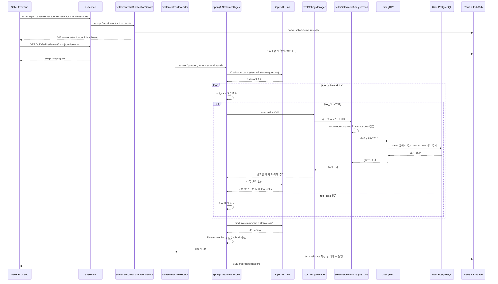
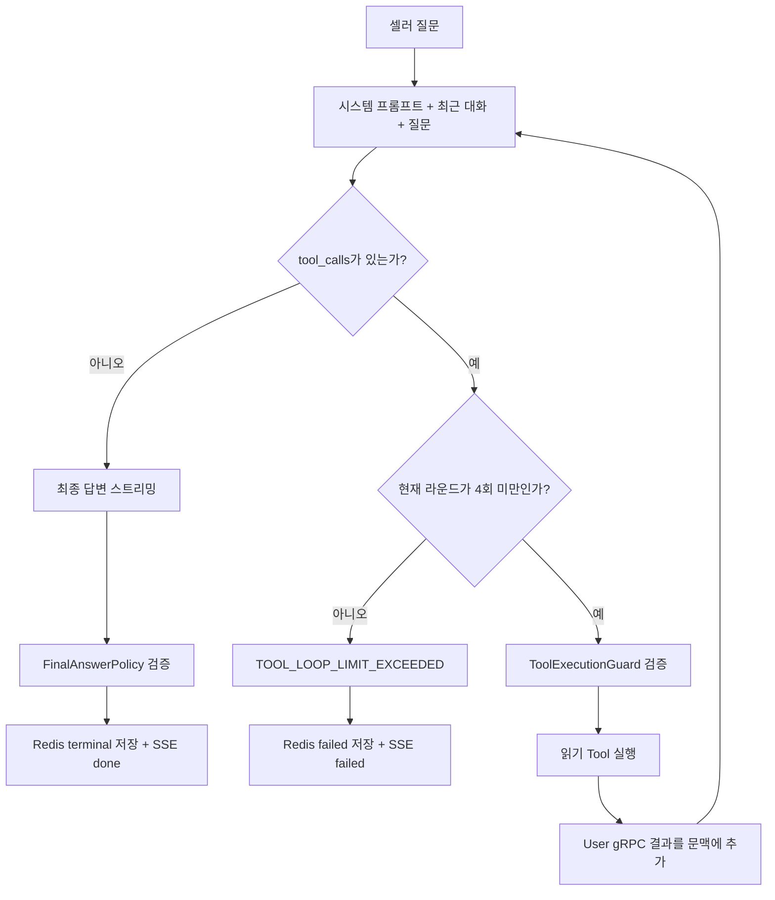

# 셀러 AI 정산 API

`ai-service`가 제공하는 셀러 범위 정산 질의 API다. Gateway는
`/api/v2/ai/settlement/**`에 `SELLER_OR_ADMIN` 정책을 적용해 `SELLER`와 `ADMIN`을 허용한다.
AI 서비스는 전달받은 `X-User-Id`를 대화 소유자와 User gRPC actor metadata로 사용한다. 현재는 role
헤더를 prompt나 gRPC 계약에 전달하지 않으며, ADMIN에도 SELLER와 동일한 본인 범위 답변 정책을 적용한다.
향후 role별 답변 범위를 확장할 때 role 전달 방식과 권한별 harness를 별도로 결정한다.

## 엔드포인트

| Method | Path | 설명 | 성공 응답 |
|---|---|---|---|
| `GET` | `/api/v2/ai/settlement/conversations/current` | 현재 셀러의 24시간 대화 조회 | `200` |
| `POST` | `/api/v2/ai/settlement/conversations/current/messages` | 질문 등록과 비동기 run 시작 | `202` |
| `DELETE` | `/api/v2/ai/settlement/conversations/current` | 현재 대화와 실행 상태 삭제 | `204` |
| `GET` | `/api/v2/ai/settlement/runs/{runId}/events` | run 진행 상태 SSE 구독 | `200 text/event-stream` |

질문 본문은 다음 형식이며 trim 이후 1자 이상 2,000자 이하여야 한다.

```json
{
  "content": "지난달과 이번 달 정산 금액을 비교해줘"
}
```

질문을 수락하면 `conversationId`, `runId`, `RUNNING` 상태, 시작·마감 시각을 반환한다. 동시에 처리할 수
있는 초기값은 Pod당 4건이고 대기열은 두지 않는다. 한 셀러의 기존 run이 실행 중이면 새 질문은
`RUN_IN_PROGRESS`로 거절한다.

## SSE 이벤트

| event | 용도 | 주요 필드 |
|---|---|---|
| `snapshot` | 연결 시 현재 실행 상태 | `runId`, `status`, `stage`, `startedAt`, `deadlineAt` |
| `progress` | Agent 단계 변경 | `runId`, `stage`, `occurredAt` |
| `delta` | 표시용 답변 조각 | `runId`, `sequence`, `text` |
| `done` | 최종 답변과 정상 종료 | `runId`, `answer`, `completedAt` |
| `failed` | 실행 실패 | `runId`, `code`, `message`, `failedAt` |
| `cancelled` | 대화 삭제 등으로 실행 취소 | `runId`, `cancelledAt` |

최초 SSE 연결만 `delta`를 받고 재연결은 snapshot과 terminal event로 복구한다. 연결 유지용 heartbeat는
15초마다 SSE comment로 전송한다. 전체 run 제한은 90초이며 terminal event 뒤 연결을 종료한다.

## 챗봇 실행·Tool Calling 흐름

`POST`는 질문을 동기 처리하지 않고 `runId`를 발급한 뒤 `202 Accepted`를 반환한다. 프론트는
반환된 `runId`로 SSE를 연결하고, 백그라운드 실행 결과를 받는다. `X-User-Id`는 Gateway가 JWT에서
추출해 내부적으로 전달하는 seller 식별자이며, 프론트가 임의로 지정하지 않는다.



에이전트는 모델이 반환한 `tool_calls` 유무를 기준으로 다음 행동을 결정한다. Tool 호출이 필요하면
최대 4라운드까지 선택된 읽기 Tool을 실행하고, 결과를 다시 모델 문맥에 넣어 추가 조회 여부를 판단한다.
Tool 인자에는 seller ID를 포함하지 않으며, `actorId`·`runId`는 서버가 `ToolContext`에서 주입한다.



## 데이터와 보안 경계

- 대화와 run 상태는 기존 Redis 인스턴스의 logical DB 1에 24시간 저장한다.
- AI는 User의 `SellerSettlementQueryService` 네 개 Tool만 호출한다.
- User gRPC는 actor metadata와 내부 토큰을 확인하고 해당 셀러의 집계 결과만 반환한다.
- OpenAI에는 원본 Kafka 이벤트와 다른 셀러 데이터, 내부 식별자 목록을 전달하지 않는다.
- `AI_SETTLEMENT_CHAT_ENABLED=false`이면 모든 엔드포인트가 `AI_CHAT_DISABLED`(503)를 반환한다.

오류 전체 목록은 [`../error-codes.md`](../error-codes.md)의 **AI 정산** 절을 참고한다.
