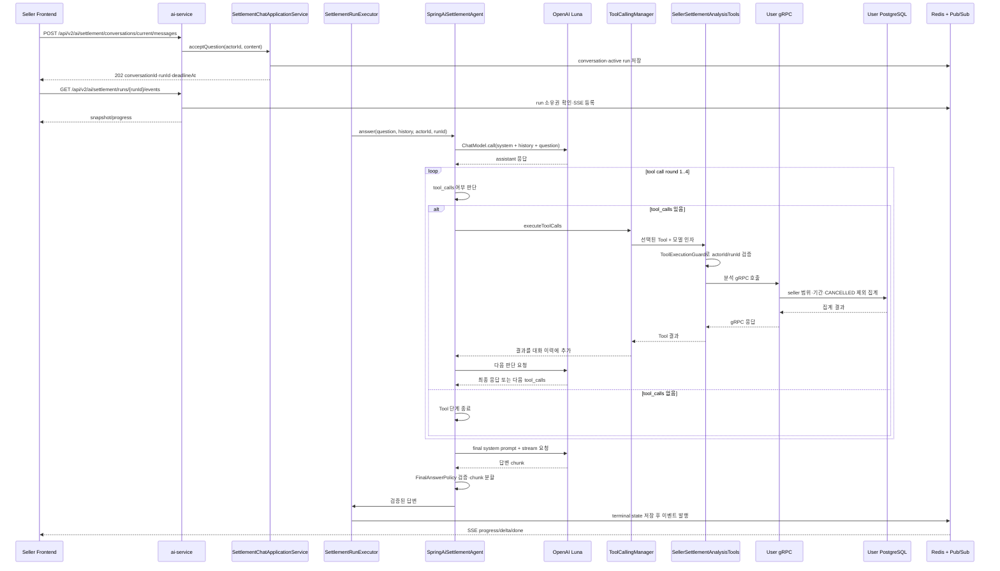
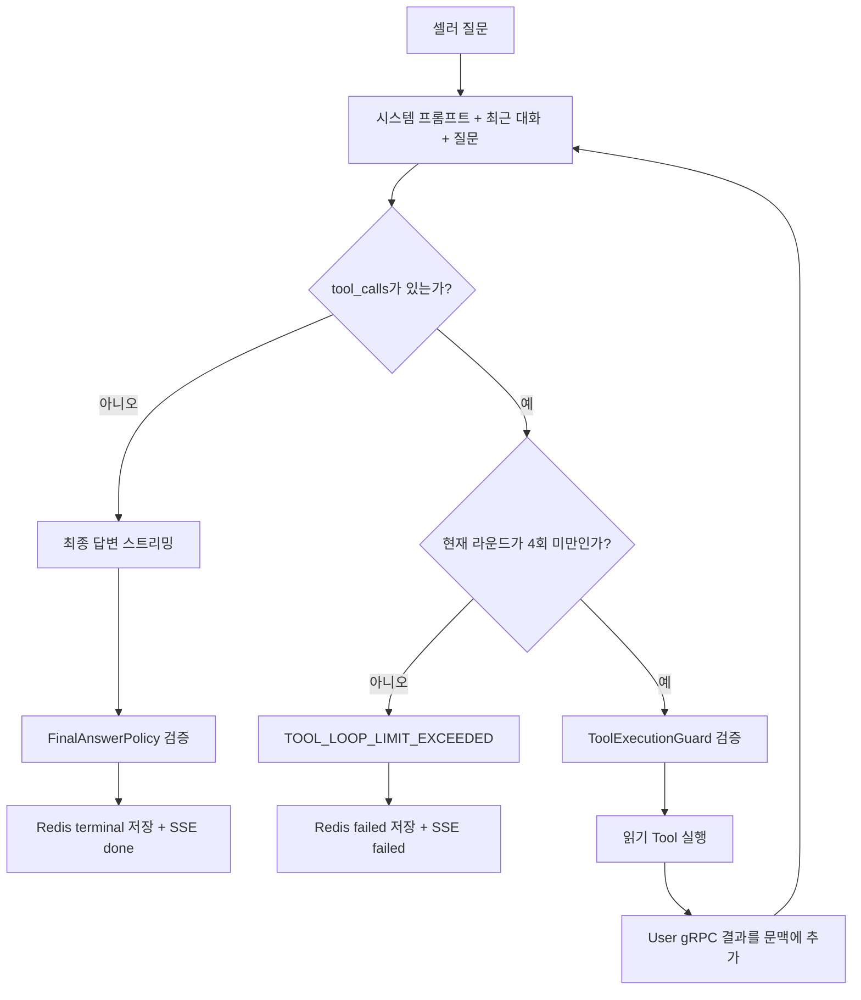

# AI 서비스 API

`ai-service`가 제공하는 API다. 현재 두 갈래 — **셀러 정산 질의**(아래)와
**맞춤 상품 추천**([맞춤 상품 추천 API](#맞춤-상품-추천-api))이다.

## 셀러 AI 정산 API

셀러 범위 정산 질의 API다. Gateway는
`/api/v2/ai/settlement/**`에 `SELLER_OR_ADMIN` 정책을 적용해 `SELLER`와 `ADMIN`을 허용한다.
AI 서비스는 전달받은 `X-User-Id`를 대화 소유자와 User gRPC actor metadata로 사용한다. 현재는 role
헤더를 prompt나 gRPC 계약에 전달하지 않으며, ADMIN에도 SELLER와 동일한 본인 범위 답변 정책을 적용한다.
향후 role별 답변 범위를 확장할 때 role 전달 방식과 권한별 harness를 별도로 결정한다.

## 엔드포인트

| Method | Path | 설명 | 성공 응답 |
|---|---|---|---|
| `GET` | `/api/v2/ai/settlement/conversations/current` | 현재 셀러의 24시간 대화 조회 | `200` |
| `POST` | `/api/v2/ai/settlement/conversations/current/messages` | 질문 등록과 비동기 run 시작 | `202` |
| `DELETE` | `/api/v2/ai/settlement/conversations/current` | 현재 대화와 실행 상태 삭제 | `204` |
| `GET` | `/api/v2/ai/settlement/runs/{runId}/events` | run 진행 상태 SSE 구독 | `200 text/event-stream` |

질문 본문은 다음 형식이며 trim 이후 1자 이상 2,000자 이하여야 한다.

```json
{
  "content": "지난달과 이번 달 정산 금액을 비교해줘"
}
```

질문을 수락하면 `conversationId`, `runId`, `RUNNING` 상태, 시작·마감 시각을 반환한다. 동시에 처리할 수
있는 초기값은 Pod당 4건이고 대기열은 두지 않는다. 한 셀러의 기존 run이 실행 중이면 새 질문은
`RUN_IN_PROGRESS`로 거절한다.

## SSE 이벤트

| event | 용도 | 주요 필드 |
|---|---|---|
| `snapshot` | 연결 시 현재 실행 상태 | `runId`, `status`, `stage`, `startedAt`, `deadlineAt` |
| `progress` | Agent 단계 변경 | `runId`, `stage`, `occurredAt` |
| `delta` | 표시용 답변 조각 | `runId`, `sequence`, `text` |
| `done` | 최종 답변과 정상 종료 | `runId`, `answer`, `completedAt` |
| `failed` | 실행 실패 | `runId`, `code`, `message`, `failedAt` |
| `cancelled` | 대화 삭제 등으로 실행 취소 | `runId`, `cancelledAt` |

최초 SSE 연결만 `delta`를 받고 재연결은 snapshot과 terminal event로 복구한다. 연결 유지용 heartbeat는
15초마다 SSE comment로 전송한다. 전체 run 제한은 90초이며 terminal event 뒤 연결을 종료한다.

## 챗봇 실행·Tool Calling 흐름

`POST`는 질문을 동기 처리하지 않고 `runId`를 발급한 뒤 `202 Accepted`를 반환한다. 프론트는
반환된 `runId`로 SSE를 연결하고, 백그라운드 실행 결과를 받는다. `X-User-Id`는 Gateway가 JWT에서
추출해 내부적으로 전달하는 seller 식별자이며, 프론트가 임의로 지정하지 않는다.


```mermaid
sequenceDiagram
    participant F as Seller Frontend
    participant AI as ai-service
    participant C as SettlementChatApplicationService
    participant E as SettlementRunExecutor
    participant AG as SpringAiSettlementAgent
    participant O as OpenAI Luna
    participant TM as ToolCallingManager
    participant T as SellerSettlementAnalysisTools
    participant U as User gRPC
    participant DB as User PostgreSQL
    participant S as Redis + Pub/Sub

    F->>AI: POST /api/v2/ai/settlement/conversations/current/messages
    AI->>C: acceptQuestion(actorId, content)
    C->>S: conversation·active run 저장
    C-->>F: 202 conversationId·runId·deadlineAt
    F->>AI: GET /api/v2/ai/settlement/runs/{runId}/events
    AI->>S: run 소유권 확인·SSE 등록
    AI-->>F: snapshot/progress

    E->>AG: answer(question, history, actorId, runId)
    AG->>O: ChatModel.call(system + history + question)
    O-->>AG: assistant 응답

    loop tool call round 1..4
        AG->>AG: tool_calls 여부 판단
        alt tool_calls 있음
            AG->>TM: executeToolCalls
            TM->>T: 선택된 Tool + 모델 인자
            T->>T: ToolExecutionGuard로 actorId/runId 검증
            T->>U: 분석 gRPC 호출
            U->>DB: seller 범위·기간·CANCELLED 제외 집계
            DB-->>U: 집계 결과
            U-->>T: gRPC 응답
            T-->>TM: Tool 결과
            TM-->>AG: 결과를 대화 이력에 추가
            AG->>O: 다음 판단 요청
            O-->>AG: 최종 응답 또는 다음 tool_calls
        else tool_calls 없음
            AG->>AG: Tool 단계 종료
        end
    end

    AG->>O: final system prompt + stream 요청
    O-->>AG: 답변 chunk
    AG->>AG: FinalAnswerPolicy 검증·chunk 분할
    AG->>E: 검증된 답변
    E->>S: terminal state 저장 후 이벤트 발행
    S-->>F: SSE progress/delta/done
```

에이전트는 모델이 반환한 `tool_calls` 유무를 기준으로 다음 행동을 결정한다. Tool 호출이 필요하면
최대 4라운드까지 선택된 읽기 Tool을 실행하고, 결과를 다시 모델 문맥에 넣어 추가 조회 여부를 판단한다.
Tool 인자에는 seller ID를 포함하지 않으며, `actorId`·`runId`는 서버가 `ToolContext`에서 주입한다.


```mermaid
flowchart TD
    Q["셀러 질문"] --> M["시스템 프롬프트 + 최근 대화 + 질문"]
    M --> D{"tool_calls가 있는가?"}
    D -- "아니오" --> FP["최종 답변 스트리밍"]
    D -- "예" --> L{"현재 라운드가 4회 미만인가?"}
    L -- "아니오" --> X["TOOL_LOOP_LIMIT_EXCEEDED"]
    L -- "예" --> G["ToolExecutionGuard 검증"]
    G --> T["읽기 Tool 실행"]
    T --> R["User gRPC 결과를 문맥에 추가"]
    R --> M
    FP --> V["FinalAnswerPolicy 검증"]
    V --> DONE["Redis terminal 저장 + SSE done"]
    X --> FAIL["Redis failed 저장 + SSE failed"]
```

## 데이터와 보안 경계

- 대화와 run 상태는 기존 Redis 인스턴스의 logical DB 1에 24시간 저장한다.
- AI는 User의 `SellerSettlementQueryService` 네 개 Tool만 호출한다.
- User gRPC는 actor metadata와 내부 토큰을 확인하고 해당 셀러의 집계 결과만 반환한다.
- OpenAI에는 원본 Kafka 이벤트와 다른 셀러 데이터, 내부 식별자 목록을 전달하지 않는다.
- `AI_SETTLEMENT_CHAT_ENABLED=false`이면 모든 엔드포인트가 `AI_CHAT_DISABLED`(503)를 반환한다.

오류 전체 목록은 [`../error-codes.md`](../error-codes.md)의 **AI 정산** 절을 참고한다.

---

# 맞춤 상품 추천 API

사용자의 활동 내역(장바구니·구매)을 기준으로 비슷한 상품을 추천한다. Gateway의
`route-policies`에 별도 항목을 두지 않아 기본 정책(인증된 사용자)이 적용된다.

## 엔드포인트

| Method | Path | 설명 | 성공 응답 |
|---|---|---|---|
| `GET` | `/api/v2/ai/recommendations` | 활동 기준 맞춤 추천 조회 | `200` |

| 쿼리 파라미터 | 타입 | 설명 |
|---|---|---|
| `cartProductIds` | `UUID[]` | 장바구니에 담은 상품. 가중치 1.0 |
| `purchasedProductIds` | `UUID[]` | 구매한 상품. 가중치 0.7 |
| `limit` | `int` | 받아올 개수. 기본 4, 최대 20 |

**활동 내역을 서버가 저장하지 않고 호출자가 실어 보낸다.** 장바구니와 주문은 order-service가
소유하고 ai-service에는 DB가 없다. 활동을 저장하려면 별도 적재 경로가 필요한데, 추천에는
필요하지 않아 두지 않았다.

```json
{
  "success": true,
  "data": [
    {
      "id": "9f1c2a7e-4b8d-4e2a-9c11-2d3e4f5a1111",
      "title": "이력서·경력기술서 AI 첨삭 프롬프트",
      "productType": "PROMPT",
      "model": "GPT-5",
      "amount": 15000,
      "rating": 4.5,
      "salesCount": 12,
      "sellerId": "7c2f6e91-2c1b-4a3b-9f99-3f527f7d1234",
      "desc": "채용담당자 시점으로 첨삭합니다.",
      "thumbnailUrl": "https://.../thumbnail.png",
      "tags": ["취업", "이력서"]
    }
  ],
  "message": "success"
}
```

## 동작

```
활동 목록 수신
  → 신호당 최대 3개를 기준 상품으로 추림
  → product-service gRPC GetSimilarProducts (기준별 순위, 합치지 않음)
  → 가중 RRF 합산  점수 = Σ ( 가중치 × 1 / (60 + 등수) )
  → 이미 담았거나 구매한 상품 제외
  → 상위 limit개
```

**추천 판단은 ai-service가 소유한다.** product-service는 "이 상품과 가까운 것"만 답하고
누구에게 무엇을 추천할지 모른다.

**여러 기준을 평균 내지 않는다.** 임베딩 좌표를 평균 내면 그 중간 지점에 착지하는데, 이
카탈로그는 임베딩 공간이 좁게 뭉쳐 있어 그 중간이 곧 모든 것과 어중간하게 가까운 구역이다.
순위 합산은 각 기준의 실제 위치에서 뽑은 등수만 쓰므로 중간 지점을 만들지 않고, 여러 기준이
공통으로 상위로 꼽은 상품을 올린다.

## 실패 처리

**활동 내역이 없거나 추천할 상품이 없으면 빈 배열을 `200`으로 반환한다.** 오류가 아니라
"보여줄 게 없음"이 맞는 상태이고, 화면은 섹션을 숨기면 된다.

**product-service gRPC 호출이 실패해도 빈 배열을 반환한다.** 추천이 안 되는 것과 상품을 못 사는
것은 다른 문제이며, 추천이 중단돼도 구매 흐름은 정상 동작해야 한다. 호출 지연 예산은 2초이고,
실패는 `warn` 로그로 남긴다.

전체 흐름은 [`../architecture/search-vector-flows.md`](../architecture/search-vector-flows.md)
흐름 ⑥을 참고한다.
