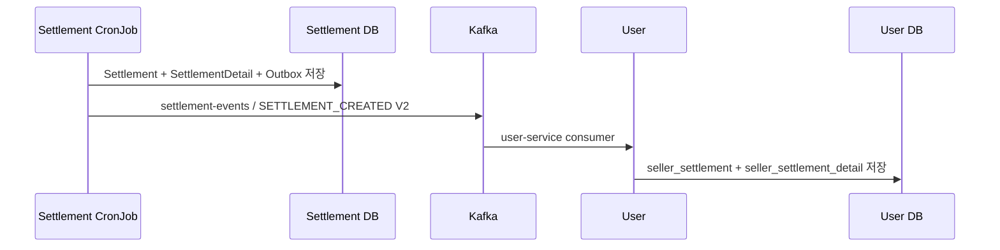
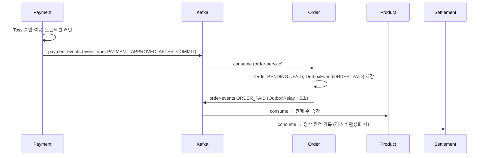
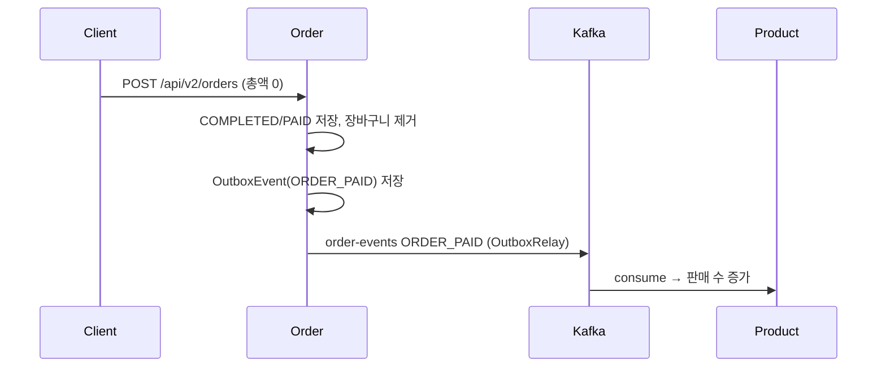
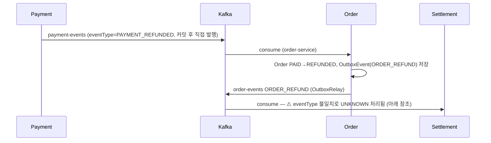
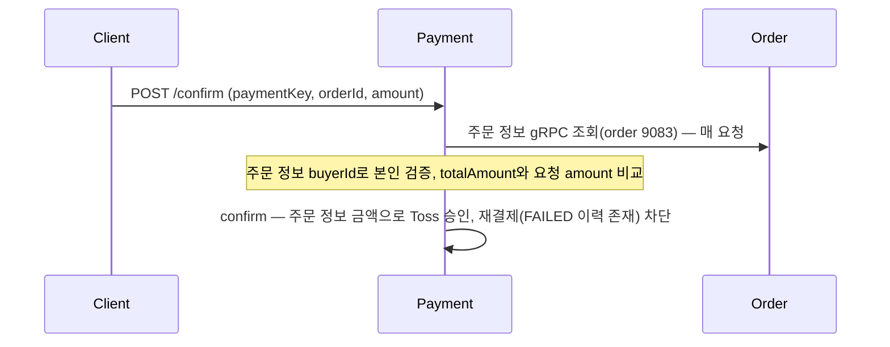
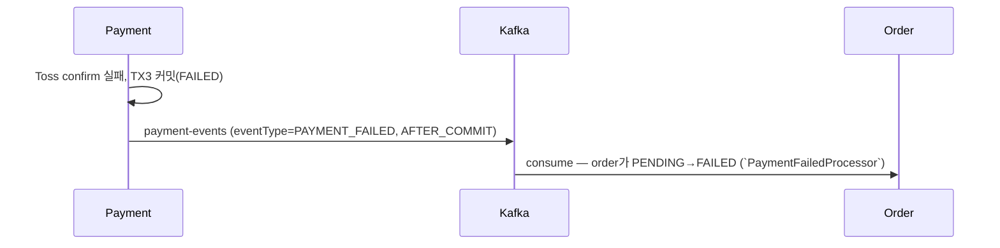

# 이벤트 흐름

서비스 간 Kafka 이벤트 계약과 흐름. **2026-07-23 기준 실제 코드에서 도출**했으며 각 사실의 근거 파일을 병기한다. 시스템 전체 구조는 `overview.md` 참조.

> 주문-결제 흐름 재설계(#396)는 payment/order 양측 모두 반영 완료됐다. payment-service는 `ORDER_CREATED` 구독을 제거하고 결제 승인 시마다 order gRPC(9083)로 직접 조회하는 구조다. order-service는 gRPC 서버(9083, `OrderQueryGrpcServer`)를 제공하며, `payment-events` 토픽의 `PAYMENT_FAILED`를 소비해 주문을 `PENDING`→`FAILED`로 전이한다(`PaymentFailedProcessor`). (설계: `payment-service/.claude/plans/396-confirm-payment-flow-redesign.md`)

## Kafka 토픽 목록

payment가 발행하는 결제/환불 이벤트는 **토픽 이름이 이벤트 종류별로 나뉘어 있지 않다** — 아래 표의 `payment-events` 단일 토픽에 4종 이벤트를 모두 발행하고, 공통 봉투(`EventMessage<T>`)의 `eventType` 필드로 구분한다.

| 토픽 | 발행 | 소비 | 메시지 키 | 페이로드 |
|---|---|---|---|---|
| `payment-events` | payment | order (`PAYMENT_APPROVED`/`PAYMENT_REFUNDED`/`PAYMENT_FAILED`만 라우팅, `PAYMENT_REFUND_FAILED`는 미소비 — 아래 참조) | `orderId`(문자열) | `EventMessage<T>` 봉투: `eventId`, `eventType`, `occurredAt`, `aggregateType`(=`ORDER` 고정), `aggregateId`(=orderId), `payload`. `eventType`별 payload — `PAYMENT_APPROVED`→`PaymentApprovedMessage`, `PAYMENT_REFUNDED`→`PaymentRefundedMessage`, `PAYMENT_FAILED`→`PaymentFailedMessage`, `PAYMENT_REFUND_FAILED`→`PaymentRefundFailedMessage` |
| `order-events` | order | product, settlement, **payment(구현: `ORDER_REFUND_REQUESTED`만)** | `orderId` (aggregateId) | `OrderEventEnvelope`(`ORDER_PAID`/`ORDER_REFUND`) |
| `product-events` | product | order | `productId` | `ProductStoppedEvent` / `ProductDeletedEvent` / `ProductPriceChangedEvent` |
| `settlement-events` | settlement | user | `settlementId` | `EventMessage<SettlementCreatedEvent>` 봉투. 현재 생산 버전은 `payloadVersion=2`이며 정산 부모 필드와 `SettlementDetail` 전체를 포함 |

- 토픽 상수: `payment-service/.../infrastructure/messaging/config/PaymentTopic.java`(`PAYMENT_EVENTS = "payment-events"`), 각 서비스 Consumer/Producer의 `TOPIC` 상수.
- `NewTopic` 선언은 payment-service `KafkaConfig`의 `payment-events`(partitions 1, replicas 1)만 존재. 나머지 토픽은 브로커 auto-create에 의존한다.
- payment-service가 실제 발행하는 이벤트 4종: `PAYMENT_APPROVED`, `PAYMENT_REFUNDED`, `PAYMENT_REFUND_FAILED`, `PAYMENT_FAILED` (전부 `KafkaPaymentEventPublisher`, `payment-events` 토픽). `PAYMENT_CANCELED`는 여전히 코드 없음 — 추측 구현 금지.
- **`PAYMENT_REFUND_FAILED`는 payment는 발행하지만 order-service `PaymentEventType` enum에는 정의돼 있지 않다** — order 쪽에서 `Unsupported payment event` 경고만 남기고 무시된다(`order-service/.../PaymentEventRouter.java`). 사실상 소비자가 없는 이벤트.

## 이벤트 발행 / 소비 매트릭스

P = 발행, C = 소비(괄호는 consumer groupId):

| 서비스 \ 토픽 | payment-events | order-events | product-events | settlement-events |
|---|---|---|---|---|
| payment | P (`PAYMENT_APPROVED`/`PAYMENT_REFUNDED`/`PAYMENT_REFUND_FAILED`/`PAYMENT_FAILED` 4종) | C (`payment-service-order-events`, `ORDER_REFUND_REQUESTED`만) | - | - |
| order | C (`order-service`, `PAYMENT_APPROVED`/`PAYMENT_REFUNDED`/`PAYMENT_FAILED`만 라우팅 — `PAYMENT_REFUND_FAILED`는 정의 없어 무시) | P | C (`order-service`) | - |
| product | - | C (`product-service`) | P | - |
| settlement | - | C (`settlement-service`) | - | P (`SETTLEMENT_CREATED` V2) |
| user | - | - | - | C (`user-service`) |

주의 사항:

- **settlement의 order-events 리스너는 기본 비활성**: `autoStartup = "${settlement.kafka.listener.order.enabled:false}"` — 설정으로 켜야 소비한다. `settlement-service/.../kafka/consumer/order/OrderEventConsumer.java:34`
- **payment-service는 `order-events`를 구독한다**: `OrderEventConsumer`가 전용 그룹 `payment-service-order-events`로 소비하되 최상위 `eventType == ORDER_REFUND_REQUESTED`만 처리(그 외 무시)하고 부분환불을 개시한다. `StringDeserializer`+`ObjectMapper` 수동 파싱, MANUAL ack, 재시도 3회 후 `order-events.DLT`. 결제 승인 시 필요한 주문 정보는 이벤트 구독이 아니라 매 요청 gRPC(order 9083) 직접 조회로 확보한다(#396).
- **user-service의 settlement 리스너도 기본 비활성**:
  `user.kafka.listener.settlement.enabled=false`. V1 코드는 변경 이력을 위해 남겨 두지만 현재 Settlement
  생산자는 V2만 발행한다. 역직렬화·처리 실패는 1초 간격으로 3회 재시도한 뒤
  `settlement-events.DLT`로 보내고, Webhook이 설정돼 있으면 Slack으로 알린다.

### 서비스별 발행 메커니즘

| 서비스 | 방식 | 근거 |
|---|---|---|
| payment (승인/실패) | 도메인 이벤트 → `@TransactionalEventListener(AFTER_COMMIT)` → `KafkaTemplate.send("payment-events", ...)` (승인=`PaymentApprovedEvent`, 실패=`PaymentFailedEvent`) | `KafkaPaymentEventPublisher.java` |
| payment (환불/환불실패) | 스케줄러/서비스가 트랜잭션 커밋 후 publisher **직접 호출**, 동일하게 `payment-events`에 발행 (Spring Boot 4.1 중첩 리스너 제한 우회) | `KafkaPaymentEventPublisher.java` |
| order | **Outbox 패턴**: `OutboxEventAppender`가 `OutboxEvent`(PENDING) 저장 → `OutboxRelay`가 `@Scheduled`(기본 5초) 폴링 후 동기 발행(`send().get()`) | `order-service/.../outbox/OutboxEventAppender.java`, `kafka/producer/OutboxRelay.java` |
| product | `KafkaTemplate.send` 직접 호출 (Outbox·트랜잭션 리스너 없음) | `product-service/.../messaging/producer/ProductEventProducer.java` |
| settlement | 정산과 Detail, Outbox를 같은 트랜잭션에 저장 → 현재 배치의 Outbox를 동기 발행하고 성공/실패 상태 기록 | `JsonOutboxEventAppender.java`, `OutboxEventPublishService.java`, `FlushCurrentBatchOutboxTasklet.java` |

## 주요 시나리오별 이벤트 시퀀스

### 정산 완료 → 셀러 분석 읽기 모델

V2는 정산 한 건에 속한 Detail을 같은 이벤트에 포함한다. User는 이를 셀러 본인 조회용 읽기 모델로
보관하고, AI 서비스에는 원본 이벤트가 아니라 권한 검사가 적용된 gRPC 집계 결과를 제공한다.

### 결제 승인

### 0원 주문 즉시 완료

`POST /api/v2/orders`에서 상품 금액 합계가 0이면 Order Service가 주문을 즉시 `COMPLETED`, 주문상품을 `PAID`로 전이하고 기존 Outbox에 `ORDER_PAID`를 저장한다. 별도 topic, key, payload, eventType은 만들지 않는다.

0원 주문은 Redis 만료 예약과 Payment Service 승인·환불 요청을 만들지 않는다. Settlement는 기존 주문 조회 경로에서 금액 0의 `PAID` 라인으로 조회한다.

### 환불

### 상품 상태 변경

product가 판매중지/삭제/가격변경 시 `product-events` 발행 → order가 소비해 장바구니·주문 가능 상태에 반영. (`ProductEventProducer.java` → `order-service/.../consumer/product/ProductEventConsumer.java`)

### 주문 생성 → 결제 (재설계, payment/order 양측 구현 완료)

payment는 로컬 스냅샷 캐시를 제거하고(#396) 매 confirm 요청마다 order gRPC를 직접 호출해 금액·본인 확인의 진실 공급원으로 삼는다. 한 번 `FAILED`로 끝난 주문은 같은 orderId로 재결제할 수 없다.

### 결제 실패

취소(`PAYMENT_CANCELED` 등)는 여전히 코드 없음 — 임의 구현 금지. `PAYMENT_REFUND_FAILED`는 payment가 발행하지만 order가 소비하지 않는다(위 토픽 목록 참조).

## 알려진 불일치 (2026-07-18 코드 기준)

| 항목 | 내용 | 영향 |
|---|---|---|
| **`ORDER_REFUND` vs `ORDER_REFUNDED`** | order는 eventType `ORDER_REFUND`를 발행(`OutboxEventAppender.java:28`)하는데 settlement enum은 `ORDER_REFUNDED`만 인식(`OrderEventType.java:8`) → `UNKNOWN`으로 떨어져 **환불 정산이 기록되지 않는다** | 높음 — `docs/qa/order-payment-event-idempotency-check.md`에서도 지적됨 |
| **`PAYMENT_REFUND_FAILED` 소비자 없음** | payment는 환불 실패 시 `payment-events`에 `PAYMENT_REFUND_FAILED`를 발행하지만, order-service `PaymentEventType` enum에 값이 없어 라우터가 무시(`Unsupported payment event` 로그만 남김) | 중간 — 환불 실패를 order/후속 서비스가 알 방법이 없음 |
| settlement 리스너 기본 OFF | `settlement.kafka.listener.order.enabled` 기본값 `false` | 배포 설정에서 활성화 필요 |
| payment-service `.claude/docs/events.md`와의 차이 | 서비스 로컬 계약 문서와 이 문서가 다르면 **코드를 우선**하고 두 문서를 함께 갱신할 것 | - |
