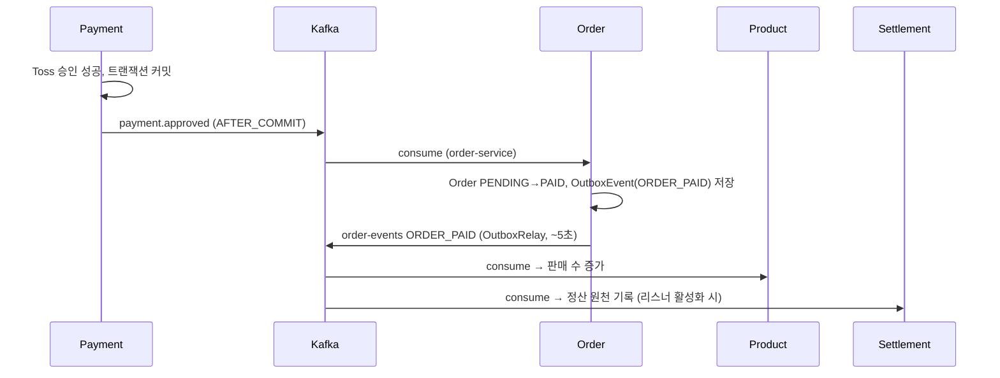
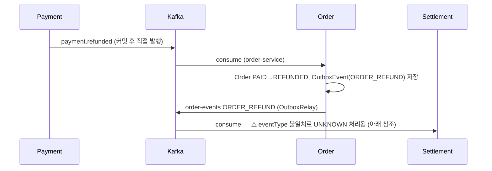
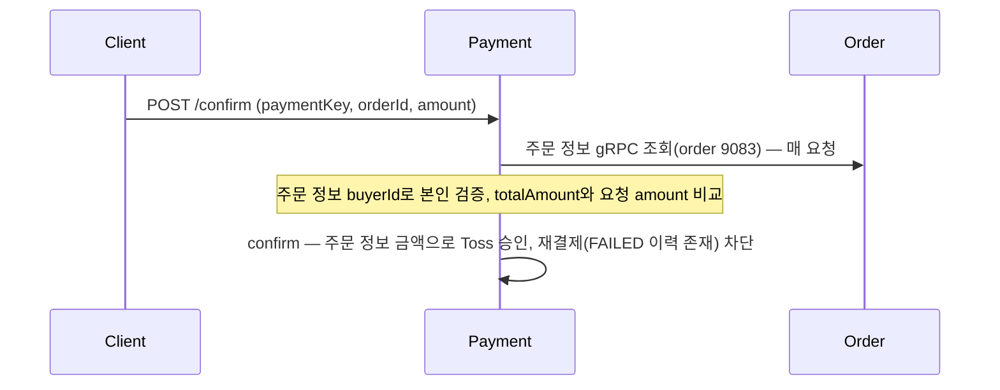
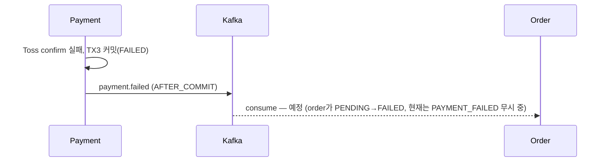

# 이벤트 흐름

서비스 간 Kafka 이벤트 계약과 흐름. **2026-07-06 기준 실제 코드에서 도출**했으며 각 사실의 근거 파일을 병기한다. 시스템 전체 구조는 `overview.md` 참조.

> ⚠️ **부분 반영(주문-결제 흐름 재설계, payment-service 측)**: payment-service는 `ORDER_CREATED` 구독을 제거하고 결제 승인 시마다 order gRPC(9083)로 직접 조회하는 구조로 전환했다(#396). `payment.failed` 발행은 **구현 완료**. order-service 후속(gRPC 서버 9083, `payment.events`(dot)→`payment-events`(dash) 토픽 통일, PAYMENT_FAILED 소비)은 **미완**이라 실서비스 E2E는 아직 이어지지 않는다. (설계: `payment-service/.claude/plans/396-confirm-payment-flow-redesign.md`)

## Kafka 토픽 목록

| 토픽 | 발행 | 소비 | 메시지 키 | 페이로드 |
|---|---|---|---|---|
| `payment.approved` | payment | order | `orderId` | `PaymentApprovedMessage` (orderId, approvedAmount, approvedAt) |
| `payment.refunded` | payment | order | `orderId` | `PaymentRefundedMessage` (paymentId, orderId, userId, amount, refundedAt) |
| `payment.failed` | payment (구현) | order (예정) | `orderId` | `PaymentFailedMessage` (orderId). PG confirm 실패 시 발행(Toss 호출 전 금액 불일치는 발행 안 함, #396) |
| `order-events` | order | product, settlement, **payment(구현: `ORDER_REFUND_REQUESTED`만)** | `orderId` (aggregateId) | `OrderEventEnvelope`(`ORDER_PAID`/`ORDER_REFUND`) |
| `product-events` | product | order | `productId` | `ProductStoppedEvent` / `ProductDeletedEvent` / `ProductPriceChangedEvent` |

- 토픽 상수: `payment-service/.../infrastructure/messaging/config/PaymentTopic.java`, 각 서비스 Consumer/Producer의 `TOPIC` 상수.
- `NewTopic` 선언은 payment-service `KafkaConfig`의 `payment-events`(partitions 1, replicas 1)만 존재. 나머지 토픽은 브로커 auto-create에 의존한다.
- `payment.failed`는 payment-service에 **구현됨**(`payment-events` 토픽, `KafkaPaymentEventPublisher.onPaymentFailed`). `payment.canceled`/`payment.cancel_failed`/`payment.refund_failed`는 여전히 코드 없음 — 추측 구현 금지.

## 이벤트 발행 / 소비 매트릭스

P = 발행, C = 소비(괄호는 consumer groupId):

| 서비스 \ 토픽 | payment.approved | payment.refunded | payment.failed | order-events | product-events |
|---|---|---|---|---|---|
| payment | P | P | P (구현) | C (`payment-service-order-events`, `ORDER_REFUND_REQUESTED`만) | - |
| order | C (`order-service`) | C (`order-service`) | C (예정) | P | C (`order-service`) |
| product | - | - | - | C (`product-service`) | P |
| settlement | - | - | - | C (`settlement-service`) | - |
| user | - | - | - | - | - |

주의 사항:

- **settlement의 order-events 리스너는 기본 비활성**: `autoStartup = "${settlement.kafka.listener.order.enabled:false}"` — 설정으로 켜야 소비한다. `settlement-service/.../kafka/consumer/order/OrderEventConsumer.java:34`
- **payment-service는 `order-events`를 구독한다**: `OrderEventConsumer`가 전용 그룹 `payment-service-order-events`로 소비하되 최상위 `eventType == ORDER_REFUND_REQUESTED`만 처리(그 외 무시)하고 부분환불을 개시한다. `StringDeserializer`+`ObjectMapper` 수동 파싱, MANUAL ack, 재시도 3회 후 `order-events.DLT`. 결제 승인 시 필요한 주문 정보는 이벤트 구독이 아니라 매 요청 gRPC(order 9083) 직접 조회로 확보한다(#396).
- user-service는 Kafka를 사용하지 않는다.

### 서비스별 발행 메커니즘

| 서비스 | 방식 | 근거 |
|---|---|---|
| payment (승인/실패) | 도메인 이벤트 → `@TransactionalEventListener(AFTER_COMMIT)` → `KafkaTemplate.send` (승인=TX2 `PaymentApprovedEvent`, 실패=TX3 `PaymentFailedEvent`) | `KafkaPaymentEventPublisher.java` |
| payment (환불) | 스케줄러/서비스가 트랜잭션 커밋 후 publisher **직접 호출** (Spring Boot 4.1 중첩 리스너 제한 우회) | `KafkaPaymentEventPublisher.java` |
| order | **Outbox 패턴**: `OutboxEventAppender`가 `OutboxEvent`(PENDING) 저장 → `OutboxRelay`가 `@Scheduled`(기본 5초) 폴링 후 동기 발행(`send().get()`) | `order-service/.../outbox/OutboxEventAppender.java`, `kafka/producer/OutboxRelay.java` |
| product | `KafkaTemplate.send` 직접 호출 (Outbox·트랜잭션 리스너 없음) | `product-service/.../messaging/producer/ProductEventProducer.java` |

## 주요 시나리오별 이벤트 시퀀스

### 결제 승인

### 환불

### 상품 상태 변경

product가 판매중지/삭제/가격변경 시 `product-events` 발행 → order가 소비해 장바구니·주문 가능 상태에 반영. (`ProductEventProducer.java` → `order-service/.../consumer/product/ProductEventConsumer.java`)

### 주문 생성 → 결제 (재설계, payment 측 구현 / order 측 gRPC 서버 예정)

payment는 로컬 스냅샷 캐시를 제거하고(#396) 매 confirm 요청마다 order gRPC를 직접 호출해 금액·본인 확인의 진실 공급원으로 삼는다. 한 번 `FAILED`로 끝난 주문은 같은 orderId로 재결제할 수 없다.

### 결제 실패

취소(`payment.canceled` 등)는 여전히 코드 없음 — 임의 구현 금지.

## 알려진 불일치 (2026-07-06 코드 기준)

| 항목 | 내용 | 영향 |
|---|---|---|
| **`ORDER_REFUND` vs `ORDER_REFUNDED`** | order는 eventType `ORDER_REFUND`를 발행(`OutboxEventAppender.java:28`)하는데 settlement enum은 `ORDER_REFUNDED`만 인식(`OrderEventType.java:8`) → `UNKNOWN`으로 떨어져 **환불 정산이 기록되지 않는다** | 높음 — `docs/qa/order-payment-event-idempotency-check.md`에서도 지적됨 |
| settlement 리스너 기본 OFF | `settlement.kafka.listener.order.enabled` 기본값 `false` | 배포 설정에서 활성화 필요 |
| payment-service `.claude/docs/events.md`와의 차이 | 서비스 로컬 계약 문서와 이 문서가 다르면 **코드를 우선**하고 두 문서를 함께 갱신할 것 | - |
