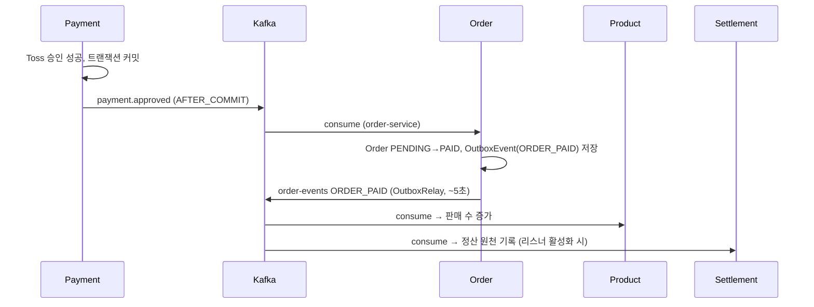
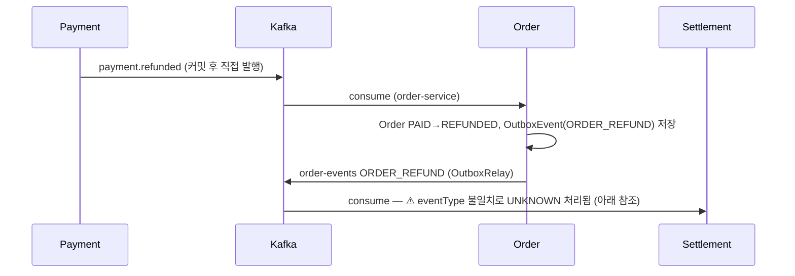

# 이벤트 흐름

서비스 간 Kafka 이벤트 계약과 흐름. **2026-07-06 기준 실제 코드에서 도출**했으며 각 사실의 근거 파일을 병기한다. 시스템 전체 구조는 `overview.md` 참조.

> ⚠️ **변경 예정**: 결제 실패/취소 이벤트 신설(`payment.failed` 등)과 토픽 구조 개편이 논의 중이다(`docs/qa/order-payment-event-idempotency-check.md`, `docs/qa/product-order-kafka-event-verification-report.md`). 해당 작업이 머지되면 이 문서를 반드시 갱신할 것.

## Kafka 토픽 목록

| 토픽 | 발행 | 소비 | 메시지 키 | 페이로드 |
|---|---|---|---|---|
| `payment.approved` | payment | order | `orderId` | `PaymentApprovedMessage` (paymentId, orderId, userId, amount, approvedAt) |
| `payment.refunded` | payment | order | `orderId` | `PaymentRefundedMessage` (paymentId, orderId, userId, amount, refundedAt) |
| `order-events` | order | product, settlement | `orderId` (aggregateId) | `OrderEventEnvelope` (eventId, eventType, version, timestamp, aggregateId, payload). eventType: `ORDER_PAID` / `ORDER_REFUND` |
| `product-events` | product | order | `productId` | `ProductStoppedEvent` / `ProductDeletedEvent` / `ProductPriceChangedEvent` |

- 토픽 상수: `payment-service/.../infrastructure/messaging/config/PaymentTopic.java`, 각 서비스 Consumer/Producer의 `TOPIC` 상수.
- `NewTopic` 선언은 payment-service `KafkaConfig`의 `payment.approved`/`payment.refunded`(partitions 1, replicas 1)만 존재. 나머지 토픽은 브로커 auto-create에 의존한다.
- 계획 단계(코드 미구현) 이벤트: `payment.failed`, `payment.canceled`, `payment.cancel_failed`, `payment.refund_failed` — `docs/qa/` 문서에만 언급되어 있으며 **현재 발행·소비 코드가 없다**. 추측으로 구현하지 말 것.

## 이벤트 발행 / 소비 매트릭스

P = 발행, C = 소비(괄호는 consumer groupId):

| 서비스 \ 토픽 | payment.approved | payment.refunded | order-events | product-events |
|---|---|---|---|---|
| payment | P | P | - | - |
| order | C (`order-service`) | C (`order-service`) | P | C (`order-service`) |
| product | - | - | C (`product-service`) | P |
| settlement | - | - | C (`settlement-service`) | - |
| user | - | - | - | - |

주의 사항:

- **settlement의 order-events 리스너는 기본 비활성**: `autoStartup = "${settlement.kafka.listener.order.enabled:false}"` — 설정으로 켜야 소비한다. `settlement-service/.../kafka/consumer/order/OrderEventConsumer.java:34`
- **payment-service는 현재 어떤 토픽도 소비하지 않는다**: `application.yaml`에 `group-id: payment-service-group` 설정은 있으나 `@KafkaListener`가 없다.
- user-service는 Kafka를 사용하지 않는다.

### 서비스별 발행 메커니즘

| 서비스 | 방식 | 근거 |
|---|---|---|
| payment (승인) | 도메인 이벤트 → `@TransactionalEventListener(AFTER_COMMIT)` → `KafkaTemplate.send` | `KafkaPaymentEventPublisher.java` |
| payment (환불) | 스케줄러/서비스가 트랜잭션 커밋 후 publisher **직접 호출** (Spring Boot 4.1 중첩 리스너 제한 우회) | `KafkaPaymentEventPublisher.java` |
| order | **Outbox 패턴**: `OutboxEventAppender`가 `OutboxEvent`(PENDING) 저장 → `OutboxRelay`가 `@Scheduled`(기본 5초) 폴링 후 동기 발행(`send().get()`) | `order-service/.../outbox/OutboxEventAppender.java`, `kafka/producer/OutboxRelay.java` |
| product | `KafkaTemplate.send` 직접 호출 (Outbox·트랜잭션 리스너 없음) | `product-service/.../messaging/producer/ProductEventProducer.java` |

## 주요 시나리오별 이벤트 시퀀스

### 결제 승인

### 환불

### 상품 상태 변경

product가 판매중지/삭제/가격변경 시 `product-events` 발행 → order가 소비해 장바구니·주문 가능 상태에 반영. (`ProductEventProducer.java` → `order-service/.../consumer/product/ProductEventConsumer.java`)

### 결제 실패 / 취소

**코드상 이벤트 없음.** 결제 실패·취소는 현재 Kafka 이벤트를 발행하지 않는다(payment-service 내부 상태로만 관리). `docs/qa/` 문서에서 신설이 논의 중인 영역이므로 임의 구현 금지.

## 알려진 불일치 (2026-07-06 코드 기준)

| 항목 | 내용 | 영향 |
|---|---|---|
| **`ORDER_REFUND` vs `ORDER_REFUNDED`** | order는 eventType `ORDER_REFUND`를 발행(`OutboxEventAppender.java:28`)하는데 settlement enum은 `ORDER_REFUNDED`만 인식(`OrderEventType.java:8`) → `UNKNOWN`으로 떨어져 **환불 정산이 기록되지 않는다** | 높음 — `docs/qa/order-payment-event-idempotency-check.md`에서도 지적됨 |
| settlement 리스너 기본 OFF | `settlement.kafka.listener.order.enabled` 기본값 `false` | 배포 설정에서 활성화 필요 |
| payment-service `.claude/docs/events.md`와의 차이 | 서비스 로컬 계약 문서와 이 문서가 다르면 **코드를 우선**하고 두 문서를 함께 갱신할 것 | - |
