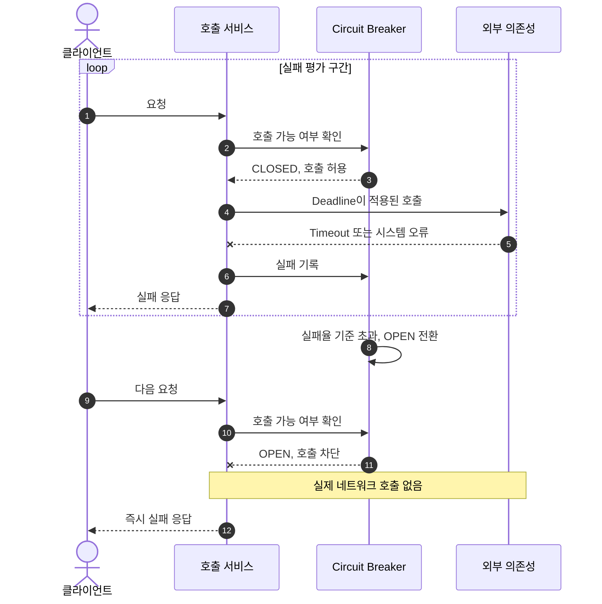
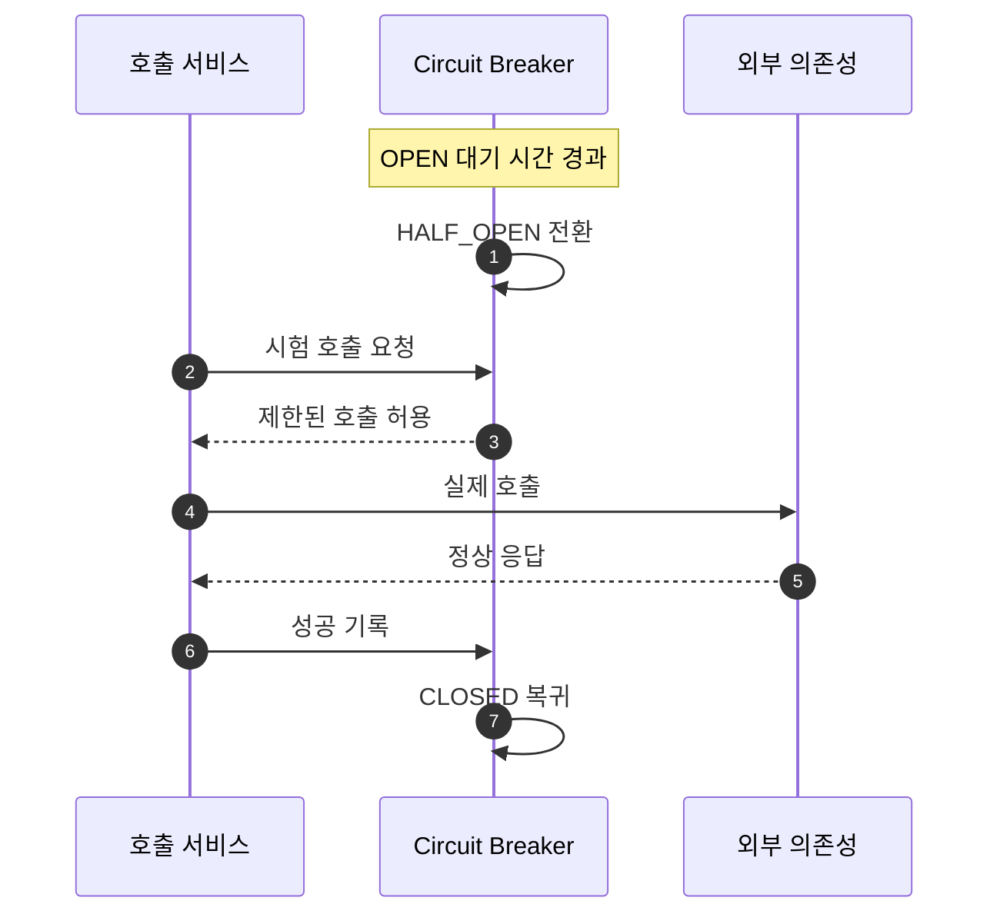
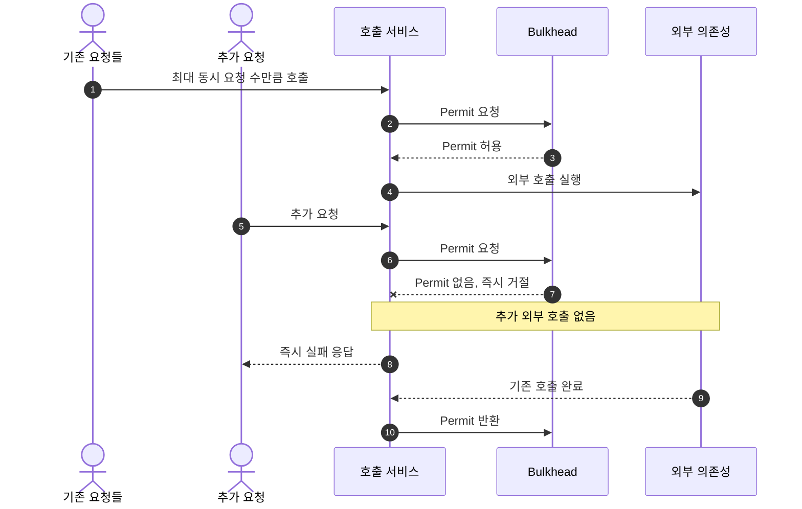
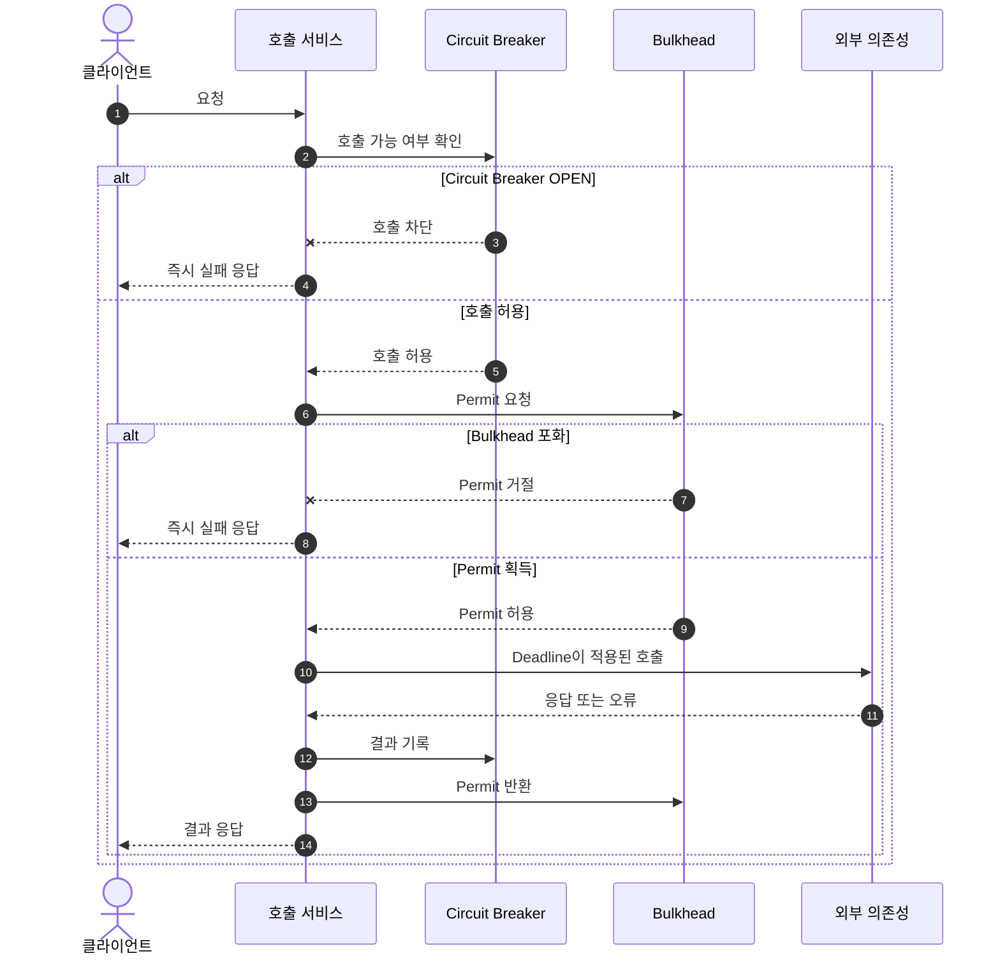

# Circuit Breaker and Bulkhead Resilience Guide

## 1. 문서 목적

이 문서는 동기 네트워크 호출에서 발생하는 장애 전파를 막기 위해 사용하는 **Circuit Breaker**와 **Bulkhead**를 설명한다.

두 패턴의 목적은 실패한 요청을 성공으로 바꾸는 것이 아니다.

> 특정 외부 의존성의 장애가 호출 서비스 전체의 스레드와 커넥션을 고갈시키지 않도록 피해 범위를 제한하는 것이 목적이다.

외부 의존성이 느려지면 호출 서비스의 요청 처리 자원이 응답을 기다리며 점유된다. 이러한 호출이 누적되면 해당 기능뿐 아니라 같은 서비스의 다른 API까지 영향을 받는다.

```text
외부 의존성 지연
→ 동기 호출 누적
→ 요청 처리 자원 고갈
→ 서비스 전체 지연 또는 장애
```

각 보호 정책의 역할은 다음과 같다.

| 정책 | 역할 |
|---|---|
| Timeout·Deadline | 시작된 호출의 최대 대기 시간 제한 |
| Circuit Breaker | 현재 외부 호출을 실제로 수행할지 판단 |
| Bulkhead | 외부 호출이 동시에 사용할 수 있는 자원 제한 |
| Retry | 실패한 호출을 다시 시도할지 결정 |

기본 조합은 다음과 같다.

```text
Timeout 또는 Deadline
+ Circuit Breaker
+ Bulkhead
+ Retry 기본 미적용
```

---

## 2. Circuit Breaker

### 설명

Circuit Breaker는 최근 호출의 실패와 지연을 관찰하여 외부 의존성을 계속 호출할지 결정한다.

| 상태 | 동작 |
|---|---|
| `CLOSED` | 실제 호출을 수행하고 결과를 기록한다. |
| `OPEN` | 실제 호출 없이 즉시 실패시킨다. |
| `HALF_OPEN` | 제한된 시험 호출로 복구 여부를 확인한다. |

### 도입 목적과 이유

- 장애 상태의 시스템을 반복 호출하지 않는다.
- 매 요청이 Timeout까지 기다리는 상황을 줄인다.
- 호출 서비스의 요청 처리 자원을 보호한다.
- 장애가 발생한 시스템에 추가 부하를 주지 않는다.
- 장애 상태와 복구 여부를 명확하게 관리한다.

### 정책

- 동기 네트워크 호출 경계에 적용한다.
- 네트워크 오류, 서버 오류, Timeout은 실패로 기록한다.
- 입력값 오류, 인증·권한 오류, 리소스 없음은 장애 실패율에서 제외한다.
- `OPEN` 상태에서는 실제 외부 호출을 수행하지 않는다.
- 일정 시간이 지나면 `HALF_OPEN` 상태에서 제한된 호출만 허용한다.
- 데이터 정합성이 중요한 호출은 임의 데이터로 Fallback하지 않는다.

### 장애 감지와 차단 예시



### 복구 확인 예시



---

## 3. Bulkhead

### 설명

Bulkhead는 특정 외부 호출이 동시에 사용할 수 있는 자원의 상한을 정하는 장애 격리 패턴이다.

선박 내부를 격벽으로 나누어 한 구획의 침수가 전체 선박으로 번지는 것을 막는 것처럼, 한 외부 의존성이 서비스 전체 자원을 독점하지 못하게 한다.

| 방식 | 특징 |
|---|---|
| Semaphore Bulkhead | 기존 스레드를 사용하며 동시 호출 수만 제한한다. |
| Thread Pool Bulkhead | 별도 스레드 풀과 대기열로 호출을 격리한다. |

일반적인 Blocking 동기 호출은 구조가 단순한 Semaphore Bulkhead로 시작할 수 있다.

### 도입 목적과 이유

- 특정 외부 호출이 요청 처리 자원을 모두 점유하지 못하게 한다.
- 외부 시스템에 전달되는 동시 요청 수를 제한한다.
- Circuit Breaker가 열리기 전의 자원 점유를 제한한다.
- 처리할 수 없는 요청을 내부에 쌓지 않고 빠르게 실패시킨다.
- 장애 영향을 해당 호출 경계 안으로 격리한다.

### 정책

- 외부 의존성별로 동시 호출 예산을 관리한다.
- Permit이 없으면 기본적으로 기다리지 않고 즉시 거절한다.
- Bulkhead 거절은 외부 시스템 실패가 아닌 호출 서비스의 보호 동작으로 분류한다.
- Bulkhead 거절은 Circuit Breaker 실패율에 포함하지 않는다.
- 동시 호출 제한은 피크 트래픽, 응답 시간, 호출 서비스 자원, 하위 시스템 처리량을 기준으로 정한다.
- Bulkhead는 반드시 Timeout 또는 Deadline과 함께 사용한다.

### 동시 호출 제한 예시



---

## 4. 결합 정책

Circuit Breaker와 Bulkhead는 다음 순서로 함께 사용한다.

```text
Circuit Breaker: 호출 가능 여부 판단
→ Bulkhead: 동시 호출 자원 확보
→ Timeout·Deadline: 호출 최대 실행 시간 제한
```



### 최종 원칙

```text
1. Circuit Breaker는 호출 가능 여부를 판단한다.
2. Bulkhead는 동시 자원 사용량을 제한한다.
3. Timeout·Deadline은 시작된 호출의 종료 시간을 제한한다.
4. Retry는 기본적으로 적용하지 않는다.
5. 장애를 임의의 정상 데이터로 숨기지 않는다.
6. Circuit Breaker Open과 Bulkhead Full은 빠르게 실패한다.
7. Bulkhead 거절은 Circuit Breaker 실패율과 분리한다.
```
