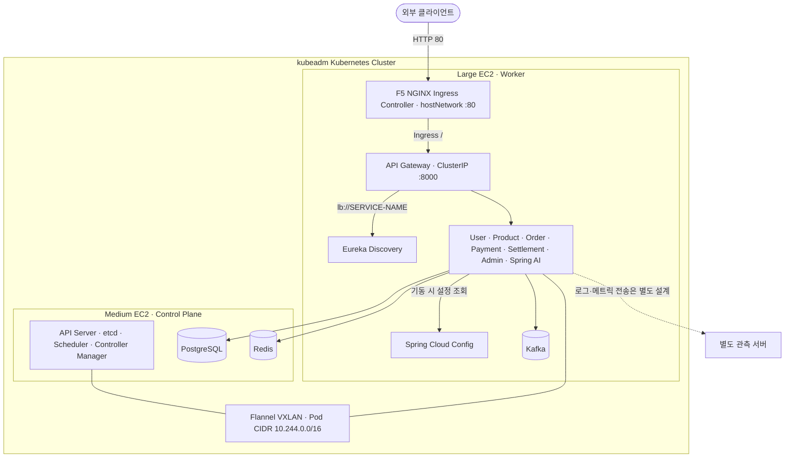
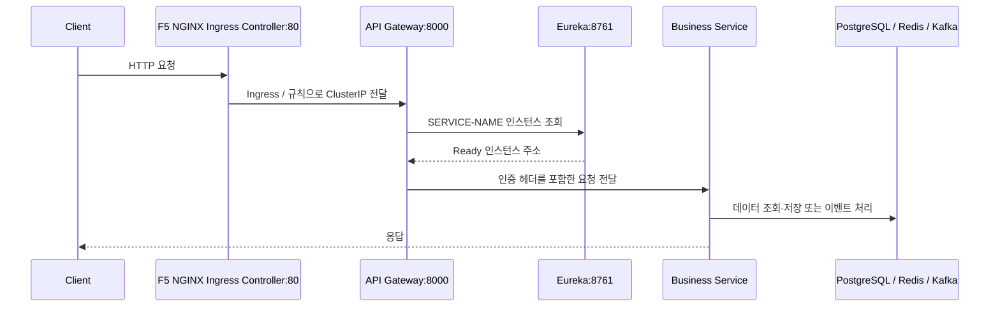

# Kubernetes 아키텍처 명세

> 상태: 승인된 목표 아키텍처, 상태 저장 인프라 구현·검증 완료, 플랫폼·애플리케이션과 Ingress 매니페스트 작성 중
> 관련 이슈: [#340](https://github.com/prgrms-be-adv-devcourse/beadv6_6_3JMT_BE/issues/340)
> 최종 갱신: 2026-07-16

## 1. 문서 목적

이 문서는 PromptHub 백엔드를 Kubernetes에 배포할 때 따라야 하는 목표 아키텍처와 매니페스트 구성 규칙을 정의한다. Kubernetes 전환의 선택 배경, 범위, 리소스 계약과 변경 기준은 이 문서를 유일한 아키텍처 원본으로 사용한다.

`k8s/README.md`는 이 명세를 반복하지 않고 매니페스트 렌더링, 적용, 검증과 복구 명령만 제공한다. 아키텍처 값이 바뀌면 이 문서와 실제 매니페스트를 함께 변경하며 README에 별도 명세를 만들지 않는다.

이 문서에서 다루는 범위는 다음과 같다.

- 두 EC2 노드의 역할과 워크로드 배치
- Kubernetes 리소스 종류, 이름, 포트와 의존 관계
- Flannel, Service DNS, Eureka와 Config Server의 역할 분담
- Local PV/PVC와 상태 저장 워크로드
- Secret과 런타임 설정 주입 방식
- `k8s/` 매니페스트 디렉터리와 Kustomize 패키지 구성
- 리소스 label, 파일 이름, 이미지 태그와 변경 규칙
- 기동, 검증, 장애와 복구의 기본 계약

애플리케이션의 Java 패키지 구조, 도메인 설계, 로그·메트릭 스택은 이 문서의 범위가 아니다.

## 2. 결정 배경과 전환 범위

### 2.1 선택 배경과 목표

현재 단일 EC2의 Docker Compose에서 실행하는 PromptHub 백엔드를 두 대의 EC2에 직접 설치한 Kubernetes 클러스터로 옮긴다. EKS 같은 관리형 Kubernetes를 사용하지 않고 Ubuntu에 containerd, kubeadm, kubelet, kubectl과 Flannel을 직접 설치한다.

이번 전환은 단순한 실행 환경 교체뿐 아니라 클러스터 부트스트랩, Pod 네트워크, 스케줄링, StatefulSet, PV/PVC, Secret, probe와 배포·복구 절차를 직접 학습하는 것을 목표로 한다. 첫 배포와 검증은 SSH와 `kubectl`로 수행하고, 절차가 재현 가능해진 뒤 GitHub Actions CD를 Kubernetes 방식으로 전환한다.

### 2.2 제외 범위

- 기존 PostgreSQL·Redis·Kafka 데이터 이전
- 다중 Control Plane, 다중 Worker와 자동 장애 조치
- EKS, AWS Load Balancer Controller와 EBS CSI 동적 프로비저닝
- 자체 도메인과 TLS 인증서 자동화
- Elasticsearch, Logstash, Filebeat, Kibana, Prometheus와 Grafana
- Flannel이 제공하지 않는 Kubernetes NetworkPolicy
- HPA, VPA와 PodDisruptionBudget
- 첫 단계에서의 서비스별 PostgreSQL 계정 전환

로그와 메트릭 관측 스택은 크레딧이 남는 별도 서버에 구성하며 이 클러스터 전환과 독립적으로 다룬다.

### 2.3 전환 원칙

Kubernetes 전환과 애플리케이션 구조 변경을 동시에 진행하지 않는다.

- Eureka 기반 서비스 등록과 `lb://SERVICE-NAME` 라우팅을 유지한다.
- Spring Cloud Config native backend와 이미지에 포함된 `config/src/main/resources/configs/`를 유지한다.
- PostgreSQL 초기화 스크립트와 서비스별 Flyway baseline을 유지한다.
- 서비스별 Gradle 빌드와 Dockerfile을 유지한다.
- Compose 컨테이너 이름 대신 Kubernetes Service DNS를 사용한다.
- `latest` 대신 기존 워크플로가 생성하는 짧은 Git SHA 태그를 사용한다.

### 2.4 현재 구현 상태

2026-07-15 기준으로 단일 Control Plane과 단일 Worker가 `Ready`이며 Flannel을 통한 노드 간 Pod 통신을 검증했다. PostgreSQL, Redis와 Kafka는 StatefulSet과 Local PV/PVC로 배포했고 Pod 재생성 후 데이터가 유지되는 것도 확인했다.

Discovery, Config, 비즈니스 서비스와 API Gateway 매니페스트는 작성 중이며 아직 클러스터에 적용하지 않았다. Spring AI, Ingress Controller 실제 설치와 Kubernetes CD 전환은 후속 배포 단계다. 기존 Docker Compose 트래픽은 외부 진입점 전환을 승인하기 전까지 유지한다.

### 2.5 기준 우선순위

이 문서는 목표 상태 명세이며 `k8s/` 매니페스트는 이 계약을 구현한다.

서로 다른 문서나 설정이 충돌하면 다음 순서로 판단한다.

1. 실제 애플리케이션 코드가 제공하거나 소비하는 프로토콜 계약
2. 이 문서의 Kubernetes 리소스·배치 계약
3. `k8s/` 매니페스트의 현재 구현
4. 기존 `docker-compose.yml`의 레거시 호스트 포트와 기동 계약

충돌을 발견하면 매니페스트에서 임의로 우회하지 않는다. 코드·Config Server·이 문서를 함께 정렬하고 변경 근거를 이슈에 남긴다.

### 2.6 전환 단계

전환은 하나의 이슈로 추적하되 독립적으로 검증할 수 있는 네 단계로 나눈다.

1. 클러스터 부트스트랩: EC2 사전 점검, containerd, kubeadm, Flannel, 노드 join과 네트워크 검증
2. 상태 저장 인프라: Local PV/PVC, PostgreSQL init/Flyway, Redis, Kafka와 재생성 검증
3. 플랫폼·애플리케이션: Secret, Discovery, Config, 비즈니스 서비스, Spring AI, Gateway와 HTTP/gRPC 검증
4. 배포 전환: SHA 이미지 rollout, rollback, Config 변경 절차와 GitHub Actions CD 교체

각 단계는 앞 단계의 검증 결과를 입력으로 사용한다. 클러스터가 `Ready`가 아니면 인프라를 배포하지 않고, 인프라가 준비되지 않으면 플랫폼과 애플리케이션 배포로 넘어가지 않는다.

## 3. 설계 원칙과 경계

- Kubernetes는 kubeadm으로 직접 설치한다. EKS나 k3s는 사용하지 않는다.
- 클러스터는 단일 Control Plane과 단일 Worker로 구성한다.
- Pod 네트워크는 Flannel VXLAN을 사용한다.
- 모든 프로젝트 워크로드의 replica는 첫 배포에서 1개다.
- PostgreSQL, Redis와 Kafka는 StatefulSet과 static Local PV/PVC를 사용한다.
- Discovery와 Config Server는 유지한다. Kubernetes DNS나 ConfigMap으로 즉시 대체하지 않는다.
- 실제 환경변수는 Medium에서 직접 관리하는 Secret YAML로 주입한다.
- 외부 진입점은 Large에서 `hostNetwork`로 실행하는 F5 NGINX Ingress Controller 하나다.
- API Gateway Service는 ClusterIP로 유지하며 외부 HTTP 요청은 Ingress를 통해서만 전달한다.
- 애플리케이션 이미지는 `latest`가 아닌 불변 Git SHA 태그를 사용한다.
- 매니페스트는 Kustomize base와 `learning` overlay로 관리한다.
- 로그와 메트릭 수집 시스템은 별도 서버에 두며 이 클러스터에 배치하지 않는다.
- 이 구성은 학습 환경이다. 노드 장애 고가용성이나 데이터 자동 복구를 제공하지 않는다.

### 3.1 채택한 절충점

- kubeadm 직접 설치를 선택해 학습 범위를 넓히는 대신 관리형 Control Plane의 안정성을 포기한다.
- Flannel을 선택해 설치와 네트워크 이해를 단순화하는 대신 NetworkPolicy를 포기한다.
- Control Plane에 PostgreSQL과 Redis를 제한 배치해 두 서버 자원을 활용하는 대신 Medium 장애 범위를 키운다.
- Local PV를 선택해 CSI 복잡도를 피하는 대신 노드 간 이동과 자동 복구를 포기한다.
- Eureka와 Config를 유지해 애플리케이션 변경을 줄이는 대신 Kubernetes native service discovery와 ConfigMap으로 즉시 전환하지 않는다.
- F5 NGINX Ingress Controller를 DaemonSet과 `hostNetwork`로 실행해 NodePort와 AWS Load Balancer를 생략하는 대신, Large의 80/443 포트 충돌과 호스트 네트워크 접근 위험을 직접 관리한다.
- 첫 단계는 EC2 공인 DNS와 HTTP 80만 사용한다. 자체 도메인과 신뢰 가능한 TLS 인증서가 준비되기 전에는 HTTPS 443을 외부 진입점으로 사용하지 않는다.
- 현재 단일 `/` 라우팅에는 안정화된 `networking.k8s.io/v1` Ingress를 사용한다. Kubernetes가 Ingress API의 신규 개발을 중단하고 Gateway API를 권장하므로, 향후 복잡한 트래픽 정책이 필요해지면 별도 전환 이슈에서 Gateway API를 평가한다.
- 초기 resource requests/limits는 보수적으로 지정하되 실제 부하와 장애 기록을 기준으로 재조정한다.

## 4. 물리 토폴로지

| 서버 | Kubernetes 역할 | 사용자 label | 배치 대상 |
|---|---|---|---|
| Medium EC2 | Control Plane | `prompthub.io/node-pool=control-stateful` | Control Plane, PostgreSQL, Redis |
| Large EC2 | Worker | `prompthub.io/node-pool=application` | Kafka, Discovery, Config, 전체 애플리케이션 |
| 별도 서버 | 클러스터 외부 | 해당 없음 | 로그·메트릭 관측 스택 |



### 4.1 장애 경계

| 장애 지점 | 영향 |
|---|---|
| Medium 중단 | Control Plane, PostgreSQL과 Redis가 동시에 중단된다. 기존 Worker Pod가 남아도 관리와 핵심 요청이 실패한다. |
| Large 중단 | Kafka, Discovery, Config와 모든 애플리케이션이 중단된다. |
| Local PV가 있는 노드 소실 | 다른 노드로 볼륨이나 StatefulSet이 자동 이동하지 않는다. |
| Config 중단 | 실행 중인 Pod는 기존 설정으로 동작하지만 신규 Pod는 정상 기동하지 못한다. |
| Eureka 중단 | 신규 등록과 조회가 실패하고 Gateway 라우팅이 불안정해진다. |
| Ingress Controller 중단 | 외부 HTTP 요청이 API Gateway에 도달하지 못한다. 클러스터 내부 Service 통신은 유지된다. |

## 5. 클러스터 기준

| 항목 | 기준 |
|---|---|
| OS | Ubuntu Server 26.04 LTS |
| Kubernetes | v1.36.2 |
| containerd | v2.2.5, CRI v1, systemd cgroup |
| Flannel | v0.28.4, VXLAN |
| Flannel CNI plugin | v1.9.1 |
| Ingress Controller | F5 NGINX Ingress Controller OSS v5.5.1 |
| Pod CIDR | `10.244.0.0/16` |
| Service CIDR | `10.96.0.0/12` |
| 프로젝트 Namespace | `prompthub` |
| 외부 HTTP 포트 | Large TCP 80 |

버전 변경은 한 구성 요소만 독립적으로 올리지 않는다. Kubernetes, containerd, Flannel 호환성을 확인하고 kubeadm 설치 문서와 이 표를 같은 변경에서 갱신한다.

## 6. Namespace와 스케줄링

### 6.1 Namespace

- 프로젝트 리소스는 `prompthub` namespace에 둔다.
- `StorageClass`와 `PersistentVolume`은 cluster-scoped 리소스이므로 namespace를 지정하지 않는다.
- Flannel은 `kube-flannel`, Kubernetes 시스템 Pod는 `kube-system`을 유지한다.
- 다른 환경이 추가되기 전까지 namespace를 서비스별로 나누지 않는다.

### 6.2 Node 배치

Control Plane의 기본 `node-role.kubernetes.io/control-plane:NoSchedule` taint는 유지한다.

| 워크로드 | `nodeSelector` | Control Plane toleration |
|---|---|---|
| PostgreSQL, Redis | `prompthub.io/node-pool=control-stateful` | 필요 |
| Kafka | `prompthub.io/node-pool=application` | 없음 |
| Discovery, Config | `prompthub.io/node-pool=application` | 없음 |
| 비즈니스 서비스, Spring AI, Gateway | `prompthub.io/node-pool=application` | 없음 |
| F5 NGINX Ingress Controller | `prompthub.io/node-pool=application` | 없음 |

PostgreSQL과 Redis 이외의 프로젝트 Pod에는 Control Plane toleration을 추가하지 않는다. Local PV의 `nodeAffinity`도 같은 사용자 label을 기준으로 고정한다.

## 7. 논리 아키텍처와 통신 책임

Kubernetes 도입 후에도 DNS, Eureka와 Config Server의 책임을 구분한다.

| 기능 | 담당 | 사용 예 |
|---|---|---|
| Pod 간 기본 주소 확인 | Kubernetes Service DNS | `postgres:5432`, `kafka:9092`, `config:8888` |
| HTTP 서비스 등록·조회 | Eureka | Gateway의 `lb://USER-SERVICE` |
| 애플리케이션 설정 제공 | Spring Cloud Config | `configserver:http://config:8888` |
| 민감값과 런타임 환경변수 | Kubernetes Secret | DB 비밀번호, JWT key, 외부 API key |
| 비동기 이벤트 | Kafka | `kafka:9092` |
| 내부 gRPC | Kubernetes Service DNS | `user-service:9081` |

Kubernetes Service 이름은 런타임 주소 계약이다. 이름을 바꾸면 Config Server 파일, Secret key 또는 애플리케이션 설정도 함께 바꿔야 한다.

### 7.1 외부 요청 흐름



### 7.2 외부 egress

| 출발 워크로드 | 목적지 | 포트 | 용도 |
|---|---|---:|---|
| Payment | Toss Payments API | 443 | 결제 승인·취소 |
| Product | AWS S3 API | 443 | 상품 파일 저장 |
| Spring AI | OpenAI API | 443 | AI 요청 |
| 각 노드 | GHCR와 패키지 저장소 | 443 | 이미지 pull과 설치 |

외부 egress를 차단하는 보안 구성을 추가할 때는 이 통신을 명시적으로 허용한다.

## 8. Kubernetes 리소스 명세

### 8.1 상태 저장 인프라

| 이름 | Kind | 노드 | Service | 포트 | 영속성 |
|---|---|---|---|---:|---|
| `postgres` | StatefulSet | Medium | `postgres`, `postgres-headless` | 5432 | `postgres-data` PVC 20Gi |
| `redis` | StatefulSet | Medium | `redis`, `redis-headless` | 6379 | `redis-data` PVC 5Gi |
| `kafka` | StatefulSet | Large | `kafka`, `kafka-headless` | 9092, 9093 | `kafka-data` PVC 20Gi |

각 StatefulSet은 Pod network identity를 위한 headless Service와 클라이언트용 ClusterIP Service를 분리한다. Kafka controller identity에는 `kafka-headless`를 사용하고 애플리케이션은 `kafka:9092`로 접속한다.

### 8.2 플랫폼과 애플리케이션

| Kubernetes 이름 | Kind | replica | Service 포트 → Pod 포트 | Eureka 이름 | 상태 |
|---|---|---:|---|---|---|
| `discovery` | Deployment | 1 | 8761 → 8761 | 등록하지 않음 | 기존 모듈 |
| `config` | Deployment | 1 | 8888 → 8888 | 등록하지 않음 | 기존 모듈 |
| `user-service` | Deployment | 1 | HTTP 8081 → 18081, gRPC 9081 → 9081 | `USER-SERVICE` | 기존 모듈 |
| `product-service` | Deployment | 1 | HTTP 8082 → 18082, gRPC 9082 → 9082 | `PRODUCT-SERVICE` | 기존 모듈 |
| `order-service` | Deployment | 1 | HTTP 8083 → 18083, gRPC 9083 → 9083 | `ORDER-SERVICE` | 기존 모듈 |
| `payment-service` | Deployment | 1 | HTTP 8084 → 18084, gRPC 9084 → 9084 | `PAYMENT-SERVICE` | 기존 gRPC 서버 포함 |
| `settlement-service` | Deployment | 1 | HTTP 8085 → 18085 | `SETTLEMENT-SERVICE` | 현재 gRPC 클라이언트만 사용 |
| `admin-service` | Deployment | 1 | HTTP 8086 → 18086 | `ADMIN-SERVICE` | 기존 모듈 |
| `spring-ai-service` | Deployment | 1 | HTTP 8087 → 18087 | `SPRING-AI-SERVICE` | 구현·이미지 준비 필요 |
| `apigateway` | Deployment | 1 | 8000 → 8000 | `APIGATEWAY` | 기존 모듈 |

HTTP Service의 808x 포트는 기존 내부 호출 계약을 유지하고, 1808x `targetPort`는 Config Server의 현재 `server.port`를 따른다.

Payment는 `PaymentQueryGrpcService` 구현과 gRPC server starter를 가지므로 9084를 Service로 노출한다. Kubernetes 적용 전에 `config/src/main/resources/configs/payment-service.yml`에서 `spring.grpc.server.port`를 9084로 명시해야 한다. Settlement의 Compose 9085 매핑과 Config 값은 현재 서버 구현이 없는 레거시 설정이므로 Kubernetes Service에는 9085를 노출하지 않는다.

Spring AI는 현재 저장소에 모듈이 없다. 다음 조건을 충족한 이미지가 준비되기 전에는 해당 패키지를 base의 최종 `kustomization.yaml`에 포함하지 않는다.

- 이미지: `ghcr.io/prgrms-be-adv-devcourse/prompthub-spring-ai-service:<git-sha>`
- `SPRING-AI-SERVICE`로 Eureka 등록
- HTTP 18087과 Actuator health endpoint 제공
- `OPENAI_API_KEY`를 `spring-ai-secret`에서 주입

### 8.3 Gateway 외부 노출

외부 HTTP 요청은 F5 NGINX Ingress Controller와 `apigateway` Ingress를 거쳐 API Gateway로만 전달한다. Ingress Controller는 공개 진입과 L7 전달만 담당하고, 인증·인가와 Eureka 기반 서비스 라우팅은 기존 API Gateway가 담당한다.

F5 NGINX Ingress Controller 계약은 다음과 같다.

| 필드 | 값 |
|---|---|
| 구현체 | F5 NGINX Ingress Controller OSS v5.5.1 |
| 이미지 | `nginx/nginx-ingress:5.5.1`을 digest로 고정 |
| Namespace | `nginx-ingress` |
| workload | `DaemonSet` |
| 배치 노드 | Large (`prompthub.io/node-pool=application`) |
| 네트워크 | `hostNetwork: true` |
| DNS 정책 | `ClusterFirstWithHostNet` |
| IngressClass | 이름 `nginx`, controller `nginx.org/ingress-controller` |
| 표준 Ingress 전용 | `-enable-custom-resources=false` |
| host 없는 규칙 허용 | `-allow-empty-ingress-host` |
| 감시 범위 | `-watch-namespace=prompthub` |
| telemetry | `-enable-telemetry-reporting=false` |
| 내부 상태 포트 | NGINX status 18080, readiness 18081 |
| 공개 포트 | HTTP 80 |
| Service 노출 | 사용하지 않음(NodePort·LoadBalancer 없음) |

`hostNetwork`는 Controller가 Large EC2의 네트워크 인터페이스와 listener를 직접 사용하게 한다. 한 노드에서 같은 포트를 쓰는 Controller Pod를 둘 이상 실행할 수 없으므로 DaemonSet으로 노드당 하나만 배치한다. F5 Controller 기본 상태 포트 8080·8081은 기존 Docker 포트와 충돌할 수 있으므로 18080·18081로 변경하고 보안 그룹에는 공개하지 않는다.

이 설계의 NGINX Controller는 F5가 유지보수하는 `nginx/kubernetes-ingress` 계열이다. 2026년 3월 유지보수가 종료된 커뮤니티 `kubernetes/ingress-nginx`와 `registry.k8s.io/ingress-nginx/controller` 이미지는 새 설치에 사용하지 않는다.

`learning` 환경의 `apigateway` Ingress 계약은 다음과 같다.

| 필드 | 값 |
|---|---|
| apiVersion | `networking.k8s.io/v1` |
| ingressClassName | `nginx` |
| host | 지정하지 않음(EC2 공인 DNS·IP 요청 허용) |
| path / pathType | `/` / `Prefix` |
| backend | `apigateway:8000` |
| TLS | 첫 단계에서는 사용하지 않음 |
| Gateway Service type | `ClusterIP` |

host를 지정하지 않은 규칙은 Controller로 들어온 모든 HTTP Host 헤더에 적용되며 F5 Controller의 `-allow-empty-ingress-host`가 필요하다. 이 클러스터는 표준 Kubernetes Ingress만 사용하므로 F5 전용 VirtualServer·TransportServer CRD는 설치하지 않고 custom resources를 비활성화한다. 자체 도메인을 연결할 때는 host를 명시하고 TLS Secret 또는 인증서 자동화 구성을 같은 변경에서 추가한다.

Vercel의 HTTPS 페이지에서 브라우저가 EC2의 HTTP API를 직접 호출하면 혼합 콘텐츠 정책으로 차단될 수 있다. 실제 프런트엔드 전환 전에 자체 도메인과 HTTPS를 구성하거나 Vercel의 서버 측 proxy/rewrite를 통해 API를 호출해야 한다. HTTP 80 구성은 클러스터 통신과 cutover 전 스모크 테스트를 위한 첫 단계다.

현재 Docker Compose Gateway가 Large의 host 80을 사용하므로 Docker Gateway와 `hostNetwork` Controller는 동시에 실행할 수 없다. 2026-07-16 실측으로 Docker 12개와 Kubernetes Kafka가 실행 중인 Worker의 available memory가 약 2.3GiB이므로 플랫폼·비즈니스 서비스·Gateway Pod 전체도 Docker와 동시에 추가하지 않는다. cutover 전에는 client/server dry-run만 수행하고, Secret과 이미지 pull을 준비한 뒤 승인된 전환 시간에 Docker 애플리케이션을 중지한다. 이후 Kubernetes 플랫폼·서비스·Gateway를 ClusterIP와 `kubectl port-forward`로 검증한 다음 Controller를 시작한다. 스모크 테스트에 실패하면 Controller와 Kubernetes 애플리케이션을 내리고 Docker 애플리케이션을 다시 시작하는 것을 rollback 경계로 삼는다. Controller 적용 전에 80, 443, 18080과 18081 listener 점유 여부를 모두 확인한다.

Discovery, Config, 인프라와 비즈니스 Service는 모두 ClusterIP로 유지하고 별도 Ingress를 만들지 않는다.

## 9. 네트워크 명세

### 9.1 Flannel

- backend는 VXLAN이다.
- Pod CIDR은 `10.244.0.0/16`이다.
- 노드 사이 UDP 8472를 허용한다.
- VPC나 연결 네트워크와 Pod·Service CIDR이 겹치면 kubeadm 초기화 전에 CIDR을 다시 정한다.
- Flannel은 NetworkPolicy를 집행하지 않는다. 첫 단계의 격리는 보안 그룹, Ingress 단일 진입점과 ClusterIP 경계에 의존한다.

### 9.2 보안 그룹

| 대상 | 포트 | 출발지 |
|---|---|---|
| 두 EC2 | TCP 22 | 관리자 고정 IP |
| Medium | TCP 6443 | Large 보안 그룹 |
| 두 EC2 | TCP 10250 | 상대 노드 보안 그룹 |
| 두 EC2 | UDP 8472 | 상대 노드 보안 그룹 |
| Large | TCP 80 | 외부 HTTP 클라이언트 |
| Large | TCP 443 | 자체 도메인과 TLS 적용 후 외부 HTTPS 클라이언트 |

PostgreSQL 5432, Redis 6379, Kafka 9092·9093, Eureka 8761, Config 8888, 내부 HTTP·gRPC 포트는 인터넷에 공개하지 않는다.

첫 HTTP 단계에서는 443을 Kubernetes 진입점으로 사용하지 않는다. 기존 Docker 트래픽 때문에 이미 열린 80/443 규칙은 cutover 전까지 유지할 수 있지만, Kubernetes 전환 시점에는 실제 listener와 사용 목적을 다시 확인하고 불필요한 규칙을 닫는다.

## 10. 설정과 Secret 명세

### 10.1 설정 책임

| 데이터 | 저장 위치 | Git 추적 |
|---|---|---|
| 공통·서비스별 Spring 설정 | Config 이미지의 `config/src/main/resources/configs/` | 허용 |
| 실제 비밀번호·key·credential | Medium의 `/home/ubuntu/prompthub-secrets/secret.yaml` | 금지 |
| Secret key 이름과 작성 예시 | `k8s/templates/secret.example.yaml` | 허용 |
| PostgreSQL 초기화 스크립트 | ConfigMap으로 마운트할 선언적 매니페스트 | 허용 |
| GHCR pull credential | `ghcr-pull-secret` | 금지 |

사용자 결정에 따라 호스트·포트처럼 민감하지 않은 런타임 환경변수도 `runtime-secret`에서 주입한다. 일반 애플리케이션 설정을 별도 ConfigMap으로 이중 관리하지 않는다.

### 10.2 Secret 객체

| Secret | 주요 key | 소비자 |
|---|---|---|
| `postgres-secret` | `POSTGRES_DB`, `POSTGRES_USER`, `POSTGRES_PASSWORD`, 역할 비밀번호 | PostgreSQL, DB 사용 서비스 |
| `runtime-secret` | DB·Redis·Kafka·Config·Eureka 주소와 포트 | Spring 워크로드 |
| `jwt-secret` | `JWT_PRIVATE_KEY`, `JWT_PUBLIC_KEY` | User, Gateway |
| `payment-secret` | `TOSS_SECRET_KEY`, `TOSS_TEST_MODE` | Payment |
| `product-secret` | AWS region, S3 bucket, AWS credential | Product |
| `spring-ai-secret` | `OPENAI_API_KEY` | Spring AI |
| `ghcr-pull-secret` | Docker registry credential | GHCR 이미지를 쓰는 Pod |

실제 Secret 파일은 mode 600으로 유지한다. 각 Pod는 필요한 key만 `secretKeyRef`로 참조하고 ServiceAccount token은 Kubernetes API 사용이 없으면 자동 mount하지 않는다.

### 10.3 런타임 주소

```text
SPRING_CONFIG_IMPORT=configserver:http://config:8888
EUREKA_CLIENT_SERVICEURL_DEFAULTZONE=http://discovery:8761/eureka/
POSTGRES_HOST=postgres
POSTGRES_PORT=5432
REDIS_HOST=redis
REDIS_PORT=6379
KAFKA_BOOTSTRAP_SERVERS=kafka:9092
```

Config 파일은 Config Server 이미지에 포함된다. 설정을 바꾸면 Config 이미지를 새 SHA로 배포하고 영향을 받는 Deployment를 순차 재시작한다.

## 11. 스토리지 명세

### 11.1 StorageClass

`local-storage`는 다음 값을 사용한다.

```yaml
provisioner: kubernetes.io/no-provisioner
volumeBindingMode: WaitForFirstConsumer
reclaimPolicy: Retain
```

### 11.2 PV/PVC

| PV | PVC | 노드 | `spec.local.path` | 컨테이너 mount | 용량 | access mode |
|---|---|---|---|---|---:|---|
| `postgres-local-pv` | `postgres-data` | Medium | `/var/lib/prompthub/postgres` | `/var/lib/postgresql` | 20Gi | `ReadWriteOnce` |
| `redis-local-pv` | `redis-data` | Medium | `/var/lib/prompthub/redis` | `/data` | 5Gi | `ReadWriteOnce` |
| `kafka-local-pv` | `kafka-data` | Large | `/var/lib/prompthub/kafka` | `/var/lib/kafka/data` | 20Gi | `ReadWriteOnce` |

PV는 사용자 node-pool label을 이용한 `nodeAffinity`를 가져야 한다. 호스트 디렉터리는 매니페스트 적용 전에 SSH로 만들고 컨테이너 UID/GID가 쓸 수 있게 설정한다.

PV 용량은 EC2 파일시스템을 물리적으로 분리하거나 강제 제한하지 않는다. 디스크 사용량은 별도로 확인해야 한다. 데이터는 이전하지 않으며 초기 배포에서 새로 생성한다.

## 12. 매니페스트 패키지 구조

목표 디렉터리는 다음과 같다.

```text
k8s/
├── addons/
│   └── nginx-ingress/
│       ├── kustomization.yaml
│       ├── namespace.yaml
│       ├── service-account.yaml
│       ├── rbac.yaml
│       ├── ingress-class.yaml
│       ├── configmap.yaml
│       └── controller-daemonset.yaml
├── base/
│   ├── kustomization.yaml
│   ├── namespace.yaml
│   ├── storage/
│   │   ├── kustomization.yaml
│   │   ├── storage-class.yaml
│   │   ├── postgres/
│   │   │   ├── kustomization.yaml
│   │   │   ├── postgres-pv.yaml
│   │   │   └── postgres-pvc.yaml
│   │   ├── redis/
│   │   │   ├── kustomization.yaml
│   │   │   ├── redis-pv.yaml
│   │   │   └── redis-pvc.yaml
│   │   └── kafka/
│   │       ├── kustomization.yaml
│   │       ├── kafka-pv.yaml
│   │       └── kafka-pvc.yaml
│   ├── infrastructure/
│   │   ├── kustomization.yaml
│   │   ├── postgres/
│   │   │   ├── kustomization.yaml
│   │   │   ├── init-configmap.yaml
│   │   │   ├── service.yaml
│   │   │   ├── headless-service.yaml
│   │   │   └── statefulset.yaml
│   │   ├── redis/
│   │   │   ├── kustomization.yaml
│   │   │   ├── service.yaml
│   │   │   ├── headless-service.yaml
│   │   │   └── statefulset.yaml
│   │   └── kafka/
│   │       ├── kustomization.yaml
│   │       ├── service.yaml
│   │       ├── headless-service.yaml
│   │       └── statefulset.yaml
│   ├── platform/
│   │   ├── kustomization.yaml
│   │   ├── discovery/
│   │   │   ├── kustomization.yaml
│   │   │   ├── deployment.yaml
│   │   │   └── service.yaml
│   │   └── config/
│   │       ├── kustomization.yaml
│   │       ├── deployment.yaml
│   │       └── service.yaml
│   ├── services/
│   │   ├── kustomization.yaml
│   │   ├── user/
│   │   ├── product/
│   │   ├── order/
│   │   ├── payment/
│   │   ├── settlement/
│   │   ├── admin/
│   │   └── spring-ai/
│   └── gateway/
│       ├── kustomization.yaml
│       ├── deployment.yaml
│       └── service.yaml
├── overlays/
│   └── learning/
│       ├── kustomization.yaml
│       └── gateway-ingress.yaml
├── templates/
│   └── secret.example.yaml
└── README.md
```

`services` 아래 각 워크로드 디렉터리는 기본적으로 다음 세 파일을 가진다.

```text
<service>/
├── kustomization.yaml
├── deployment.yaml
└── service.yaml
```

Spring AI 패키지는 계약을 문서화하기 위해 디렉터리를 예약하지만, 이미지와 모듈 준비 전에는 상위 `services/kustomization.yaml`의 `resources`에 넣지 않는다.

PostgreSQL의 `init-configmap.yaml`은 루트 `docker-entrypoint-initdb.d/01-init-schemas-and-roles.sh`와 같은 내용을 사용한다. 초기화 스크립트를 바꾸면 두 배포 방식의 입력이 달라지지 않도록 ConfigMap 매니페스트도 같은 커밋에서 갱신하고 차이를 검사한다.

`addons/nginx-ingress`는 `nginx-ingress` namespace의 Controller와 cluster-scoped RBAC·IngressClass를 독립 관리한다. `overlays/learning`의 namespace transformer가 Controller namespace를 `prompthub`로 덮어쓰지 않도록 전체 애플리케이션 overlay에 포함하지 않고 먼저 별도 적용한다.

환경별 외부 주소 계약은 base가 아니라 overlay가 소유한다. 따라서 EC2 공인 DNS를 받는 host 없는 `apigateway` Ingress는 `overlays/learning/gateway-ingress.yaml`에 두고, `base/gateway`의 Service는 환경과 무관한 ClusterIP로 유지한다.

## 13. Kustomize 구성 규칙

### 13.1 Base

`base`는 환경과 무관한 다음 계약을 가진다.

- 리소스 이름, Service 포트와 selector
- workload kind와 replica 기본값
- probe, 종료 유예와 배포 전략
- nodeSelector와 필요한 toleration
- PVC 이름과 mount path
- 초기 requests/limits
- Secret key 참조 이름

Base 이미지도 `latest`를 사용하지 않는다. 첫 구현 시 동작이 검증된 SHA 태그를 기록하고 overlay가 배포할 SHA로 교체한다.

애플리케이션 이미지 이름은 다음 규칙을 사용한다.

```text
ghcr.io/prgrms-be-adv-devcourse/prompthub-<module-name>:<short-git-sha>
```

`<module-name>`은 저장소의 Gradle 모듈 이름을 사용한다. 예외로 Spring AI는 8.2절에 정의한 예약 이름을 사용한다.

### 13.2 Learning overlay

`overlays/learning`은 두 EC2 학습 환경의 실제 배포값을 가진다.

- GHCR 이미지 이름과 Git SHA 태그
- 실제 운영 중 조정한 requests/limits patch
- EC2 공인 DNS를 받는 host 없는 HTTP Gateway Ingress
- `app.kubernetes.io/instance=learning` 환경 label
- 환경별 replica 변경이 생긴 경우의 patch

실제 Secret 리소스는 overlay에 포함하지 않는다. Medium에서 `kubectl apply -f /home/ubuntu/prompthub-secrets/secret.yaml`로 먼저 적용한다.

### 13.3 적용 단위

각 상위 디렉터리는 자체 `kustomization.yaml`을 가져 독립적으로 렌더링할 수 있어야 한다.

| 적용 단위 | 포함 리소스 |
|---|---|
| `addons/nginx-ingress` | F5 NGINX Ingress Controller, RBAC, IngressClass |
| `base/storage` | StorageClass, PV, PVC |
| `base/infrastructure` | PostgreSQL, Redis, Kafka |
| `base/platform` | Discovery, Config |
| `base/services` | 비즈니스 서비스, 준비된 경우 Spring AI |
| `base/gateway` | API Gateway Deployment와 ClusterIP Service |
| `overlays/learning` | 전체 base, 환경 patch와 Gateway Ingress |

Kustomize의 파일 나열 순서는 readiness를 보장하지 않는다. 최초 설치는 16절의 배포 파동대로 그룹별 적용과 대기를 수행하고, 전체 overlay 적용은 초기 인프라와 Ingress Controller가 준비된 뒤 반복 배포에 사용한다.

## 14. 리소스 이름과 label

### 14.1 이름

- Kubernetes 리소스는 소문자 kebab-case를 사용한다.
- Deployment, StatefulSet과 주 Service는 같은 기본 이름을 사용한다.
- Stateful 데이터 PVC는 `<component>-data`를 사용한다.
- Local PV는 `<component>-local-pv`를 사용한다.
- headless Service는 `<component>-headless`를 사용한다.
- 환경 이름을 리소스 이름 앞에 붙이지 않는다. namespace와 label로 구분한다.
- 전역 `namePrefix`는 Service DNS 계약을 깨뜨릴 수 있으므로 사용하지 않는다.

### 14.2 공통 label

모든 namespaced workload와 Service의 base는 다음 label을 사용한다.

```yaml
app.kubernetes.io/name: <component-name>
app.kubernetes.io/part-of: prompthub
app.kubernetes.io/component: infrastructure|platform|service|gateway
app.kubernetes.io/managed-by: kustomize
```

`learning` overlay는 `app.kubernetes.io/instance: learning`을 추가한다.

Deployment·StatefulSet의 selector와 Pod template label은 정확히 일치해야 한다. selector 변경은 기존 리소스 교체가 필요하므로 단순 리네임으로 처리하지 않는다.

## 15. Workload 공통 계약

### 15.1 Deployment

- replica: 1
- strategy: `RollingUpdate`
- `maxSurge: 1`, `maxUnavailable: 0`
- `terminationGracePeriodSeconds: 30`
- `imagePullPolicy: IfNotPresent`
- `imagePullSecrets: ghcr-pull-secret`
- Large nodeSelector
- startup, readiness, liveness probe
- 필요한 Secret key만 개별 `secretKeyRef`로 주입
- Kubernetes API를 사용하지 않으면 ServiceAccount token 자동 mount 비활성화

Ingress Controller는 Ingress, Service와 EndpointSlice를 감시해야 하므로 전용 ServiceAccount와 F5 v5.5.1 공식 manifest의 core RBAC를 사용하며 ServiceAccount token 자동 mount 비활성화 대상에서 제외한다. F5 전용 CRD와 선택적 통합 API 권한은 제외하고 실제 감시 범위는 `prompthub` namespace로 제한한다.

### 15.2 StatefulSet

- replica: 1
- `podManagementPolicy: OrderedReady`
- `updateStrategy: RollingUpdate`
- 명시적인 PVC mount
- `spec.serviceName`은 먼저 생성된 headless Service를 참조
- nodeSelector와 Local PV nodeAffinity 일치
- PostgreSQL과 Redis는 Control Plane toleration 포함
- PostgreSQL과 Kafka의 `terminationGracePeriodSeconds`: 60

### 15.3 Probe

| 대상 | startup | readiness | liveness |
|---|---|---|---|
| Spring Boot | `/actuator/health` | `/actuator/health/readiness` | `/actuator/health/liveness` |
| PostgreSQL | `pg_isready` | `pg_isready` | `pg_isready` |
| Redis | `redis-cli ping` | `redis-cli ping` | `redis-cli ping` |
| Kafka | TCP 9092 | TCP 9092 | TCP 9092 |

Spring Boot startup probe는 10초 간격으로 최대 30회 실패를 허용한다. readiness는 10초 간격, liveness는 20초 간격을 초기 기준으로 사용한다.

## 16. 기동 순서와 의존성

```mermaid
flowchart LR
    A["1. Namespace · Secret"] --> B["2. StorageClass · PV · PVC"]
    B --> C["3. PostgreSQL · Redis · Kafka"]
    C --> D["4. Discovery"]
    D --> E["5. Config Server"]
    E --> F["6. 비즈니스 서비스 · Spring AI"]
    F --> G["7. API Gateway · ClusterIP"]
    G --> H["8. 내부·port-forward 스모크 테스트"]
    H --> I["9. 승인된 cutover · Controller · Ingress"]
    I --> J["10. 외부 HTTP 80 스모크 테스트"]
```



각 파동은 `kubectl wait` 또는 `kubectl rollout status`가 성공한 뒤 다음 단계로 진행한다.

현재 완료된 1~3단계는 기존 Docker 트래픽과 함께 유지한다. 4~10단계의 실제 Pod 적용은 Worker 메모리와 host 80 충돌 때문에 하나의 승인된 cutover 작업으로 진행한다. cutover 전에는 Secret·이미지 준비, 로컬 렌더링과 API Server dry-run까지만 수행하며 문서와 매니페스트 작성만으로 Docker를 중지하거나 애플리케이션 Pod를 생성하지 않는다.

Kubernetes에는 Compose `depends_on`이 없으므로 init container는 네트워크 endpoint만 기다린다.

| 워크로드 | init container 대기 대상 |
|---|---|
| 여섯 비즈니스 서비스와 Spring AI | Discovery, Config |
| DB 사용 서비스 | PostgreSQL 추가 |
| User | Redis 추가 |
| Kafka 사용 서비스 | Kafka 추가 |
| Gateway | Discovery, Config |

비즈니스 서비스끼리 init dependency를 만들지 않는다. 상호 의존은 Eureka, gRPC deadline, retry와 circuit breaker로 처리해 기동 교착을 방지한다.

## 17. 초기 자원 기준

아래 값은 첫 배포 기준이며 확정 용량이 아니다. 실제 부하에서 OOMKilled, CPU throttling, Pending, eviction과 사용량을 확인해 조정한다.

### 17.1 Medium

| Pod | CPU request / limit | Memory request / limit |
|---|---:|---:|
| PostgreSQL | 300m / 800m | 512Mi / 1Gi |
| Redis | 50m / 250m | 128Mi / 256Mi |

Control Plane과 OS를 위해 1~1.5GiB 이상의 메모리 여유를 유지한다.

### 17.2 Large

| Pod 그룹 | 수 | Pod당 CPU request / limit | Pod당 Memory request / limit |
|---|---:|---:|---:|
| Kafka | 1 | 250m / 700m | 768Mi / 1280Mi |
| Discovery, Config | 2 | 100m / 300m | 256Mi / 512Mi |
| 비즈니스 서비스 | 6 | 100m / 500m | 256Mi / 512Mi |
| API Gateway | 1 | 100m / 500m | 256Mi / 512Mi |
| F5 NGINX Ingress Controller | 1 | 100m / 300m | 128Mi / 256Mi |
| Spring AI | 1 | 150m / 600m | 384Mi / 768Mi |

Spring JVM과 Kafka heap은 컨테이너 memory limit보다 작게 명시한다. 자원이 부족하면 모든 Pod 값을 일괄 변경하지 않고 실제 사용량과 재시작 원인을 기준으로 워크로드별로 조정한다.

## 18. 보안 계약

- SSH는 관리자 고정 IP에서만 허용한다.
- API Server 6443은 인터넷에 공개하지 않는다.
- 공개 HTTP 진입은 Large의 F5 NGINX Ingress Controller 80으로 제한한다.
- 자체 도메인과 TLS를 적용하기 전에는 443을 Kubernetes 진입점으로 사용하지 않는다.
- NodePort Service를 외부 진입점으로 만들지 않는다.
- 실제 Secret YAML, base64 값과 kubeconfig를 Git에 커밋하지 않는다.
- `secret.example.yaml`에는 key 이름과 가짜 예시만 둔다.
- GHCR credential은 `kubernetes.io/dockerconfigjson` Secret으로 관리한다.
- Pod는 필요한 Secret key만 주입받는다.
- 불필요한 ServiceAccount token mount를 끈다.
- Flannel 환경에서 NetworkPolicy가 집행된다고 가정하지 않는다.
- 이미지의 non-root 전환은 이미지 하드닝 작업으로 분리하고, 검증 없이 `runAsNonRoot`를 강제하지 않는다.

## 19. 변경 규칙

| 변경 | 함께 확인할 항목 |
|---|---|
| Service 이름 또는 포트 | Config Server, Secret 주소, Eureka와 gRPC client 설정 |
| container port | Service `targetPort`, probe, Config Server `server.port` |
| 이미지 | GHCR SHA 존재, rollout과 rollback 대상 |
| Secret key | `secret.example.yaml`, 소비 Pod의 `secretKeyRef` |
| node label | nodeSelector, PV nodeAffinity, Control Plane toleration |
| PVC 또는 hostPath | StatefulSet mount, EC2 디렉터리 권한, 데이터 초기화 정책 |
| Config Server 파일 | Config 이미지 재빌드, Config rollout, 소비 서비스 재시작 |
| resource requests/limits | 노드 allocatable, JVM/Kafka heap, Pending·OOM 기록 |
| Ingress 또는 Controller | IngressClass, backend Service, Large 80/443 listener, 보안 그룹, TLS 여부 |

배포용 YAML을 직접 복사해 환경별 파일을 만들지 않는다. 공통 변경은 base에, 학습 환경에만 필요한 값은 overlay patch에 둔다.

## 20. 검증 계약

### 20.1 정적 검증

- 모든 패키지가 `kubectl kustomize`로 독립 렌더링된다.
- `kubectl apply --dry-run=client`가 성공한다.
- 클러스터 연결 후 `kubectl apply --server-side --dry-run=server`가 성공한다.
- 렌더링 결과에 `latest`, 실제 Secret 값, 미정 placeholder가 없다.
- F5 NGINX Ingress Controller 이미지는 v5.5.1 digest로 고정되고 외부 노출 Service가 생성되지 않는다.
- `apigateway` Service는 ClusterIP이고 `learning` Ingress backend가 `apigateway:8000`을 가리킨다.
- Deployment·Service selector와 Pod label이 일치한다.
- 모든 Local PV에 올바른 nodeAffinity가 있다.

### 20.2 클러스터 검증

- Medium과 Large가 `Ready`다.
- CoreDNS와 Flannel Pod가 정상이다.
- 서로 다른 노드의 테스트 Pod가 Service DNS와 Pod IP로 통신한다.
- Local PV와 PVC가 의도한 노드에서 `Bound`다.
- PostgreSQL, Redis와 Kafka가 재생성 후 같은 PVC를 사용한다.
- Config endpoint가 서비스별 설정을 반환한다.
- Eureka에 Gateway와 배포된 서비스가 등록된다.
- HTTP와 실제 구현된 gRPC endpoint가 Service DNS로 호출된다.
- F5 NGINX Ingress Controller Pod가 Large에서 Ready이고 Large의 80을 통한 로그인·상품 조회 스모크 테스트가 성공한다.
- `apigateway`와 다른 프로젝트 Service에 NodePort 또는 LoadBalancer type이 없다.
- 잘못된 SHA 이미지 적용 후 직전 SHA로 복구할 수 있다.

## 21. 구현 문서 경계

이 문서는 Kubernetes 선택 배경, 전환 범위와 최종 리소스 계약을 설명하는 유일한 아키텍처 원본이다. SSH 설치 명령이나 단계별 `kubectl` 명령은 담지 않는다.

- 클러스터 직접 설치 절차: `docs/guides/kubeadm-cluster-bootstrap.md`에서 작성
- 실제 매니페스트 사용법: [`k8s/README.md`](../../k8s/README.md)
- 서비스 간 이벤트 흐름: `event-flow.md`
- Spring Cloud 동작: `spring-cloud.md`
- StatefulSet network identity: [Kubernetes StatefulSets](https://kubernetes.io/docs/concepts/workloads/controllers/statefulset/)
- Service와 headless Service: [Kubernetes Service](https://kubernetes.io/docs/concepts/services-networking/service/)
- HTTP 외부 라우팅: [Kubernetes Ingress](https://kubernetes.io/docs/concepts/services-networking/ingress/)
- F5 NGINX Controller 설치: [Install NGINX Ingress Controller with Manifests](https://docs.nginx.com/nginx-ingress-controller/install/manifests/)
- F5 NGINX Controller 호환성: [NGINX Ingress Controller changelog](https://docs.nginx.com/nginx-ingress-controller/changelog/)

`k8s/README.md`에는 버전, 토폴로지, 포트, 리소스 이름, 배치나 용량을 별도 명세로 복사하지 않는다. 명세와 매니페스트가 다르면 매니페스트만 조용히 수정하지 않고 구현 변경과 함께 이 문서를 갱신해 목표 상태와 실제 상태를 일치시킨다.
