# Order Service 상세 유즈케이스

이 문서는 현재 `order-service` 구현을 기준으로 장바구니, 주문, 구매 콘텐츠, 결제 이벤트, 관리자 조회 흐름을 정리한다. 공개 API 경로는 `docs/api-spec/order.md`와 동일하게 실제 컨트롤러의 `/api/v1/...` 경로를 사용한다.

## UC-CART-01 장바구니 조회

| 항목 | 내용 |
|------|------|
| 주 액터 | 구매자 |
| 보조 액터 | Product Service |
| API | `GET /api/v1/cart/products` |
| 목표 | 구매자가 자신의 장바구니 상품 목록과 합계 금액을 확인한다. |
| 사전조건 | Gateway가 `X-User-Id`를 전달한다. |
| 완료 조건 | 장바구니 요약과 상품 스냅샷 목록이 반환된다. |

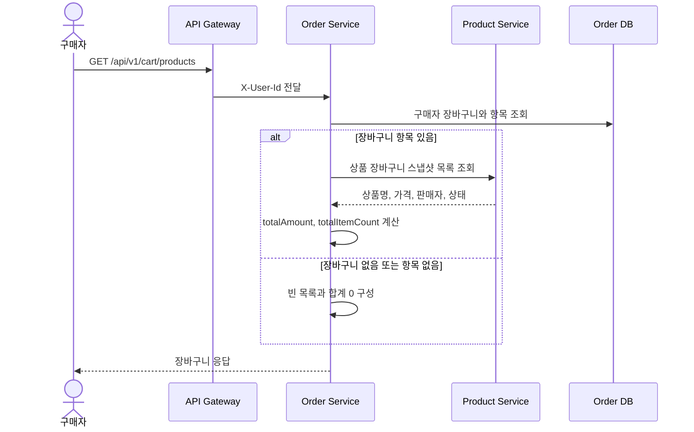

기본 흐름:

1. Order Service는 구매자 ID로 장바구니와 항목을 조회한다.
2. 장바구니가 없으면 `cartId: null`, 빈 목록, 합계 `0`을 반환한다.
3. 항목이 있으면 Product Service에서 상품 스냅샷을 조회한다.
4. 상품 스냅샷과 장바구니 항목을 합쳐 `CartResponse`를 만든다.

대안/예외:

- Product Service 응답에서 필요한 상품 스냅샷이 누락되면 `SYS002`로 실패한다.
- 인증/권한 헤더가 없거나 유효하지 않으면 인증 또는 권한 오류로 응답한다.

## UC-CART-02 장바구니 상품 추가

| 항목 | 내용 |
|------|------|
| 주 액터 | 구매자 |
| 보조 액터 | Product Service |
| API | `POST /api/v1/cart/products` |
| 목표 | 구매자가 판매 중인 상품을 장바구니에 담는다. |
| 사전조건 | 요청 본문에 `productId`가 있다. |
| 완료 조건 | 장바구니 항목이 생성되고 추가된 상품 스냅샷이 반환된다. |

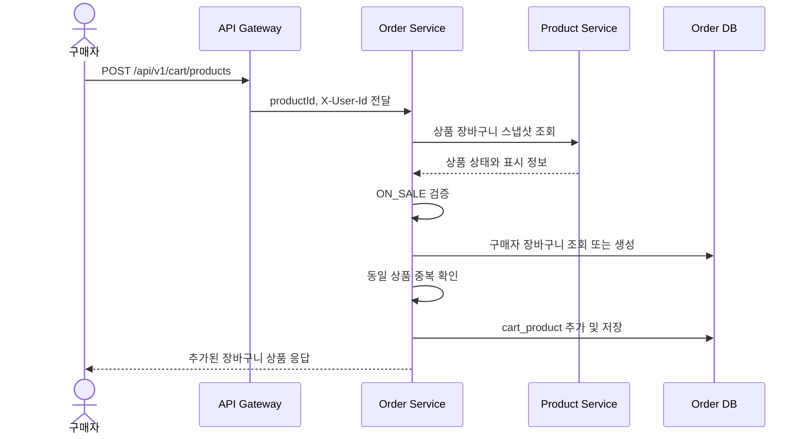

대안/예외:

- 상품 상태가 `ON_SALE`이 아니면 `O003`으로 거부한다.
- 이미 담긴 상품이면 `C001`로 거부한다.
- Product Service를 사용할 수 없으면 `SYS002`로 응답한다.

## UC-CART-03 장바구니 상품 삭제

| 항목 | 내용 |
|------|------|
| 주 액터 | 구매자 |
| API | `DELETE /api/v1/cart/products/{cartProductId}` |
| 목표 | 구매자가 자신의 장바구니 상품을 삭제한다. |
| 사전조건 | `cartProductId`가 존재한다. |
| 완료 조건 | 대상 장바구니 항목이 삭제된다. |

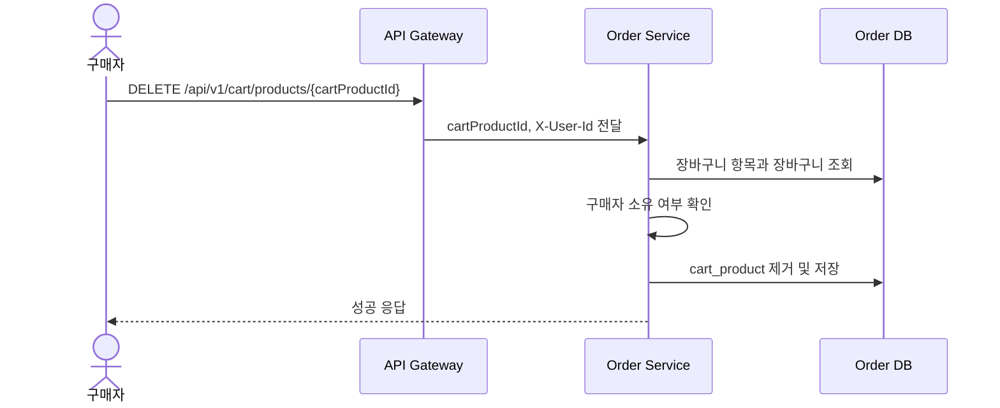

대안/예외:

- 항목이 없으면 `O006`으로 응답한다.
- 다른 구매자의 장바구니 항목이면 `C003`으로 응답한다.

## UC-ORDER-01 주문 생성

| 항목 | 내용 |
|------|------|
| 주 액터 | 구매자 |
| 보조 액터 | Product Service |
| API | `POST /api/v1/orders` |
| 목표 | 상품 ID 목록으로 결제 대기 주문을 생성한다. |
| 사전조건 | `productIds`가 비어 있지 않다. |
| 완료 조건 | `PENDING` 주문과 주문 상품이 생성되고 `CreateOrderResponse`가 반환된다. |

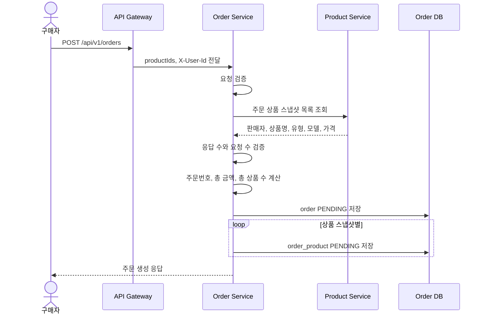

대안/예외:

- `productIds`가 비어 있거나 null 항목이 있으면 `V001`로 응답한다.
- Product Service 스냅샷이 요청 상품 수와 맞지 않으면 주문 생성을 중단한다.
- 주문 생성 응답에는 주문 상품 스냅샷 필드와 `totalAmount`, `createdAt`, `canceledAt`이 포함된다.

## UC-ORDER-02 내 주문 목록 조회

| 항목 | 내용 |
|------|------|
| 주 액터 | 구매자 |
| API | `GET /api/v1/orders` |
| 목표 | 구매자가 자신의 주문 상품 목록을 조건별로 조회한다. |
| 사전조건 | 구매자가 인증되어 있다. |
| 완료 조건 | 주문 상품 row 기준 페이지 응답이 반환된다. |

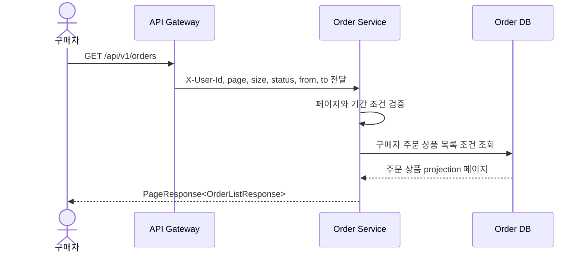

대안/예외:

- `page < 1`, `size < 1`, `size > 100`, `from > to`이면 `V001`로 응답한다.
- 조건에 맞는 항목이 없으면 빈 목록과 페이지 메타를 반환한다.

## UC-ORDER-03 주문 상세 조회

| 항목 | 내용 |
|------|------|
| 주 액터 | 구매자 |
| API | `GET /api/v1/orders/{orderId}` |
| 목표 | 주문 단위 상태, 금액, 주문 상품, 열람/환불 가능 여부를 확인한다. |
| 사전조건 | 주문이 요청 구매자 소유이다. |
| 완료 조건 | `OrderDetailResponse`가 반환된다. |

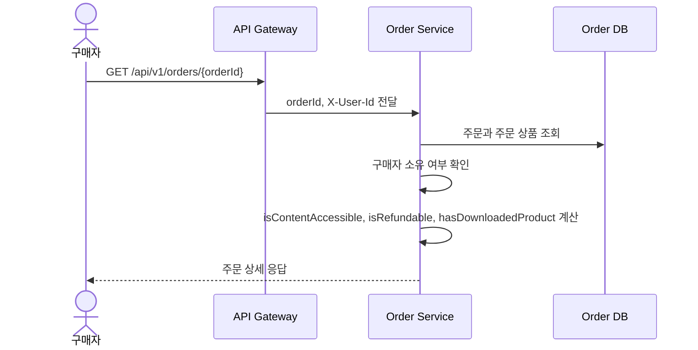

대안/예외:

- 주문이 없으면 `O001`로 응답한다.
- 다른 구매자의 주문이면 권한 오류로 응답한다.

## UC-ORDER-04 구매 콘텐츠 열람

| 항목 | 내용 |
|------|------|
| 주 액터 | 구매자 |
| 보조 액터 | Product Service |
| API | `GET /api/v1/orders/{orderId}/content/{orderProductId}` |
| 목표 | 결제 완료된 주문 상품의 콘텐츠 원문을 열람한다. |
| 사전조건 | 주문과 주문 상품이 모두 `PAID` 상태이고 요청 구매자 소유이다. |
| 완료 조건 | `OrderContentResponse`가 반환된다. |

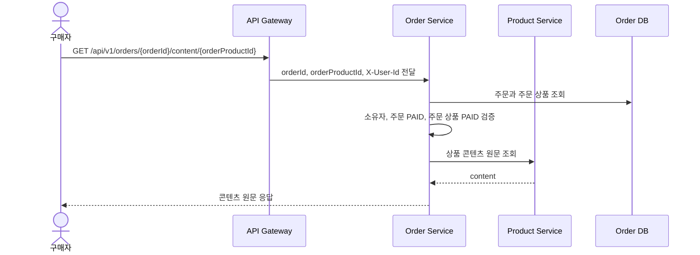

대안/예외:

- 주문이 없으면 `O001`로 응답한다.
- 주문 상품이 주문에 없거나 `PAID`가 아니면 `E001`로 응답한다.
- 이 API는 `downloaded`를 변경하지 않는다. 다운로드 확정은 UC-ORDER-05가 담당한다.

## UC-ORDER-05 주문 상품 다운로드 확정

| 항목 | 내용 |
|------|------|
| 주 액터 | 구매자 |
| 보조 액터 | Product Service |
| API | `PATCH /api/v1/orders/{orderId}/products/{orderProductId}/download` |
| 목표 | 구매자가 콘텐츠 열람/다운로드를 확정했음을 기록한다. |
| 사전조건 | 주문과 주문 상품이 모두 `PAID` 상태이고 요청 구매자 소유이다. |
| 완료 조건 | 주문 상품의 `downloaded`가 `true`가 되고 환불 가능 여부가 반환된다. |

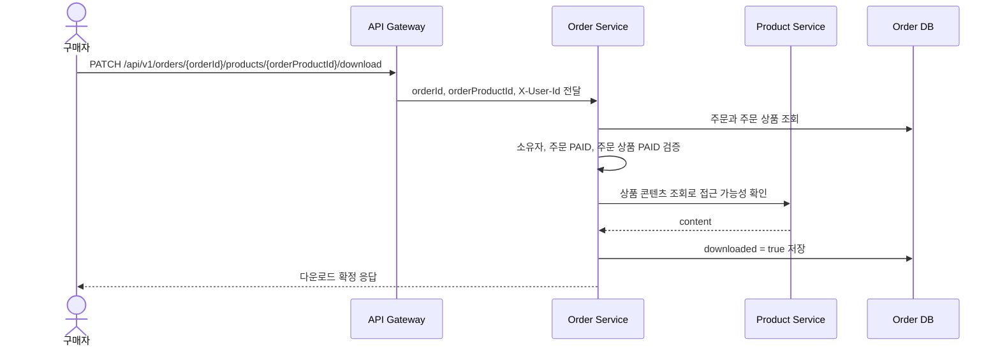

대안/예외:

- 주문 상품이 없으면 `O012`로 응답한다.
- 이미 다운로드 확정된 상품이면 값을 유지하고 성공 응답을 반환한다.
- 다운로드 확정 이후 해당 주문 상품의 `isRefundable`은 false가 된다.

## UC-ORDER-06 주문 결제 내역 조회

| 항목 | 내용 |
|------|------|
| 주 액터 | 구매자 |
| API | `GET /api/v1/orders/payments` |
| 목표 | 구매자가 자신의 주문 결제 내역을 조회한다. |
| 사전조건 | 구매자가 인증되어 있다. |
| 완료 조건 | 결제 내역 페이지 응답이 반환된다. |

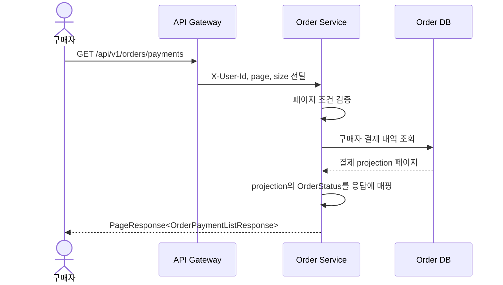

대안/예외:

- 결제 내역이 없으면 빈 목록과 페이지 메타를 반환한다.
- 현재 구현은 `PageRequestParams`의 `status`, `from`, `to`를 결제 내역 조회에 적용하지 않는다.

## UC-ADMIN-01 전체 주문 관리 목록 조회

| 항목 | 내용 |
|------|------|
| 주 액터 | 관리자 |
| 보조 액터 | Seller Service |
| API | `GET /api/v1/admin/orders` |
| 목표 | 관리자가 전체 주문 목록을 상태별로 조회한다. |
| 사전조건 | `X-User-Role`이 `ADMIN`이다. |
| 완료 조건 | 관리자 주문 목록 페이지가 반환된다. |

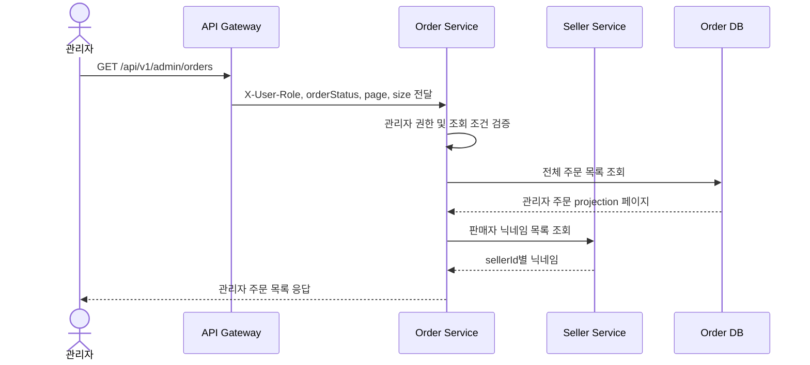

대안/예외:

- `orderStatus`가 `ALL`이면 상태 조건 없이 조회한다.
- 판매자 닉네임을 찾을 수 없으면 `알 수 없음`을 사용한다.

## UC-ADMIN-02 이번 달 실제 거래액 조회

| 항목 | 내용 |
|------|------|
| 주 액터 | 관리자 |
| API | `GET /api/v1/admin/orders/month` |
| 목표 | 관리자가 이번 달 거래액 합계를 확인한다. |
| 사전조건 | `X-User-Role`이 `ADMIN`이다. |
| 완료 조건 | `monthlyTransactionAmount`가 반환된다. |

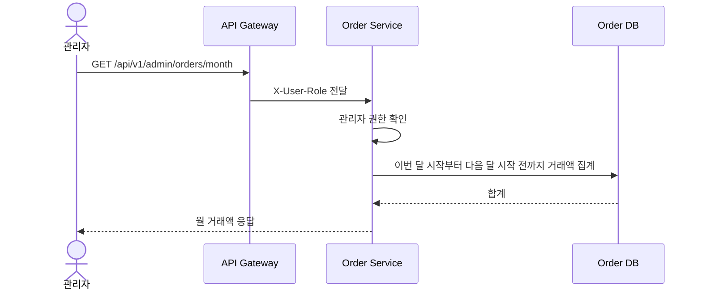

대안/예외:

- 집계 대상이 없으면 `0`을 반환한다.

## UC-ADMIN-03 최근 7일 거래량 조회

| 항목 | 내용 |
|------|------|
| 주 액터 | 관리자 |
| API | `GET /api/v1/admin/orders/weekend` |
| 목표 | 관리자가 최근 7일 거래 건수와 거래액을 일자별로 확인한다. |
| 사전조건 | `X-User-Role`이 `ADMIN`이다. |
| 완료 조건 | 전체 합계, 조회 기간, 일자별 거래량이 반환된다. |

> 현재 구현 경로는 `/weekend`이다. 의미상 `/week`에 가깝지만 이 문서는 구현 경로를 우선한다.

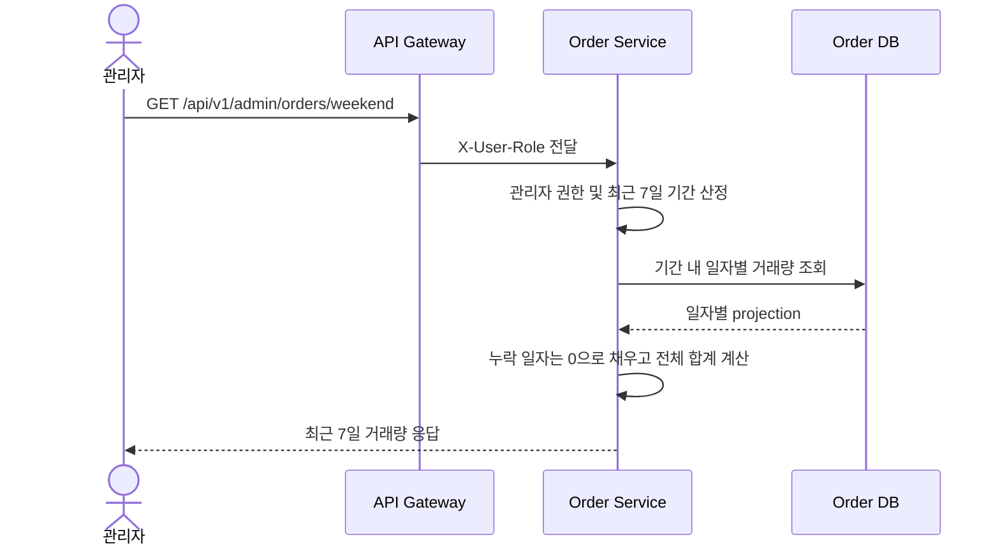

대안/예외:

- 특정 일자에 거래가 없으면 거래 건수와 거래액을 `0`으로 반환한다.

## UC-EVENT-01 결제 승인 이벤트 반영

| 항목 | 내용 |
|------|------|
| 주 액터 | Payment Service |
| 이벤트 | `payment.approved` |
| 목표 | 결제 승인 결과를 주문 상태와 결제 내역에 반영한다. |
| 사전조건 | 이벤트에 `paymentId`, `orderId`, `userId`, `amount`, `approvedAt`이 있다. |
| 완료 조건 | 주문과 주문 상품이 `PAID`가 되고 `ORDER_PAID` outbox 이벤트가 저장된다. |

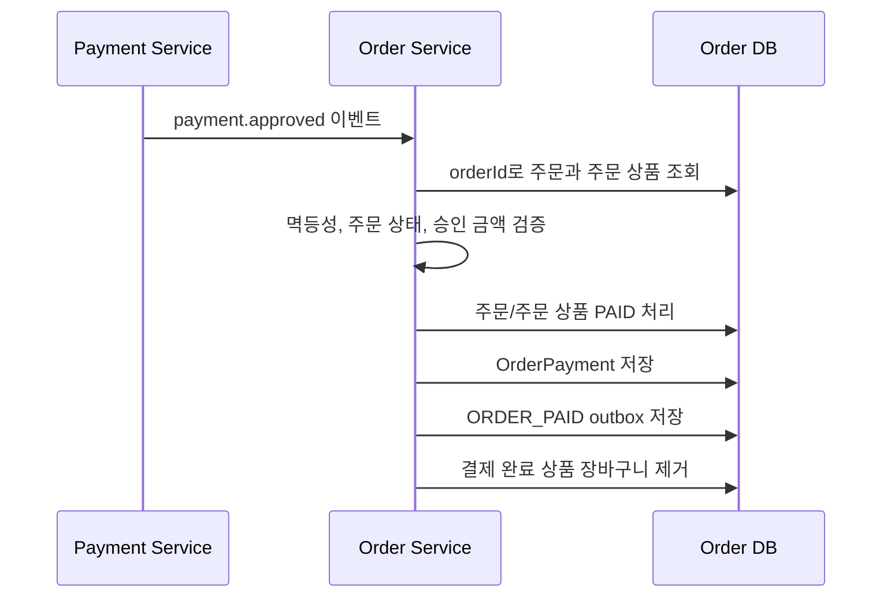

대안/예외:

- 이미 `PAID`이고 결제 내역이 있으면 중복 이벤트로 보고 생략한다.
- 주문이 없으면 `O001`, 금액이 다르면 `O014`, 처리할 수 없는 상태이면 `O013` 또는 `O009`로 실패한다.

## UC-EVENT-02 환불 완료 이벤트 반영

| 항목 | 내용 |
|------|------|
| 주 액터 | Payment Service |
| 이벤트 | `payment.refunded` |
| 목표 | 전체 환불 완료 결과를 주문 상태에 반영한다. |
| 사전조건 | 이벤트에 `paymentId`, `orderId`, `userId`, `amount`, `refundedAt`이 있다. |
| 완료 조건 | 주문과 주문 상품이 `REFUNDED`가 되고 `ORDER_REFUND` outbox 이벤트가 저장된다. |

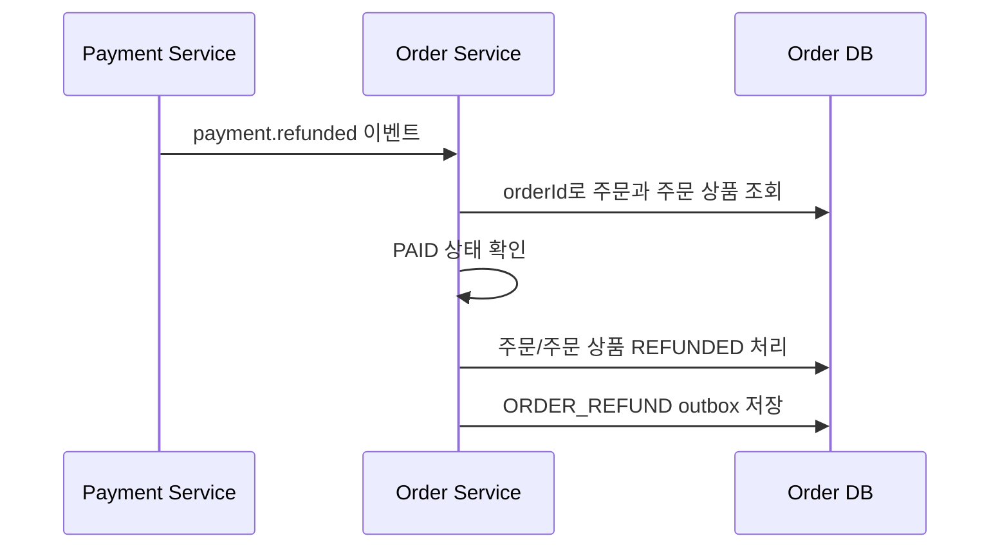

대안/예외:

- 주문이 없으면 `O001`로 실패한다.
- 주문이 `PAID`가 아니면 상태 변경을 거부한다.
- 현재 기준은 전체 환불이며 부분 환불은 별도 확장으로 다룬다.

## UC-EVENT-03 Outbox 이벤트 발행

| 항목 | 내용 |
|------|------|
| 주 액터 | Order Service |
| 토픽 | `order-events` |
| 목표 | 주문 상태 변경 이벤트를 Kafka로 발행한다. |
| 사전조건 | `PENDING` outbox 이벤트가 저장되어 있다. |
| 완료 조건 | Kafka 발행 성공 시 outbox 상태가 `PUBLISHED`가 된다. |

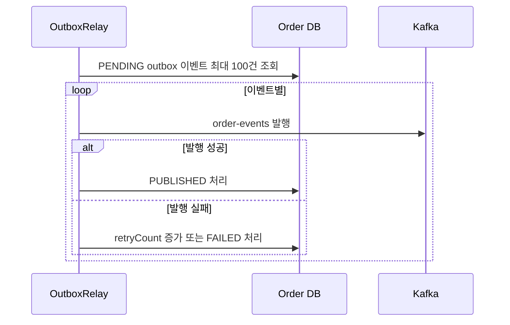

대안/예외:

- 발행 실패가 3회를 초과하면 `FAILED`로 전이한다.
- 발행은 at-least-once 전제이며 소비자는 멱등성을 갖춰야 한다.

## 미구현 또는 별도 문서 대상

- 리뷰 생성/수정 공개 API는 현재 `OrderController`에 없다. 리뷰 관련 타입이 일부 남아 있어도 구현된 API로 보지 않는다.
- 정산 대상 내부 조회 API는 현재 `order-service` 컨트롤러에 없다. 정산은 Kafka 주문 이벤트 또는 추후 내부 API 설계에서 별도로 다룬다.
