# Order Service 상세 유즈케이스

`docs/architecture/order-usecase.md`의 유즈케이스 다이어그램을 기준으로 각 UC의 상세 흐름을 정리한다. API 경로와 이벤트명은 `docs/api-spec/order.md`, `docs/api-spec/payment.md`를 따른다. 각 UC의 흐름 다이어그램은 Mermaid `sequenceDiagram`으로 표현한다.

## UC-CART-01 장바구니 조회

| 항목 | 내용 |
|------|------|
| 주 액터 | 구매자 |
| 목표 | 구매자가 자신의 장바구니 상품 목록과 합계 금액을 확인한다. |
| API | `GET /cart` |
| 사전조건 | 구매자가 인증되어 있고 Gateway가 `X-User-Id`, `X-User-Role`을 전달한다. |
| 완료 조건 | 구매자 기준 장바구니, 장바구니 항목, 상품 스냅샷 정보가 응답된다. |

흐름 다이어그램:

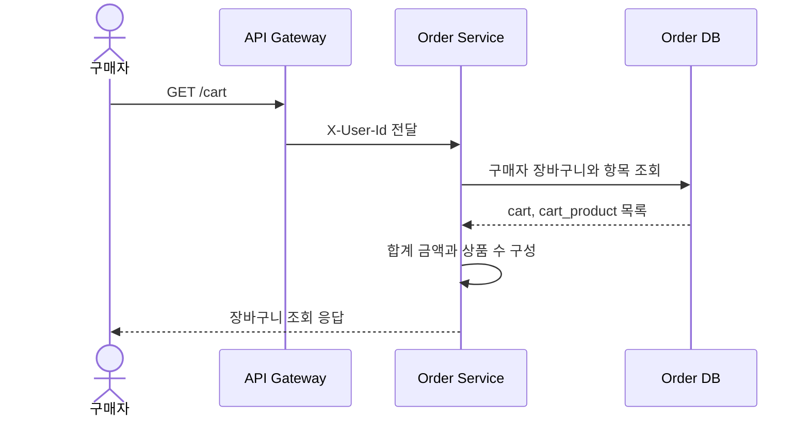
```mermaid
sequenceDiagram
    actor Buyer as 구매자
    participant Gateway as API Gateway
    participant Order as Order Service
    participant DB as Order DB

    Buyer->>Gateway: GET /cart
    Gateway->>Order: X-User-Id 전달
    Order->>DB: 구매자 장바구니와 항목 조회
    DB-->>Order: cart, cart_product 목록
    Order->>Order: 합계 금액과 상품 수 구성
    Order-->>Buyer: 장바구니 조회 응답
```

기본 흐름:

1. 구매자가 장바구니 조회를 요청한다.
2. Order Service는 요청 헤더의 구매자 ID를 확인한다.
3. 구매자 소유 장바구니와 장바구니 항목을 조회한다.
4. 각 항목의 상품명, 상품 유형, 가격, 썸네일, 판매자 정보, 판매 상태를 응답 모델로 구성한다.
5. 전체 금액과 전체 상품 수를 함께 반환한다.

대안/예외:

- 장바구니가 없거나 항목이 없으면 빈 상품 목록과 합계 `0`을 반환하는 정책을 기본으로 한다.
- 인증 헤더가 없거나 유효하지 않으면 Gateway 또는 공통 예외 처리에서 인증 오류로 응답한다.

## UC-CART-02 장바구니 상품 담기

| 항목 | 내용 |
|------|------|
| 주 액터 | 구매자 |
| 보조 액터 | Product Service |
| 목표 | 구매자가 판매 중인 상품을 자신의 장바구니에 담는다. |
| API | `POST /cart/products` |
| 포함 UC | 상품 주문 스냅샷 조회 |
| 사전조건 | 구매자가 인증되어 있고 요청 본문에 `productId`가 있다. |
| 완료 조건 | 장바구니 항목이 생성되고 갱신된 장바구니 요약이 응답된다. |

흐름 다이어그램:

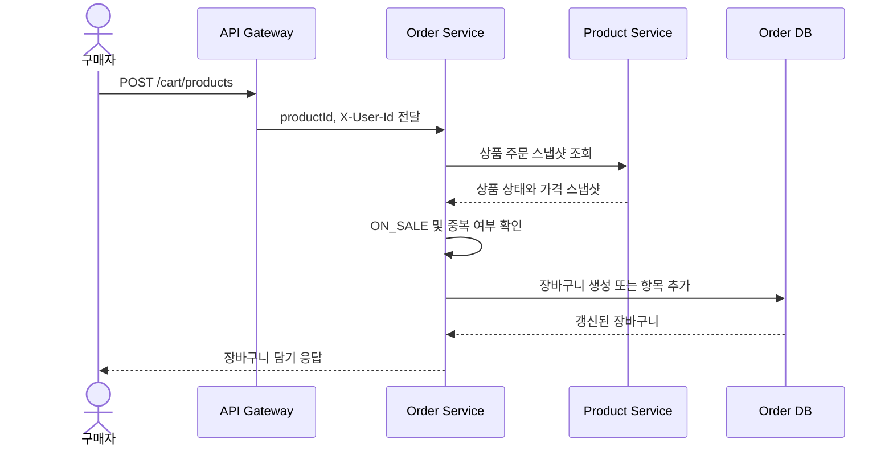
```mermaid
sequenceDiagram
    actor Buyer as 구매자
    participant Gateway as API Gateway
    participant Order as Order Service
    participant Product as Product Service
    participant DB as Order DB

    Buyer->>Gateway: POST /cart/products
    Gateway->>Order: productId, X-User-Id 전달
    Order->>Product: 상품 주문 스냅샷 조회
    Product-->>Order: 상품 상태와 가격 스냅샷
    Order->>Order: ON_SALE 및 중복 여부 확인
    Order->>DB: 장바구니 생성 또는 항목 추가
    DB-->>Order: 갱신된 장바구니
    Order-->>Buyer: 장바구니 담기 응답
```

기본 흐름:

1. 구매자가 상품 ID로 장바구니 담기를 요청한다.
2. Order Service는 Product Service에 상품 주문 스냅샷을 조회한다.
3. 상품이 `ON_SALE` 상태인지 확인한다.
4. 구매자 장바구니가 없으면 생성한다.
5. 동일 상품이 이미 장바구니에 있는지 확인한다.
6. 장바구니 항목을 추가하고 장바구니 합계 금액과 상품 수를 갱신한다.
7. 생성된 장바구니 항목과 갱신된 요약 정보를 반환한다.

대안/예외:

- 상품이 존재하지 않거나 판매 중이 아니면 장바구니에 담지 않는다.
- 동일 상품이 이미 장바구니에 있으면 중복 추가를 거부한다.
- Product Service 스냅샷 응답이 유효하지 않으면 실패 처리한다.

## UC-CART-03 장바구니 상품 삭제

| 항목 | 내용 |
|------|------|
| 주 액터 | 구매자 |
| 목표 | 구매자가 자신의 장바구니에서 특정 상품을 제거한다. |
| API | `DELETE /cart/products/{cartProductId}` |
| 사전조건 | 구매자가 인증되어 있고 `cartProductId`가 존재한다. |
| 완료 조건 | 대상 장바구니 항목이 삭제되고 장바구니 합계가 갱신된다. |

흐름 다이어그램:

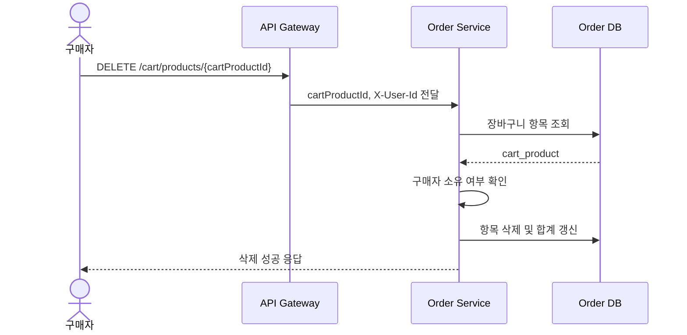
```mermaid
sequenceDiagram
    actor Buyer as 구매자
    participant Gateway as API Gateway
    participant Order as Order Service
    participant DB as Order DB

    Buyer->>Gateway: DELETE /cart/products/{cartProductId}
    Gateway->>Order: cartProductId, X-User-Id 전달
    Order->>DB: 장바구니 항목 조회
    DB-->>Order: cart_product
    Order->>Order: 구매자 소유 여부 확인
    Order->>DB: 항목 삭제 및 합계 갱신
    Order-->>Buyer: 삭제 성공 응답
```

기본 흐름:

1. 구매자가 장바구니 항목 삭제를 요청한다.
2. Order Service는 장바구니 항목을 조회한다.
3. 해당 항목이 요청한 구매자의 장바구니에 속하는지 확인한다.
4. 장바구니 항목을 삭제한다.
5. 장바구니 합계 금액과 상품 수를 갱신한다.
6. 성공 응답을 반환한다.

대안/예외:

- 장바구니 항목이 없으면 `CART_PRODUCT_NOT_FOUND` 계열 오류로 응답한다.
- 다른 구매자의 장바구니 항목이면 접근 거부로 응답한다.

## UC-ORDER-01 주문 생성

| 항목 | 내용 |
|------|------|
| 주 액터 | 구매자 |
| 보조 액터 | Product Service |
| 목표 | 구매자가 단건 또는 복수 상품에 대한 결제 대기 주문을 생성한다. |
| API | `POST /orders` |
| 포함 UC | 상품 주문 스냅샷 조회, 주문/주문항목 PENDING 생성 |
| 사전조건 | 구매자가 인증되어 있고 `productId` 또는 `productIds` 중 하나를 전달한다. |
| 완료 조건 | `PENDING` 상태의 주문과 주문항목이 생성되고 `orderId`가 반환된다. |

흐름 다이어그램:

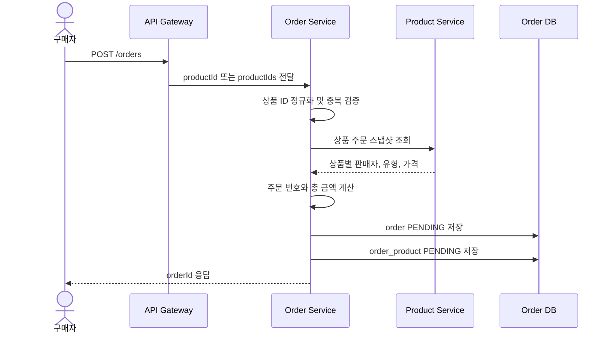
```mermaid
sequenceDiagram
    actor Buyer as 구매자
    participant Gateway as API Gateway
    participant Order as Order Service
    participant Product as Product Service
    participant DB as Order DB

    Buyer->>Gateway: POST /orders
    Gateway->>Order: productId 또는 productIds 전달
    Order->>Order: 상품 ID 정규화 및 중복 검증
    Order->>Product: 상품 주문 스냅샷 조회
    Product-->>Order: 상품별 판매자, 유형, 가격
    Order->>Order: 주문 번호와 총 금액 계산
    Order->>DB: order PENDING 저장
    Order->>DB: order_product PENDING 저장
    Order-->>Buyer: orderId 응답
```

기본 흐름:

1. 구매자가 단건 상품 ID 또는 복수 상품 ID로 주문 생성을 요청한다.
2. Order Service는 요청 상품 ID 목록을 정규화하고 중복 여부를 검증한다.
3. Product Service에 주문용 상품 스냅샷을 조회한다.
4. 조회된 상품 수와 요청 상품 수가 일치하는지 확인한다.
5. 상품별 판매자 ID, 상품명, 상품 유형, 가격 스냅샷을 확보한다.
6. 주문 번호를 생성하고 총 주문 금액과 총 상품 수를 계산한다.
7. `order`를 `PENDING` 상태로 생성한다.
8. 각 상품에 대한 `order_product`를 `PENDING` 상태로 생성한다.
9. 생성된 주문 ID를 반환한다.

대안/예외:

- 요청 상품 ID가 비어 있거나 중복되면 입력 오류로 응답한다.
- 상품 스냅샷이 누락되거나 유효하지 않으면 주문 생성을 중단한다.
- 상품 가격 또는 판매 상태가 주문 가능 조건을 만족하지 않으면 주문을 생성하지 않는다.

## UC-ORDER-02 내 주문 목록 조회

| 항목 | 내용 |
|------|------|
| 주 액터 | 구매자 |
| 목표 | 구매자가 자신의 주문과 주문항목 이력을 조건별로 조회한다. |
| API | `GET /orders` |
| 사전조건 | 구매자가 인증되어 있다. |
| 완료 조건 | 구매자 소유 주문 목록과 페이지 메타 정보가 반환된다. |

흐름 다이어그램:

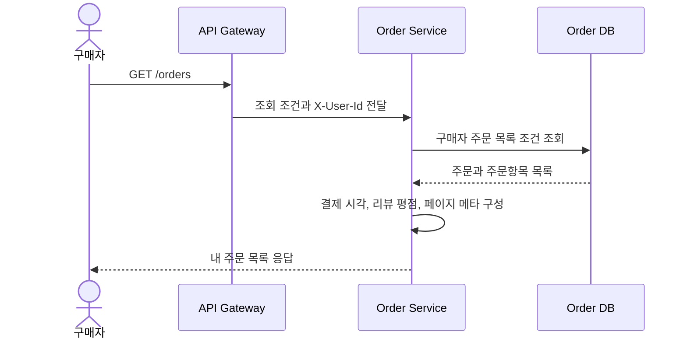
```mermaid
sequenceDiagram
    actor Buyer as 구매자
    participant Gateway as API Gateway
    participant Order as Order Service
    participant DB as Order DB

    Buyer->>Gateway: GET /orders
    Gateway->>Order: 조회 조건과 X-User-Id 전달
    Order->>DB: 구매자 주문 목록 조건 조회
    DB-->>Order: 주문과 주문항목 목록
    Order->>Order: 결제 시각, 리뷰 평점, 페이지 메타 구성
    Order-->>Buyer: 내 주문 목록 응답
```

기본 흐름:

1. 구매자가 페이지, 크기, 상태, 기간 조건으로 주문 목록을 요청한다.
2. Order Service는 요청 헤더의 구매자 ID를 기준으로 조회 범위를 제한한다.
3. 주문 상태와 기간 조건을 적용한다.
4. 주문과 주문항목, 결제 완료 시각, 리뷰 평점 여부를 목록 응답으로 구성한다.
5. 페이지 메타 정보와 함께 반환한다.

대안/예외:

- 조건에 맞는 주문이 없으면 빈 목록과 페이지 메타 정보를 반환한다.
- 허용되지 않은 상태값이나 잘못된 기간 형식은 입력 오류로 처리한다.

## UC-ORDER-03 주문 상세 조회

| 항목 | 내용 |
|------|------|
| 주 액터 | 구매자, 관리자 |
| 목표 | 주문 단위의 상태, 금액, 항목, 콘텐츠 열람 가능 여부를 확인한다. |
| API | `GET /orders/{orderId}` |
| 사전조건 | 요청자가 인증되어 있고 주문 조회 권한을 가진다. |
| 완료 조건 | 주문 상세와 주문항목 목록이 반환된다. |

흐름 다이어그램:

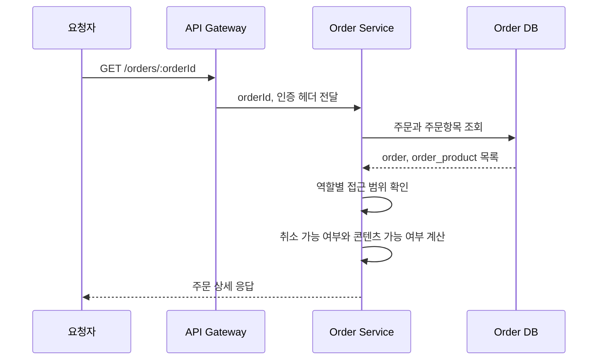
```mermaid
sequenceDiagram
    participant Requester as 요청자
    participant Gateway as API Gateway
    participant Order as Order Service
    participant DB as Order DB

    Requester->>Gateway: GET /orders/:orderId
    Gateway->>Order: orderId, 인증 헤더 전달
    Order->>DB: 주문과 주문항목 조회
    DB-->>Order: order, order_product 목록
    Order->>Order: 역할별 접근 범위 확인
    Order->>Order: 취소 가능 여부와 콘텐츠 가능 여부 계산
    Order-->>Requester: 주문 상세 응답
```

기본 흐름:

1. 액터가 주문 ID로 상세 조회를 요청한다.
2. Order Service는 주문과 주문항목을 조회한다.
3. 구매자 요청이면 주문의 `buyer_id`와 요청자 ID가 일치하는지 확인한다.
4. 관리자 요청이면 관리자 권한을 확인한다.
5. 주문 상태, 결제/취소/환불 시각, 취소 가능 여부, 다운로드 여부를 계산한다.
6. 주문항목별 상품 스냅샷, 항목 상태, 열람 여부, 콘텐츠 열람 가능 여부를 구성한다.
7. 주문 상세 응답을 반환한다.

대안/예외:

- 주문이 없으면 `ORDER_NOT_FOUND` 계열 오류로 응답한다.
- 조회 권한이 없으면 접근 거부로 응답한다.

## UC-ORDER-04 구매 상품 콘텐츠 열람

| 항목 | 내용 |
|------|------|
| 주 액터 | 구매자 |
| 목표 | 결제 완료된 주문항목의 구매 콘텐츠를 열람한다. |
| API | `GET /orders/{orderId}/content/{orderProductId}` |
| 포함 UC | PAID 상태 확인, 주문항목 다운로드 처리 |
| 사전조건 | 구매자가 인증되어 있고 주문과 주문항목이 구매자 소유이다. |
| 완료 조건 | 콘텐츠 열람 응답이 반환되고 최초 열람이면 `downloaded`가 `true`로 변경된다. |

흐름 다이어그램:

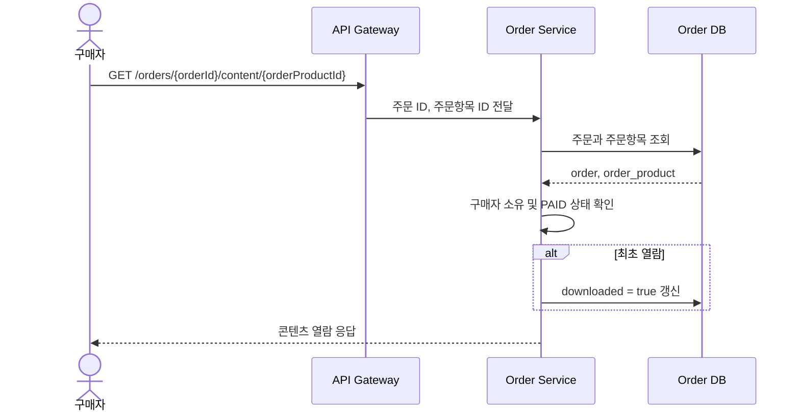
```mermaid
sequenceDiagram
    actor Buyer as 구매자
    participant Gateway as API Gateway
    participant Order as Order Service
    participant DB as Order DB

    Buyer->>Gateway: GET /orders/{orderId}/content/{orderProductId}
    Gateway->>Order: 주문 ID, 주문항목 ID 전달
    Order->>DB: 주문과 주문항목 조회
    DB-->>Order: order, order_product
    Order->>Order: 구매자 소유 및 PAID 상태 확인
    alt 최초 열람
        Order->>DB: downloaded = true 갱신
    end
    Order-->>Buyer: 콘텐츠 열람 응답
```

기본 흐름:

1. 구매자가 주문 ID와 주문항목 ID로 콘텐츠 열람을 요청한다.
2. Order Service는 주문과 주문항목을 조회한다.
3. 주문이 요청 구매자 소유인지 확인한다.
4. 주문항목이 해당 주문에 속하는지 확인한다.
5. 주문항목 상태가 `PAID`인지 확인한다.
6. 최초 열람이면 주문항목의 `downloaded`를 `true`로 갱신한다.
7. 주문 번호, 상품 ID, 열람 여부, 콘텐츠 접근 정보를 반환한다.

대안/예외:

- 주문 또는 주문항목이 없으면 조회 실패로 응답한다.
- 구매자 소유가 아니면 접근 거부로 응답한다.
- 주문항목이 `PAID`가 아니면 콘텐츠 열람을 허용하지 않는다.

## UC-ORDER-05 리뷰 평점 생성/수정

| 항목 | 내용 |
|------|------|
| 주 액터 | 구매자 |
| 목표 | 구매자가 구매한 상품에 대한 리뷰 평점을 생성하거나 수정한다. |
| API | `POST /orders/review` |
| 사전조건 | 구매자가 인증되어 있고 요청 본문에 `productId`, `rating`이 있다. |
| 완료 조건 | 상품 리뷰 평점이 생성되거나 기존 평점이 갱신된다. |

흐름 다이어그램:

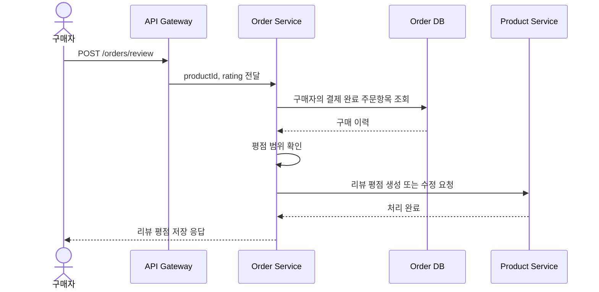
```mermaid
sequenceDiagram
    actor Buyer as 구매자
    participant Gateway as API Gateway
    participant Order as Order Service
    participant DB as Order DB
    participant Product as Product Service

    Buyer->>Gateway: POST /orders/review
    Gateway->>Order: productId, rating 전달
    Order->>DB: 구매자의 결제 완료 주문항목 조회
    DB-->>Order: 구매 이력
    Order->>Order: 평점 범위 확인
    Order->>Product: 리뷰 평점 생성 또는 수정 요청
    Product-->>Order: 처리 완료
    Order-->>Buyer: 리뷰 평점 저장 응답
```

기본 흐름:

1. 구매자가 상품 ID와 평점으로 리뷰 평점 저장을 요청한다.
2. Order Service는 구매자가 해당 상품을 결제 완료했는지 확인한다.
3. 평점이 허용 범위 안에 있는지 확인한다.
4. Order Service는 Product Service에 리뷰 평점 생성 또는 수정을 위임한다.
5. 성공 응답을 반환한다.

대안/예외:

- 구매 이력이 없거나 결제 완료 상태가 아니면 리뷰 작성을 허용하지 않는다.
- 평점이 허용 범위를 벗어나면 입력 오류로 응답한다.

## UC-ORDER-06 결제 내역 조회

| 항목 | 내용 |
|------|------|
| 주 액터 | 구매자 |
| 목표 | 구매자가 주문항목 기준 결제 내역과 환불 여부를 조회한다. |
| API | `GET /orders/payments` |
| 사전조건 | 구매자가 인증되어 있다. |
| 완료 조건 | 결제 ID, 결제 상태, 상품 정보, 금액, 결제 완료 시각이 목록으로 반환된다. |

흐름 다이어그램:

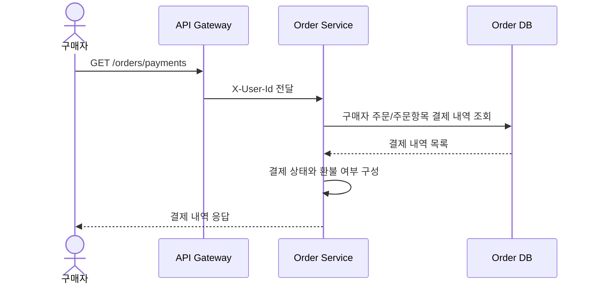
```mermaid
sequenceDiagram
    actor Buyer as 구매자
    participant Gateway as API Gateway
    participant Order as Order Service
    participant DB as Order DB

    Buyer->>Gateway: GET /orders/payments
    Gateway->>Order: X-User-Id 전달
    Order->>DB: 구매자 주문/주문항목 결제 내역 조회
    DB-->>Order: 결제 내역 목록
    Order->>Order: 결제 상태와 환불 여부 구성
    Order-->>Buyer: 결제 내역 응답
```

기본 흐름:

1. 구매자가 결제 내역 목록을 요청한다.
2. Order Service는 요청 구매자 기준으로 주문과 주문항목을 조회한다.
3. 결제 상태, 환불 여부, 상품 유형, 상품명, 결제 금액, 결제 완료 시각을 구성한다.
4. 페이지 메타 정보와 함께 반환한다.

대안/예외:

- 결제 내역이 없으면 빈 목록을 반환한다.
- 다른 구매자의 결제 내역은 조회 범위에 포함하지 않는다.

## UC-ADMIN-01 전체 주문 관리 내역 조회

| 항목 | 내용 |
|------|------|
| 주 액터 | 관리자 |
| 목표 | 관리자가 전체 주문 현황을 상태별로 조회한다. |
| API | `GET /admin/orders` |
| 사전조건 | 요청자가 관리자 권한을 가진다. |
| 완료 조건 | 전체 주문 관리 목록과 페이지 메타 정보가 반환된다. |

흐름 다이어그램:

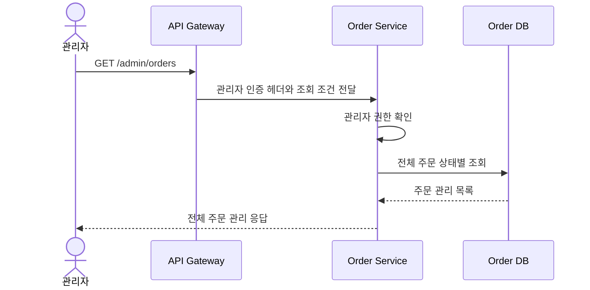
```mermaid
sequenceDiagram
    actor Admin as 관리자
    participant Gateway as API Gateway
    participant Order as Order Service
    participant DB as Order DB

    Admin->>Gateway: GET /admin/orders
    Gateway->>Order: 관리자 인증 헤더와 조회 조건 전달
    Order->>Order: 관리자 권한 확인
    Order->>DB: 전체 주문 상태별 조회
    DB-->>Order: 주문 관리 목록
    Order-->>Admin: 전체 주문 관리 응답
```

기본 흐름:

1. 관리자가 주문 상태, 페이지, 크기 조건으로 전체 주문 목록을 요청한다.
2. Order Service는 관리자 권한을 확인한다.
3. 상태 조건을 적용해 전체 주문을 조회한다.
4. 판매자 닉네임, 상품명, 주문항목 수, 주문 금액, 주문 상태, 생성 시각을 구성한다.
5. 페이지 메타 정보와 함께 반환한다.

대안/예외:

- 관리자 권한이 없으면 접근 거부로 응답한다.
- 조건에 맞는 주문이 없으면 빈 목록을 반환한다.

## UC-ADMIN-02 이번 달 거래액 조회

| 항목 | 내용 |
|------|------|
| 주 액터 | 관리자 |
| 목표 | 관리자가 이번 달 총 거래액을 확인한다. |
| API | `GET /admin/orders/month` |
| 사전조건 | 요청자가 관리자 권한을 가진다. |
| 완료 조건 | 이번 달 총 거래액이 반환된다. |

흐름 다이어그램:

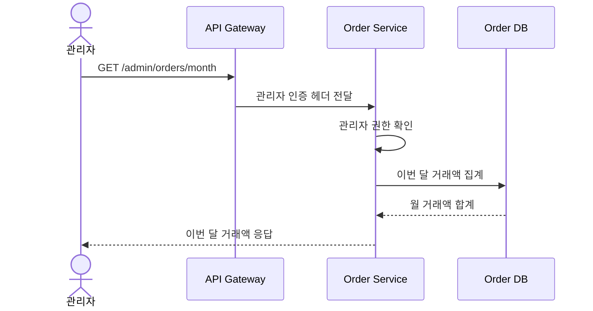
```mermaid
sequenceDiagram
    actor Admin as 관리자
    participant Gateway as API Gateway
    participant Order as Order Service
    participant DB as Order DB

    Admin->>Gateway: GET /admin/orders/month
    Gateway->>Order: 관리자 인증 헤더 전달
    Order->>Order: 관리자 권한 확인
    Order->>DB: 이번 달 거래액 집계
    DB-->>Order: 월 거래액 합계
    Order-->>Admin: 이번 달 거래액 응답
```

기본 흐름:

1. 관리자가 이번 달 거래액 조회를 요청한다.
2. Order Service는 관리자 권한을 확인한다.
3. 현재 월의 거래 대상 주문을 집계한다.
4. 월 거래액 합계를 반환한다.

대안/예외:

- 집계 대상 주문이 없으면 `0`을 반환한다.
- 관리자 권한이 없으면 접근 거부로 응답한다.

## UC-ADMIN-03 최근 7일 거래량 조회

| 항목 | 내용 |
|------|------|
| 주 액터 | 관리자 |
| 목표 | 관리자가 최근 7일 거래 건수와 거래액 추이를 확인한다. |
| API | `GET /admin/orders/weekend` |
| 사전조건 | 요청자가 관리자 권한을 가진다. |
| 완료 조건 | 최근 7일 합계와 일자별 거래 건수/거래액이 반환된다. |

흐름 다이어그램:

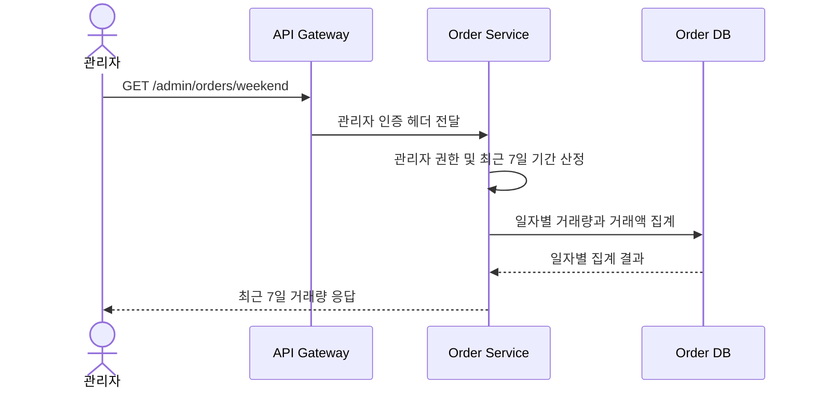
```mermaid
sequenceDiagram
    actor Admin as 관리자
    participant Gateway as API Gateway
    participant Order as Order Service
    participant DB as Order DB

    Admin->>Gateway: GET /admin/orders/weekend
    Gateway->>Order: 관리자 인증 헤더 전달
    Order->>Order: 관리자 권한 및 최근 7일 기간 산정
    Order->>DB: 일자별 거래량과 거래액 집계
    DB-->>Order: 일자별 집계 결과
    Order-->>Admin: 최근 7일 거래량 응답
```

기본 흐름:

1. 관리자가 최근 7일 거래량 조회를 요청한다.
2. Order Service는 관리자 권한을 확인한다.
3. 조회 시작일과 종료일을 산정한다.
4. 기간 내 거래 건수와 거래액을 일자별로 집계한다.
5. 전체 합계와 일자별 목록을 반환한다.

대안/예외:

- 특정 일자에 거래가 없으면 해당 일자의 거래 건수와 거래액은 `0`으로 집계한다.
- 관리자 권한이 없으면 접근 거부로 응답한다.

## UC-INT-01 상품 주문 스냅샷 조회

| 항목 | 내용 |
|------|------|
| 주 액터 | Order Service |
| 보조 액터 | Product Service |
| 목표 | 주문과 장바구니에 필요한 상품 상태와 구매 시점 스냅샷을 확보한다. |
| 사용 위치 | 장바구니 상품 담기, 주문 생성 |
| 사전조건 | 상품 ID 목록이 있다. |
| 완료 조건 | 상품 ID별 판매자 ID, 상품명, 상품 유형, 가격, 판매 상태가 확보된다. |

흐름 다이어그램:

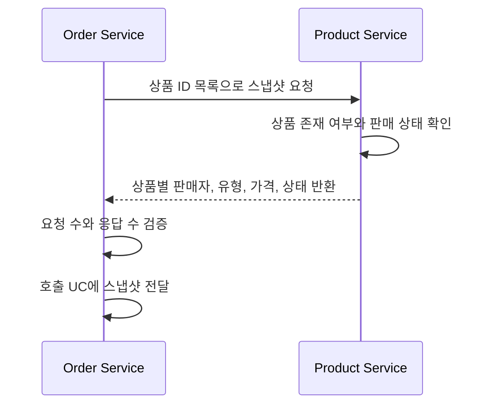
```mermaid
sequenceDiagram
    participant Order as Order Service
    participant Product as Product Service

    Order->>Product: 상품 ID 목록으로 스냅샷 요청
    Product->>Product: 상품 존재 여부와 판매 상태 확인
    Product-->>Order: 상품별 판매자, 유형, 가격, 상태 반환
    Order->>Order: 요청 수와 응답 수 검증
    Order->>Order: 호출 UC에 스냅샷 전달
```

기본 흐름:

1. Order Service가 Product Service에 상품 ID 목록을 전달한다.
2. Product Service는 상품 존재 여부와 판매 상태를 확인한다.
3. Product Service는 주문/장바구니에 필요한 상품 스냅샷을 반환한다.
4. Order Service는 요청 상품 수와 응답 상품 수를 검증한다.
5. Order Service는 반환된 스냅샷을 장바구니 또는 주문 생성에 사용한다.

대안/예외:

- 일부 상품이 없거나 판매 가능 상태가 아니면 호출 유즈케이스를 실패 처리한다.
- 스냅샷에 가격, 판매자, 상품명 등 필수 값이 없으면 호출 유즈케이스를 실패 처리한다.

## UC-INT-02 주문/주문항목 PENDING 생성

| 항목 | 내용 |
|------|------|
| 주 액터 | Order Service |
| 목표 | 결제 요청 전에 주문과 주문항목을 결제 대기 상태로 저장한다. |
| 사용 위치 | 주문 생성 |
| 사전조건 | 구매자 ID, 주문 번호, 상품 스냅샷, 총 금액, 총 상품 수가 준비되어 있다. |
| 완료 조건 | `order`, `order_product`가 모두 `PENDING` 상태로 저장된다. |

흐름 다이어그램:

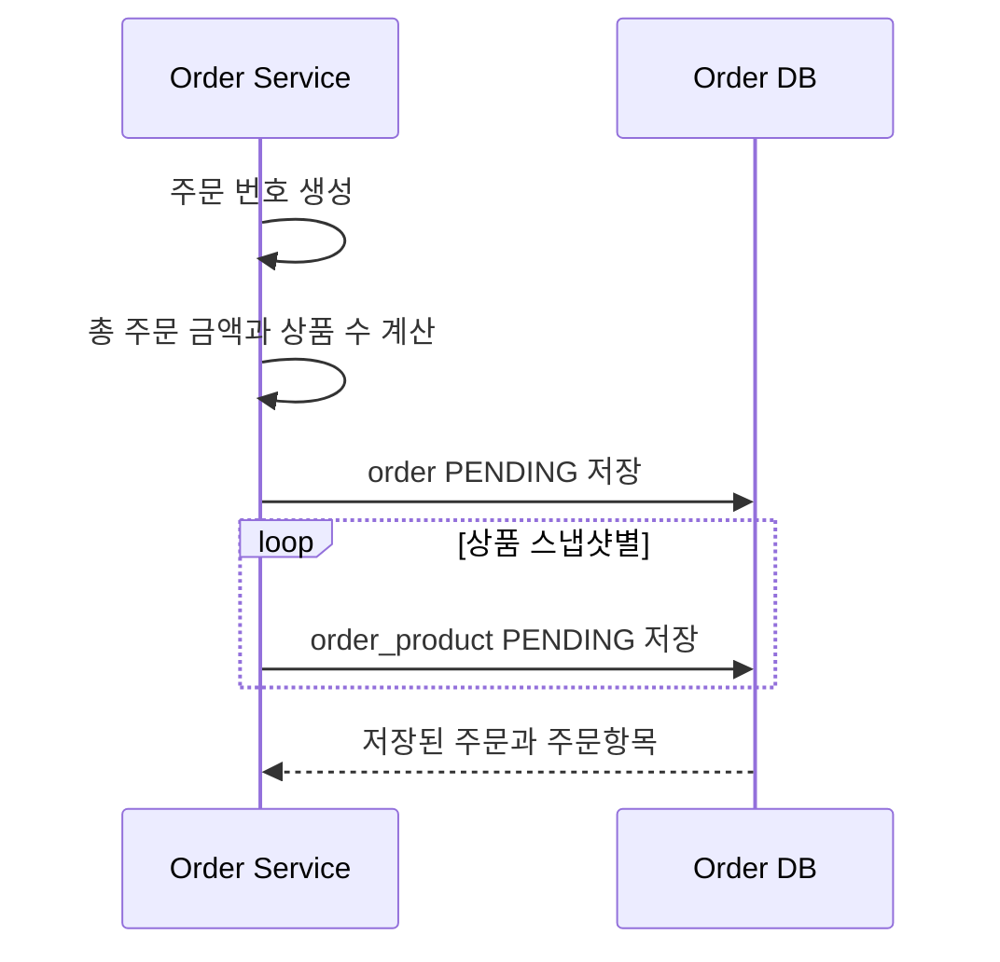
```mermaid
sequenceDiagram
    participant Order as Order Service
    participant DB as Order DB

    Order->>Order: 주문 번호 생성
    Order->>Order: 총 주문 금액과 상품 수 계산
    Order->>DB: order PENDING 저장
    loop 상품 스냅샷별
        Order->>DB: order_product PENDING 저장
    end
    DB-->>Order: 저장된 주문과 주문항목
```

기본 흐름:

1. Order Service는 주문 번호를 생성한다.
2. 상품 스냅샷 가격을 기준으로 총 주문 금액을 계산한다.
3. 구매자 ID, 주문 번호, 총 금액, 총 상품 수로 주문을 생성한다.
4. 각 상품 스냅샷으로 주문항목을 생성한다.
5. 주문과 주문항목의 양방향 관계를 설정한다.
6. 주문과 주문항목을 저장한다.

대안/예외:

- 주문 번호 생성에 실패하거나 중복되면 저장을 중단하고 재시도 또는 실패 처리한다.
- 상품 스냅샷이 유효하지 않으면 주문과 주문항목을 생성하지 않는다.

## UC-INT-03 PAID 상태 확인

| 항목 | 내용 |
|------|------|
| 주 액터 | Order Service |
| 목표 | 콘텐츠 열람 가능한 주문항목인지 확인한다. |
| 사용 위치 | 구매 상품 콘텐츠 열람, 주문 상세 응답의 `contentAvailable` 산정 |
| 사전조건 | 주문항목이 조회되어 있다. |
| 완료 조건 | 주문항목이 `PAID`이면 열람 가능, 아니면 열람 불가로 판단한다. |

흐름 다이어그램:

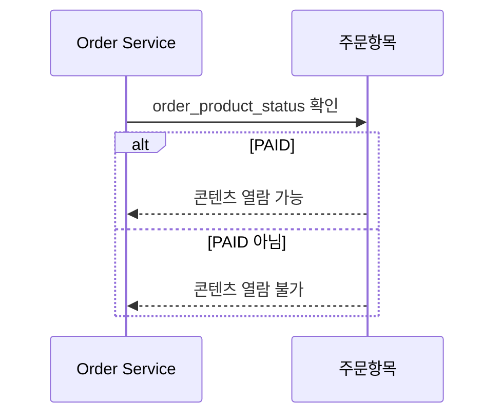
```mermaid
sequenceDiagram
    participant Order as Order Service
    participant Item as 주문항목

    Order->>Item: order_product_status 확인
    alt PAID
        Item-->>Order: 콘텐츠 열람 가능
    else PAID 아님
        Item-->>Order: 콘텐츠 열람 불가
    end
```

기본 흐름:

1. Order Service는 주문항목 상태를 확인한다.
2. 상태가 `PAID`이면 콘텐츠 열람 가능으로 판단한다.
3. 상태가 `PAID`가 아니면 콘텐츠 열람 불가로 판단한다.

대안/예외:

- 주문항목이 없으면 호출 유즈케이스에서 조회 실패로 처리한다.
- `REFUNDED`, `CANCELED`, `FAILED`, `PENDING` 상태는 콘텐츠 열람을 허용하지 않는다.

## UC-INT-04 주문항목 다운로드 처리

| 항목 | 내용 |
|------|------|
| 주 액터 | Order Service |
| 목표 | 구매자가 콘텐츠를 열람한 이력을 주문항목에 기록한다. |
| 사용 위치 | 구매 상품 콘텐츠 열람 |
| 사전조건 | 주문항목이 `PAID` 상태이다. |
| 완료 조건 | 주문항목의 `downloaded`가 `true`가 된다. |

흐름 다이어그램:

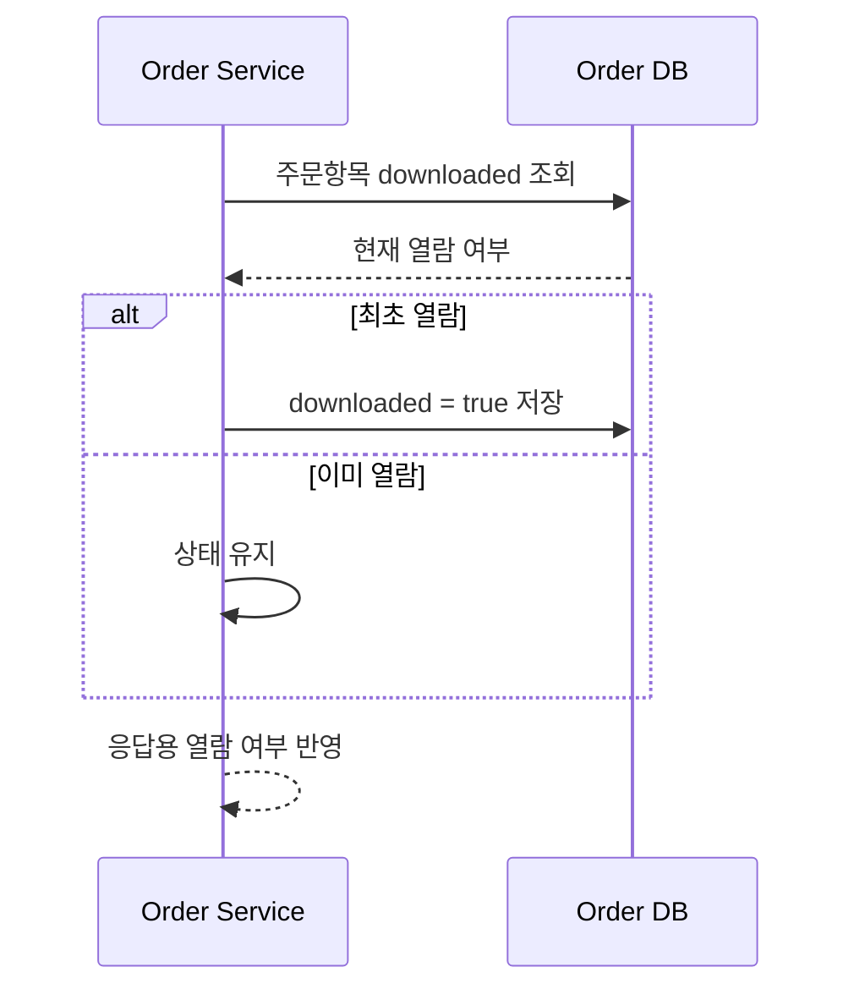
```mermaid
sequenceDiagram
    participant Order as Order Service
    participant DB as Order DB

    Order->>DB: 주문항목 downloaded 조회
    DB-->>Order: 현재 열람 여부
    alt 최초 열람
        Order->>DB: downloaded = true 저장
    else 이미 열람
        Order->>Order: 상태 유지
    end
    Order-->>Order: 응답용 열람 여부 반영
```

기본 흐름:

1. Order Service는 주문항목의 `downloaded` 값을 확인한다.
2. `false`이면 `true`로 변경한다.
3. 이미 `true`이면 상태를 유지한다.
4. 갱신된 열람 여부를 콘텐츠 열람 응답에 반영한다.

대안/예외:

- 주문항목이 `PAID`가 아니면 다운로드 처리하지 않는다.

## UC-EVENT-01 결제 승인 이벤트 반영

| 항목 | 내용 |
|------|------|
| 주 액터 | Payment Service |
| 목표 | 결제 승인 결과를 주문 상태에 반영한다. |
| 이벤트 | `payment.approved` |
| 포함 UC | 주문/주문항목 PAID 처리, 결제 완료 상품 장바구니 제거 |
| 사전조건 | 이벤트에 `paymentId`, `orderId`, `userId`, `amount`, `approvedAt`이 있다. |
| 완료 조건 | 주문과 주문항목이 `PAID` 상태가 되고 결제된 상품이 장바구니에서 제거된다. |

흐름 다이어그램:

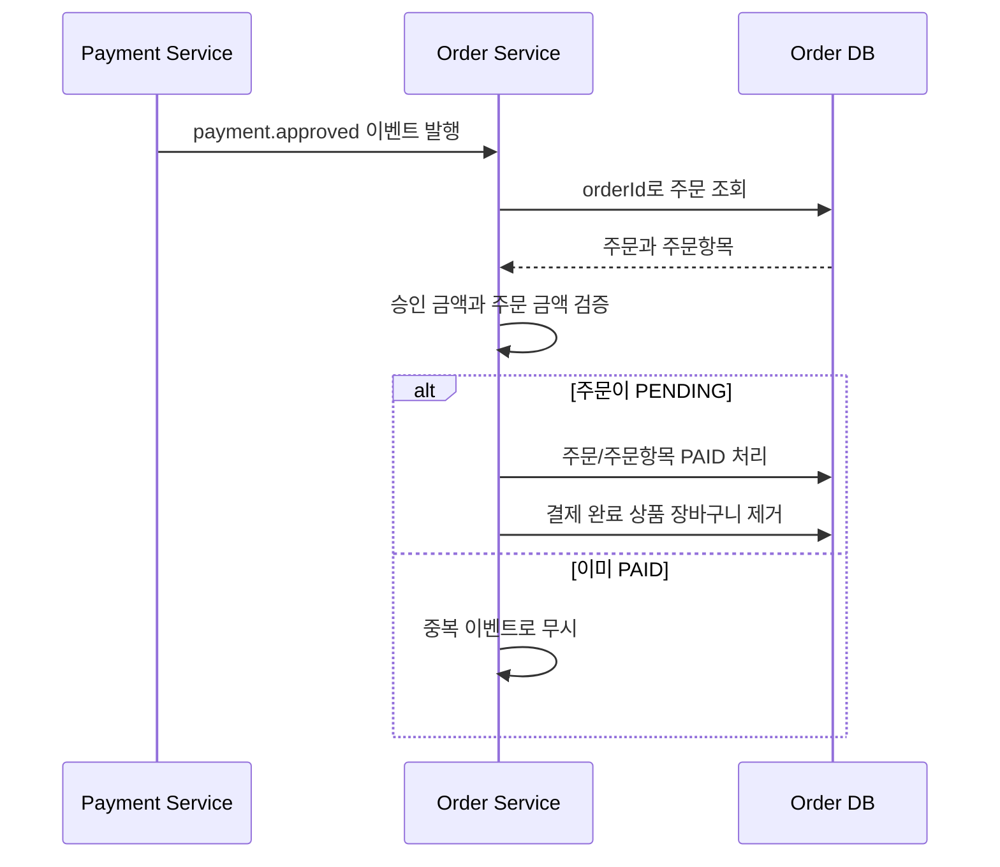
```mermaid
sequenceDiagram
    participant Payment as Payment Service
    participant Order as Order Service
    participant DB as Order DB

    Payment->>Order: payment.approved 이벤트 발행
    Order->>DB: orderId로 주문 조회
    DB-->>Order: 주문과 주문항목
    Order->>Order: 승인 금액과 주문 금액 검증
    alt 주문이 PENDING
        Order->>DB: 주문/주문항목 PAID 처리
        Order->>DB: 결제 완료 상품 장바구니 제거
    else 이미 PAID
        Order->>Order: 중복 이벤트로 무시
    end
```

기본 흐름:

1. Payment Service가 `payment.approved` 이벤트를 발행한다.
2. Order Service는 이벤트의 주문 ID로 주문을 조회한다.
3. 이벤트 금액과 주문 총 금액이 일치하는지 확인한다.
4. 주문이 이미 `PAID`이면 중복 이벤트로 보고 후속 처리를 생략한다.
5. 주문이 `PENDING`이면 주문과 주문항목을 `PAID` 상태로 변경한다.
6. 주문의 결제 완료 시각을 이벤트 승인 시각으로 반영한다.
7. 구매자 장바구니가 있으면 결제 완료된 상품을 장바구니에서 제거한다.

대안/예외:

- 주문이 없으면 이벤트 처리 실패로 기록한다.
- 주문 상태가 `PENDING`이 아니고 `PAID`도 아니면 허용되지 않은 상태 전이로 처리한다.
- 이벤트 금액과 주문 총 금액이 다르면 결제 승인 반영을 거부한다.
- 장바구니가 없으면 주문 결제 완료 처리는 그대로 성공한다.

## UC-EVENT-02 주문/주문항목 PAID 처리

| 항목 | 내용 |
|------|------|
| 주 액터 | Order Service |
| 목표 | 결제 승인된 주문과 주문항목을 구매 완료 상태로 변경한다. |
| 사용 위치 | 결제 승인 이벤트 반영 |
| 사전조건 | 주문과 주문항목이 `PENDING` 상태이다. |
| 완료 조건 | 주문과 모든 주문항목이 `PAID` 상태가 된다. |

흐름 다이어그램:

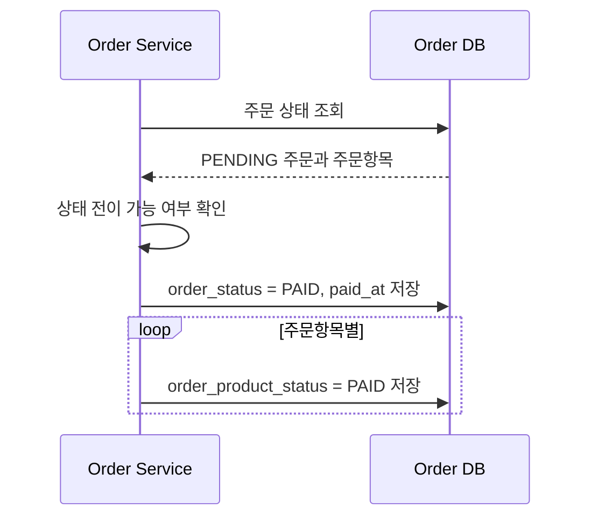
```mermaid
sequenceDiagram
    participant Order as Order Service
    participant DB as Order DB

    Order->>DB: 주문 상태 조회
    DB-->>Order: PENDING 주문과 주문항목
    Order->>Order: 상태 전이 가능 여부 확인
    Order->>DB: order_status = PAID, paid_at 저장
    loop 주문항목별
        Order->>DB: order_product_status = PAID 저장
    end
```

기본 흐름:

1. Order Service는 주문 상태가 `PENDING`인지 확인한다.
2. 주문 상태를 `PAID`로 변경한다.
3. 주문의 `paid_at`을 설정한다.
4. 모든 주문항목 상태를 `PAID`로 변경한다.
5. 각 주문항목의 수정 시각을 갱신한다.

대안/예외:

- 주문 또는 주문항목이 `PENDING`이 아니면 상태 변경을 거부한다.
- 이미 `PAID`인 주문은 멱등 처리를 위해 추가 상태 변경을 하지 않는다.

## UC-EVENT-03 결제 완료 상품 장바구니 제거

| 항목 | 내용 |
|------|------|
| 주 액터 | Order Service |
| 목표 | 결제 완료된 상품을 구매자의 장바구니에서 제거한다. |
| 사용 위치 | 결제 승인 이벤트 반영 |
| 사전조건 | 주문이 `PAID` 처리되었고 주문항목의 상품 ID 목록이 있다. |
| 완료 조건 | 구매자 장바구니에서 주문 상품 ID와 일치하는 항목이 제거된다. |

흐름 다이어그램:

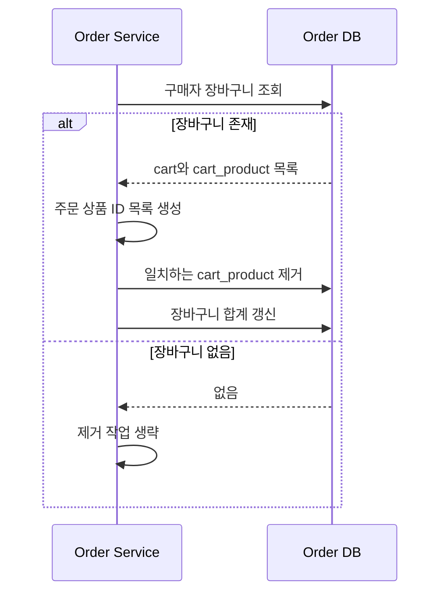
```mermaid
sequenceDiagram
    participant Order as Order Service
    participant DB as Order DB

    Order->>DB: 구매자 장바구니 조회
    alt 장바구니 존재
        DB-->>Order: cart와 cart_product 목록
        Order->>Order: 주문 상품 ID 목록 생성
        Order->>DB: 일치하는 cart_product 제거
        Order->>DB: 장바구니 합계 갱신
    else 장바구니 없음
        DB-->>Order: 없음
        Order->>Order: 제거 작업 생략
    end
```

기본 흐름:

1. Order Service는 주문의 구매자 ID로 장바구니를 조회한다.
2. 주문항목의 상품 ID 목록을 만든다.
3. 장바구니 항목 중 주문 상품 ID와 일치하는 항목을 제거한다.
4. 장바구니 합계와 상품 수를 갱신한다.

대안/예외:

- 구매자 장바구니가 없으면 제거 작업을 생략한다.
- 일부 상품이 장바구니에 없으면 존재하는 항목만 제거한다.

## UC-EVENT-04 환불 완료 이벤트 반영

| 항목 | 내용 |
|------|------|
| 주 액터 | Payment Service |
| 목표 | 전체 환불 완료 결과를 주문 상태에 반영한다. |
| 이벤트 | `payment.refunded` |
| 포함 UC | 주문/주문항목 REFUNDED 처리 |
| 사전조건 | 이벤트에 `paymentId`, `orderId`, `userId`, `amount`, `refundedAt`이 있다. |
| 완료 조건 | 주문과 주문항목이 `REFUNDED` 상태가 된다. |

흐름 다이어그램:

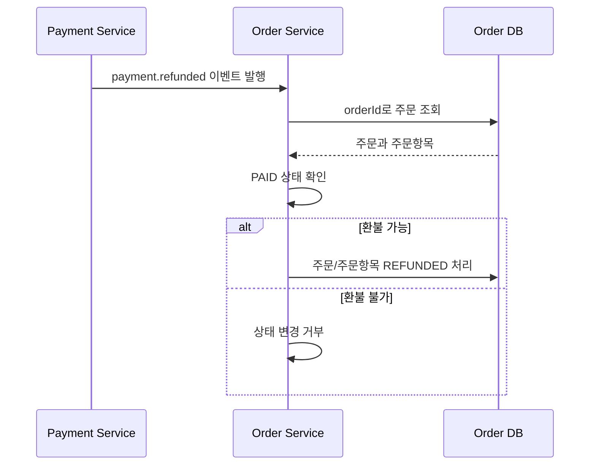
```mermaid
sequenceDiagram
    participant Payment as Payment Service
    participant Order as Order Service
    participant DB as Order DB

    Payment->>Order: payment.refunded 이벤트 발행
    Order->>DB: orderId로 주문 조회
    DB-->>Order: 주문과 주문항목
    Order->>Order: PAID 상태 확인
    alt 환불 가능
        Order->>DB: 주문/주문항목 REFUNDED 처리
    else 환불 불가
        Order->>Order: 상태 변경 거부
    end
```

기본 흐름:

1. Payment Service가 `payment.refunded` 이벤트를 발행한다.
2. Order Service는 이벤트의 주문 ID로 주문을 조회한다.
3. 주문이 환불 가능한 `PAID` 상태인지 확인한다.
4. 주문과 주문항목을 `REFUNDED` 상태로 변경한다.
5. 주문의 환불 완료 시각을 이벤트 환불 시각으로 반영한다.

대안/예외:

- 주문이 없으면 이벤트 처리 실패로 기록한다.
- 주문이 `PAID` 상태가 아니면 환불 상태 변경을 거부한다.
- 현재 기준은 전체 환불이며 부분 환불은 별도 확장으로 다룬다.

## UC-EVENT-05 주문/주문항목 REFUNDED 처리

| 항목 | 내용 |
|------|------|
| 주 액터 | Order Service |
| 목표 | 환불 완료된 주문과 주문항목을 환불 상태로 변경한다. |
| 사용 위치 | 환불 완료 이벤트 반영 |
| 사전조건 | 주문과 주문항목이 `PAID` 상태이다. |
| 완료 조건 | 주문과 모든 주문항목이 `REFUNDED` 상태가 된다. |

흐름 다이어그램:

```mermaid
sequenceDiagram
    participant Order as Order Service
    participant DB as Order DB

    Order->>DB: 주문 상태 조회
    DB-->>Order: PAID 주문과 주문항목
    Order->>Order: 환불 상태 전이 가능 여부 확인
    Order->>DB: order_status = REFUNDED, refunded_at 저장
    loop 주문항목별
        Order->>DB: order_product_status = REFUNDED 저장
    end
```

기본 흐름:

1. Order Service는 주문 상태가 `PAID`인지 확인한다.
2. 주문 상태를 `REFUNDED`로 변경한다.
3. 주문의 `refunded_at`을 설정한다.
4. 모든 주문항목 상태를 `REFUNDED`로 변경한다.
5. 각 주문항목의 `refunded_at`과 수정 시각을 갱신한다.

대안/예외:

- 주문 또는 주문항목이 `PAID`가 아니면 상태 변경을 거부한다.
- 이미 `REFUNDED`인 주문은 중복 이벤트로 보고 추가 상태 변경을 하지 않는다.

## UC-INT-05 정산 대상 PAID 주문 제공

| 항목 | 내용 |
|------|------|
| 주 액터 | Settlement Service |
| 목표 | 정산 배치가 판매자별 정산 대상 주문항목을 조회할 수 있게 한다. |
| API | `GET /internal/orders/paid` |
| 사전조건 | Settlement Service가 내부 호출 권한을 가진다. |
| 완료 조건 | 정산 대상 `PAID` 주문과 주문항목 데이터가 반환된다. |

흐름 다이어그램:

```mermaid
sequenceDiagram
    participant Settlement as Settlement Service
    participant Order as Order Service
    participant DB as Order DB

    Settlement->>Order: GET /internal/orders/paid
    Order->>Order: 내부 호출 권한 확인
    Order->>DB: 기간 내 PAID 주문과 주문항목 조회
    DB-->>Order: 정산 대상 주문항목 목록
    Order->>Order: 판매자별 정산 필요 데이터 구성
    Order-->>Settlement: 정산 대상 PAID 주문 응답
```

기본 흐름:

1. Settlement Service가 정산 기간 조건으로 PAID 주문 조회를 요청한다.
2. Order Service는 내부 호출 권한을 확인한다.
3. 정산 대상 기간에 속하는 `PAID` 주문과 주문항목을 조회한다.
4. 판매자 ID, 주문항목 ID, 상품 금액, 결제 완료 시각 등 정산에 필요한 데이터를 구성한다.
5. Settlement Service에 조회 결과를 반환한다.

대안/예외:

- 정산 대상 주문이 없으면 빈 목록을 반환한다.
- 내부 호출 권한이 없으면 접근 거부로 응답한다.
- 환불된 주문항목은 정산 대상에서 제외하거나 환불 차감 라인으로 처리할 수 있으며, 최종 정책은 Settlement Service 정산 규칙을 따른다.
