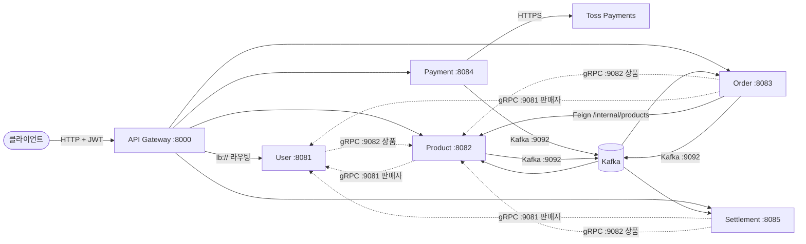

# 시스템 아키텍처 개요

3JMT 프롬프트 마켓 백엔드 모노레포의 MSA 전체 구조. **2026-07-06 기준 실제 코드·설정에서 도출**했으며, 각 사실의 근거 파일을 병기한다. Spring Cloud 컴포넌트 상세 동작은 `spring-cloud.md`, 서비스 간 Kafka 이벤트 상세는 `event-flow.md` 참조.

## 서비스 목록

| 모듈 | HTTP 포트 | gRPC 포트 | 역할 |
|---|---|---|---|
| `discovery` | 8761 | - | Eureka 서비스 레지스트리 |
| `config` | 8888 | - | Config Server (native, `config/src/main/resources/configs/` 제공) |
| `apigateway` | 8000 | - | 진입점. JWT 검증, 라우팅, `X-User-Id`/`X-User-Role` 주입 (WebFlux 기반) |
| `user-service` | 8081 | 9081 (서버) | 회원·인증(JWT 발급)·판매자·찜 |
| `product-service` | 8082 | 9082 (서버) | 상품·카테고리·리뷰 |
| `order-service` | 8083 | 9083 (서버, **예정** — 결제정보 폴백용 `OrderInternalService`) | 주문·장바구니·Outbox Relay |
| `payment-service` | 8084 | 9084 (서버, order-service향 환불 조회) / order 9083 **클라이언트** | 결제 (Toss Payments 연동), `order-events` 구독 |
| `settlement-service` | 8085 | - | 정산 (Spring Batch) |
| `common-module` | - | - | 공용 라이브러리 (`BusinessException`, `ErrorCode`, 공통 응답 래퍼). 루트 `settings.gradle`에 `include 'common-module'`로 서브프로젝트 포함 |

- 포트 근거: 각 모듈 `src/main/resources/application.yml`(또는 `.yaml`)의 `server.port`, `grpc.server.port`.
- 인프라 (루트 `docker-compose.yml`): PostgreSQL `postgres:18.4-alpine`(5432, loopback 노출), Kafka `confluentinc/cp-kafka:7.8.0`(9092, KRaft).
- 배포 구성에서 외부 진입은 host 80 → apigateway 8000이며, 서비스 포트는 loopback으로만 노출된다.

## 서비스 간 통신 흐름



### 1) 외부 → Gateway HTTP 라우팅

`apigateway/src/main/resources/application.yaml`의 라우트 정의 전체:

| 경로 패턴 | 대상 |
|---|---|
| `/api/v2/admin/settlements/batch/**` | `lb://SETTLEMENT-SERVICE` |
| `/api/v2/admin/settlements/**` | `lb://ADMIN-SERVICE` |
| `/api/v1/orders(/**)`, `/api/v1/cart(/**)`, `/api/v1/admin/orders(/**)`, `/api/v1/internal/orders/**` | `lb://ORDER-SERVICE` |
| `/api/v1/products(/**)`, `/api/v1/sellers/me/products(/**)`, `/api/v1/admin/products(/**)` | `lb://PRODUCT-SERVICE` |
| `/api/v1/payments/**` | `lb://PAYMENT-SERVICE` |
| `/api/v2/auth/**`, `/api/v2/users/**`, `/api/v2/seller(s)/**`, `/api/v2/wishlists/**`, `/api/v2/admin/**` | `lb://USER-SERVICE` |
| `/{service}/v3/api-docs` | 각 서비스 Swagger 문서 프록시 (RewritePath) |

`lb://`는 Eureka에 등록된 인스턴스를 조회해 로드밸런싱한다.

### 2) 내부 동기 통신 (gRPC)

| 호출자 → 대상 | 포트 | 용도 | 근거 |
|---|---|---|---|
| user → product | 9082 | 찜 상품 정보 조회 | `user-service` `application.yml` `grpc.client.product-service`, `wishlist/infrastructure/grpc/GrpcClientConfig.java` |
| product → user | 9081 | 판매자 정보 조회 | `product-service` `application.yml` `grpc.client.user-service` |
| order → product | 9082 | 상품 정보 조회 | `order-service/.../infra/grpc/client/product/ProductGrpcClientConfig.java` |
| order → user | 9081 | 판매자 정보 조회 | `order-service/.../infra/grpc/client/seller/SellerGrpcClientConfig.java` |
| settlement → user | 9081 | 판매자 정보 배치 조회 | `settlement-service/.../infrastructure/client/seller/config/SellerGrpcClientConfig.java` |
| settlement → product | 9082 | 상품 정보 배치 조회 | `settlement-service/.../infrastructure/client/product/config/ProductGrpcClientConfig.java` |
| payment → order | 9083 | 주문 결제정보 폴백 조회(스냅샷 미확보 시) | `payment-service/.../infrastructure/external/grpc/OrderGrpcClientConfig.java` (**order 측 서버 예정**) |
| order → payment | 9084 | 환불 이벤트 폴백 조회(Kafka 유실 시) | `payment-service/.../infrastructure/grpc/PaymentQueryGrpcService.java` |

### 3) 내부 동기 통신 (HTTP)

- order → product: FeignClient, `path = /internal/products` (상품 스냅샷 조회). `order-service/.../infra/rest/client/ProductFeignClient.java`

### 4) 비동기 통신 (Kafka)

토픽: `payment.approved`, `payment.refunded`, `payment.failed`(payment 구현), `order-events`, `product-events`. payment는 `order-events`의 `ORDER_CREATED`를 구독한다(주문 스냅샷 확보, order 발행은 예정). 발행/소비 매트릭스·시나리오 시퀀스는 **`event-flow.md`** 참조.

### 5) 외부 연동

- payment → Toss Payments (`https://api.tosspayments.com/v1`, RestClient). `payment-service/.../infrastructure/external/toss/TossPaymentGateway.java`

## 기동 순서

루트 `docker-compose.yml`의 `depends_on` 체인 기준:

```
postgres(5432) + kafka(9092)
  → discovery(8761)            # healthcheck 통과 대기
  → config(8888)               # discovery 의존
  → user/product/order/payment/settlement(8081~8085)
                               # postgres·kafka(healthy) + discovery·config 의존
  → apigateway(8000)           # 모든 서비스 이후
```

- 각 서비스의 Config Server 연결은 `optional:configserver:` 이므로 Config Server 없이도 기동은 된다(중앙 설정만 비활성).
- Eureka가 없으면 `lb://` 라우팅이 동작하지 않으므로 gateway 경유 호출이 불가하다.
- 참고: `spring-cloud.md`는 Config → Eureka 순서로 설명하지만, 실제 compose는 discovery → config 순서다(각 서비스가 optional import라 기동에는 영향 없음).

## 인증 / 인가 흐름

1. **JWT 발급**: user-service가 로그인 시 RS256 개인키로 발급 (`user-service` `application.yml`의 `jwt.private-key`, access 1시간 / refresh 30일).
2. **JWT 검증**: apigateway가 OAuth2 Resource Server(`ReactiveJwtDecoder`)로 공개키 검증. `apigateway/.../config/SecurityConfig.java`, `JwtConfig.java`
3. **인증 제외 경로** (`WhitelistPathResolver`, `gateway.api-versions` 설정 기반 동적 생성): user-service는 `[v1, v2]` 병행 활성이라 `/api/v1/auth/signup`·`/api/v2/auth/signup`, `/api/v1/auth/login`·`/api/v2/auth/login`, `/api/v1/auth/oauth/**`·`/api/v2/auth/oauth/**`, `/api/v1/auth/token/refresh`·`/api/v2/auth/token/refresh`가 모두 화이트리스트에 오르지만, 실제로 서빙되는 건 auth 컨트롤러가 매핑된 v2뿐이다(v1 auth 경로는 화이트리스트 통과 후 다운스트림에서 404). `/actuator/**`, Swagger 경로도 제외 대상. 추가로 `GET /api/v1/products(/**)`는 비로그인 허용.
4. **헤더 주입** (`apigateway/.../filter/UserHeaderFilter.java`):
   - JWT `sub` → `X-User-Id`, `roles` claim → `X-User-Role`(콤마 조인, `BUYER`/`SELLER`/`ADMIN`)
   - `status` claim이 `ACTIVE`가 아니면 **403 즉시 반환**
   - 다운스트림 전달 전 `Authorization` 헤더는 제거
5. **다운스트림 소비**: 각 서비스 Controller가 `@RequestHeader("X-User-Id")` 등으로 수신. 역할 검증 방식은 서비스별 규칙을 따른다(payment는 Controller 진입부 직접 검증).
6. 헤더 이름(`X-User-Id`, `X-User-Role`)은 **서비스 간 계약이므로 임의 변경 금지** (apigateway CLAUDE.md).
