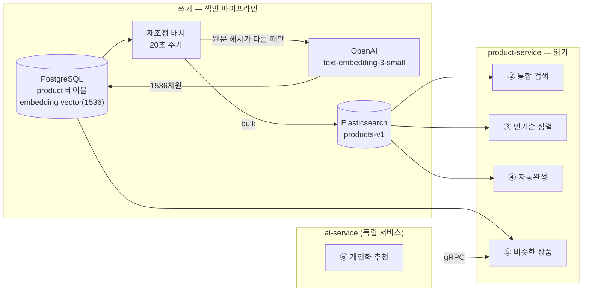
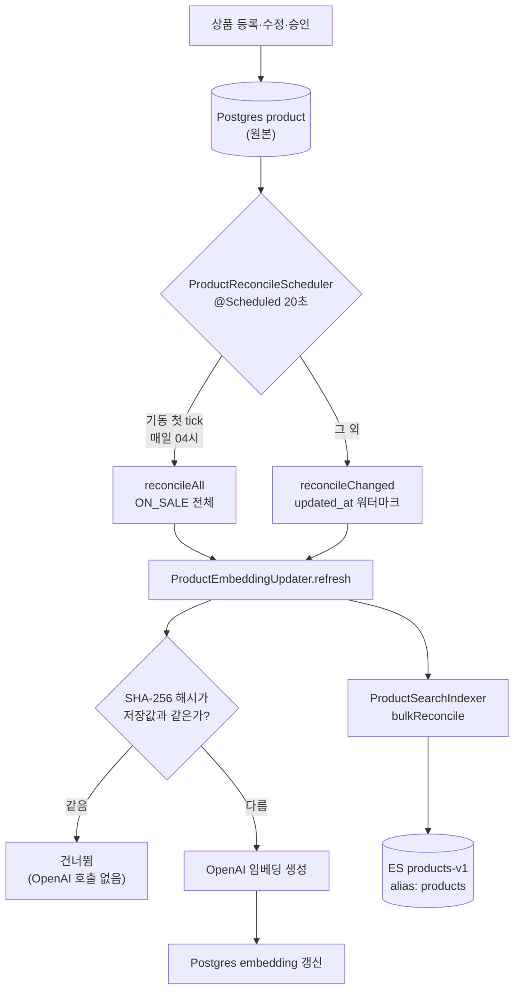
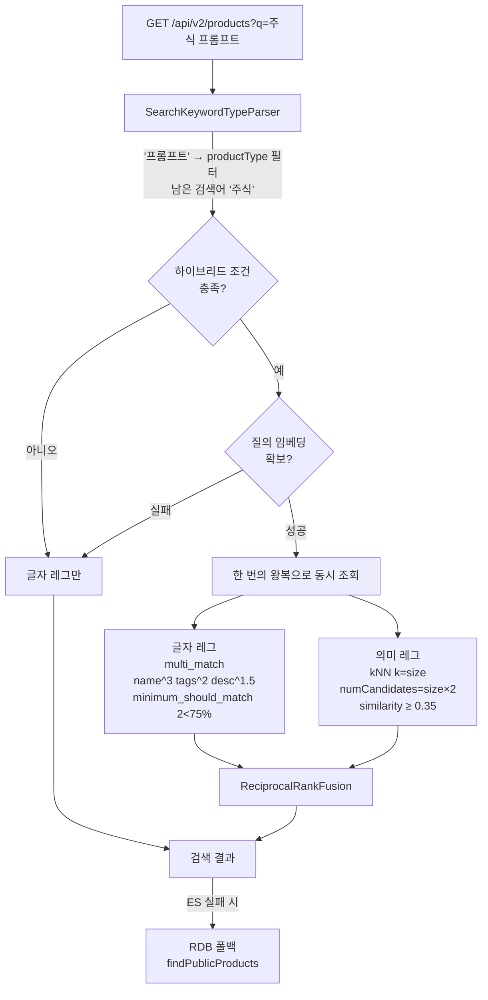
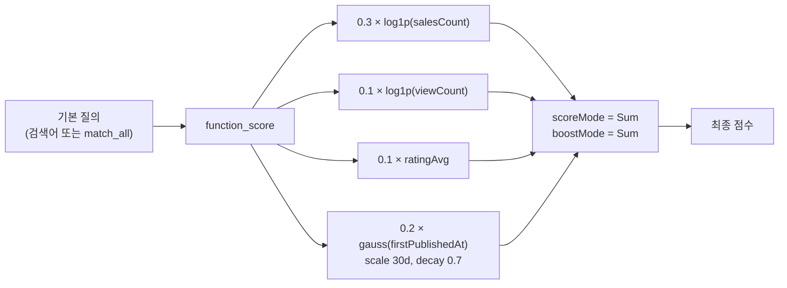
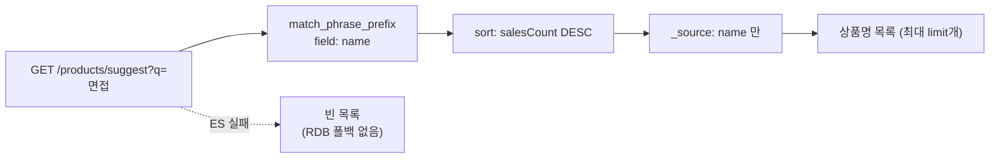
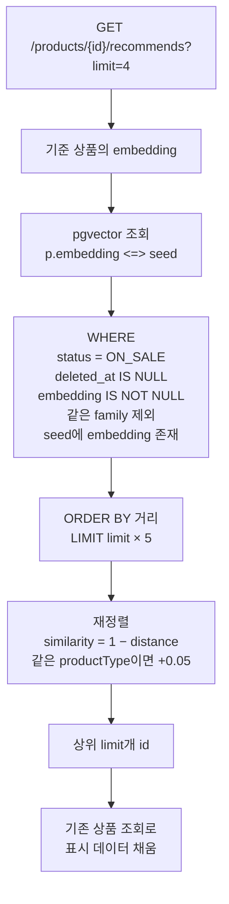
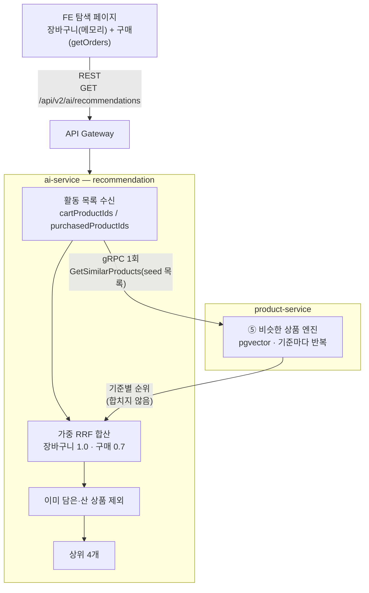

# 검색·벡터 전 흐름

product-service의 검색·추천 계열 기능 6가지가 각각 어떤 경로로 동작하는지 한곳에 정리한다.
발표 자료의 다이어그램 소스로 쓰도록 흐름마다 **목적 → 그림 → 노드 설명 → 코드 위치 → 수치**
순으로 같은 형식을 유지한다.

> 관련 문서
> - 서비스 전체 구조: `overview.md`
> - Kafka 이벤트 계약: `event-flow.md`
> - 계층·패키지 규칙: `.claude/rules/clean-architecture.md`

**읽기 전 알아둘 두 가지**

1. **저장소가 둘로 갈린다.** 검색은 Elasticsearch, 추천은 PostgreSQL(pgvector)에서 돈다.
   같은 임베딩을 쓰지만 코드를 공유하지 않는다.
2. **임베딩의 원본은 Postgres다.** ES는 검색용 사본이며, 사본이 날아가도 원본에서 다시 만들 수 있다.

---

## 0. 전체 지도



| 흐름 | 담당 서비스 | 저장소 | 벡터 사용 | 상태 |
|---|---|---|---|---|
| ① 색인 파이프라인 | product | Postgres → ES | 생성 | 운영 중 |
| ② 통합 검색 (하이브리드) | product | Elasticsearch | 질의↔상품 kNN | 운영 중 |
| ③ 인기순 랭킹 | product | Elasticsearch | 미사용 | 운영 중 |
| ④ 자동완성 | product | Elasticsearch | 미사용 | 운영 중 |
| ⑤ 비슷한 상품 | product | PostgreSQL (pgvector) | 상품↔상품 | 운영 중 |
| ⑥ 개인화 추천 | **ai** | ⑤에 gRPC 위임 | 상품↔상품 | **구현 중** |

**⑤와 ⑥은 다른 기능이다.** 계산 엔진(벡터 거리)만 공유하고 기준점이 다르다.

| | ⑤ 비슷한 상품 | ⑥ 개인화 추천 |
|---|---|---|
| 기준점 | **상품** — 지금 보는 것 | **사람** — 그 사용자의 활동 |
| 결과 | 누가 봐도 같음 | 사람마다 다름 |
| 노출 위치 | 상품 상세 하단 | 탐색 페이지 상단 |

---

## ① 색인 파이프라인

> **목적** — 상품이 바뀌면 임베딩과 검색 색인을 자동으로 따라가게 한다. 모든 벡터 기능의 토대다.



**노드 설명**

- **원본은 Postgres** — 임베딩은 외부 API를 호출해 만든 값이라 재생성에 비용이 든다.
  ES가 날아가도 다시 만들 수 있어야 하므로 벡터의 원본은 DB 컬럼에 둔다.
- **두 갈래 주기** — 기동 후 첫 tick과 매일 04시는 전체(`reconcileAll`), 그 외에는
  `updated_at` 기준 증분(`reconcileChanged`)이다. 워터마크는 메모리 필드라
  **배포로 파드가 재시작되면 초기화되어 전체 재조정이 한 번 돈다.**
- **해시 게이트가 핵심** — 배치는 `updated_at`으로 대상을 고르는데 조회수 증가만으로도 그 값이
  바뀐다. 원문 해시로 한 번 더 거르지 않으면 상품을 열어보기만 해도 OpenAI를 호출한다.
- **임베딩 원문** = 제목 + 태그 + 소개글 + 본문(2000자까지). 유형별로 넣을 수 있는 텍스트가
  달라 PROMPT만 본문이 있고 NOTION·PPT·EXCEL은 제목·태그·소개글이 전부다.

**코드 위치**

| 역할 | 파일 |
|---|---|
| 주기 실행 | `search/infra/batch/ProductReconcileScheduler.java` |
| 전체·증분 재조정 | `search/application/ProductReindexService.java` |
| 임베딩 갱신·해시 게이트 | `search/application/ProductEmbeddingUpdater.java` |
| 임베딩 원문·해시 | `search/application/EmbeddingSource.java` |
| OpenAI 어댑터 | `search/infra/openai/SpringAiEmbeddingAdapter.java` |
| 색인 매핑 | `resources/es/products-v1-mapping.json` |

**수치**

- 재조정 주기 20초 — admin 승인부터 검색 노출까지의 지연 예산. 화면 이동·검색에 걸리는
  5~15초를 크게 넘기지 않아야 "승인이 반영되지 않았다"는 오인을 막는다
- 워터마크 겹침 30초 — 커밋 시각과 조회 가시 시점의 간극에 낀 행이 영구 누락되는 것을 막는다
- 본문 절단 2000자 — `text-embedding-3-small`의 입력 상한 8,191토큰 아래로 두려는 여유값
- 임베딩 실패 시 재시도하지 않는다. 해시를 저장하지 않으므로 다음 주기가 곧 재시도다

---

## ② 통합 검색 — 하이브리드

> **목적** — 글자가 겹치지 않아도 의미가 가까우면 찾는다. 글자 검색과 의미 검색을 한 번의
> 왕복으로 돌려 순위를 병합한다.



**노드 설명**

- **유형 단어 해석이 먼저다** — "주식 프롬프트"에서 사용자가 원하는 건 "프롬프트라는 글자가
  들어간 상품"이 아니라 "프롬프트 유형 중 주식 관련"이다. 유형 단어를 글자로 매칭하면 그
  단어를 이름에 단 모든 상품이 꼬리로 딸려오고, 질의 임베딩도 유형 쪽으로 쏠려 **의미 레그까지
  오염된다.** 유형 단어는 필터로 옮기고 남은 단어로만 두 레그를 돌린다.
  화면에서 유형을 이미 골랐으면(`productType != all`) 그 선택을 존중하고 해석하지 않는다.
- **하이브리드 조건** — 검색어가 있고, 정렬이 `popular`이고, `offset + size ≤ 100`일 때만.
  RRF는 순위 목록을 통째로 섞는 방식이라 페이지 단위로 나눠 계산할 수 없어 병합 창이 필요하다.
- **두 레그에 같은 필터** — 대상 집합이 다르면 병합 결과에 필터 밖 문서가 섞인다.
- **의미 레그에 하한이 필수** — kNN은 관련도와 무관하게 상위 k건을 채워 돌려준다. 하한이
  없으면 색인 문서가 k보다 적을 때 어떤 질의든 전체 문서가 후보가 되어 **"검색 결과 0건"이
  발생할 수 없게 된다.**
- **총 건수** = 글자 레그의 전체 건수와 병합 결과 크기 중 **큰 값**. 글자 레그 값만 쓰면 의미
  레그만 찾은 문서가 빠지고, 병합 크기만 쓰면 병합 창을 넘는 글자 결과가 과소 집계된다.
- **폴백 판단은 product 패키지가 한다** — search 패키지는 예외를 던지고, 폴백 여부는
  `ProductQueryService`의 try/catch가 정한다.

**코드 위치**

| 역할 | 파일 |
|---|---|
| 유형 단어 해석 | `search/infra/es/SearchKeywordTypeParser.java` |
| 질의 조립 | `search/infra/es/ProductSearchQueryBuilder.java` |
| 두 레그 실행·병합 | `search/infra/es/ElasticsearchProductSearchQuerier.java` |
| 순위 융합 | `search/application/ReciprocalRankFusion.java` |
| 질의 임베딩 캐시 | `search/application/QueryEmbeddingCache.java` |
| 폴백 판단 | `product/application/service/ProductQueryService.java` |

**수치·상수**

| 상수 | 값 | 근거 |
|---|---|---|
| 검색 대상 필드 | `name^3`, `tags.text^2`, `description^1.5` | 본문(`content`)은 제외 — placeholder 예시에 무관한 검색어가 걸려 오탐을 만든다(#689) |
| `minimumShouldMatch` | `2<75%` | 기본 OR이면 단어 하나만 겹쳐도 매칭된다. 이 코퍼스는 대부분 상품명이 "프롬프트"를 포함해 그 단어가 만능 열쇠가 됐다 |
| `tieBreaker` | 0.3 | `best_fields` 사용 시 나머지 필드 점수 반영 비율 |
| kNN 유사도 하한 | 0.35 | 2026-07-30 dev 실측으로 검증 — 아래 부록 A |
| `numCandidates` | `size × 2` | 근사 탐색(HNSW)이 상위 k를 놓치지 않을 여유 |
| 병합 창 | 100 | 검색 결과 100건 뒤를 넘겨보는 사용은 사실상 없다 |

---

## ③ 인기순 랭킹

> **목적** — 검색 점수에 판매·조회·평점·신선도를 얹어 "인기순"을 만든다. 벡터를 쓰지 않는다.



**노드 설명**

- **판매·조회에 `log1p`를 씌우는 이유** — 두 값은 상한이 없어 스케일이 무계다. 그대로 더하면
  판매 3000건짜리 하나가 다른 모든 항을 압도한다. 로그를 씌워 증가폭을 눌러 담는다.
- **평점은 그대로** — 0~5로 이미 유계라 변환이 필요 없다. 리뷰가 없으면 `missing(0.0)`.
- **신선도는 가우시안 감쇠** — 등록 후 30일까지 완만히, 그 뒤로 빠르게 떨어진다. 계단식
  분기(신규/구형) 대신 연속 함수를 쓰면 경계에서 순위가 튀지 않는다.
- **Sum / Sum** — 네 항을 더하고, 그 합을 원래 검색 점수에 다시 더한다. 곱이 아니라 합이라
  한 항이 0이어도 나머지가 죽지 않는다.

**코드 위치** — `search/infra/es/ProductSearchQueryBuilder.java`의 `withPopularityBoost`,
가중치는 `search/infra/es/SearchRankingProperties.java`

**수치**

가중치 4개는 `prompthub.search.ranking.*` yml 노브다(`configs/product-service.yml`).
**실측 없이 잡은 초기 추측값이며 아직 조정된 적이 없다.** 조정 근거가 될 클릭률 지표가
수집되지 않고 있다.

| 노브 | 값 |
|---|---|
| `sales-weight` | 0.3 |
| `view-weight` | 0.1 |
| `rating-weight` | 0.1 |
| `freshness-weight` | 0.2 |
| `freshness-scale` | 30d |
| `freshness-decay` | 0.7 |

---

## ④ 자동완성

> **목적** — 검색창에 타이핑하는 동안 상품명을 제안한다. 검색 계열에서 **유일하게 벡터를 쓰지
> 않는** 기능이다.



**노드 설명**

- **`match_phrase_prefix`** — 마지막 토큰을 접두사로 취급한다. "면접 준"이 "면접 준비"에 걸린다.
- **판매량 순 정렬** — 접두사에 걸린 후보가 여럿일 때 무엇을 먼저 보여줄지의 기준. 관련도가
  아니라 인기다.
- **이름만 반환** — 드롭다운에 필요한 건 문자열뿐이라 `_source` 필터로 전송량을 줄인다.
- **폴백이 없는 이유** — RDB에 대응하는 조회가 없고, 자동완성은 실패해도 드롭다운이 안 뜰 뿐
  사용자가 검색 자체를 못 하게 되지는 않는다. 검색 본체와 판단이 다르다.

**코드 위치** — `ProductSearchQueryBuilder.buildSuggest`, 호출은
`ProductQueryService.suggest`(예외를 잡아 빈 목록 반환)

**한계** — 형태소 분석기가 없어 붙여 쓴 검색어("주식프롬프트")는 한 토큰으로 취급되어 매칭되지
않는다. nori는 서비스 어휘를 오히려 망가뜨려 제거한 상태다.

---

## ⑤ 비슷한 상품 — pgvector

> **목적** — 상품 상세 페이지에서 "이 상품과 비슷한 상품"을 보여준다. **여기서부터는
> Elasticsearch가 아니라 PostgreSQL이다.**



**노드 설명**

- **`<=>` 는 코사인 거리** — 유사도가 아니다. **낮을수록 비슷하다.** `거리 = 1 − 유사도`.
- **같은 family 제외** — 같은 상품의 다른 버전을 "비슷한 상품"으로 보여줄 수는 없다.
  `coalesce(parent_id, id) <> :familyRootId`.
- **`EXISTS` 가드** — 기준 상품에 임베딩이 없으면 `<=> NULL`이 NULL이 되어 후보가 걸러지지
  않고 `distance = NULL`로 돌아온다. 이를 primitive `double`로 받으면 NPE가 난다. 승인 직후
  재조정 배치가 임베딩을 채우기 전까지 실제로 생기는 상태다.
- **후보를 5배로 받는 이유** — 요청한 만큼만 가져오면 같은 유형이 그 자리를 다 채웠을 때 다른
  유형이 후보에도 들지 못해 가산점이 순서를 뒤집을 여지가 사라진다.
- **유형 가산점 0.05** — 코사인 유사도가 0~1로 유계라 이 값은 "다른 유형이 같은 유형을
  앞서려면 유사도가 얼마나 더 높아야 하는가"로 직접 읽힌다. 하드 필터로 두지 않는 이유는
  FE가 4개만 요청하므로 같은 유형 후보가 4개만 있어도 다른 유형이 절대 노출되지 않기 때문이다.
- **인기도 항을 넣지 않는다** — `salesCount`는 스케일이 무계라 코사인 공간에 섞으면 가중치의
  근거도 해석도 없어진다. 해석 가능한 항 하나만 둔다.

**코드 위치**

| 역할 | 파일 |
|---|---|
| 순위 계산 | `recommendation/application/ProductRecommender.java` |
| pgvector 쿼리 | `product/infra/persistence/ProductJpaRepository.java` (`findSimilarProductRows`) |
| 표시 데이터 채움 | `product/application/service/ProductQueryService.java` (`getRecommendedProducts`) |

**알려진 결함 — 유사도 하한이 없다**

검색(②)에는 kNN 하한 0.35가 있지만 **추천 쿼리에는 거리 하한이 없다.** `ORDER BY ... LIMIT`은
줄세우기지 거르기가 아니라서, 아무리 관련이 없어도 가장 덜 먼 상품이 자리를 채운다.
검색과 추천은 저장소도 코드도 공유하지 않아 한쪽에만 하한이 들어갔다.

실측 결과는 부록 A에 있다. **상위 4건 중 1건만 관련 있고 3건은 무관하며, 정작 관련 있는
상품이 5~8위로 밀려 잘린다.** 하한 값은 아직 확정하지 못했다 — 관련/무관이 거리로 분리되지
않는 구간이 존재해 단순히 값을 정하는 문제가 아니다.

---

## ⑥ 개인화 추천 — ai-service (구현 중)

> **목적** — 탐색 페이지 상단에 "내 활동과 비슷한 상품"을 보여준다. ⑤의 계산 엔진을 그대로
> 쓰고 **기준점을 상품에서 사람으로 바꾼다.**
>
> 요구사항이 AI 추천을 **독립된 서비스**로 요구하므로 product-service가 아니라 `ai-service`에
> 둔다. `ai-service`는 이미 상품 검수·정산 챗봇을 담당하는 독립 서비스다.



**설계 요점**

- **조합 판단이 ai-service에 있다.** 어떤 활동에 얼마나 무게를 둘지, 무엇을 빼고 몇 개를
  보여줄지를 ai가 정한다. product는 `"이 상품과 가까운 것"`만 답하고 누구에게 무엇을
  추천할지 모른다. **gRPC가 기준별 순위를 합치지 않고 그대로 돌려주는 이유**가 이것이다 —
  합쳐서 주면 그 판단이 product로 넘어와 독립 서비스로 둔 의미가 사라진다.
- **ai-service에는 DB가 없다**(Redis만). 그래서 상품·임베딩을 gRPC로 받고, 활동 내역은
  FE가 요청에 실어 보낸다. **order-service를 수정하지 않는다.**
- **평균이 아니라 순위 합산(RRF)** — 여러 상품의 좌표를 평균 내면 그 중간 지점에 착지하는데,
  부록 A-5의 중심성 측정이 보여주듯 이 카탈로그에서 그 중간은 **모든 것과 어중간하게 가까운
  허브 구역**이다. 평균은 취향을 잡는 게 아니라 지운다. RRF는 각 기준의 실제 위치에서 뽑은
  **순위만** 더하므로 중간 지점을 만들지 않는다.
- **RRF의 부수 효과** — 여러 목록에서 공통으로 상위인 상품이 올라가므로, 한 목록에서만 우연히
  상위인 허브가 밀린다. 부록 A-5의 "특정 상품이 전체 기준점의 27%에 등장" 현상을 부분적으로
  완화한다.
- **추천이 죽어도 구매는 된다.** 활동이 없거나 gRPC가 실패하면 빈 목록을 돌려주고 FE가 섹션을
  숨긴다. 상품 목록·구매 흐름과 분리돼 있다.

```
점수 = Σ ( 가중치 × 1 / (60 + 등수) )

장바구니 1.0   지금 사려는 것
구매     0.7   확정된 취향이지만 과거
```

**물려받는 한계** — ⑤와 같은 엔진을 쓰므로 **거리 하한이 없는 문제를 그대로 물려받는다.**
부록 A-4처럼 상위 4건 중 1건만 관련 있는 상태가 개인화 추천에도 그대로 나타난다. 기준점을
바꾸는 것으로는 해결되지 않는다.

---

# 부록 A — 실측 수치

모두 dev 배포 환경(k8s `prompthub` 네임스페이스)에서 2026-07-30에 측정했다.
**추정치는 이 표에 넣지 않는다.**

## A-1. 색인 규모

| 항목 | 값 |
|---|---|
| ON_SALE 상품 | 36건 |
| 그중 임베딩 보유 | 36건 (100%) |
| 임베딩 차원 | 1536 (`text-embedding-3-small`) |
| 인덱스 | `products-v1` (alias `products`), 샤드 1 / 복제본 0 |
| 벡터 필드 | `dense_vector`, `similarity: cosine`, `index_options: int8_hnsw` |

`int8_hnsw`는 벡터를 8비트 정수로 양자화해 저장하는 HNSW 색인이다. 메모리를 약 1/4로 줄이는
대신 근사 오차가 생기는데, heap 1GB 단일 노드에서 여러 로그 스트림과 노드를 공유하는 환경이라
정확도보다 메모리를 택한 구성이다.

## A-2. 검색 kNN 하한 검증 (질의 ↔ 상품)

무관한 질의 5종의 최고 코사인이 전부 하한 0.35에 못 미쳐 **오탐 0건**이었다.

| 구분 | 코사인 | 통과 |
|---|---|---|
| 무관 질의 5종 최고 | 0.249 ~ 0.305 | 미달 (의도대로 탈락) |
| 명확히 관련된 질의 | 0.435 ~ 0.494 | 통과 |
| 경계 사례 "면접 준비" | 0.325 | 미달 — 글자 레그가 잡아준다 |

→ **하한 0.35는 이 코퍼스에서 유효하다.**

## A-3. 추천 거리 분포 (상품 ↔ 상품)

ON_SALE 36건의 모든 쌍 1260개(36 × 35).

| min | p05 | p25 | median | p75 | max |
|---|---|---|---|---|---|
| 0.180 | 0.479 | 0.574 | 0.632 | 0.696 | 0.862 |

**median 0.632의 의미** — 무관한 상품 둘을 아무거나 집으면 거리가 대략 이 값이다. 즉
"서로 상관없음"의 기본값이 0.632다.

**A-2의 0.35를 그대로 옮기면 안 되는 이유** — 유사도 0.35는 거리로 0.65인데, 이는 median
0.632보다 느슨하다. 전체 쌍의 약 57%가 통과해 상위 4건에 아무 영향을 주지 못한다.
**질의↔상품과 상품↔상품은 분포가 다르므로 하한을 옮겨 쓸 수 없다.**

## A-4. 추천 품질 실측

`펭귄 생성 프롬프트` 기준:

| 거리 | 상품 | 관련성 |
|---|---|---|
| 0.180 | GPT를 활용한 동물 이미지 생성 가이드 | 관련 |
| 0.483 | AI 개인화 에이전트 생성기 About Me.md | 무관 |
| 0.488 | Claude Design + Claude Code Figma | 무관 |
| 0.489 | 상위노출 블로그 SEO 글쓰기 | 무관 |
| 0.505 | 웹툰 주인공 캐릭터 디자인 | 관련 — **잘림** |
| 0.531 | 동화책 캐릭터 일러스트 | 관련 — **잘림** |

FE 기본값이 `limit=4`라 화면에는 관련 1건 + 무관 3건이 노출된다.

`합격하는 자기소개서 첨삭 프롬프트` 기준도 같은 패턴이다. 1위 이력서 첨삭(0.329) 뒤로
0.479~0.553 구간에 9건이 몰려 있고, 그 안에서 **백엔드 기술 면접 모의면접관(0.504, 관련)과
CS 완전 정복(0.504, 무관)이 동점**이라 거리로 구분되지 않는다.

## A-5. 중심성 — 임베딩 공간 압축

각 상품의 "나머지 전체에 대한 평균 거리". 작을수록 모든 것과 가까운 허브다.

| 상품 | 본문 길이 | 평균 거리 |
|---|---|---|
| 블로그 SEO 초안 | 927 | 0.568 |
| 이력서·경력기술서 첨삭 | 957 | 0.568 |
| 자기소개서 첨삭 | 124 | 0.592 |
| 버그 잡는 코드 리뷰 | 110 | 0.603 |
| About Me.md 자동 생성 | 4000 | 0.609 |
| 1인 개발자 노션 템플릿 | 0 | 0.609 |

**본문 길이와 중심성에 상관관계가 없다.** 본문 4000자와 0자의 중심성이 같다. "본문이 벡터를
지배한다"는 가설은 이 측정으로 기각됐다.

대신 드러나는 것은 **공간 전체의 압축**이다. 상위 15건의 중심성이 0.568~0.610의 좁은 구간에
있어 어느 상품도 특별히 중심에 있지 않은데, 개별 seed의 후보들이 0.05 안에 몰려 있어
**0.01 차이가 상위 4건을 결정한다.** 전수 조사에서 특정 상품이 전체 seed의 최대 27%에
등장하는 현상도 여기서 비롯한다.

---

# 부록 B — 상수 일람

| 상수 | 값 | 위치 | 설정 가능 |
|---|---|---|---|
| 재조정 주기 | 20초 | `prompthub.search.reconcile.fixed-delay-ms` | yml |
| 전체 스윕 | 매일 04:00 | `prompthub.search.reconcile.full-sweep-cron` | yml |
| 워터마크 겹침 | 30초 | `ProductReconcileScheduler` | 코드 |
| 본문 절단 | 2000자 | `EmbeddingSource.MAX_CONTENT_CHARS` | 코드 |
| kNN 유사도 하한 | 0.35 | `ProductSearchQueryBuilder.MIN_SEMANTIC_SIMILARITY` | 코드 |
| `minimumShouldMatch` | `2<75%` | 〃 | 코드 |
| `tieBreaker` | 0.3 | 〃 | 코드 |
| 병합 창 | 100 | `ElasticsearchProductSearchQuerier.FUSION_WINDOW` | 코드 |
| 인기순 가중치 4종 | 0.3 / 0.1 / 0.1 / 0.2 | `prompthub.search.ranking.*` | yml |
| 신선도 감쇠 | 30d / 0.7 | 〃 | yml |
| 유형 가산점 | 0.05 | `ProductRecommender.TYPE_BONUS` | 코드 |
| 추천 후보 배수 | ×5 | `ProductRecommender.CANDIDATE_MULTIPLIER` | 코드 |
| 추천 거리 하한 | **없음** | — | — |
| RRF 상수 K | 60 | ai-service `WeightedRankFusion` | 코드 |
| 활동 가중치 | 장바구니 1.0 / 구매 0.7 | 〃 | 코드 |

**코드 상수를 yml로 빼지 않은 이유** — `configs/`가 config server 이미지에 구워져 yml을 고쳐도
머지·재배포가 필요하다. 노브로 만들어도 조정이 빨라지지 않고 배포 단계만 는다. 반복 조정이
실제로 필요해지는 시점(클릭률 등 조정 신호가 생겼을 때)에 외부화한다.
