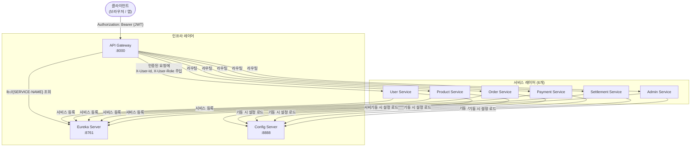
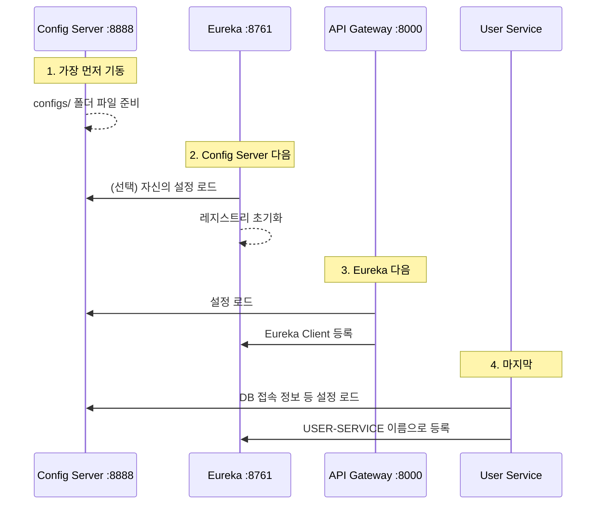
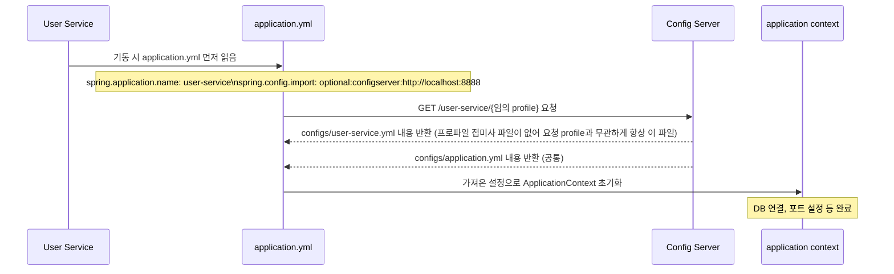
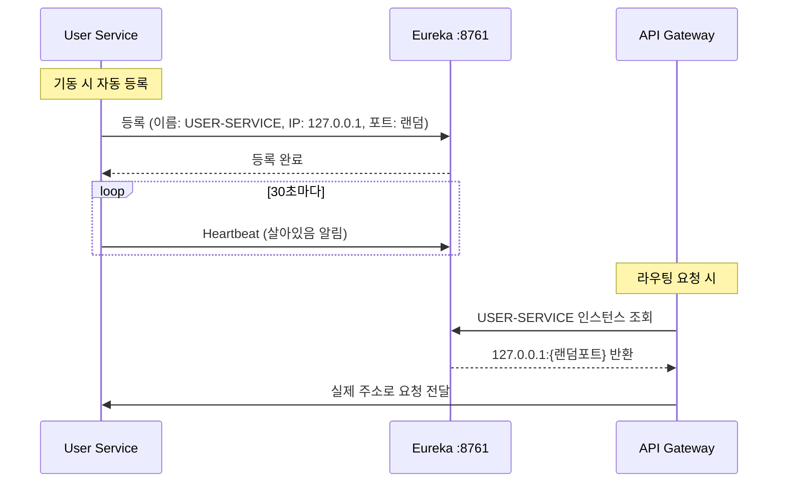
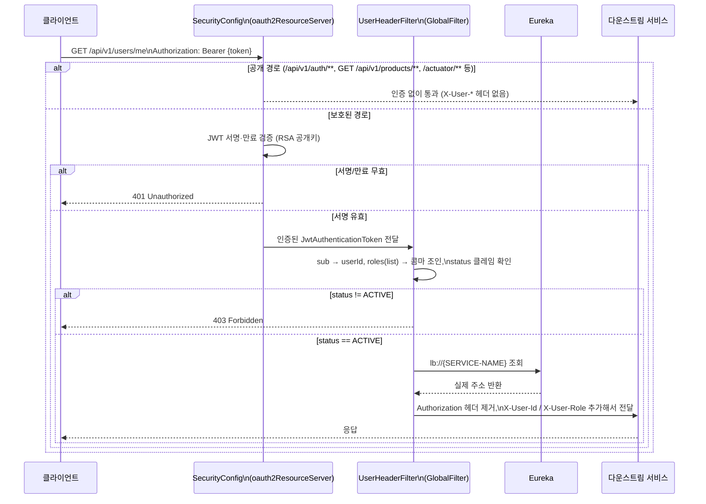

# Spring Cloud 아키텍처

이 프로젝트에서 Spring Cloud 3개 컴포넌트가 어떻게 동작하는지 설명한다.

---

## 전체 구조



> User/Product/Order/Payment/Settlement/Admin 6개 서비스 모두 Eureka client·Config client
> 의존성을 갖는다(`build.gradle`의 "비즈니스 서비스 6개" 블록). Discovery는 config client를
> 붙이지 않는다.

---

## 기동 순서

반드시 아래 순서로 기동해야 한다. 순서가 틀리면 서비스가 설정을 못 읽거나 Eureka에 등록이 안 된다.



| 순서 | 모듈 | 포트 | 이유 |
|------|------|------|------|
| 1 | Config Server | 8888 | 다른 모든 서비스가 여기서 설정을 읽어옴 |
| 2 | Discovery (Eureka) | 8761 | Gateway와 서비스들이 여기에 등록함 |
| 3 | API Gateway | 8000 | Eureka가 살아있어야 lb:// 라우팅 가능 |
| 4 | 각 서비스 | - | Config + Eureka 모두 필요 |

---

## Config Server 동작 방식

서비스가 기동할 때 자신의 설정을 Config Server에서 가져온다.



**핵심**: `spring.config.import`로 Config Server를 지정하면(예: `optional:configserver:http://localhost:8888`) 별도의 `bootstrap.yml` 없이도 애플리케이션 초기 단계에서 원격 설정을 로드한다.

**Config Server가 관리하는 파일 구조** — `config/src/main/resources/configs/`(native/classpath 서빙, `spring.cloud.config.server.native.search-locations: classpath:/configs/`). 팀 지시사항상 별도 설정 리포는 만들 수 없어 이 리포 안 config 모듈이 유일한 소스다:
```
config/src/main/resources/configs/
├── application.yml         # 모든 서비스 공통 (Eureka 클라이언트, actuator 노출)
├── user-service.yml
├── product-service.yml
├── order-service.yml
├── payment-service.yml
└── settlement-service.yml   # admin-service는 전용 파일 없음 — application.yml만 받음
```
**프로파일 접미사(`-dev`, `-local` 등)가 붙은 파일은 없다** — 전부 기본형태(`{service}.yml`) 하나뿐이다. Spring Cloud Config의 native 백엔드는 `{application}.yml`을 프로파일과 무관하게 항상 포함하고, `{application}-{profile}.yml`이 실제로 존재할 때만 그 위에 덮어쓴다 — 여기서는 그 프로파일별 파일 자체가 없으므로 어떤 profile로 요청하든 이 기본 파일이 그대로 나간다. 즉 지금은 "환경별로 값을 가르는" 계층이 config server 쪽엔 없고, DB 접속 정보 등은 서비스별 파일에 `${환경변수}` 플레이스홀더로만 들어 있어 실제 값은 그 값을 주입하는 쪽(docker-compose의 `environment` 등)에서 결정된다.

> 참고: 서비스 5개(apigateway/product/order/payment/settlement)의 `application.yml`은 `spring.profiles.default: local`을 선언하지만, 그 프로파일을 채우는 `application-local.yml` 오버레이 파일은 어느 서비스에도 존재하지 않는다 — 현재는 선언뿐이고 실질적인 분기 효과는 없다. `docker-compose.yml`에도 `SPRING_PROFILES_ACTIVE`가 지정된 곳이 없다. 실제로 확실히 존재하고 동작하는 프로파일은 **`test`** 뿐이다 — 7개 모듈 전부 `src/test/resources/application-test.yml`을 갖고 있고, 여기서 `spring.cloud.config.enabled: false` / `eureka.client.enabled: false`로 빌드·CI 시 외부 인프라 의존을 끈다.

---

## Eureka 서비스 등록·조회 흐름



**`lb://USER-SERVICE`의 의미**: "Eureka에서 USER-SERVICE 이름으로 등록된 인스턴스를 찾아서 로드밸런싱"

---

## API Gateway 요청 처리 흐름

**서명 검증과 헤더 주입은 서로 다른 컴포넌트가 담당한다** — 하나의 "JWT 필터"가 아니다:
1. `SecurityConfig`의 `oauth2ResourceServer`가 `ReactiveJwtDecoder`(RSA 공개키, `NimbusReactiveJwtDecoder`)로 서명·만료를 검증한다. 여기서 실패하면 `UserHeaderFilter`까지 가지 않고 401을 반환한다.
2. 인증에 성공하면 `GlobalFilter`인 `UserHeaderFilter`(order=-1)가 `SecurityContext`에서 이미 검증된 `JwtAuthenticationToken`을 읽어 클레임을 추출하고 헤더를 주입한다. **서명 검증은 여기서 다시 하지 않는다.**



**다운스트림 서비스가 받는 헤더** (인증이 필요한 요청에서만 주입됨 — 공개 경로는 헤더 없이 그대로 전달):
- `X-User-Id`: JWT의 `sub` 클레임 (사용자 UUID, 예: `550e8400-e29b-41d4-a716-446655440000`)
- `X-User-Role`: JWT의 `roles` 클레임(리스트)을 **콤마로 join한 문자열** (예: `BUYER`, 혹은 다중 역할이면 `BUYER,SELLER`) — 항상 단일 값이라고 가정하면 안 된다.
- 각 서비스는 JWT를 직접 파싱하지 않고 이 헤더만 읽으면 된다.
- **`status` 게이트**: JWT의 `status` 클레임이 `ACTIVE`가 아니면 Gateway가 다운스트림에 요청을 전달하지 않고 **403**을 즉시 반환한다(정지·탈퇴 계정 차단). 다운스트림 서비스는 이 검사를 신뢰하고 별도로 상태를 재확인하지 않는다.

---

## 포트 및 URL 정리

| 모듈 | 포트 | 주요 URL |
|------|------|----------|
| Config Server | 8888 | `http://localhost:8888/{서비스명}/default` (어떤 profile을 넣어도 같은 파일이 나감 — 위 섹션 참고) |
| Eureka | 8761 | `http://localhost:8761` (대시보드) |
| API Gateway | 8000 (local 직접 접속) | `http://localhost:8000/api/v1/...` |
| User / Product / Order / Payment / Settlement Service | HTTP + gRPC 쌍 (예: user 8081/9081, product 8082/9082 — `docker-compose.yml` 기준) | Eureka 대시보드에서 확인 — 정확한 현재 값은 `docker-compose.yml`이 원본이다 |
| Admin Service | HTTP만 (gRPC 없음, 8086) | 위와 동일 |

> 개발서버(AWS EC2) 배포 시 외부 진입점은 **host 80 → container 8000**으로 매핑된다
> (`docker-compose.yml`의 `apigateway.ports: ["80:8000"]`, SG 80만 오픈). 그 외 서비스 포트는
> 전부 `127.0.0.1` loopback 노출(헬스체크·SSH 터널용, 외부 직접 접근 차단)이다. 이 표의 포트
> 숫자는 바뀔 수 있으므로, 항상 `docker-compose.yml`과 `config/src/main/resources/configs/`를
> 최종 근거로 확인할 것.

---

## 자주 겪는 문제

| 증상 | 원인 | 해결 |
|------|------|------|
| `Could not resolve placeholder 'DB_HOST'` | Config Server가 아직 안 떴거나 접속 실패 | Config Server 먼저 기동 |
| `No instances available for USER-SERVICE` | Eureka에 아직 서비스가 등록 안 됨 | 잠시 대기 (기동 후 ~30초) |
| Gateway에서 `401` 계속 반환 | 화이트리스트 경로 누락 | Gateway 필터 화이트리스트 확인 |
| Eureka 대시보드에 서비스 안 보임 | Eureka Client 의존성 누락 또는 URL 오타 | `eureka.client.service-url` 설정 확인 |
| `Unable to connect to Config Server` | `spring.config.import` 설정 오류 또는 포트 오타 | `spring.config.import: optional:configserver:http://localhost:8888` 확인 |
| 유효한 토큰인데 다운스트림에서 403 | JWT `status` 클레임이 `ACTIVE`가 아님 — Gateway의 `UserHeaderFilter`가 서비스에 도달하기 전에 차단 | 계정 상태(정지·탈퇴 여부) 확인 |
| `X-User-Role` 파싱 시 단일 값만 기대해서 깨짐 | 역할이 여러 개면 `roles` 클레임을 콤마로 join해서 보낸다(예: `BUYER,SELLER`) | 다운스트림에서 콤마 split을 전제로 파싱 |
| Config Server 파일 수정했는데 로컬 `curl`에는 반영, 배포 환경엔 미반영 | native(classpath) 서빙 특성상 "커밋 ≠ 반영" — `configs/`는 config server 이미지에 빌드 시 포함되므로, 이미지가 재빌드·재배포돼야 서빙 내용이 바뀐다 | config 모듈 재빌드·재배포 여부 확인, 이후 값을 쓰는 서비스 재시작 여부 확인 |
