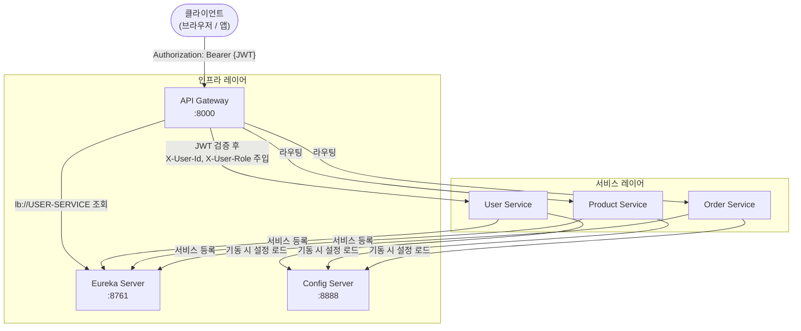
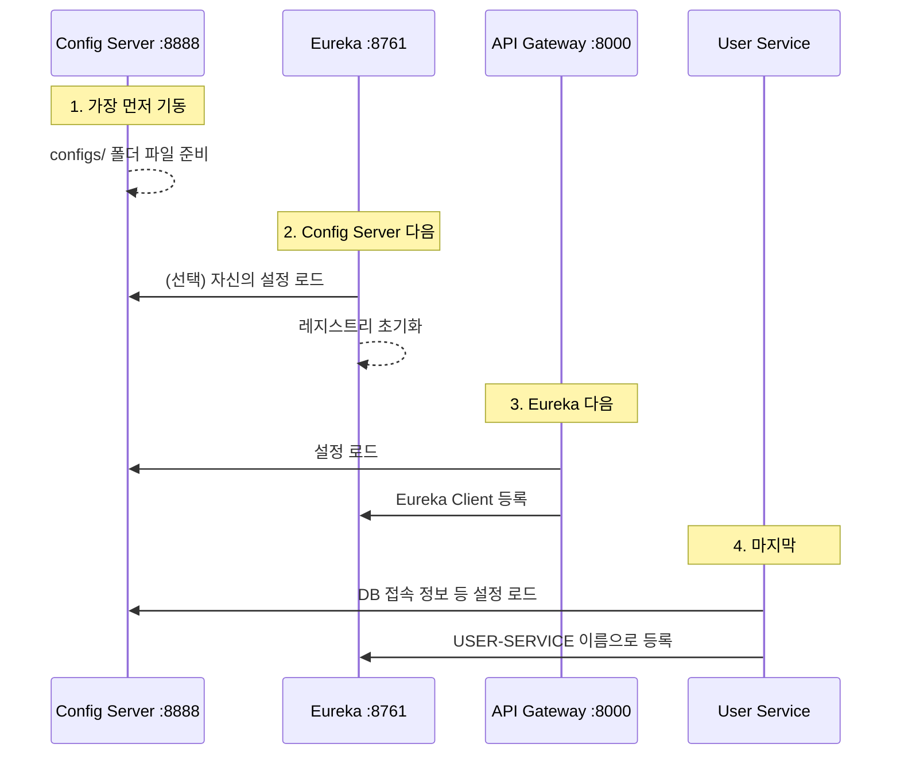
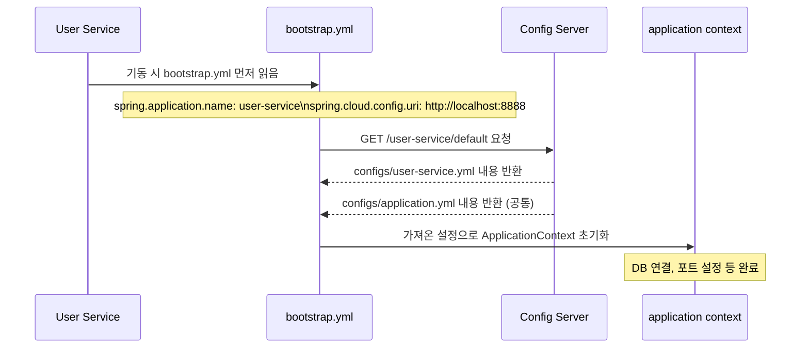
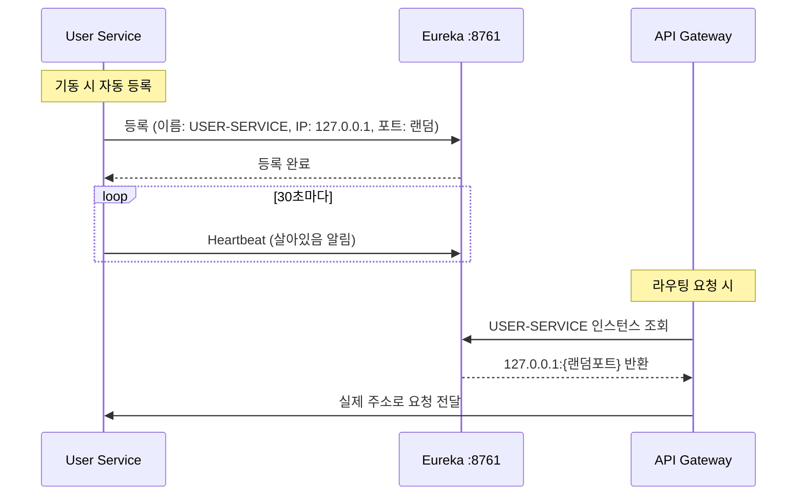
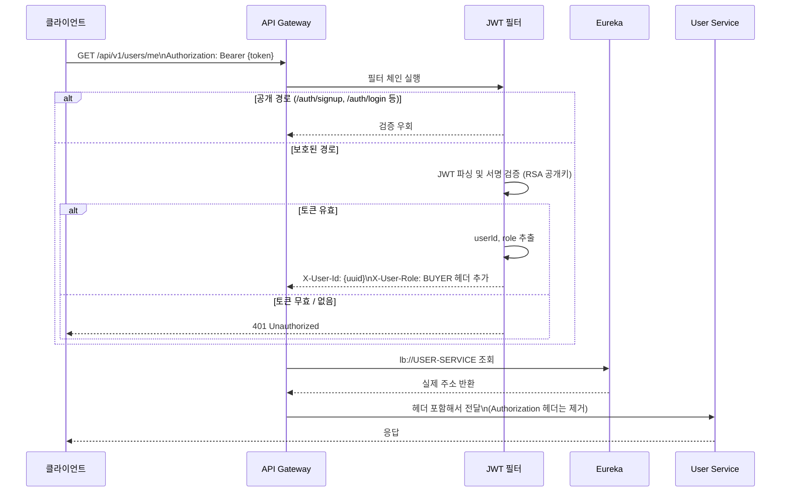

# Spring Cloud 아키텍처

이 프로젝트에서 Spring Cloud 3개 컴포넌트가 어떻게 동작하는지 설명한다.

---

## 전체 구조



---

## 기동 순서

반드시 아래 순서로 기동해야 한다. 순서가 틀리면 서비스가 설정을 못 읽거나 Eureka에 등록이 안 된다.



| 순서 | 모듈 | 포트 | 이유 |
|------|------|------|------|
| 1 | Config Server | 8888 | 다른 모든 서비스가 여기서 설정을 읽어옴 |
| 2 | Discovery (Eureka) | 8761 | Gateway와 서비스들이 여기에 등록함 |
| 3 | API Gateway | 8000 | Eureka가 살아있어야 lb:// 라우팅 가능 |
| 4 | 각 서비스 | - | Config + Eureka 모두 필요 |

---

## Config Server 동작 방식

서비스가 기동할 때 자신의 설정을 Config Server에서 가져온다.



**핵심**: `spring.config.import`로 Config Server를 지정하면(예: `optional:configserver:http://localhost:8888`) 별도의 `bootstrap.yml` 없이도 애플리케이션 초기 단계에서 원격 설정을 로드한다.

**Config Server가 관리하는 파일 구조**:
```
config/configs/
├── application.yml        # 모든 서비스 공통 (Eureka 주소 등)
├── user-service.yml       # user-service 전용 (feature flag, 외부 서비스 URL 등)
├── product-service.yml
└── ...
```

---

## Eureka 서비스 등록·조회 흐름



**`lb://USER-SERVICE`의 의미**: "Eureka에서 USER-SERVICE 이름으로 등록된 인스턴스를 찾아서 로드밸런싱"

---

## API Gateway 요청 처리 흐름



**다운스트림 서비스(user-service 등)가 받는 헤더**:
- `X-User-Id`: 사용자 UUID (예: `550e8400-e29b-41d4-a716-446655440000`)
- `X-User-Role`: 역할 (예: `BUYER`, `SELLER`, `ADMIN`)
- 각 서비스는 JWT를 직접 파싱하지 않고 이 헤더만 읽으면 된다.

---

## 포트 및 URL 정리

| 모듈 | 포트 | 주요 URL |
|------|------|----------|
| Config Server | 8888 | `http://localhost:8888/{서비스명}/default` |
| Eureka | 8761 | `http://localhost:8761` (대시보드) |
| API Gateway | 8000 | `http://localhost:8000/api/v1/...` |
| User Service | 랜덤 | Eureka 대시보드에서 확인 |

---

## 자주 겪는 문제

| 증상 | 원인 | 해결 |
|------|------|------|
| `Could not resolve placeholder 'DB_HOST'` | Config Server가 아직 안 떴거나 접속 실패 | Config Server 먼저 기동 |
| `No instances available for USER-SERVICE` | Eureka에 아직 서비스가 등록 안 됨 | 잠시 대기 (기동 후 ~30초) |
| Gateway에서 `401` 계속 반환 | 화이트리스트 경로 누락 | Gateway 필터 화이트리스트 확인 |
| Eureka 대시보드에 서비스 안 보임 | Eureka Client 의존성 누락 또는 URL 오타 | `eureka.client.service-url` 설정 확인 |
| `Unable to connect to Config Server` | bootstrap.yml 위치 오류 또는 포트 오타 | `spring.cloud.config.uri: http://localhost:8888` 확인 |
