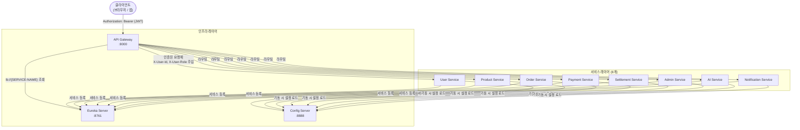
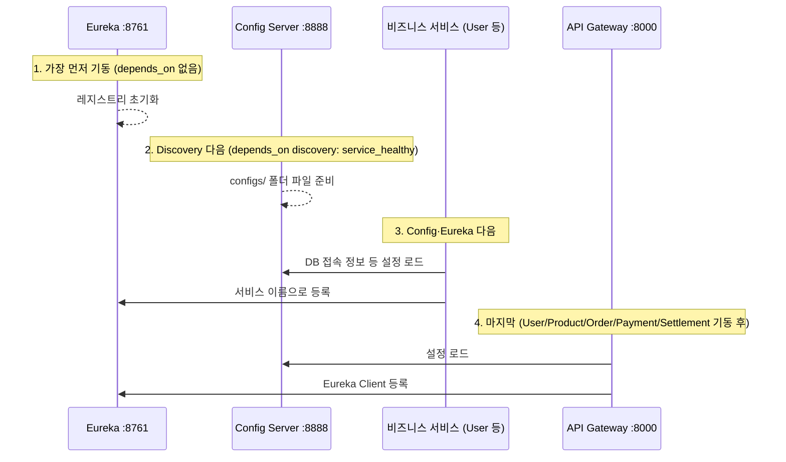
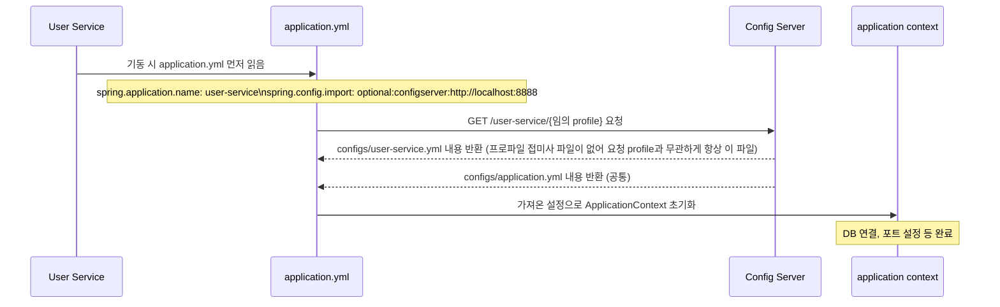
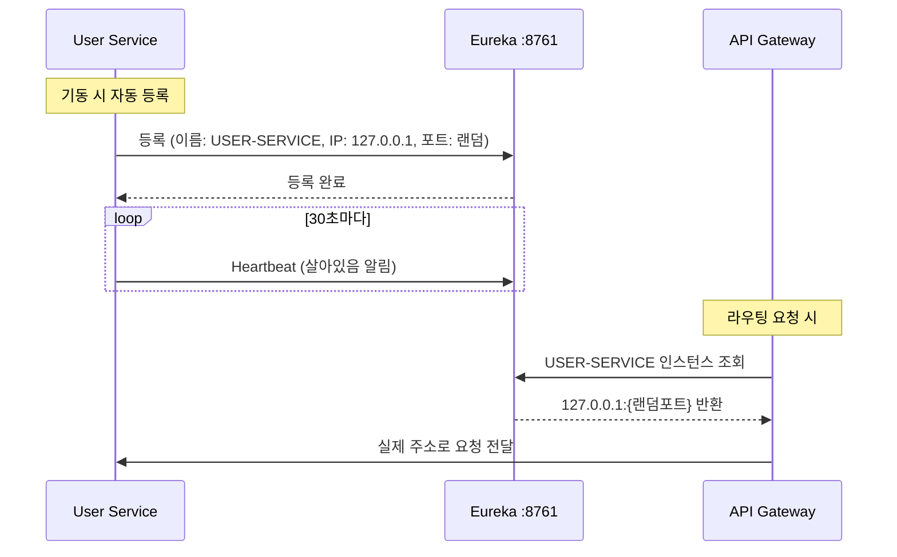
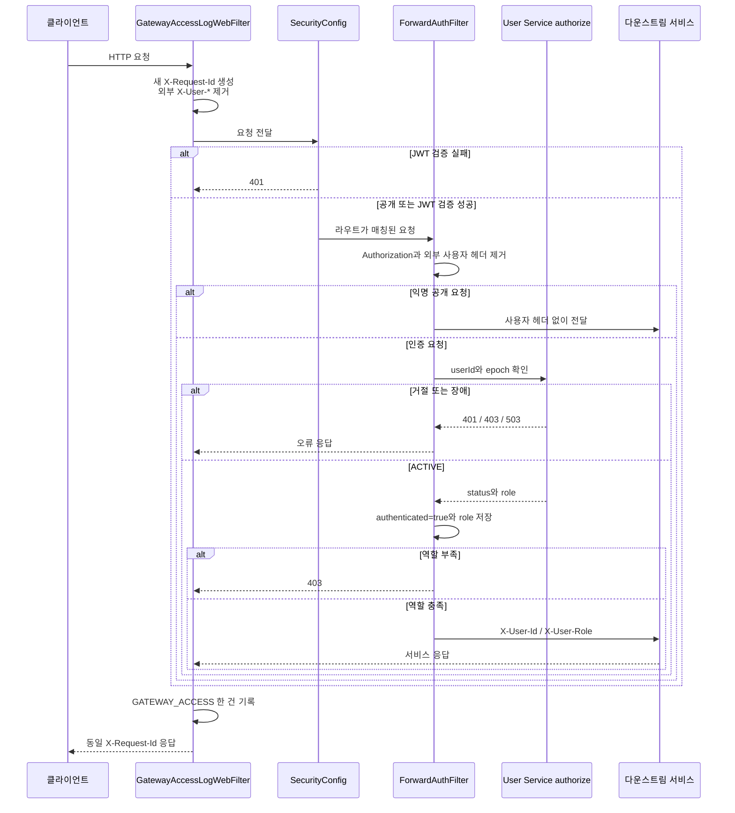

# Spring Cloud 아키텍처

이 프로젝트에서 Spring Cloud 3개 컴포넌트가 어떻게 동작하는지 설명한다.

---

## 전체 구조


```mermaid
flowchart TD
    Client(["클라이언트\n(브라우저 / 앱)"])

    subgraph infra["인프라 레이어"]
        GW["API Gateway\n:8000"]
        EUR["Eureka Server\n:8761"]
        CFG["Config Server\n:8888"]
    end

    subgraph services["서비스 레이어 (8개)"]
        US["User Service"]
        PS["Product Service"]
        OS["Order Service"]
        PayS["Payment Service"]
        SetS["Settlement Service"]
        AdmS["Admin Service"]
        AIS["AI Service"]
        NotS["Notification Service"]
    end

    Client -->|"Authorization: Bearer {JWT}"| GW
    GW -->|"인증된 요청에\nX-User-Id, X-User-Role 주입"| US
    GW -->|라우팅| PS
    GW -->|라우팅| OS
    GW -->|라우팅| PayS
    GW -->|라우팅| SetS
    GW -->|라우팅| AdmS
    GW -->|라우팅| AIS
    GW -->|라우팅| NotS

    GW -->|"lb://{SERVICE-NAME} 조회"| EUR
    US -->|서비스 등록| EUR
    PS -->|서비스 등록| EUR
    OS -->|서비스 등록| EUR
    PayS -->|서비스 등록| EUR
    SetS -->|서비스 등록| EUR
    AdmS -->|서비스 등록| EUR
    AIS -->|서비스 등록| EUR
    NotS -->|서비스 등록| EUR

    US -->|"기동 시 설정 로드"| CFG
    PS -->|"기동 시 설정 로드"| CFG
    OS -->|"기동 시 설정 로드"| CFG
    PayS -->|"기동 시 설정 로드"| CFG
    SetS -->|"기동 시 설정 로드"| CFG
    AdmS -->|"기동 시 설정 로드"| CFG
    AIS -->|"기동 시 설정 로드"| CFG
    NotS -->|"기동 시 설정 로드"| CFG
```

> User/Product/Order/Payment/Settlement/Admin/AI/Notification 8개 서비스 모두 Eureka client·
> Config client 의존성을 갖는다. Admin/Order/Payment/Product/Settlement/Notification/User
> 7개는 `build.gradle`의 공통 서비스 블록(주석은 "비즈니스 서비스 6개"이나 실제로는 7개 프로젝트가
> 나열돼 있음 — 주석 자체가 stale)에서 두 의존성을 받고, AI Service는 이 블록에 없어
> `ai-service/build.gradle`에 두 의존성을 직접 선언한다. Discovery·Config Server는 config client를
> 붙이지 않는다(Discovery는 Eureka server, Config는 config server 역할만 한다).

---

## 기동 순서

`docker-compose.yml`의 `depends_on` 체인 기준 실제 순서는 아래와 같다. **Config Server가 아니라
Discovery가 가장 먼저 기동하고, API Gateway는 가장 마지막에 기동한다** — Config Server 관점
서술(Config→Discovery→Gateway→서비스)과 반대다. 순서가 틀리면 서비스가 설정을 못 읽거나 Eureka에
등록이 안 된다.


```mermaid
sequenceDiagram
    participant EUR as Eureka :8761
    participant CFG as Config Server :8888
    participant SVC as 비즈니스 서비스 (User 등)
    participant GW as API Gateway :8000

    Note over EUR: 1. 가장 먼저 기동 (depends_on 없음)
    EUR-->>EUR: 레지스트리 초기화

    Note over CFG: 2. Discovery 다음 (depends_on discovery: service_healthy)
    CFG-->>CFG: configs/ 폴더 파일 준비

    Note over SVC: 3. Config·Eureka 다음
    SVC->>CFG: DB 접속 정보 등 설정 로드
    SVC->>EUR: 서비스 이름으로 등록

    Note over GW: 4. 마지막 (User/Product/Order/Payment/Settlement 기동 후)
    GW->>CFG: 설정 로드
    GW->>EUR: Eureka Client 등록
```

| 순서 | 모듈 | 포트 | 이유(`docker-compose.yml`의 `depends_on` 근거) |
|------|------|------|------|
| 1 | Discovery (Eureka) | 8761 | `depends_on`이 없는 유일한 Spring Cloud 코어 컴포넌트 — 가장 먼저 기동 |
| 2 | Config Server | 8888 | `depends_on: discovery: condition: service_healthy` |
| 3 | User Service | 8081 | `discovery`·`config` healthy 필요. Product/Order/Settlement가 이후 이 서비스에 의존 |
| 4 | Product Service, Payment Service | 8082, 8084 | Product는 `depends_on: user-service` 추가, Payment는 Discovery·Config만 필요 |
| 5 | Order Service, Settlement Service | 8083, 8085 | 둘 다 `depends_on: user-service, product-service` |
| 6 | Admin Service | 8086 | `depends_on: settlement-service`(정산 스키마 소유자, `ddl-auto: none`) |
| 7 | API Gateway | 8000 | `depends_on: user/product/order/payment/settlement-service` 5개 전부 — 가장 늦게 기동 |

> AI Service·Notification Service는 Eureka/Config client 의존성은 갖지만, 현재 `docker-compose.yml`
> 자체에 서비스로 정의돼 있지 않다(k8s 매니페스트 `k8s/base/services/ai/`, `k8s/base/services/notification/`에는
> 있음). 따라서 위 로컬 compose 기동 순서에는 포함되지 않는다.

---

## Config Server 동작 방식

서비스가 기동할 때 자신의 설정을 Config Server에서 가져온다.


```mermaid
sequenceDiagram
    participant SVC as User Service
    participant APP as application.yml
    participant CFG as Config Server
    participant CTX as application context

    SVC->>APP: 기동 시 application.yml 먼저 읽음
    Note over APP: spring.application.name: user-service\nspring.config.import: optional:configserver:http://localhost:8888

    APP->>CFG: GET /user-service/{임의 profile} 요청
    CFG-->>APP: configs/user-service.yml 내용 반환 (프로파일 접미사 파일이 없어 요청 profile과 무관하게 항상 이 파일)
    CFG-->>APP: configs/application.yml 내용 반환 (공통)

    APP->>CTX: 가져온 설정으로 ApplicationContext 초기화
    Note over CTX: DB 연결, 포트 설정 등 완료
```

**핵심**: `spring.config.import`로 Config Server를 지정하면(예: `optional:configserver:http://localhost:8888`) 별도의 `bootstrap.yml` 없이도 애플리케이션 초기 단계에서 원격 설정을 로드한다.

**Config Server가 관리하는 파일 구조** — `config/src/main/resources/configs/`(native/classpath 서빙, `spring.cloud.config.server.native.search-locations: classpath:/configs/`). 팀 지시사항상 별도 설정 리포는 만들 수 없어 이 리포 안 config 모듈이 유일한 소스다:
```
config/src/main/resources/configs/
├── application.yml            # 모든 서비스 공통 (Eureka 클라이언트, actuator 노출, Gateway route-policies)
├── admin-service.yml
├── ai-service.yml
├── notification-service.yml
├── order-service.yml
├── payment-service.yml
├── product-service.yml
├── settlement-service.yml
└── user-service.yml
```
**프로파일 접미사(`-dev`, `-local` 등)가 붙은 파일은 없다** — 전부 기본형태(`{service}.yml`) 하나뿐이다. Spring Cloud Config의 native 백엔드는 `{application}.yml`을 프로파일과 무관하게 항상 포함하고, `{application}-{profile}.yml`이 실제로 존재할 때만 그 위에 덮어쓴다 — 여기서는 그 프로파일별 파일 자체가 없으므로 어떤 profile로 요청하든 이 기본 파일이 그대로 나간다. 즉 지금은 "환경별로 값을 가르는" 계층이 config server 쪽엔 없고, DB 접속 정보 등은 서비스별 파일에 `${환경변수}` 플레이스홀더로만 들어 있어 실제 값은 그 값을 주입하는 쪽(docker-compose의 `environment` 등)에서 결정된다.

> 참고: 과거에는 서비스 5개(apigateway/product/order/payment/settlement)의 `application.yml`이
> `spring.profiles.default: local`을 선언했다. 배포 환경은 `SPRING_PROFILES_ACTIVE`를 지정하지
> 않으므로 이 기본값 때문에 Config Server의 default 프로파일 대신 local 프로파일이 활성화되어
> order-service가 postgres 컨테이너 대신 `localhost:5432`로 접속을 시도하다 크래시-재시작을 반복하는
> 장애가 있었고, 커밋 `a1f5a355`(`fix: 배포 환경에서 local 프로파일이 강제 활성화되는
> spring.profiles.default 제거`)에서 5개 서비스 모두에서 이 선언을 삭제했다. **지금은 어떤 서비스의
> `application.yml`에도 `spring.profiles.default`가 없다** — 로컬 개발 시 `SPRING_PROFILES_ACTIVE=local`을
> 명시적으로 지정해야 한다. `docker-compose.yml`에도 `SPRING_PROFILES_ACTIVE`가 지정된 곳이 없다.
> 실제로 확실히 존재하고 동작하는 프로파일은 **`test`** 뿐이다 — apigateway와 8개 비즈니스 서비스
> (user/product/order/payment/settlement/admin/ai/notification-service) 총 9개 모듈 전부
> `src/test/resources/application-test.yml`을 갖고 있고, 여기서 `spring.cloud.config.enabled: false`
> 등으로 빌드·CI 시 외부 인프라 의존을 끈다.

---

## Eureka 서비스 등록·조회 흐름


```mermaid
sequenceDiagram
    participant SVC as User Service
    participant EUR as Eureka :8761
    participant GW as API Gateway

    Note over SVC: 기동 시 자동 등록
    SVC->>EUR: 등록 (이름: USER-SERVICE, IP: 127.0.0.1, 포트: 랜덤)
    EUR-->>SVC: 등록 완료

    loop 30초마다
        SVC->>EUR: Heartbeat (살아있음 알림)
    end

    Note over GW: 라우팅 요청 시
    GW->>EUR: USER-SERVICE 인스턴스 조회
    EUR-->>GW: 127.0.0.1:{랜덤포트} 반환
    GW->>SVC: 실제 주소로 요청 전달
```

**`lb://USER-SERVICE`의 의미**: "Eureka에서 USER-SERVICE 이름으로 등록된 인스턴스를 찾아서 로드밸런싱"

---

## API Gateway 요청 처리 흐름

요청 추적, JWT 검증과 내부 계정·역할 확인은 서로 다른 컴포넌트가 담당한다.

1. `GatewayAccessLogWebFilter`가 Security보다 먼저 실행되어 요청 ID를 생성하고 전체 요청을 감싼다.
2. `SecurityConfig`의 OAuth2 Resource Server가 보호 경로의 JWT 서명과 만료를 검증한다.
3. 라우트가 매칭되면 `ForwardAuthFilter`가 `SecurityContext`의 JWT subject와 epoch로 User Service 내부 authorize API를 호출한다.
4. authorize 결과가 ACTIVE이면 실제 역할을 기록한 뒤 역할 정책을 검사한다.
5. 허용된 요청만 신뢰 사용자 헤더를 주입해 다운스트림으로 전달한다.
6. 최종 응답, 예외 또는 취소 시 요청당 `GATEWAY_ACCESS` 로그를 한 건 기록한다.


```mermaid
sequenceDiagram
    participant C as 클라이언트
    participant AL as GatewayAccessLogWebFilter
    participant SEC as SecurityConfig
    participant FWD as ForwardAuthFilter
    participant AUTH as User Service authorize
    participant SVC as 다운스트림 서비스

    C->>AL: HTTP 요청
    AL->>AL: 새 X-Request-Id 생성<br/>외부 X-User-* 제거
    AL->>SEC: 요청 전달

    alt JWT 검증 실패
        SEC-->>AL: 401
    else 공개 또는 JWT 검증 성공
        SEC->>FWD: 라우트가 매칭된 요청
        FWD->>FWD: Authorization과 외부 사용자 헤더 제거
        alt 익명 공개 요청
            FWD->>SVC: 사용자 헤더 없이 전달
        else 인증 요청
            FWD->>AUTH: userId와 epoch 확인
            alt 거절 또는 장애
                AUTH-->>FWD: 401 / 403 / 503
                FWD-->>AL: 오류 응답
            else ACTIVE
                AUTH-->>FWD: status와 role
                FWD->>FWD: authenticated=true와 role 저장
                alt 역할 부족
                    FWD-->>AL: 403
                else 역할 충족
                    FWD->>SVC: X-User-Id / X-User-Role
                    SVC-->>AL: 서비스 응답
                end
            end
        end
    end

    AL->>AL: GATEWAY_ACCESS 한 건 기록
    AL-->>C: 동일 X-Request-Id 응답
```

다운스트림 서비스가 받는 헤더는 다음과 같다.

- `X-Request-Id`: Gateway가 생성한 UUID. 외부 값을 그대로 사용하지 않는다.
- `X-User-Id`: 내부 authorize가 성공한 사용자의 JWT subject.
- `X-User-Role`: 내부 authorize가 반환한 단일 역할 `BUYER`, `SELLER`, `ADMIN`.
- `Authorization`: Gateway 이후에는 전달하지 않는다.

Access 로그는 `eventType`, `service`, `requestId`, `method`, query 없는 `path`, `routeId`, `status`, `durationMs`, `authenticated`, 선택적 `userRole`, `clientIp`, 선택적 `exceptionType`을 JSON 최상위에 기록한다. 정상 응답은 2xx·3xx INFO, 4xx WARN, 5xx ERROR 정책을 따른다. Spring WebFlux의 `ErrorResponse` 예외는 내장 HTTP status와 그 status에 맞는 level을 사용하고 `exceptionType`을 유지한다. 그 밖의 예외는 500 ERROR이며, 클라이언트 취소는 다른 failure 존재 여부와 무관하게 499 WARN이다.

헬스 체크(`/actuator/health/**`, `/liveness`, `/readiness`)는 access 로그에서 제외한다. `Authorization`, Cookie, userId, query string과 요청·응답 본문은 기록하지 않는다.

---

## 포트 및 URL 정리

| 모듈 | 포트 | 주요 URL |
|------|------|----------|
| Config Server | 8888 | `http://localhost:8888/{서비스명}/default` (어떤 profile을 넣어도 같은 파일이 나감 — 위 섹션 참고) |
| Eureka | 8761 | `http://localhost:8761` (대시보드) |
| API Gateway | 8000 (local 직접 접속) | `http://localhost:8000/api/v1/...` |
| User / Product / Order / Payment / Settlement Service | HTTP + gRPC 쌍 (예: user 8081/9081, product 8082/9082 — `docker-compose.yml` 기준) | Eureka 대시보드에서 확인 — 정확한 현재 값은 `docker-compose.yml`이 원본이다 |
| Admin Service | HTTP만 (gRPC 없음, 8086) | 위와 동일 |
| AI Service | HTTP만, 18087(gRPC 서버는 없고 User Service를 gRPC 클라이언트로 호출) | `docker-compose.yml`에는 정의돼 있지 않음 — `config/src/main/resources/configs/ai-service.yml`, `k8s/base/services/ai/deployment.yaml`이 원본이다 |
| Notification Service | HTTP만 (gRPC 없음, 18088) | 위와 동일 — `config/src/main/resources/configs/notification-service.yml`, `k8s/base/services/notification/deployment.yaml`이 원본이다 |

> 개발서버(AWS EC2) 배포 시 외부 진입점은 **host 80 → container 8000**으로 매핑된다
> (`docker-compose.yml`의 `apigateway.ports: ["80:8000"]`, SG 80만 오픈). 그 외 서비스 포트는
> 전부 `127.0.0.1` loopback 노출(헬스체크·SSH 터널용, 외부 직접 접근 차단)이다. 이 표의 포트
> 숫자는 바뀔 수 있으므로, 항상 `docker-compose.yml`과 `config/src/main/resources/configs/`를
> 최종 근거로 확인할 것.

---

## 자주 겪는 문제

| 증상 | 원인 | 해결 |
|------|------|------|
| `Could not resolve placeholder 'DB_HOST'` | Discovery·Config Server가 아직 안 떴거나 접속 실패 | Discovery → Config Server 순서로 먼저 기동 확인 |
| `No instances available for USER-SERVICE` | Eureka에 아직 서비스가 등록 안 됨 | 잠시 대기 (기동 후 ~30초) |
| Gateway에서 `401` 계속 반환 | 화이트리스트 경로 누락 | Gateway 필터 화이트리스트 확인 |
| Eureka 대시보드에 서비스 안 보임 | Eureka Client 의존성 누락 또는 URL 오타 | `eureka.client.service-url` 설정 확인 |
| `Unable to connect to Config Server` | `spring.config.import` 설정 오류 또는 포트 오타 | `spring.config.import: optional:configserver:http://localhost:8888` 확인 |
| 유효한 토큰인데 Gateway에서 403 | 내부 authorize 결과가 비활성이거나 현재 역할이 경로 정책보다 낮음 | User Service 계정 상태와 `gateway.route-policies` 확인 |
| 다운스트림에서 사용자 역할을 인식하지 못함 | `X-User-Role`은 내부 authorize가 반환한 `BUYER`, `SELLER`, `ADMIN` 단일 값 | 서비스 enum과 Gateway 역할 계약 확인 |
| Config Server 파일 수정했는데 로컬 `curl`에는 반영, 배포 환경엔 미반영 | native(classpath) 서빙 특성상 "커밋 ≠ 반영" — `configs/`는 config server 이미지에 빌드 시 포함되므로, 이미지가 재빌드·재배포돼야 서빙 내용이 바뀐다 | config 모듈 재빌드·재배포 여부 확인, 이후 값을 쓰는 서비스 재시작 여부 확인 |
