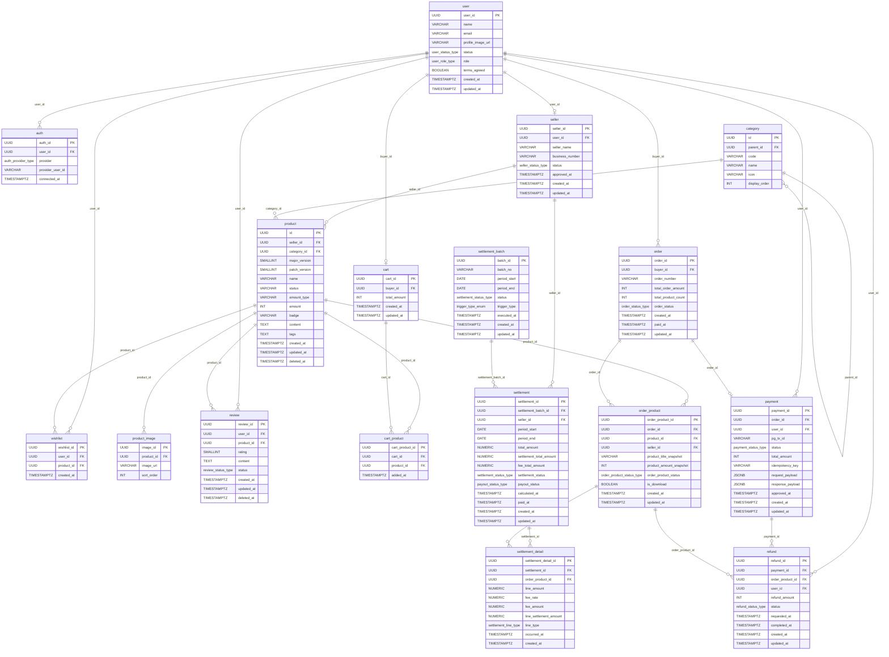

# 전체 ERD 다이어그램

서비스 경계별로 색을 구분해 표기. 실선은 FK 참조, 점선은 논리적 연관(명시적 FK 제약 없음).

```mermaid
erDiagram
    %% ───────────────────────────────
    %% User Service
    %% ───────────────────────────────
    user {
        UUID user_id PK
        VARCHAR name
        VARCHAR email
        VARCHAR profile_image_url
        user_status_type status
        user_role_type role
        BOOLEAN terms_agreed
        TIMESTAMPTZ created_at
        TIMESTAMPTZ updated_at
    }
    auth {
        UUID auth_id PK
        UUID user_id FK
        auth_provider_type provider
        VARCHAR provider_user_id
        TIMESTAMPTZ connected_at
    }
    seller {
        UUID seller_id PK
        UUID user_id FK
        VARCHAR seller_name
        VARCHAR business_number
        seller_status_type status
        TIMESTAMPTZ approved_at
        TIMESTAMPTZ created_at
        TIMESTAMPTZ updated_at
    }
    wishlist {
        UUID wishlist_id PK
        UUID user_id FK
        UUID product_id FK
        TIMESTAMPTZ created_at
    }

    %% ───────────────────────────────
    %% Product Service
    %% ───────────────────────────────
    category {
        UUID id PK
        UUID parent_id FK
        VARCHAR code
        VARCHAR name
        VARCHAR icon
        INT display_order
    }
    product {
        UUID id PK
        UUID seller_id FK
        UUID category_id FK
        SMALLINT major_version
        SMALLINT patch_version
        VARCHAR name
        VARCHAR status
        VARCHAR amount_type
        INT amount
        VARCHAR badge
        TEXT content
        TEXT tags
        TIMESTAMPTZ created_at
        TIMESTAMPTZ updated_at
        TIMESTAMPTZ deleted_at
    }
    product_image {
        UUID image_id PK
        UUID product_id FK
        VARCHAR image_url
        INT sort_order
    }
    review {
        UUID review_id PK
        UUID user_id FK
        UUID product_id FK
        SMALLINT rating
        TEXT content
        review_status_type status
        TIMESTAMPTZ created_at
        TIMESTAMPTZ updated_at
        TIMESTAMPTZ deleted_at
    }

    %% ───────────────────────────────
    %% Order Service
    %% ───────────────────────────────
    cart {
        UUID cart_id PK
        UUID buyer_id FK
        INT total_amount
        TIMESTAMPTZ created_at
        TIMESTAMPTZ updated_at
    }
    cart_product {
        UUID cart_product_id PK
        UUID cart_id FK
        UUID product_id FK
        TIMESTAMPTZ added_at
    }
    order {
        UUID order_id PK
        UUID buyer_id FK
        VARCHAR order_number
        INT total_order_amount
        INT total_product_count
        order_status_type order_status
        TIMESTAMPTZ created_at
        TIMESTAMPTZ paid_at
        TIMESTAMPTZ updated_at
    }
    order_product {
        UUID order_product_id PK
        UUID order_id FK
        UUID product_id FK
        UUID seller_id FK
        VARCHAR product_title_snapshot
        INT product_amount_snapshot
        order_product_status_type order_product_status
        BOOLEAN is_download
        TIMESTAMPTZ created_at
        TIMESTAMPTZ updated_at
    }

    %% ───────────────────────────────
    %% Payment Service
    %% ───────────────────────────────
    payment {
        UUID payment_id PK
        UUID order_id FK
        UUID user_id FK
        VARCHAR pg_tx_id
        payment_status_type status
        INT total_amount
        VARCHAR idempotency_key
        JSONB request_payload
        JSONB response_payload
        TIMESTAMPTZ approved_at
        TIMESTAMPTZ created_at
        TIMESTAMPTZ updated_at
    }
    refund {
        UUID refund_id PK
        UUID payment_id FK
        UUID order_product_id FK
        UUID user_id FK
        INT refund_amount
        refund_status_type status
        TIMESTAMPTZ requested_at
        TIMESTAMPTZ completed_at
        TIMESTAMPTZ created_at
        TIMESTAMPTZ updated_at
    }

    %% ───────────────────────────────
    %% Settlement Service
    %% ───────────────────────────────
    settlement_batch {
        UUID batch_id PK
        VARCHAR batch_no
        DATE period_start
        DATE period_end
        settlement_status_type status
        trigger_type_enum trigger_type
        TIMESTAMPTZ executed_at
        TIMESTAMPTZ created_at
        TIMESTAMPTZ updated_at
    }
    settlement {
        UUID settlement_id PK
        UUID settlement_batch_id FK
        UUID seller_id FK
        DATE period_start
        DATE period_end
        NUMERIC total_amount
        NUMERIC settlement_total_amount
        NUMERIC fee_total_amount
        settlement_status_type settlement_status
        payout_status_type payout_status
        TIMESTAMPTZ calculated_at
        TIMESTAMPTZ paid_at
        TIMESTAMPTZ created_at
        TIMESTAMPTZ updated_at
    }
    settlement_detail {
        UUID settlement_detail_id PK
        UUID settlement_id FK
        UUID order_product_id FK
        NUMERIC line_amount
        NUMERIC fee_rate
        NUMERIC fee_amount
        NUMERIC line_settlement_amount
        settlement_line_type line_type
        TIMESTAMPTZ occurred_at
        TIMESTAMPTZ created_at
    }

    %% ───────────────────────────────
    %% Relationships
    %% ───────────────────────────────
    user ||--o{ auth : "user_id"
    user ||--o| seller : "user_id"
    user ||--o{ wishlist : "user_id"
    user ||--o| cart : "buyer_id"
    user ||--o{ review : "user_id"
    user ||--o{ order : "buyer_id"
    user ||--o{ payment : "user_id"
    user ||--o{ refund : "user_id"

    seller ||--o{ product : "seller_id"
    seller ||--o{ settlement : "seller_id"

    category ||--o{ category : "parent_id"
    category ||--o{ product : "category_id"

    product ||--o{ product_image : "product_id"
    product ||--o{ wishlist : "product_id"
    product ||--o{ cart_product : "product_id"
    product ||--o{ review : "product_id"
    product ||--o{ order_product : "product_id"

    cart ||--o{ cart_product : "cart_id"

    order ||--o{ order_product : "order_id"
    order ||--o| payment : "order_id"

    payment ||--o{ refund : "payment_id"
    order_product ||--o{ refund : "order_product_id"

    settlement_batch ||--o{ settlement : "settlement_batch_id"
    settlement ||--o{ settlement_detail : "settlement_id"
    order_product ||--o{ settlement_detail : "order_product_id"
```
