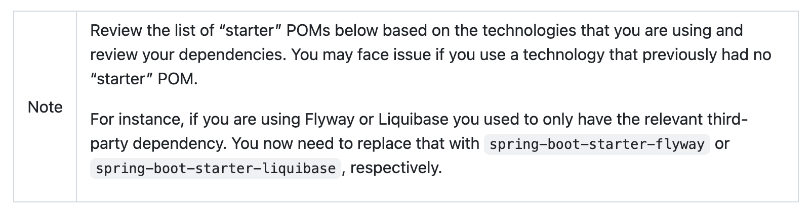

# Spring Boot 4 autoconfigure 모듈화로 flyway-core만으로는 자동설정이 안 되는 문제

**날짜**: 2026-07-14
**상태**: Resolved
**분류**: Build &amp; Dependencies / Spring Boot 4 Migration

## 환경

Spring Boot 4.1 / Flyway 12.4.0 / PostgreSQL 18.4 / Docker Compose (EC2 self-hosted)

## 증상

`build.gradle`에 `org.flywaydb:flyway-core` + `org.flywaydb:flyway-database-postgresql`를 추가하고 baseline SQL(`V1__baseline.sql`)까지 다 준비한 뒤 개발서버에 배포했는데, Flyway가 전혀 실행되지 않았다.

```
$ docker logs payment-service | grep -i flyway
(결과 없음)
```

로그에 "flyway"라는 단어가 한 글자도 안 나왔다. Hibernate `ddl-auto: validate`는 빈 스키마를 보고 계속 크래시했다.

```
Caused by: org.hibernate.tool.schema.spi.SchemaManagementException:
Schema validation: missing table [order_snapshot]
```

## 핵심: Spring Boot 4부터 `spring-boot-autoconfigure`가 기능별 모듈로 쪼개졌다

Spring Boot 3.x까지는 `org.flywaydb:flyway-core`만 클래스패스에 있으면 거대한 단일 모듈 `spring-boot-autoconfigure`가 `FlywayAutoConfiguration`을 자동으로 인식해 켰다. Spring Boot 4.0부터는 이 단일 모듈이 기능별 세분화 모듈로 쪼개졌고, Flyway 자동설정 코드(`FlywayAutoConfiguration`)는 이제 `spring-boot-autoconfigure`가 아니라 별도 모듈(`spring-boot-flyway`)에 들어있다. 이 모듈은 라이브러리(`flyway-core`)를 추가한다고 딸려오지 않고, 전용 스타터(`spring-boot-starter-flyway`)를 통해서만 클래스패스에 들어온다. 즉 "라이브러리만 있으면 자동으로 인식"되던 Boot 3.x식 습관이 더 이상 통하지 않는다.

## 조사 과정

### 1. baseline SQL이 아니라 자동설정 자체를 의심

baseline SQL 내용에도 별도 문제가 있었지만(#0004 참고), Flyway가 **시도조차 하지 않는다**는 게 이상했다. SQL 파싱 실패라면 최소한 에러 로그라도 남아야 하는데 아무 흔적이 없었다 — 자동설정 자체가 안 걸리고 있다는 신호였다.

### 2. 배포된 jar를 직접 까서 의존성 확인

실행 중인 컨테이너에서 jar를 꺼내 클래스패스를 직접 확인했다.

```bash
cid=$(docker create ghcr.io/.../prompthub-payment-service:latest)
docker cp $cid:/app/app.jar /tmp/payment-app.jar
docker rm $cid

python3 -c "
import zipfile
z = zipfile.ZipFile('/tmp/payment-app.jar')
libs = [n for n in z.namelist() if n.startswith('BOOT-INF/lib/')]
print([n for n in libs if 'flyway' in n.lower()])
"
# ['BOOT-INF/lib/flyway-core-12.4.0.jar', 'BOOT-INF/lib/flyway-database-postgresql-12.4.0.jar']
```

의존성 자체는 클래스패스에 정상적으로 있었다. 즉 "라이브러리가 없어서"가 아니라 "있어도 자동설정이 안 걸리는" 문제였다.

### 3. spring-boot-autoconfigure 모듈 안을 직접 검사

같은 방식으로 `spring-boot-autoconfigure-4.1.0.jar`를 꺼내서 그 안에 Flyway 관련 클래스나 자동설정 등록 파일이 있는지 뒤졌다.

```bash
python3 -c "
import zipfile
z = zipfile.ZipFile('/tmp/autoconf-extract/BOOT-INF/lib/spring-boot-autoconfigure-4.1.0.jar')
names = z.namelist()
print([n for n in names if 'flyway' in n.lower()])  # []
imports = z.read('META-INF/spring/org.springframework.boot.autoconfigure.AutoConfiguration.imports').decode()
print('lyway' in imports)  # False
"
```

`spring-boot-autoconfigure` 모듈 안에 Flyway 관련 클래스도, 자동설정 등록 항목도 **전혀 없었다**. 이 모듈 자체에 Flyway 자동설정 코드가 없다는 것을 직접 확인한 결정적 증거였다.

### 4. `--debug` Condition Evaluation Report로 재확인

확실히 하려고 임시 컨테이너를 debug 모드로 띄워 전체 조건 평가 리포트를 받았다.

```bash
docker run --rm --network ... --env-file /tmp/payment-env.txt \
  --entrypoint java ghcr.io/.../prompthub-payment-service:latest \
  -jar /app/app.jar --debug > /tmp/payment-debug.log 2>&1
```

이 리포트는 애플리케이션 컨텍스트 초기화가 완전히 끝나야(성공이든 실패든) 통째로 flush된다는 걸 모르고 처음엔 로그 파일이 0줄이라 당황했다 — 컨테이너가 종료되는 시점에 한꺼번에 수천 줄이 나타났다. 전체 리포트를 확보한 뒤 확인해보니 Positive matches, Negative matches 어디에도 "flyway"라는 단어가 없었다. `FlywayAutoConfiguration` 자체가 자동설정 후보 목록에 올라와 있지 않다는 뜻이었다.

### 5. 웹 검색으로 원인 확정

Spring Boot 공식 블로그("Modularizing Spring Boot", 2025-10-28)와 github을 확인해 Spring Boot 4의 모듈화 방침을 확정했다: 각 기능이 자기 전용 스타터를 갖고, 그 스타터를 통해서만 해당 기능의 자동설정 모듈이 클래스패스에 들어온다.

cf.

- [https://spring.io/blog/2025/10/28/modularizing-spring-boot](https://spring.io/blog/2025/10/28/modularizing-spring-boot)
- [https://github.com/spring-projects/spring-boot/wiki/Spring-Boot-4.0-Migration-Guide](https://github.com/spring-projects/spring-boot/wiki/Spring-Boot-4.0-Migration-Guide)




### 6. 스타터 교체 후 재확인

```groovy
implementation 'org.springframework.boot:spring-boot-starter-flyway'
```

로 바꾼 뒤 같은 방식으로 jar를 까 보니, `spring-boot-flyway-4.1.0.jar` 안에 정확히 등록되어 있었다.

```bash
$ python3 -c "... z.read('META-INF/spring/org.springframework.boot.autoconfigure.AutoConfiguration.imports').decode()"
org.springframework.boot.flyway.autoconfigure.FlywayAutoConfiguration
org.springframework.boot.flyway.autoconfigure.FlywayEndpointAutoConfiguration
```

`--debug` 리포트에도 매치 로그가 나타났다.

```
FlywayAutoConfiguration matched:
   - @ConditionalOnClass found required class 'org.flywaydb.core.Flyway' (OnClassCondition)
   - @ConditionalOnBooleanProperty (spring.flyway.enabled=true) matched (OnPropertyCondition)
```

## 해결

루트 `build.gradle`의 6개 서비스 공통 의존성 블록에서 원시 라이브러리 의존성을 스타터로 교체했다.

```groovy
// Before
implementation 'org.flywaydb:flyway-core'
runtimeOnly 'org.flywaydb:flyway-database-postgresql'

// After
implementation 'org.springframework.boot:spring-boot-starter-flyway'
runtimeOnly 'org.flywaydb:flyway-database-postgresql'
```

## 검증

`./gradlew :payment-service:dependencies --configuration runtimeClasspath`로 `spring-boot-flyway` 모듈이 전이 의존성에 포함되는 것을 확인. 배포 후 처음으로 Flyway가 마이그레이션을 시도하는 로그가 나타났다.

```
org.flywaydb.core.FlywayExecutor : Database: jdbc:postgresql://postgres:5432/prompthub?currentSchema=payment_service (PostgreSQL 18.4)
```

## 교훈 / 재발 방지

- Spring Boot 4로 올라가는 프로젝트에서 "예전 방식(원시 라이브러리 의존성)대로 썼는데 자동설정이 아예 안 걸린다"는 증상을 만나면, 먼저 그 기능의 전용 스타터가 Boot 4에서 새로 생겼는지 확인한다. Flyway·Liquibase처럼 예전엔 라이브러리만으로 충분했던 기능들이 전부 스타터 필요로 바뀌었을 가능성이 높다.
- 자동설정이 전혀 안 걸리는 미스터리를 만나면, 로그나 문서보다 "그 모듈의 jar를 직접 까서 `META-INF/spring/org.springframework.boot.autoconfigure.AutoConfiguration.imports`에 원하는 클래스가 등록되어 있는지" 확인하는 게 가장 빠르고 확실하다.
- `--debug` Condition Evaluation Report는 컨텍스트 초기화가 끝나야 전체가 flush된다. 로그를 리다이렉트해서 볼 때 초반에 파일이 비어 보여도 조급해하지 말고 완료까지 기다린다.

