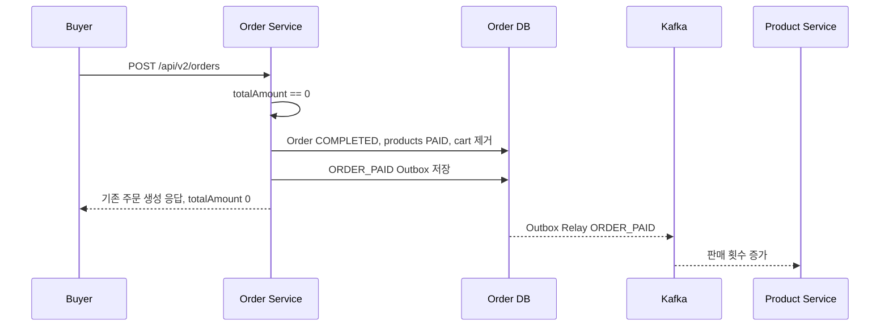

# Free Orders and Payment Ready Removal Implementation Plan

> **For agentic workers:** REQUIRED SUB-SKILL: Use superpowers:subagent-driven-development (recommended) or superpowers:executing-plans to implement this plan task-by-task. Steps use checkbox (`- [ ]`) syntax for tracking.

**Goal:** `POST /api/v2/orders`에서 0원 주문을 즉시 완료하고 기존 구매 권한과 `ORDER_PAID` 흐름을 활성화하는 동시에 사용하지 않는 `payment-ready` API를 제거한다.

**Architecture:** 금액·상태 전이는 도메인 규칙으로 고정하고, `OrderCreator`가 주문·장바구니·무료 주문 Outbox를 한 트랜잭션으로 처리한다. 무료 주문과 결제 승인 주문은 하나의 `OrderPaidOutboxAppender`를 공유하며, 총액이 양수인 혼합·유료 주문은 기존 Payment 승인 흐름을 유지한다.

**Tech Stack:** Java 21, Spring Boot 4.1.0, Spring Web MVC, Spring Data JPA, QueryDSL, PostgreSQL/H2, Kafka Outbox, Redis, JUnit 5, Mockito, MockMvc, Gradle Groovy DSL

## Global Constraints

- 요구사항 원문 `Backend - 0원 상품 주문 생성 및 즉시 구매 완료 처리 지원.md`와 승인된 `docs/superpowers/specs/2026-07-22-free-orders-and-payment-ready-removal-design.md`를 기준으로 한다.
- 개별 상품 금액 0은 허용하고 음수, 빈 목록, null item, overflow는 `V001`로 거부한다.
- 합계 0 주문만 즉시 `COMPLETED/PAID`로 전환한다.
- 무료·유료 혼합 주문은 합계가 양수이므로 전체를 `CREATED/PENDING`으로 유지한다.
- 접근 가능한 무료 상품 중복 구매는 `O018 ORDER_PRODUCT_ALREADY_OWNED`, HTTP 409로 거부한다.
- O018은 기존 스키마에서 일반적인 순차 재요청을 차단하며, 다중 인스턴스 완전 동시 요청의 strict idempotency는 이번 범위가 아니다.
- 무료 주문은 기존 `ORDER_PAID` topic, key, eventType, payload 계약을 그대로 사용한다.
- 무료 주문에는 `OrderCreatedEvent`, Redis 만료 예약, Payment 승인·환불 요청을 만들지 않는다.
- 무료 상품은 환불 불가이며 유료 상품의 기존 환불 흐름은 유지한다.
- `ORDER_PAYMENT_AMOUNT_MISMATCH(O014)`는 유지하고 API 전용 `ORDER_EXPIRED(O015)`만 제거한다.
- `POST /api/v2/orders/{orderId}/payment-ready`는 제거 후 404를 반환해야 한다.
- Product Service, Payment Service, Settlement Service, Frontend 코드는 수정하지 않는다.
- 무관한 리팩터링, formatting, `report.md`의 기존 충돌 표식은 수정하지 않는다.
- 작업 위치는 `order-service`이며 Gradle 명령은 `../gradlew :order-service:...`를 사용한다.
- 사용자가 실행 단계에서 커밋을 명시적으로 요청하지 않으면 stage와 commit 단계는 건너뛴다.

---

## File Map

### 금액과 도메인

- Create: `src/test/java/com/prompthub/order/application/service/order/OrderAmountCalculatorTest.java`
- Modify: `src/main/java/com/prompthub/order/application/service/order/OrderAmountCalculator.java`
- Modify: `src/test/java/com/prompthub/order/domain/model/OrderTest.java`
- Modify: `src/main/java/com/prompthub/order/domain/model/Order.java`

### ORDER_PAID 조립

- Create: `src/test/java/com/prompthub/order/application/service/event/OrderPaidOutboxAppenderTest.java`
- Create: `src/main/java/com/prompthub/order/application/service/event/OrderPaidOutboxAppender.java`
- Modify: `src/test/java/com/prompthub/order/application/service/event/PaymentApprovedProcessorTest.java`
- Modify: `src/main/java/com/prompthub/order/application/service/event/PaymentApprovedProcessor.java`

### 무료 주문 생성과 접근 권한

- Modify: `src/test/java/com/prompthub/order/application/service/order/OrderCreatorTest.java`
- Modify: `src/test/java/com/prompthub/order/application/service/order/OrderPolicyServiceTest.java`
- Modify: `src/test/java/com/prompthub/order/application/service/order/OrderCreationTransactionIntegrationTest.java`
- Modify: `src/test/java/com/prompthub/order/infra/persistence/order/SettlementOrderQueryRepositoryImplTest.java`
- Modify: `src/test/java/com/prompthub/order/presentation/OrderControllerTest.java`
- Modify: `src/main/java/com/prompthub/order/application/service/order/OrderCreator.java`
- Modify: `src/main/java/com/prompthub/order/global/exception/ErrorCode.java`

### 무료 환불 차단

- Modify: `src/test/java/com/prompthub/order/domain/model/OrderProductTest.java`
- Modify: `src/test/java/com/prompthub/order/application/service/refund/OrderRefundServiceTest.java`
- Modify: `src/test/java/com/prompthub/order/application/service/order/OrderQueryServiceTest.java`
- Modify: `src/test/java/com/prompthub/order/infra/persistence/OrderPersistenceImplTest.java`
- Modify: `src/test/java/com/prompthub/order/fixture/OrderFixture.java`
- Modify: `src/main/java/com/prompthub/order/domain/model/OrderProduct.java`
- Modify: `src/main/java/com/prompthub/order/application/service/order/OrderPolicyService.java`
- Modify: `src/main/java/com/prompthub/order/application/dto/OrderListProjection.java`
- Modify: `src/main/java/com/prompthub/order/infra/persistence/order/OrderPersistenceImpl.java`
- Modify: `src/main/java/com/prompthub/order/application/service/order/OrderQueryService.java`

### Payment Ready 제거

- Modify: `src/test/java/com/prompthub/order/presentation/OrderControllerTest.java`
- Modify: `src/test/java/com/prompthub/order/application/service/order/OrderQueryServiceTest.java`
- Modify: `src/main/java/com/prompthub/order/presentation/OrderController.java`
- Modify: `src/main/java/com/prompthub/order/application/usecase/OrderQueryUseCase.java`
- Modify: `src/main/java/com/prompthub/order/application/service/order/OrderQueryService.java`
- Delete: `src/main/java/com/prompthub/order/presentation/dto/request/OrderPaymentValidationRequest.java`
- Delete: `src/main/java/com/prompthub/order/presentation/dto/response/OrderPaymentValidationResponse.java`

### 문서

- Modify: `../docs/api-spec/order.md`
- Modify: `../docs/architecture/event-flow.md`
- Modify: `../docs/architecture/order-usecase-detail.md`
- Modify: `AGENTS.md`
- Modify: `report.md`
- Existing: `docs/superpowers/specs/2026-07-22-free-orders-and-payment-ready-removal-design.md`
- Create: `docs/superpowers/plans/2026-07-22-free-orders-and-payment-ready-removal.md`

---

### Task 1: 0원 금액과 무료 주문 도메인 전이

**Files:**

- Create: `src/test/java/com/prompthub/order/application/service/order/OrderAmountCalculatorTest.java`
- Modify: `src/main/java/com/prompthub/order/application/service/order/OrderAmountCalculator.java:19-36`
- Modify: `src/test/java/com/prompthub/order/domain/model/OrderTest.java:31-52`
- Modify: `src/main/java/com/prompthub/order/domain/model/Order.java:72-119`

**Interfaces:**

- Consumes: `OrderAmountCalculator.sum(List<T>, ToIntFunction<T>)`, `Order.markCompleted()`
- Produces: `Order.isFree(): boolean`, `Order.completeFreeOrder(): void`, 합계 0을 허용하는 calculator

- [ ] **Step 1: 금액 경계 테스트 작성**

다음 테스트 파일을 생성한다.

```java
package com.prompthub.order.application.service.order;

import com.prompthub.order.global.exception.ErrorCode;
import com.prompthub.order.global.exception.OrderException;
import org.junit.jupiter.api.Test;

import java.util.Arrays;
import java.util.List;

import static org.assertj.core.api.Assertions.assertThat;
import static org.assertj.core.api.Assertions.assertThatThrownBy;

class OrderAmountCalculatorTest {

	@Test
	void sum_zeroAmounts_returnsZero() {
		assertThat(OrderAmountCalculator.sum(List.of(0, 0), Integer::intValue)).isZero();
	}

	@Test
	void sum_mixedZeroAndPositive_returnsPositiveTotal() {
		assertThat(OrderAmountCalculator.sum(List.of(0, 10_000), Integer::intValue)).isEqualTo(10_000);
	}

	@Test
	void sum_negativeAmount_throwsInvalidInput() {
		assertThatThrownBy(() -> OrderAmountCalculator.sum(List.of(-1), Integer::intValue))
			.isInstanceOf(OrderException.class)
			.hasFieldOrPropertyWithValue("errorCode", ErrorCode.INVALID_INPUT_VALUE);
	}

	@Test
	void sum_emptyItems_throwsInvalidInput() {
		assertThatThrownBy(() -> OrderAmountCalculator.sum(List.<Integer>of(), Integer::intValue))
			.isInstanceOf(OrderException.class)
			.hasFieldOrPropertyWithValue("errorCode", ErrorCode.INVALID_INPUT_VALUE);
	}

	@Test
	void sum_nullItem_throwsInvalidInput() {
		assertThatThrownBy(() -> OrderAmountCalculator.sum(
			Arrays.asList((Integer) null),
			Integer::intValue
		))
			.isInstanceOf(OrderException.class)
			.hasFieldOrPropertyWithValue("errorCode", ErrorCode.INVALID_INPUT_VALUE);
	}

	@Test
	void sum_overflow_throwsInvalidInput() {
		assertThatThrownBy(() -> OrderAmountCalculator.sum(
			List.of(Integer.MAX_VALUE, 1),
			Integer::intValue
		))
			.isInstanceOf(OrderException.class)
			.hasFieldOrPropertyWithValue("errorCode", ErrorCode.INVALID_INPUT_VALUE);
	}
}
```

- [ ] **Step 2: calculator RED 확인**

Run:

```bash
../gradlew :order-service:test --tests 'com.prompthub.order.application.service.order.OrderAmountCalculatorTest'
```

Expected: `sum_zeroAmounts_returnsZero`와 `sum_mixedZeroAndPositive_returnsPositiveTotal`이 기존 `itemAmount <= 0` 검증 때문에 `OrderException`으로 실패한다.

- [ ] **Step 3: 0원 허용 최소 구현**

`OrderAmountCalculator`의 조건 한 줄만 변경한다.

```diff
-			if (itemAmount <= 0) {
+			if (itemAmount < 0) {
				throw invalidInput();
			}
```

- [ ] **Step 4: calculator GREEN 확인**

Run:

```bash
../gradlew :order-service:test --tests 'com.prompthub.order.application.service.order.OrderAmountCalculatorTest'
```

Expected: `BUILD SUCCESSFUL`; 0원과 혼합 합계는 성공하고 음수·빈 목록·null item·overflow는 계속 V001이다.

- [ ] **Step 5: 무료 주문 도메인 RED 테스트 작성**

`OrderTest`에 다음 테스트를 추가한다.

```java
	@Test
	void completeFreeOrder_zeroAmount_completesOrderAndProducts() {
		Order order = Order.create(BUYER_ID, ORDER_NUMBER, 0);
		OrderProduct product = OrderProduct.create(
			PRODUCT_ID_1, SELLER_ID_1, PRODUCT_TITLE_1, 0
		);
		order.addOrderProduct(product);

		order.completeFreeOrder();

		assertThat(order.isFree()).isTrue();
		assertThat(order.getOrderStatus()).isEqualTo(OrderStatus.COMPLETED);
		assertThat(order.getCompletedAt()).isNotNull();
		assertThat(product.getOrderStatus()).isEqualTo(OrderProductStatus.PAID);
	}

	@Test
	void completeFreeOrder_positiveAmount_rejectsWithoutMutation() {
		Order order = Order.create(BUYER_ID, ORDER_NUMBER, PRODUCT_AMOUNT_1);
		OrderProduct product = createOrderProduct1();
		order.addOrderProduct(product);

		assertThatThrownBy(order::completeFreeOrder)
			.isInstanceOf(OrderException.class)
			.hasFieldOrPropertyWithValue("errorCode", ErrorCode.INVALID_ORDER_STATUS_TRANSITION);

		assertThat(order.isFree()).isFalse();
		assertThat(order.getOrderStatus()).isEqualTo(OrderStatus.CREATED);
		assertThat(order.getCompletedAt()).isNull();
		assertThat(product.getOrderStatus()).isEqualTo(OrderProductStatus.PENDING);
	}
```

`SELLER_ID_1`, `PRODUCT_ID_1`, `PRODUCT_TITLE_1` static import를 기존 fixture import 목록에 추가한다.

- [ ] **Step 6: 도메인 RED 확인**

Run:

```bash
../gradlew :order-service:test --tests 'com.prompthub.order.domain.model.OrderTest'
```

Expected: `isFree`와 `completeFreeOrder`가 아직 없어 test compilation이 실패한다.

- [ ] **Step 7: 무료 주문 도메인 메서드 구현**

`Order`의 `markCompleted` 메서드 앞에 다음 메서드를 추가한다.

```java
    public boolean isFree() {
        return this.totalOrderAmount == 0;
    }

    public void completeFreeOrder() {
        if (!isFree()) {
            throw new OrderException(ErrorCode.INVALID_ORDER_STATUS_TRANSITION);
        }
        markCompleted();
    }
```

- [ ] **Step 8: 도메인 GREEN과 인접 회귀 확인**

Run:

```bash
../gradlew :order-service:test \
  --tests 'com.prompthub.order.domain.model.OrderTest' \
  --tests 'com.prompthub.order.application.service.order.OrderAmountCalculatorTest' \
  --tests 'com.prompthub.order.domain.enums.OrderStatusTest' \
  --tests 'com.prompthub.order.domain.enums.OrderProductStatusTest'
```

Expected: `BUILD SUCCESSFUL`; 기존 CREATED→COMPLETED 전이도 유지된다.

- [ ] **Step 9: 사용자가 커밋을 요청한 실행에서만 도메인 커밋 생성**

```bash
git add \
  src/main/java/com/prompthub/order/application/service/order/OrderAmountCalculator.java \
  src/main/java/com/prompthub/order/domain/model/Order.java \
  src/test/java/com/prompthub/order/application/service/order/OrderAmountCalculatorTest.java \
  src/test/java/com/prompthub/order/domain/model/OrderTest.java
git commit -m "feat: order-service 0원 주문 도메인 전이 추가"
```

---

### Task 2: 공용 ORDER_PAID Outbox Appender 추출

**Files:**

- Create: `src/test/java/com/prompthub/order/application/service/event/OrderPaidOutboxAppenderTest.java`
- Create: `src/main/java/com/prompthub/order/application/service/event/OrderPaidOutboxAppender.java`
- Modify: `src/test/java/com/prompthub/order/application/service/event/PaymentApprovedProcessorTest.java:3-17,64-86,88-198,240-352`
- Modify: `src/main/java/com/prompthub/order/application/service/event/PaymentApprovedProcessor.java:3-18,31-75`

**Interfaces:**

- Consumes: 완료된 `Order`, `OrderPaidPayload.from(Order)`, `OrderEventMessageFactory`, `OutboxEventAppender`
- Produces: `OrderPaidOutboxAppender.append(Order): void`

- [ ] **Step 1: Appender RED 테스트 작성**

다음 파일을 생성한다.

```java
package com.prompthub.order.application.service.event;

import com.prompthub.common.event.EventMessage;
import com.prompthub.order.application.service.event.outbox.OutboxEventAppender;
import com.prompthub.order.domain.model.Order;
import com.prompthub.order.infra.messaging.kafka.event.OrderPaidPayload;
import org.junit.jupiter.api.Test;
import org.junit.jupiter.api.extension.ExtendWith;
import org.mockito.ArgumentCaptor;
import org.mockito.InjectMocks;
import org.mockito.Mock;
import org.mockito.junit.jupiter.MockitoExtension;

import java.time.LocalDateTime;
import java.util.UUID;

import static com.prompthub.order.fixture.PaymentEventFixture.APPROVED_AT;
import static com.prompthub.order.fixture.PaymentEventFixture.createdOrder;
import static org.assertj.core.api.Assertions.assertThat;
import static org.mockito.ArgumentMatchers.any;
import static org.mockito.ArgumentMatchers.eq;
import static org.mockito.BDDMockito.given;
import static org.mockito.BDDMockito.then;

@ExtendWith(MockitoExtension.class)
class OrderPaidOutboxAppenderTest {

	@Mock
	private OrderEventMessageFactory messageFactory;
	@Mock
	private OutboxEventAppender outboxEventAppender;
	@InjectMocks
	private OrderPaidOutboxAppender orderPaidOutboxAppender;

	@Test
	void append_buildsCurrentOrderPaidPayloadAndStoresMessage() {
		Order order = createdOrder();
		order.markCompleted(APPROVED_AT);
		EventMessage<OrderPaidPayload> message = new EventMessage<>(
			UUID.randomUUID(), "ORDER_PAID", LocalDateTime.now(),
			"ORDER", order.getId(), OrderPaidPayload.from(order)
		);
		given(messageFactory.createOrderPaidMessage(eq(order.getId()), any())).willReturn(message);

		orderPaidOutboxAppender.append(order);

		ArgumentCaptor<OrderPaidPayload> payloadCaptor = ArgumentCaptor.forClass(OrderPaidPayload.class);
		then(messageFactory).should().createOrderPaidMessage(eq(order.getId()), payloadCaptor.capture());
		assertThat(payloadCaptor.getValue().orderId()).isEqualTo(order.getId());
		assertThat(payloadCaptor.getValue().totalOrderAmount()).isEqualTo(order.getTotalOrderAmount());
		assertThat(payloadCaptor.getValue().products()).hasSameSizeAs(order.getOrderProducts());
		then(outboxEventAppender).should().append(message);
	}
}
```

- [ ] **Step 2: Appender RED 확인**

```bash
../gradlew :order-service:test --tests 'com.prompthub.order.application.service.event.OrderPaidOutboxAppenderTest'
```

Expected: `OrderPaidOutboxAppender`가 존재하지 않아 test compilation이 실패한다.

- [ ] **Step 3: Appender 최소 구현**

다음 파일을 생성한다.

```java
package com.prompthub.order.application.service.event;

import com.prompthub.common.event.EventMessage;
import com.prompthub.order.application.service.event.outbox.OutboxEventAppender;
import com.prompthub.order.domain.model.Order;
import com.prompthub.order.infra.messaging.kafka.event.OrderPaidPayload;
import lombok.RequiredArgsConstructor;
import org.springframework.stereotype.Component;

@Component
@RequiredArgsConstructor
public class OrderPaidOutboxAppender {

	private final OrderEventMessageFactory messageFactory;
	private final OutboxEventAppender outboxEventAppender;

	public void append(Order order) {
		EventMessage<OrderPaidPayload> message = messageFactory.createOrderPaidMessage(
			order.getId(),
			OrderPaidPayload.from(order)
		);
		outboxEventAppender.append(message);
	}
}
```

- [ ] **Step 4: Appender GREEN 확인**

```bash
../gradlew :order-service:test --tests 'com.prompthub.order.application.service.event.OrderPaidOutboxAppenderTest'
```

Expected: `BUILD SUCCESSFUL`.

- [ ] **Step 5: PaymentApprovedProcessor가 공용 Appender를 사용하도록 변경**

`PaymentApprovedProcessor`에서 `OrderEventMessageFactory`, `OutboxEventAppender`, `OrderPaidPayload`, `EventMessage` import와 두 field를 제거하고 다음 field를 추가한다.

```java
	private final OrderPaidOutboxAppender orderPaidOutboxAppender;
```

기존 Outbox 조립 블록을 다음 한 줄로 바꾼다.

```diff
-			EventMessage<OrderPaidPayload> message = orderEventMessageFactory.createOrderPaidMessage(
-				order.getId(),
-				OrderPaidPayload.from(order)
-			);
-			outboxEventAppender.append(message);
+			orderPaidOutboxAppender.append(order);
```

`PaymentApprovedProcessorTest`에서는 Factory와 raw Appender mock을 다음 mock 하나로 교체한다.

```java
	@Mock
	private OrderPaidOutboxAppender orderPaidOutboxAppender;
```

테스트의 검증도 다음 규칙으로 기계적으로 교체한다.

```diff
-then(orderEventMessageFactory).should().createOrderPaidMessage(eq(ORDER_A), any());
-then(outboxEventAppender).should().append(any());
+then(orderPaidOutboxAppender).should().append(order);
```

완료·환불 상태와 실패 경로에서는 다음 검증을 사용한다.

```java
then(orderPaidOutboxAppender).shouldHaveNoInteractions();
```

`InOrder`에는 `orderPaidOutboxAppender`를 넣고 cart 저장 다음, processed event 저장 전에 `append(order)`가 호출되는지 검증한다. `stubOrderPaidMessage()` helper와 더 이상 사용하지 않는 `EventMessage`, `OrderPaidPayload`, `ArgumentCaptor`, `eq` import를 제거한다.

- [ ] **Step 6: 결제 승인 회귀 확인**

```bash
../gradlew :order-service:test \
  --tests 'com.prompthub.order.application.service.event.OrderPaidOutboxAppenderTest' \
  --tests 'com.prompthub.order.application.service.event.PaymentApprovedProcessorTest' \
  --tests 'com.prompthub.order.application.service.event.PaymentEventTransactionIntegrationTest'
```

Expected: `BUILD SUCCESSFUL`; O014 금액 불일치, 멱등성, cart 제거, cleanup 정책은 그대로다.

- [ ] **Step 7: 사용자가 커밋을 요청한 실행에서만 Outbox 추출 커밋 생성**

```bash
git add \
  src/main/java/com/prompthub/order/application/service/event/OrderPaidOutboxAppender.java \
  src/main/java/com/prompthub/order/application/service/event/PaymentApprovedProcessor.java \
  src/test/java/com/prompthub/order/application/service/event/OrderPaidOutboxAppenderTest.java \
  src/test/java/com/prompthub/order/application/service/event/PaymentApprovedProcessorTest.java
git commit -m "refactor: order-service ORDER_PAID Outbox 조립 통합"
```

---

### Task 3: 무료 주문 생성·중복 방지·접근 권한

**Files:**

- Modify: `src/test/java/com/prompthub/order/application/service/order/OrderCreatorTest.java:3-245`
- Modify: `src/test/java/com/prompthub/order/application/service/order/OrderPolicyServiceTest.java:94-193`
- Modify: `src/test/java/com/prompthub/order/application/service/order/OrderCreationTransactionIntegrationTest.java:1-180`
- Modify: `src/test/java/com/prompthub/order/infra/persistence/order/SettlementOrderQueryRepositoryImplTest.java:1-144`
- Modify: `src/test/java/com/prompthub/order/presentation/OrderControllerTest.java:1-94`
- Modify: `src/main/java/com/prompthub/order/application/service/order/OrderCreator.java:1-58`
- Modify: `src/main/java/com/prompthub/order/global/exception/ErrorCode.java:32-40`

**Interfaces:**

- Consumes: `Order.isFree`, `Order.completeFreeOrder`, `OrderPaidOutboxAppender.append`, `OrderRepository.findAccessiblePaidProductIdsByBuyerId`
- Produces: 무료 주문 `COMPLETED/PAID`, O018 중복 충돌, 무료 주문 ORDER_PAID Outbox, 유료 주문 OrderCreatedEvent

- [ ] **Step 1: snapshot 0원 허용 RED 테스트로 기존 테스트 전환**

`OrderPolicyServiceTest.zeroProductAmount_throwsStableOrderException`을 다음 성공 테스트로 교체하고 음수 테스트를 추가한다.

```java
		@Test
		@DisplayName("상품 금액이 0이면 스냅샷 검증에 성공한다")
		void zeroProductAmount_success() {
			List<ProductOrderSnapshot> snapshots = List.of(new ProductOrderSnapshot(
				PRODUCT_ID_1, SELLER_ID_1, PRODUCT_TITLE_1,
				PRODUCT_TYPE_PROMPT, PRODUCT_MODEL, 0
			));

			orderPolicyService.validateProductSnapshots(List.of(PRODUCT_ID_1), snapshots);
		}

		@Test
		@DisplayName("상품 금액이 음수이면 V001 예외가 발생한다")
		void negativeProductAmount_throwsInvalidInput() {
			List<ProductOrderSnapshot> snapshots = List.of(new ProductOrderSnapshot(
				PRODUCT_ID_1, SELLER_ID_1, PRODUCT_TITLE_1,
				PRODUCT_TYPE_PROMPT, PRODUCT_MODEL, -1
			));

			assertThatThrownBy(() -> orderPolicyService.validateProductSnapshots(List.of(PRODUCT_ID_1), snapshots))
				.isInstanceOf(OrderException.class)
				.hasFieldOrPropertyWithValue("errorCode", ErrorCode.INVALID_INPUT_VALUE);
		}
```

Task 1 구현 후 이 테스트는 바로 GREEN이어야 한다. 실행해 snapshot 계층에서도 0원 허용이 전달되는지 확인한다.

```bash
../gradlew :order-service:test --tests 'com.prompthub.order.application.service.order.OrderPolicyServiceTest$ValidateProductSnapshots'
```

Expected: `BUILD SUCCESSFUL`.

- [ ] **Step 2: OrderCreator 무료·혼합·중복 RED 테스트 작성**

`OrderCreatorTest`에 `OrderPaidOutboxAppender` mock을 추가하고 기존 zero 예외 테스트를 다음 세 테스트로 교체한다.

```java
	@Mock
	private OrderPaidOutboxAppender orderPaidOutboxAppender;

	@Test
	@DisplayName("0원 주문은 즉시 완료하고 ORDER_PAID Outbox를 저장하며 만료 이벤트를 발행하지 않는다")
	void freeOrder_completesAndAppendsPaidOutboxWithoutExpirationEvent() {
		stubSuccessfulCreation();
		given(orderNumberGenerator.generate()).willReturn("ORD-FREE");
		given(orderRepository.findAccessiblePaidProductIdsByBuyerId(BUYER_ID)).willReturn(List.of());
		List<OrderItem> items = List.of(
			new OrderItem(PRODUCT_A1, SELLER_A, REQUEST_TITLE_A1, 0),
			new OrderItem(PRODUCT_A2, SELLER_A, REQUEST_TITLE_A2, 0)
		);

		CreateOrderResult result = orderCreator.create(BUYER_ID, items);

		ArgumentCaptor<Order> orderCaptor = ArgumentCaptor.forClass(Order.class);
		then(orderRepository).should().save(orderCaptor.capture());
		Order saved = orderCaptor.getValue();
		assertThat(saved.getOrderStatus()).isEqualTo(OrderStatus.COMPLETED);
		assertThat(saved.getCompletedAt()).isNotNull();
		assertThat(saved.getOrderProducts()).extracting(OrderProduct::getOrderStatus)
			.containsOnly(OrderProductStatus.PAID);
		assertThat(result.totalAmount()).isZero();
		assertThat(result.order().orderStatus()).isEqualTo(OrderStatus.COMPLETED);
		then(orderPaidOutboxAppender).should().append(saved);
		then(applicationEventPublisher).shouldHaveNoInteractions();
	}

	@Test
	@DisplayName("무료·유료 혼합 주문은 결제 전 CREATED/PENDING을 유지한다")
	void mixedOrder_remainsCreatedUntilPaymentApproval() {
		stubSuccessfulCreation();
		given(orderNumberGenerator.generate()).willReturn("ORD-MIXED");
		given(orderRepository.findAccessiblePaidProductIdsByBuyerId(BUYER_ID)).willReturn(List.of());
		List<OrderItem> items = List.of(
			new OrderItem(PRODUCT_A1, SELLER_A, REQUEST_TITLE_A1, 0),
			new OrderItem(PRODUCT_A2, SELLER_A, REQUEST_TITLE_A2, AMOUNT_A2)
		);

		CreateOrderResult result = orderCreator.create(BUYER_ID, items);

		assertThat(result.totalAmount()).isEqualTo(AMOUNT_A2);
		assertThat(result.order().orderStatus()).isEqualTo(OrderStatus.CREATED);
		assertThat(result.order().products()).extracting(CreateOrderResult.Product::orderProductStatus)
			.containsOnly(OrderProductStatus.PENDING);
		then(orderPaidOutboxAppender).shouldHaveNoInteractions();
		then(applicationEventPublisher).should().publishEvent(any(OrderCreatedEvent.class));
	}

	@Test
	@DisplayName("이미 접근 가능한 무료 상품이면 O018이고 부수효과가 없다")
	void duplicatedAccessibleFreeProduct_throwsConflictWithoutSideEffects() {
		given(orderRepository.findAccessiblePaidProductIdsByBuyerId(BUYER_ID))
			.willReturn(List.of(PRODUCT_A1));
		List<OrderItem> items = List.of(
			new OrderItem(PRODUCT_A1, SELLER_A, REQUEST_TITLE_A1, 0)
		);

		assertThatThrownBy(() -> orderCreator.create(BUYER_ID, items))
			.isInstanceOf(OrderException.class)
			.hasFieldOrPropertyWithValue("errorCode", ErrorCode.ORDER_PRODUCT_ALREADY_OWNED);

		then(orderRepository).should().findAccessiblePaidProductIdsByBuyerId(BUYER_ID);
		then(orderRepository).shouldHaveNoMoreInteractions();
		then(orderNumberGenerator).shouldHaveNoInteractions();
		then(cartRepository).shouldHaveNoInteractions();
		then(orderPaidOutboxAppender).shouldHaveNoInteractions();
		then(applicationEventPublisher).shouldHaveNoInteractions();
	}
```

`OrderPaidOutboxAppender` import와 `shouldHaveNoMoreInteractions` 사용에 필요한 기존 Mockito API를 정리한다.

- [ ] **Step 3: 무료 주문 단위 RED 확인**

```bash
../gradlew :order-service:test --tests 'com.prompthub.order.application.service.order.OrderCreatorTest'
```

Expected: 무료 주문이 아직 `CREATED/PENDING`이고 Outbox 호출이 없으며 `ORDER_PRODUCT_ALREADY_OWNED`가 없어 compilation 또는 assertion 실패가 발생한다.

- [ ] **Step 4: 트랜잭션·접근 권한 RED 테스트 작성**

`OrderCreationTransactionIntegrationTest`에 `OrderQueryUseCase`, `OrderPaidOutboxAppender` spy를 추가한다.

```java
	@Autowired
	private OrderQueryUseCase orderQueryUseCase;

	@MockitoSpyBean
	private OrderPaidOutboxAppender orderPaidOutboxAppender;
```

다음 helper를 추가한다.

```java
	private List<ProductOrderSnapshot> freeSnapshots() {
		return shuffledSnapshots().stream()
			.map(snapshot -> new ProductOrderSnapshot(
				snapshot.productId(), snapshot.sellerId(), snapshot.title(),
				snapshot.productType(), snapshot.model(), 0
			))
			.toList();
	}
```

다음 테스트를 추가한다.

```java
	@Test
	@DisplayName("무료 주문은 완료·장바구니 제거·ORDER_PAID Outbox·구매 권한을 한 트랜잭션으로 반영한다")
	void freeOrderCompletesAndGrantsAccessAtomically() {
		saveCart();
		given(productClient.getOrderSnapshots(requestedProductIds())).willReturn(freeSnapshots());

		CreateOrderResult result = orderCommandHandler.createOrder(BUYER_ID, command());

		Order saved = orderRepository.findByIdWithOrderProducts(result.order().orderId()).orElseThrow();
		assertThat(result.totalAmount()).isZero();
		assertThat(saved.getOrderStatus()).isEqualTo(OrderStatus.COMPLETED);
		assertThat(saved.getCompletedAt()).isNotNull();
		assertThat(saved.getOrderProducts()).extracting(OrderProduct::getOrderStatus)
			.containsOnly(OrderProductStatus.PAID);
		assertThat(outboxEventPersistence.findAll()).singleElement()
			.satisfies(event -> {
				assertThat(event.getEventType()).isEqualTo("ORDER_PAID");
				assertThat(event.getAggregateId()).isEqualTo(saved.getId());
				assertThat(event.getPayload()).contains("\"totalOrderAmount\":0");
				assertThat(event.getPayload())
					.contains(PRODUCT_A1.toString(), PRODUCT_A2.toString(), PRODUCT_B1.toString(), PRODUCT_C1.toString());
			});
		assertThat(productIds(loadCart())).containsExactly(UNRELATED_PRODUCT);
		assertThat(orderQueryUseCase.hasAccessiblePaidProduct(BUYER_ID, PRODUCT_A1)).isTrue();
		assertThat(orderQueryUseCase.getAccessiblePaidProductIds(BUYER_ID))
			.contains(PRODUCT_A1, PRODUCT_A2, PRODUCT_B1, PRODUCT_C1);
		given(productClient.getProductContent(PRODUCT_A1))
			.willReturn(new ProductContent(PRODUCT_A1, "무료 구매 콘텐츠"));
		OrderProduct firstProduct = saved.getOrderProducts().stream()
			.filter(product -> product.getProductId().equals(PRODUCT_A1))
			.findFirst()
			.orElseThrow();
		assertThat(orderQueryUseCase.getOrderContent(BUYER_ID, saved.getId(), firstProduct.getId()).content())
			.isEqualTo("무료 구매 콘텐츠");
		then(orderExpirationStore).shouldHaveNoInteractions();
	}

	@Test
	@DisplayName("무료 주문 ORDER_PAID 저장 실패는 주문·상품·장바구니를 롤백한다")
	void freeOrderOutboxFailureRollsBackOrderAndCart() {
		saveCart();
		given(productClient.getOrderSnapshots(requestedProductIds())).willReturn(freeSnapshots());
		willThrow(new RuntimeException("outbox failure"))
			.given(orderPaidOutboxAppender).append(any(Order.class));

		assertThatThrownBy(() -> orderCommandHandler.createOrder(BUYER_ID, command()))
			.isInstanceOf(RuntimeException.class)
			.hasMessageContaining("outbox failure");

		assertThat(orderPersistence.count()).isZero();
		assertThat(outboxEventPersistence.count()).isZero();
		assertThat(productIds(loadCart()))
			.containsExactlyInAnyOrder(PRODUCT_A1, PRODUCT_A2, PRODUCT_B1, PRODUCT_C1, UNRELATED_PRODUCT);
		then(orderExpirationStore).shouldHaveNoInteractions();
	}

	@Test
	@DisplayName("무료 상품 재구매는 O018이고 기존 주문과 Outbox만 유지한다")
	void duplicatedFreeOrderIsRejectedWithoutNewRows() {
		given(productClient.getOrderSnapshots(requestedProductIds())).willReturn(freeSnapshots());
		orderCommandHandler.createOrder(BUYER_ID, command());

		assertThatThrownBy(() -> orderCommandHandler.createOrder(BUYER_ID, command()))
			.isInstanceOf(OrderException.class)
			.hasFieldOrPropertyWithValue("errorCode", ErrorCode.ORDER_PRODUCT_ALREADY_OWNED);

		assertThat(orderPersistence.count()).isEqualTo(1);
		assertThat(outboxEventPersistence.count()).isEqualTo(1);
	}
```

`orderPersistence.findById(...)` 대신 fetch join port인 `orderRepository.findByIdWithOrderProducts(...)`로 `saved`를 조회해 lazy collection을 트랜잭션 밖에서 접근하지 않게 한다. 필요한 `OrderQueryUseCase`, `OrderPaidOutboxAppender`, `ProductOrderSnapshot`, `ProductContent`, `OrderStatus`, `OrderProductStatus`, `OrderException`, `ErrorCode` import를 추가하고 `tearDown`의 `reset` 목록에 `orderPaidOutboxAppender`를 추가한다.

`SettlementOrderQueryRepositoryImplTest`에는 정산 pull 계약이 무료 구매를 누락하거나 양수로 바꾸지 않는 다음 회귀 테스트를 추가한다. Settlement Service에 새로운 Kafka 소비자를 만들지 않고, 기존 `completedAt` 기반 조회가 0원 `PAID` 라인을 그대로 반환하는 정책을 고정한다.

```java
	@Test
	void findSettleableLines_includesCompletedFreeProductAsZeroPaidLine() {
		UUID freeOrderId = UUID.fromString("00000000-0000-0000-0000-000000000104");
		UUID freeProductId = UUID.fromString("00000000-0000-0000-0000-000000000204");
		LocalDateTime completedAt = JULY_START.plusDays(3);
		Order freeOrder = Order.create(BUYER_ID, "ORD-FREE", 0);
		setId(freeOrder, freeOrderId);
		freeOrder.addOrderProduct(product(freeProductId, SELLER_A_ID, 0));
		freeOrder.markCompleted(completedAt);

		entityManager.persist(freeOrder);
		entityManager.flush();
		entityManager.clear();

		assertThat(repository.findSettleableLines(JULY_START, AUGUST_START))
			.containsExactly(line(
				SettlementLineType.PAID,
				freeOrderId,
				freeProductId,
				SELLER_A_ID,
				0,
				completedAt
			));
	}
```

`OrderControllerTest`에는 기존 응답 계약과 O018 HTTP 상태를 검증하는 다음 두 테스트를 추가한다.

```java
	@Nested
	@DisplayName("주문 생성")
	class CreateOrder {

		@Test
		@DisplayName("무료 주문은 기존 응답 계약으로 200과 완료 상태를 반환한다")
		void createOrder_freeOrder_returnsCompletedResponse() throws Exception {
			com.prompthub.order.domain.model.Order order =
				com.prompthub.order.domain.model.Order.create(BUYER_ID, ORDER_NUMBER, 0);
			order.addOrderProduct(com.prompthub.order.domain.model.OrderProduct.create(
				PRODUCT_ID_1, SELLER_ID_1, PRODUCT_TITLE_1, 0
			));
			order.completeFreeOrder();
			when(createOrderUseCase.createOrder(
				eq(BUYER_ID),
				org.mockito.ArgumentMatchers.any(com.prompthub.order.application.dto.CreateOrderCommand.class)
			)).thenReturn(com.prompthub.order.application.dto.CreateOrderResult.from(order));

			mockMvc.perform(post("/api/v2/orders")
					.header(AuthHeaders.USER_ID, BUYER_ID.toString())
					.contentType(MediaType.APPLICATION_JSON)
					.content("""
						{"products":[{"productId":"%s","productTitle":"무료 상품"}]}
						""".formatted(PRODUCT_ID_1)))
				.andExpect(status().isOk())
				.andExpect(jsonPath("$.data.totalAmount").value(0))
				.andExpect(jsonPath("$.data.order.orderStatus").value("COMPLETED"))
				.andExpect(jsonPath("$.data.order.products[0].orderProductStatus").value("PAID"));
		}

		@Test
		@DisplayName("중복 무료 구매는 O018과 409를 반환한다")
		void createOrder_duplicatedFreeProduct_returnsConflict() throws Exception {
			when(createOrderUseCase.createOrder(
				eq(BUYER_ID),
				org.mockito.ArgumentMatchers.any(com.prompthub.order.application.dto.CreateOrderCommand.class)
			)).thenThrow(new OrderException(ErrorCode.ORDER_PRODUCT_ALREADY_OWNED));

			mockMvc.perform(post("/api/v2/orders")
					.header(AuthHeaders.USER_ID, BUYER_ID.toString())
					.contentType(MediaType.APPLICATION_JSON)
					.content("""
						{"products":[{"productId":"%s","productTitle":"무료 상품"}]}
						""".formatted(PRODUCT_ID_1)))
				.andExpect(status().isConflict())
				.andExpect(jsonPath("$.code").value(ErrorCode.ORDER_PRODUCT_ALREADY_OWNED.getCode()));
		}
	}
```

- [ ] **Step 5: 통합 RED 확인**

```bash
../gradlew :order-service:test --tests 'com.prompthub.order.application.service.order.OrderCreationTransactionIntegrationTest'
```

Expected: 무료 주문이 즉시 완료되지 않거나 ORDER_PAID Outbox가 없고 duplicate O018도 없어 실패한다.

- [ ] **Step 6: O018과 OrderCreator 무료 분기 구현**

`ErrorCode`에서 O017 다음, O019 전에 다음 코드를 추가한다.

```java
    ORDER_PRODUCT_ALREADY_OWNED(HttpStatus.CONFLICT, "O018", "이미 구매한 상품입니다."),
```

`OrderCreator`에 import와 field를 추가한다.

```java
import com.prompthub.order.application.service.event.OrderPaidOutboxAppender;
import com.prompthub.order.global.exception.ErrorCode;
import com.prompthub.order.global.exception.OrderException;

import java.util.HashSet;
import java.util.Set;

	private final OrderPaidOutboxAppender orderPaidOutboxAppender;
```

`create`를 다음 구조로 변경한다.

```java
	@Transactional
	public CreateOrderResult create(UUID buyerId, List<OrderItem> items) {
		int totalAmount = OrderAmountCalculator.sum(items, OrderItem::amount);
		validateNoAccessibleFreeProduct(buyerId, items);
		Order order = Order.create(buyerId, orderNumberGenerator.generate(), totalAmount);
		items.stream()
			.map(item -> OrderProduct.create(
				item.productId(),
				item.sellerId(),
				item.productTitle(),
				item.amount()
			))
			.forEach(order::addOrderProduct);

		if (order.isFree()) {
			order.completeFreeOrder();
		}

		Order savedOrder = orderRepository.save(order);
		removeOrderedProductsFromCart(buyerId, savedOrder);
		if (savedOrder.isFree()) {
			orderPaidOutboxAppender.append(savedOrder);
		} else {
			applicationEventPublisher.publishEvent(OrderCreatedEvent.from(savedOrder));
		}

		return CreateOrderResult.from(savedOrder);
	}

	private void validateNoAccessibleFreeProduct(UUID buyerId, List<OrderItem> items) {
		Set<UUID> requestedFreeProductIds = items.stream()
			.filter(item -> item.amount() == 0)
			.map(OrderItem::productId)
			.collect(java.util.stream.Collectors.toSet());
		if (requestedFreeProductIds.isEmpty()) {
			return;
		}

		Set<UUID> accessibleProductIds = new HashSet<>(
			orderRepository.findAccessiblePaidProductIdsByBuyerId(buyerId)
		);
		if (requestedFreeProductIds.stream().anyMatch(accessibleProductIds::contains)) {
			throw new OrderException(ErrorCode.ORDER_PRODUCT_ALREADY_OWNED);
		}
	}
```

- [ ] **Step 7: 무료 주문 단위·통합 GREEN 확인**

```bash
../gradlew :order-service:test \
  --tests 'com.prompthub.order.application.service.order.OrderCreatorTest' \
  --tests 'com.prompthub.order.application.service.order.OrderPolicyServiceTest' \
  --tests 'com.prompthub.order.application.service.order.OrderCreationTransactionIntegrationTest' \
  --tests 'com.prompthub.order.infra.persistence.order.SettlementOrderQueryRepositoryImplTest' \
  --tests 'com.prompthub.order.presentation.OrderControllerTest'
```

Expected: `BUILD SUCCESSFUL`; 무료 주문은 완료·Outbox·접근 권한, 혼합 주문은 CREATED, 중복은 O018이며 정산 조회에는 금액 0인 PAID 라인이 포함된다.

- [ ] **Step 8: 사용자가 커밋을 요청한 실행에서만 무료 주문 커밋 생성**

```bash
git add \
  src/main/java/com/prompthub/order/application/service/order/OrderCreator.java \
  src/main/java/com/prompthub/order/global/exception/ErrorCode.java \
  src/test/java/com/prompthub/order/application/service/order/OrderCreatorTest.java \
  src/test/java/com/prompthub/order/application/service/order/OrderPolicyServiceTest.java \
  src/test/java/com/prompthub/order/application/service/order/OrderCreationTransactionIntegrationTest.java \
  src/test/java/com/prompthub/order/infra/persistence/order/SettlementOrderQueryRepositoryImplTest.java \
  src/test/java/com/prompthub/order/presentation/OrderControllerTest.java
git commit -m "feat: order-service 0원 주문 즉시 완료 처리 추가"
```

---

### Task 4: 무료 상품 환불 차단과 목록 응답 일치

**Files:**

- Modify: `src/test/java/com/prompthub/order/domain/model/OrderProductTest.java:16-78`
- Modify: `src/test/java/com/prompthub/order/domain/model/OrderTest.java:270-340`
- Modify: `src/test/java/com/prompthub/order/application/service/refund/OrderRefundServiceTest.java:1-89`
- Modify: `src/test/java/com/prompthub/order/application/service/order/OrderPolicyServiceTest.java:259-275`
- Modify: `src/test/java/com/prompthub/order/application/service/order/OrderQueryServiceTest.java:730-778`
- Modify: `src/test/java/com/prompthub/order/fixture/OrderFixture.java:204-223`
- Modify: `src/test/java/com/prompthub/order/infra/persistence/OrderPersistenceImplTest.java:48-70`
- Modify: `src/main/java/com/prompthub/order/domain/model/OrderProduct.java:180-190`
- Modify: `src/main/java/com/prompthub/order/application/service/order/OrderPolicyService.java:103-117`
- Modify: `src/main/java/com/prompthub/order/application/dto/OrderListProjection.java:7-25`
- Modify: `src/main/java/com/prompthub/order/infra/persistence/order/OrderPersistenceImpl.java:37-52`
- Modify: `src/main/java/com/prompthub/order/application/service/order/OrderQueryService.java:180-220`

**Interfaces:**

- Consumes: 상품 금액 snapshot, 주문·주문상품 상태, 다운로드 상태
- Produces: `OrderProduct.isRefundable()`와 `OrderPolicyService.isRefundable(..., int productAmount, boolean downloaded)`의 0원 차단

- [ ] **Step 1: 무료 환불 RED 테스트 작성**

`OrderProductTest`에 다음 테스트를 추가한다.

```java
	@Test
	void paidFreeProduct_isNotRefundable() {
		OrderProduct product = OrderProduct.create(PRODUCT_ID_1, SELLER_ID_1, PRODUCT_TITLE_1, 0);
		product.markPaid();

		assertThat(product.isRefundable()).isFalse();
	}
```

`OrderTest`에 다음 테스트를 추가한다.

```java
	@Test
	void requestRefund_freeProduct_throwsNotAllowedWithoutMutation() {
		Order order = Order.create(BUYER_ID, ORDER_NUMBER, 0);
		OrderProduct product = OrderProduct.create(PRODUCT_ID_1, SELLER_ID_1, PRODUCT_TITLE_1, 0);
		order.addOrderProduct(product);
		order.completeFreeOrder();

		assertThatThrownBy(() -> order.requestRefund(List.of(product.getId())))
			.isInstanceOf(OrderException.class)
			.hasFieldOrPropertyWithValue("errorCode", ErrorCode.ORDER_REFUND_NOT_ALLOWED);

		assertThat(order.getOrderStatus()).isEqualTo(OrderStatus.COMPLETED);
		assertThat(product.getOrderStatus()).isEqualTo(OrderProductStatus.PAID);
	}
```

`OrderRefundServiceTest`에 `assertThatThrownBy`, `OrderException`, `ErrorCode` import와 다음 테스트를 추가한다.

```java
	@Test
	void requestRefund_freeProduct_rejectsWithoutOutbox() {
		Order order = Order.create(BUYER_ID, "ORD-FREE", 0);
		OrderProduct product = OrderProduct.create(UUID.randomUUID(), UUID.randomUUID(), "무료 상품", 0);
		order.addOrderProduct(product);
		order.completeFreeOrder();
		given(orderRepository.findByIdWithOrderProductsForUpdate(order.getId())).willReturn(Optional.of(order));

		assertThatThrownBy(() -> service.requestRefund(BUYER_ID, order.getId(), List.of(product.getId())))
			.isInstanceOf(OrderException.class)
			.hasFieldOrPropertyWithValue("errorCode", ErrorCode.ORDER_REFUND_NOT_ALLOWED);

		then(orderEventMessageFactory).shouldHaveNoInteractions();
		then(outboxEventAppender).shouldHaveNoInteractions();
	}
```

- [ ] **Step 2: 무료 환불 RED 확인**

```bash
../gradlew :order-service:test \
  --tests 'com.prompthub.order.domain.model.OrderProductTest' \
  --tests 'com.prompthub.order.domain.model.OrderTest' \
  --tests 'com.prompthub.order.application.service.refund.OrderRefundServiceTest'
```

Expected: 현재 `isRefundable()`가 금액을 보지 않아 무료 상품 환불 테스트가 실패한다.

- [ ] **Step 3: 도메인 무료 환불 차단 구현**

`OrderProduct.isRefundable()`을 다음과 같이 변경한다.

```java
    public boolean isRefundable() {
        return this.productAmount > 0 && isPaid() && !this.downloaded;
    }
```

`OrderPolicyService.isRefundable(Order)`도 주문 총액 조건을 추가한다.

```java
	public boolean isRefundable(Order order) {
		return order.getTotalOrderAmount() > 0
			&& order.isPaid()
			&& order.getOrderProducts().stream().noneMatch(OrderProduct::isDownloaded);
	}
```

- [ ] **Step 4: 목록 환불 가능 여부 RED 테스트와 projection 계약 변경**

`OrderPolicyServiceTest`의 세 호출에 금액 인자를 추가하고 무료 테스트를 추가한다.

```java
assertThat(orderPolicyService.isRefundable(
	OrderStatus.COMPLETED, OrderProductStatus.PAID, PRODUCT_AMOUNT_1, false
)).isTrue();

assertThat(orderPolicyService.isRefundable(
	OrderStatus.COMPLETED, OrderProductStatus.PAID, 0, false
)).isFalse();
```

`OrderQueryServiceTest`에 0원 projection이 환불 불가인지 검증한다.

```java
		@Test
		@DisplayName("완료된 0원 주문상품은 목록에서 환불 불가다")
		void getMyOrders_freeProduct_notRefundable() {
			PageRequestParams request = new PageRequestParams(1, 20, null, null, null);
			PageRequest pageable = PageRequest.of(0, 20, Sort.by(Sort.Direction.DESC, "createdAt"));
			OrderListProjection projection = orderListProjection(
				OrderStatus.COMPLETED, OrderProductStatus.PAID, 0, false, null
			);
			given(orderRepository.searchOrderproducts(BUYER_ID, null, null, null, pageable))
				.willReturn(new PageImpl<>(List.of(projection), pageable, 1));

			Page<OrderListResponse> response = orderQueryService.getOrders(BUYER_ID, request);

			assertThat(response.getContent().getFirst().isRefundable()).isFalse();
		}
```

`OrderListProjection`에서 `productId` 다음에 금액을 추가한다.

```java
	UUID productId,
	int productAmount,
	OrderStatus orderStatus,
```

`OrderFixture.orderListProjection` signature를 다음으로 변경하고 모든 호출에 `PRODUCT_AMOUNT_1`을 전달한다.

```java
public static OrderListProjection orderListProjection(
	OrderStatus orderStatus,
	OrderProductStatus orderProductStatus,
	int productAmount,
	boolean downloaded,
	Double rating
)
```

fixture 생성자에서는 `PRODUCT_ID_1` 다음에 `productAmount`를 전달한다. `OrderQueryServiceTest`의 직접 `new OrderListProjection(...)` 두 곳에도 productId 다음에 `PRODUCT_AMOUNT_1`을 추가한다.

- [ ] **Step 5: 목록 projection RED 확인**

```bash
../gradlew :order-service:test \
  --tests 'com.prompthub.order.application.service.order.OrderPolicyServiceTest' \
  --tests 'com.prompthub.order.application.service.order.OrderQueryServiceTest' \
  --tests 'com.prompthub.order.infra.persistence.OrderPersistenceImplTest'
```

Expected: `OrderPolicyService.isRefundable` signature와 QueryDSL projection이 아직 금액을 제공하지 않아 compilation 또는 assertion 실패가 발생한다.

- [ ] **Step 6: 목록 projection과 정책 GREEN 구현**

`OrderPersistenceImpl`의 constructor projection에서 `orderProduct.productId` 다음에 다음 필드를 추가한다.

```java
                orderProduct.productAmount,
```

`OrderPolicyService`의 메서드를 다음으로 변경한다.

```java
	public boolean isRefundable(
		OrderStatus orderStatus,
		OrderProductStatus orderProductStatus,
		int productAmount,
		boolean downloaded
	) {
		return productAmount > 0
			&& (orderStatus == OrderStatus.COMPLETED || orderStatus == OrderStatus.PARTIAL_REFUNDED)
			&& orderProductStatus == OrderProductStatus.PAID
			&& !downloaded;
	}
```

`OrderQueryService.toOrderListResponse` 호출에 금액을 전달한다.

```java
			orderPolicyService.isRefundable(
				projection.orderStatus(),
				projection.orderProductStatus(),
				projection.productAmount(),
				projection.downloaded()
			),
```

`OrderPersistenceImplTest.searchOrderProducts_ordersByCreatedAtDescAndOrderProductIdAsc`에 다음 검증을 추가한다.

```java
		assertThat(result.getContent())
			.extracting(OrderListProjection::productAmount)
			.containsOnly(PRODUCT_AMOUNT_1);
```

- [ ] **Step 7: 무료 환불 전체 GREEN 확인**

```bash
../gradlew :order-service:test \
  --tests 'com.prompthub.order.domain.model.OrderProductTest' \
  --tests 'com.prompthub.order.domain.model.OrderTest' \
  --tests 'com.prompthub.order.application.service.refund.OrderRefundServiceTest' \
  --tests 'com.prompthub.order.application.service.order.OrderPolicyServiceTest' \
  --tests 'com.prompthub.order.application.service.order.OrderQueryServiceTest' \
  --tests 'com.prompthub.order.infra.persistence.OrderPersistenceImplTest'
```

Expected: `BUILD SUCCESSFUL`; 무료 상품은 domain, service, 목록 응답 모두 환불 불가이고 유료 정책은 유지된다.

- [ ] **Step 8: 사용자가 커밋을 요청한 실행에서만 환불 정책 커밋 생성**

```bash
git add \
  src/main/java/com/prompthub/order/domain/model/OrderProduct.java \
  src/main/java/com/prompthub/order/application/service/order/OrderPolicyService.java \
  src/main/java/com/prompthub/order/application/dto/OrderListProjection.java \
  src/main/java/com/prompthub/order/infra/persistence/order/OrderPersistenceImpl.java \
  src/main/java/com/prompthub/order/application/service/order/OrderQueryService.java \
  src/test/java/com/prompthub/order/domain/model/OrderProductTest.java \
  src/test/java/com/prompthub/order/domain/model/OrderTest.java \
  src/test/java/com/prompthub/order/application/service/refund/OrderRefundServiceTest.java \
  src/test/java/com/prompthub/order/application/service/order/OrderPolicyServiceTest.java \
  src/test/java/com/prompthub/order/application/service/order/OrderQueryServiceTest.java \
  src/test/java/com/prompthub/order/fixture/OrderFixture.java \
  src/test/java/com/prompthub/order/infra/persistence/OrderPersistenceImplTest.java
git commit -m "fix: order-service 0원 상품 환불 요청 차단"
```

---

### Task 5: Payment Ready API와 전용 코드 제거

**Files:**

- Modify: `src/test/java/com/prompthub/order/presentation/OrderControllerTest.java:14-20,38-55,94-139`
- Modify: `src/test/java/com/prompthub/order/application/service/order/OrderQueryServiceTest.java:18,31,57-58,99-185`
- Modify: `src/main/java/com/prompthub/order/presentation/OrderController.java:11-17,43,124-147`
- Modify: `src/main/java/com/prompthub/order/application/usecase/OrderQueryUseCase.java:8-23`
- Modify: `src/main/java/com/prompthub/order/application/service/order/OrderQueryService.java:18,35,116-149`
- Modify: `src/main/java/com/prompthub/order/global/exception/ErrorCode.java:36-40`
- Delete: `src/main/java/com/prompthub/order/presentation/dto/request/OrderPaymentValidationRequest.java`
- Delete: `src/main/java/com/prompthub/order/presentation/dto/response/OrderPaymentValidationResponse.java`

**Interfaces:**

- Consumes: `OrderController` 기본 경로와 MockMvc standalone 설정
- Produces: 구 payment-ready URL 404, O014 실제 결제 검증 유지, O015 제거

- [ ] **Step 1: 구 URL 404 RED 테스트 작성**

`OrderControllerTest`의 기존 `ValidatePaymentReady` nested class 전체를 다음 테스트로 교체한다. 프로덕션 매핑은 아직 제거하지 않는다.

```java
	@Nested
	@DisplayName("제거된 결제 준비 검증 API")
	class RemovedPaymentReady {

		@Test
		@DisplayName("payment-ready 경로는 더 이상 노출하지 않는다")
		void paymentReady_removed_notFound() throws Exception {
			mockMvc.perform(post("/api/v2/orders/{orderId}/payment-ready", ORDER_ID)
					.header(AuthHeaders.USER_ID, BUYER_ID.toString())
					.contentType(MediaType.APPLICATION_JSON)
					.content("""
						{"amount": 30000}
						"""))
				.andExpect(status().isNotFound());

			verifyNoInteractions(orderQueryUseCase);
		}
	}
```

- [ ] **Step 2: 404 RED 확인**

```bash
../gradlew :order-service:test --tests 'com.prompthub.order.presentation.OrderControllerTest$RemovedPaymentReady.paymentReady_removed_notFound'
```

Expected: 기대 404, 실제 200의 상태 코드 불일치로 실패한다.

- [ ] **Step 3: Controller와 Use Case 매핑 제거**

`OrderController`에서 `OrderPaymentValidationRequest`, `OrderPaymentValidationResponse`, `LocalDateTime` import와 `@PostMapping("/{orderId}/payment-ready")`가 붙은 `validatePaymentReady` 메서드 전체를 삭제한다. 주문 생성이 사용하므로 `PostMapping`, `RequestBody`, `Valid` import는 유지한다.

`OrderQueryUseCase`에서 다음 항목을 삭제한다.

```diff
-import com.prompthub.order.presentation.dto.response.OrderPaymentValidationResponse;
-import java.time.LocalDateTime;
-	OrderPaymentValidationResponse validatePaymentReady(UUID buyerId, UUID orderId, int amount, LocalDateTime now);
```

- [ ] **Step 4: Query Service 구현·테스트·DTO·O015 제거**

`OrderQueryService`에서 `OrderPaymentValidationResponse` import, `OrderExpirationPolicy expirationPolicy` field, `validatePaymentReady` 구현 전체를 삭제한다. 목록 조회가 사용하므로 `LocalDateTime` import는 유지한다.

다음 DTO 파일을 삭제한다.

```text
src/main/java/com/prompthub/order/presentation/dto/request/OrderPaymentValidationRequest.java
src/main/java/com/prompthub/order/presentation/dto/response/OrderPaymentValidationResponse.java
```

`ErrorCode`에서는 다음 한 줄만 삭제한다. Task 3에서 추가한 O018과 O014는 유지한다.

```diff
     ORDER_PAYMENT_AMOUNT_MISMATCH(HttpStatus.BAD_REQUEST, "O014", "주문 금액과 결제 승인 금액이 일치하지 않습니다."),
-    ORDER_EXPIRED(HttpStatus.CONFLICT, "O015", "만료된 주문입니다."),
     ORDER_REFUND_AMOUNT_MISMATCH(HttpStatus.BAD_REQUEST, "O016", "주문 상품 금액과 환불 금액이 일치하지 않습니다."),
```

`OrderQueryServiceTest`에서 `OrderPaymentValidationResponse`와 `ReflectionTestUtils` import, `OrderExpirationPolicy` mock, `ValidatePaymentReady` nested class 전체를 삭제한다. `ReflectionTestUtils`가 다른 테스트에서 남아 있는지 `rg`로 확인하고 사용 중이면 import를 유지한다.

`OrderControllerTest`에서 다음 전용 import를 삭제한다.

```diff
-import com.prompthub.order.presentation.dto.request.OrderPaymentValidationRequest;
-import com.prompthub.order.presentation.dto.response.OrderPaymentValidationResponse;
-import java.time.LocalDateTime;
-import org.mockito.ArgumentMatchers;
```

- [ ] **Step 5: 404 GREEN과 잔여 참조 확인**

```bash
../gradlew :order-service:test \
  --tests 'com.prompthub.order.presentation.OrderControllerTest' \
  --tests 'com.prompthub.order.application.service.order.OrderQueryServiceTest' \
  --tests 'com.prompthub.order.application.service.event.PaymentApprovedProcessorTest'
```

Expected: `BUILD SUCCESSFUL`.

```bash
rg -n 'validatePaymentReady|OrderPaymentValidation|ORDER_EXPIRED' src/main src/test
```

Expected: 출력 없음, exit code 1.

```bash
rg -n 'payment-ready' src/main src/test
```

Expected: `OrderControllerTest`의 404 회귀 테스트 URL 한 줄만 출력된다.

- [ ] **Step 6: 사용자가 커밋을 요청한 실행에서만 API 제거 커밋 생성**

```bash
git add \
  src/main/java/com/prompthub/order/presentation/OrderController.java \
  src/main/java/com/prompthub/order/application/usecase/OrderQueryUseCase.java \
  src/main/java/com/prompthub/order/application/service/order/OrderQueryService.java \
  src/main/java/com/prompthub/order/presentation/dto/request/OrderPaymentValidationRequest.java \
  src/main/java/com/prompthub/order/presentation/dto/response/OrderPaymentValidationResponse.java \
  src/main/java/com/prompthub/order/global/exception/ErrorCode.java \
  src/test/java/com/prompthub/order/presentation/OrderControllerTest.java \
  src/test/java/com/prompthub/order/application/service/order/OrderQueryServiceTest.java
git commit -m "refactor: order-service payment-ready API 제거"
```

---

### Task 6: API·이벤트·서비스 책임 문서 동기화

**Files:**

- Modify: `../docs/api-spec/order.md:90-239,900-940,1040-1085`
- Modify: `../docs/architecture/event-flow.md:54-68`
- Modify: `../docs/architecture/order-usecase-detail.md:115-153,410-435`
- Modify: `AGENTS.md:52-63,200-215`
- Modify: `report.md:25-40,50-54,115-118`
- Existing: `docs/superpowers/specs/2026-07-22-free-orders-and-payment-ready-removal-design.md`
- Create: `docs/superpowers/plans/2026-07-22-free-orders-and-payment-ready-removal.md`

**Interfaces:**

- Consumes: 무료 주문 상태·오류·이벤트 정책과 제거된 payment-ready 계약
- Produces: 실제 API·Kafka·Redis 동작과 일치하는 문서

- [ ] **Step 1: 주문 생성 API 명세 갱신**

`../docs/api-spec/order.md`의 `POST /orders - 주문 생성` 설명을 다음 규칙으로 교체한다.

```markdown
- 상품 금액은 0 이상이어야 하며 음수는 V001이다.
- 총액이 0원이면 생성 트랜잭션에서 주문은 COMPLETED, 주문상품은 PAID가 되고 ORDER_PAID Outbox가 저장된다.
- 총액이 양수인 유료·혼합 주문은 CREATED/PENDING으로 생성되고 결제 승인 후 완료된다.
- 유료 주문만 DB commit 이후 Redis Sorted Set order:expiration에 등록한다.
- 무료 주문도 기존 응답 계약을 사용하며 totalAmount는 0이다.
- 접근 가능한 무료 상품을 다시 주문하면 O018, HTTP 409다.
- 무료 주문상품은 환불할 수 없다.
```

응답 표의 상태 설명을 `PENDING` 별칭 대신 실제 직렬화 값으로 고친다.

```markdown
| orderStatus | Enum | 무료 주문은 `COMPLETED`, 유료·혼합 주문은 생성 직후 `CREATED` |
| products[].orderStatus | Enum | 무료 주문은 `PAID`, 유료·혼합 주문은 생성 직후 `PENDING` |
```

Error 표에 다음 행을 추가한다.

```markdown
| 409 | O018 | 이미 접근 가능한 무료 상품 중복 구매 |
```

무료 응답 예시는 `totalAmount: 0`, `orderStatus: COMPLETED`, 상품 상태 `PAID`를 사용한다.

- [ ] **Step 2: payment-ready API 명세 제거**

`### POST /orders/{orderId}/payment-ready - 결제 승인 전 주문 검증` 제목부터 해당 절의 마지막 Error 표와 구분선까지 삭제한다. 문서 내 `validatePaymentReady`, `O015` 현재 계약 참조도 제거한다. 결제 승인 이벤트의 `O014`는 유지한다.

- [ ] **Step 3: 이벤트 흐름과 유스케이스 문서 갱신**

`../docs/architecture/event-flow.md` 결제 승인 diagram 앞에 무료 분기를 추가한다.



diagram 아래에 무료 주문은 Payment Service와 Redis 만료 예약을 거치지 않고, 총액 양수 혼합 주문은 기존 결제 승인 diagram을 따른다고 명시한다.

`../docs/architecture/order-usecase-detail.md`의 UC-ORDER-01에 동일한 합계 분기, O018, 무료 Outbox, 무료 환불 불가를 추가하고 `PENDING/PAID` 문구를 실제 상태 `CREATED/COMPLETED`와 상품 상태 `PENDING/PAID`로 구분한다.

- [ ] **Step 4: AGENTS와 개선 리포트 갱신**

`AGENTS.md` 책임 한 줄을 다음으로 바꾼다.

```diff
-- 주문 생성, 상세·목록 조회, 결제 준비 상태 검증
+- 주문 생성과 상세·목록 조회, 0원 주문 즉시 구매 완료
```

Redis 설명은 다음 의미로 바꾼다.

```markdown
유료 주문 생성 후 트랜잭션이 commit되면 OrderExpirationRegistrar가 만료 시각을 등록한다. 즉시 완료된 0원 주문은 OrderCreatedEvent를 발행하지 않아 만료 대상에 등록되지 않는다.
```

`report.md`에서 payment-ready 완료 항목 1.4 전체, 부분 해결 2.1의 validatePaymentReady 문장, 3.4의 O015 현재 상태 두 줄을 삭제한다. 뒤따르는 완료 항목 1.5와 1.6만 1.4와 1.5로 당기고 기존 `<<<<<<< HEAD` 표식은 그대로 둔다.

- [ ] **Step 5: 문서 잔여 계약과 diff 확인**

```bash
rg -n 'payment-ready|validatePaymentReady|ORDER_EXPIRED|O015' \
  ../docs/api-spec/order.md ../docs/architecture/event-flow.md \
  ../docs/architecture/order-usecase-detail.md AGENTS.md report.md
```

Expected: 출력 없음, exit code 1.

```bash
rg -n '0원|O018|ORDER_PAID|COMPLETED|CREATED' \
  ../docs/api-spec/order.md ../docs/architecture/event-flow.md \
  ../docs/architecture/order-usecase-detail.md AGENTS.md
```

Expected: 주문 생성의 무료 분기, 중복 충돌, 기존 ORDER_PAID 정책이 출력된다.

```bash
git diff -- ../docs/api-spec/order.md ../docs/architecture/event-flow.md \
  ../docs/architecture/order-usecase-detail.md AGENTS.md report.md
```

Expected: 승인된 무료 주문·payment-ready 제거 문서 변경만 표시된다. 상위 `../docs/**`는 workspace 쓰기 범위 밖이므로 실행 시 필요한 편집 승인을 요청한다.

- [ ] **Step 6: 사용자가 커밋을 요청한 실행에서만 문서 커밋 생성**

```bash
git add \
  ../docs/api-spec/order.md \
  ../docs/architecture/event-flow.md \
  ../docs/architecture/order-usecase-detail.md \
  AGENTS.md \
  report.md \
  docs/superpowers/specs/2026-07-22-free-orders-and-payment-ready-removal-design.md \
  docs/superpowers/plans/2026-07-22-free-orders-and-payment-ready-removal.md
git commit -m "docs: order-service 0원 주문과 API 제거 계약 반영"
```

---

### Task 7: 전체 회귀와 계약 최종 검증

**Files:**

- Verify: `src/main/**`
- Verify: `src/test/**`
- Verify: `../docs/api-spec/order.md`
- Verify: `../docs/architecture/event-flow.md`
- Verify: `../docs/architecture/order-usecase-detail.md`
- Verify: `AGENTS.md`
- Verify: `report.md`

**Interfaces:**

- Consumes: Task 1~6의 코드·테스트·문서 결과
- Produces: 전체 테스트 통과, 제거 심볼 없음, O014·ORDER_PAID 유지, whitespace 오류 없는 최종 diff

- [ ] **Step 1: 핵심 기능 묶음 재검증**

```bash
../gradlew :order-service:test \
  --tests 'com.prompthub.order.application.service.order.OrderAmountCalculatorTest' \
  --tests 'com.prompthub.order.domain.model.OrderTest' \
  --tests 'com.prompthub.order.application.service.event.OrderPaidOutboxAppenderTest' \
  --tests 'com.prompthub.order.application.service.order.OrderCreatorTest' \
  --tests 'com.prompthub.order.application.service.order.OrderCreationTransactionIntegrationTest' \
  --tests 'com.prompthub.order.application.service.refund.OrderRefundServiceTest' \
  --tests 'com.prompthub.order.infra.persistence.order.SettlementOrderQueryRepositoryImplTest' \
  --tests 'com.prompthub.order.presentation.OrderControllerTest'
```

Expected: `BUILD SUCCESSFUL`.

- [ ] **Step 2: order-service 전체 테스트 실행**

```bash
../gradlew :order-service:test
```

Expected: `BUILD SUCCESSFUL`; test profile이 외부 PostgreSQL, Redis, Kafka, Config Server 없이 완료되고 Embedded Kafka 테스트는 자체 broker를 사용한다.

- [ ] **Step 3: 제거·유지 심볼 검색**

```bash
rg -n 'validatePaymentReady|OrderPaymentValidation|ORDER_EXPIRED' src/main src/test
```

Expected: 출력 없음, exit code 1.

```bash
rg -n 'payment-ready' src/main src/test
```

Expected: 404 회귀 테스트 URL 한 줄만 출력된다.

```bash
rg -n 'ORDER_PAYMENT_AMOUNT_MISMATCH|ORDER_PRODUCT_ALREADY_OWNED|OrderPaidOutboxAppender|completeFreeOrder' \
  src/main src/test
```

Expected: O014 실제 결제 승인 검증, O018 무료 중복 검증, 공용 Outbox Appender, 무료 완료 도메인과 테스트가 출력된다.

- [ ] **Step 4: API·Kafka 영향 범위 최종 확인**

```bash
rg -n 'ORDER_PAID' \
  src/main/java/com/prompthub/order/application/service/event \
  src/main/java/com/prompthub/order/infra/messaging/kafka/event \
  src/test/java/com/prompthub/order/application/service/event \
  src/test/java/com/prompthub/order/infra/messaging/kafka
```

Expected: 기존 eventType과 payload 타입을 그대로 사용하며 무료 전용 eventType이나 topic이 없다.

```bash
rg -n 'OrderCreatedEvent' src/main/java/com/prompthub/order/application/service/order/OrderCreator.java \
  src/test/java/com/prompthub/order/application/service/order/OrderCreatorTest.java
```

Expected: 합계 양수 주문 분기와 그 테스트에서만 사용된다.

- [ ] **Step 5: whitespace, 민감정보, 최종 범위 확인**

```bash
git diff --check
git status --short --untracked-files=all
git diff --stat
git diff
```

Expected: `git diff --check` 출력 없이 exit code 0. 변경은 0원 주문, 무료 환불 차단, 공용 ORDER_PAID 조립, payment-ready 제거, 관련 테스트·문서에 한정되며 `.env`, API key, token, password, 인증서가 없다.
