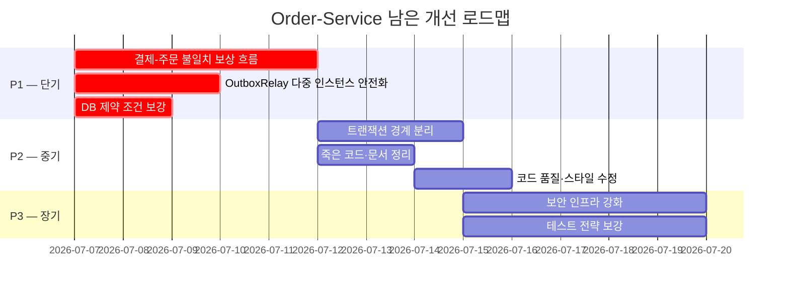

# Order-Service 미해결 개선 리포트

> 본 문서는 기존 `report.md`에서 이미 해결된 P0 항목을 제외하고, 현재 브랜치 기준으로 **부분 해결된 항목**과 **미해결 항목**만 남긴 정리본입니다.
>
> 해결 완료로 제외한 항목:
> - `2.1 [P0] 인가 인터셉터 미등록`
> - `2.2 [P0] gRPC 어댑터의 ON_SALE 하드코딩`

---

## 1. 부분 해결된 항목

### 1.1 [P3] 테스트 전략 보강

#### 현재 상태

인터셉터 배선 누락 문제를 잡기 위한 컨텍스트 기반 MVC 테스트는 추가되었습니다.

- `WebConfig` 등록 여부를 `@WebMvcTest` 기반 테스트로 검증
- `BUYER` 권한의 관리자 API 접근이 `403 Forbidden`으로 차단되는지 검증
- 주문/장바구니 API의 인증 헤더 누락 및 권한 실패 시나리오 검증

#### 남은 문제

리포트에서 요구한 테스트 전략 강화 전체가 완료된 것은 아닙니다.

- `@SpringBootTest` 기반 실제 애플리케이션 컨텍스트 통합 테스트는 아직 없음
- Testcontainers 기반 PostgreSQL + Kafka 실환경 테스트는 아직 없음
- Gateway부터 order-service까지 이어지는 역할별 E2E 보안 시나리오 테스트는 아직 없음

#### 추가 개선 방안

1. `@SpringBootTest` + `@AutoConfigureMockMvc` 기반으로 실제 컨텍스트에서 인터셉터, 필터, 예외 핸들러 동작을 검증합니다.
2. Testcontainers로 PostgreSQL, Kafka를 띄워 DB 제약과 이벤트 흐름을 검증합니다.
3. Gateway가 주입하는 신뢰 헤더 기준으로 역할별 접근 제어 E2E 테스트를 추가합니다.

---

## 2. 미해결 항목

### 2.1 [P1] 결제-주문 불일치 보상 흐름 부재

#### 현재 상태

Kafka `DefaultErrorHandler`는 실패 메시지를 원본 토픽의 `.DLT`로 보내도록 설정되어 있습니다.

```java
new TopicPartition(record.topic() + ".DLT", record.partition())
```

하지만 결제 승인 이벤트 처리 실패 이후의 보상 흐름은 아직 없습니다.

#### 남은 문제

- `.DLT` 토픽을 소비하는 전용 컨슈머 없음
- 금액 불일치 등 검증 실패 후 `payment.cancel-requested` 같은 환불 요청 이벤트 발행 없음
- 운영팀 알림(Slack, 이메일 등) 연동 없음
- 결제는 승인됐지만 주문은 `PENDING`인 상태가 방치될 수 있음

#### 개선 방안

1. 결제 이벤트 DLT 컨슈머를 추가합니다.
2. 실패 원인을 분류하고, 금액 불일치처럼 자동 보상이 필요한 케이스는 결제 취소 요청 이벤트를 발행합니다.
3. 수동 확인이 필요한 케이스는 운영 알림을 발송합니다.
4. DLT 재처리 또는 보상 처리 이력을 추적할 수 있는 로그/저장 구조를 둡니다.

---

### 2.2 [P1] OutboxRelay 다중 인스턴스 안전성 부재

#### 현재 상태

`OutboxRelay.publishPendingEvents()`는 스케줄러 전체가 하나의 트랜잭션으로 실행됩니다.

```java
@Transactional
@Scheduled(fixedDelayString = "${prompthub.outbox-relay.fixed-delay-ms:5000}")
public void publishPendingEvents() {
    outboxEventRepository.findPendingEvents(properties.batchSize())
        .forEach(this::publish);
}
```

`findPendingEvents()`는 단순 조회입니다.

```java
findByStatusOrderByOccurredAtAsc(OutboxEventStatus.PENDING, PageRequest.of(0, batchSize))
```

#### 남은 문제

- `FOR UPDATE SKIP LOCKED` 또는 pessimistic lock 없음
- ShedLock 같은 스케줄러 단일 실행 보장 장치 없음
- 배치 전체가 한 트랜잭션이라 후반 이벤트 실패 시 앞선 `markPublished`까지 롤백될 수 있음
- 다중 인스턴스에서 같은 PENDING 이벤트를 중복 발행할 수 있음

#### 개선 방안

1. PENDING 이벤트 조회에 pessimistic lock과 `SKIP LOCKED` 전략을 적용합니다.
2. 이벤트 단위 트랜잭션으로 발행과 `markPublished`를 분리합니다.
3. 대안 또는 보완책으로 ShedLock을 도입해 스케줄러 자체를 단일 인스턴스에서만 실행합니다.
4. 중복 발행을 전제로 소비자 멱등성도 계속 유지합니다.

---

### 2.3 [P1] DB 제약 조건 누락 — 장바구니 레이스 컨디션

#### 현재 상태

도메인 레벨에는 중복 방어가 있습니다.

- `Cart.containsProduct(productId)`로 같은 상품 중복 추가를 검사
- `OrderPolicyService`에서 주문 요청 상품 ID 중복을 검사

하지만 DB 제약은 아직 부족합니다.

#### 남은 문제

- `cart(buyer_id)` 유니크 제약 없음
- `cart_product(cart_id, product_id)` 유니크 제약 없음
- 주문 생성 멱등키 없음
- 동시 요청 시 구매자당 장바구니가 2개 생성되거나 같은 상품이 중복 담길 수 있음
- 중복 클릭 시 PENDING 주문이 여러 개 생성될 수 있음

#### 개선 방안

1. `cart.buyer_id`에 유니크 제약을 추가합니다.
2. `cart_product(cart_id, product_id)`에 유니크 제약을 추가합니다.
3. 주문 생성 요청에 멱등키를 도입하고 `order` 테이블에 유니크 제약을 추가합니다.
4. 유니크 제약 위반 시 기존 리소스를 조회하거나 도메인 에러로 매핑하는 정책을 정의합니다.

---

### 2.4 [P2] 트랜잭션 경계 문제 — 원격 호출이 트랜잭션 내부

#### 현재 상태

`OrderService`는 클래스 레벨 `@Transactional`을 사용합니다.

```java
@Service
@Transactional
@RequiredArgsConstructor
public class OrderService implements OrderUseCase {
    ...
}
```

`createOrder()` 내부에서 `productClient.getOrderSnapshots()`를 호출합니다.

#### 남은 문제

- gRPC/Feign 원격 호출이 DB 트랜잭션 내부에서 실행됨
- 원격 호출 지연 또는 타임아웃 동안 DB 커넥션을 점유할 수 있음
- `confirmDownload`는 존재 확인 용도인데도 상품 콘텐츠 전체를 조회하는 구조가 남아 있음

#### 개선 방안

1. 클래스 레벨 `@Transactional`을 제거하고 메서드별 트랜잭션으로 전환합니다.
2. `createOrder()`는 트랜잭션 밖에서 상품 스냅샷을 조회하고, 저장 구간만 별도 트랜잭션으로 묶습니다.
3. self-invocation 문제가 생기지 않도록 저장 전용 컴포넌트 또는 별도 application service로 분리합니다.
4. `confirmDownload`용 경량 gRPC 메서드를 추가해 콘텐츠 전체 조회 없이 존재 여부만 확인합니다.

---

### 2.5 [P2] 죽은 코드·문서 불일치 정리

#### 현재 상태

아래 항목들이 여전히 남아 있습니다.

| 항목 | 현재 상태 |
|---|---|
| `ErrorCode.CART_EMPTY(O004)` | 코드상 throw 지점 없음 |
| `ErrorCode.ORDER_PRICE_CHANGED(O011)` | 코드상 throw 지점 없음 |
| `OrderReviewRequest` | 미사용 DTO로 남아 있음 |
| `OrderRepository.existsPaidOrderProductByBuyerIdAndProductId` | 미사용 메서드로 남아 있음 |
| `Order.updateOrderStatus()` | 상태 전이 검증을 우회할 수 있는 메서드로 남아 있음 |
| `Cart.recalculateTotalAmount()` | `totalAmount = 0`으로 리셋하는 구조 유지 |
| product 이벤트 처리 | 이벤트는 소비하지만 application service는 로그만 남김 |

#### 남은 문제

- Swagger 문서와 실제 런타임 에러가 불일치할 수 있음
- 사용하지 않는 DTO/메서드가 유지보수 비용을 높임
- `updateOrderStatus()`는 잘못 쓰이면 도메인 상태 전이 규칙을 우회할 수 있음
- `Cart.totalAmount` 컬럼은 현재 정확한 값을 보장하지 않음
- 상품 중지/삭제/가격 변경 이벤트가 장바구니 정리나 가격 갱신으로 이어지지 않음

#### 개선 방안

1. 미사용 에러 코드와 Swagger 응답 문서를 동기화합니다.
2. 미사용 DTO, repository 메서드, 상태 setter를 삭제합니다.
3. 테스트 fixture에서 `updateOrderStatus()`를 쓰는 부분은 상태 전이 메서드 또는 Reflection 기반 fixture로 대체합니다.
4. `Cart.totalAmount` 컬럼을 제거하거나, `CartProduct`에 가격 스냅샷을 두고 정확히 재계산합니다.
5. product 이벤트 컨슈머를 실제 장바구니 정리/가격 갱신 로직에 연결하거나, 필요 없으면 제거합니다.

---

### 2.6 [P2] 코드 품질·스타일 이슈

#### 현재 상태와 남은 문제

| 항목 | 현재 상태 |
|---|---|
| `searchOrderproducts` | 오타 메서드명 유지 |
| 와일드카드 import | 일부 테스트에서 사용 중 |
| `OrderProduct` | `BaseEntity` 미상속, `createdAt/updatedAt` 수동 관리 |
| `KafkaConfig` | ConsumerFactory/ContainerFactory 중복 구조 유지 |
| 날짜 범위 처리 | 주요 조회는 `endExclusive` 패턴을 쓰지만 전반 검토 필요 |
| `LocalDateTime.now()` | 도메인/서비스/테스트 fixture에 직접 호출 다수 존재 |
| `ddl-auto: update` | local/default 설정에서 유지 |

#### 개선 방안

1. `searchOrderproducts`를 `searchOrderProducts`로 변경하고 호출부를 모두 갱신합니다.
2. 와일드카드 import를 명시적 import로 정리합니다.
3. `OrderProduct`가 `BaseEntity`를 상속하도록 변경하고 수동 시간 필드를 제거하거나 정리합니다.
4. `KafkaConfig`의 반복 factory 생성 코드를 공통 메서드로 추출합니다.
5. 시간 의존 로직에 `Clock` 주입 패턴을 도입합니다.
6. 운영 환경에서 `ddl-auto: update`를 제거하여 스키마가 자동으로 변경되는 것을 방지합니다.

---

### 2.7 [P3] 보안 인프라 강화

#### 현재 상태

order-service는 Gateway가 전달하는 신뢰 헤더를 기반으로 사용자 정보를 판단합니다.

- `X-User-Id`
- `X-User-Role`

gRPC 클라이언트는 plaintext 연결을 사용합니다.

```java
.usePlaintext()
```

#### 남은 문제

- 서비스 포트에 직접 접근할 수 있으면 헤더 위조로 사용자/권한을 가장할 수 있음
- 내부 호출 공유 시크릿 검증 없음
- gRPC TLS 없음
- mTLS 또는 서비스 메시 기반 인증 없음

#### 개선 방안

1. 단기적으로 Gateway와 내부 서비스 사이에 공유 시크릿 헤더 검증을 추가합니다.
2. 내부망 접근 제어, 방화벽, 보안 그룹 정책을 함께 정리합니다.
3. gRPC TLS를 적용합니다.
4. 장기적으로 mTLS 또는 내부 서비스 인증 토큰 체계를 도입합니다.

---

## 3. 남은 개선 우선순위



---

## 4. 핵심 결론

P0 보안/상태 매핑 문제는 현재 브랜치에서 해결되었습니다. 남은 핵심 위험은 **결제 보상 흐름**, **Outbox 중복 발행 방어**, **DB 레벨 동시성 제약**입니다.

다음 작업은 P1 항목부터 분리된 이슈로 처리하는 것이 좋습니다. 각 항목은 DB 스키마, 이벤트 계약, 트랜잭션 경계에 영향을 주므로 하나의 큰 변경으로 묶기보다 독립 브랜치로 나누는 편이 안전합니다.
