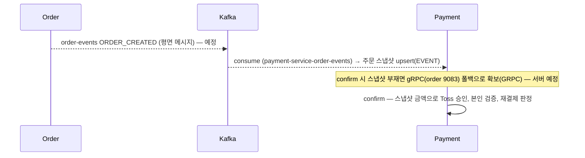
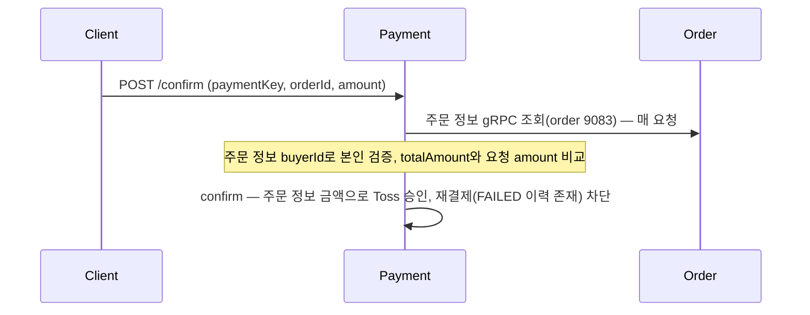

# 결제 승인 흐름 재정렬 구현 태스크

> **For agentic workers:** REQUIRED SUB-SKILL: Use superpowers:subagent-driven-development (recommended) or superpowers:executing-plans to implement this plan task-by-task. Steps use checkbox (`- [ ]`) syntax for tracking.

**Goal:** 결제 승인(`ConfirmPaymentService`) 흐름을 목표 시퀀스 다이어그램 기준으로 재정렬한다 — 금액 검증 도입, 중복 판정 사전체크 전환, `OrderSnapshot` 캐시 제거(매 요청 gRPC 직접 조회), 결제 실패 후 재결제 차단, Kafka 이벤트 payload 최소화.

**Architecture:** 클린 아키텍처 레이어(`domain`/`application`/`presentation`/`infrastructure`) 그대로 유지. `ConfirmPaymentService`가 중심 변경 대상이며, `OrderSnapshot` 관련 domain/application/infrastructure 파일 전체를 삭제한다. `OrderGateway`(gRPC) 인터페이스·구현은 그대로 재사용, 매 요청 호출로 전환.

**Tech Stack:** Spring Boot 4.1, Java 21, Spring Data JPA, Testcontainers(PostgreSQL/Kafka), JUnit5 + Mockito(단위), AssertJ, Flyway.

## Global Constraints

- 설계 근거: `.claude/plans/396-confirm-payment-flow-redesign.md` — 각 결정의 "왜"는 이 문서 참조.
- 수정 가능 범위는 `payment-service/`와 `../docs/`로 한정 — `order-service` 등 다른 서비스 소스는 건드리지 않는다(불일치 발견 사항은 "리포 스코프 밖" 섹션에 기록만 함, 코드 수정 없음).
- 테스트 메서드명은 한국어, 클래스/필드/메서드 식별자는 영어. 단언은 AssertJ(`assertThat`).
- 영속성/Kafka 통합 테스트는 Testcontainers 기반(`AbstractIntegrationTest`/`AbstractJpaTest`) — H2·EmbeddedKafka로 대체하지 않는다.
- Flyway: 이미 배포된 `V1`/`V2`는 수정 금지. 다음 마이그레이션은 `V3`.
- 커밋 메시지는 `type: 한국어 설명` 형식(`git-conventions.md`). 커밋·푸시는 사용자가 명시적으로 요청할 때만 실행 — 각 태스크의 "Step: Commit"은 사용자 승인 후에만 실행한다.
- 구현 시작 전 `git status`로 현재 브랜치 상태를 확인하고, 아직 전용 브랜치가 아니면 `/create-branch`로 `feat/#396-confirm-payment-flow-redesign` 브랜치를 만든 뒤 Task 1부터 진행한다.

---

### Task 1: `PaymentErrorCode`에 `AMOUNT_MISMATCH` 추가

**Files:**
- Modify: `src/main/java/com/prompthub/paymentservice/application/exception/PaymentErrorCode.java`

**Interfaces:**
- Produces: `PaymentErrorCode.AMOUNT_MISMATCH` (400, 코드 `PAY012`) — Task 5·9가 이 상수를 사용한다.

- [ ] **Step 1: enum에 항목 추가**

`src/main/java/com/prompthub/paymentservice/application/exception/PaymentErrorCode.java`에서:

```java
    DUPLICATE_PAYMENT(HttpStatus.CONFLICT, "PAY002", "이미 결제된 주문입니다."),
    PG_INVALID_REQUEST(HttpStatus.BAD_GATEWAY, "PAY003", "잘못된 API 요청으로 인한 PG사 오류입니다."),
```

를 다음으로 교체:

```java
    DUPLICATE_PAYMENT(HttpStatus.CONFLICT, "PAY002", "이미 결제된 주문입니다."),
    AMOUNT_MISMATCH(HttpStatus.BAD_REQUEST, "PAY012", "결제 금액이 주문 금액과 일치하지 않습니다."),
    PG_INVALID_REQUEST(HttpStatus.BAD_GATEWAY, "PAY003", "잘못된 API 요청으로 인한 PG사 오류입니다."),
```

- [ ] **Step 2: 컴파일 확인**

Run: `../gradlew :payment-service:compileJava`
Expected: BUILD SUCCESSFUL

- [ ] **Step 3: Commit**

```bash
git add src/main/java/com/prompthub/paymentservice/application/exception/PaymentErrorCode.java
git commit -m "feat: 금액 불일치 에러 코드(AMOUNT_MISMATCH) 추가"
```

---

### Task 2: `Payment.fail()` 상태 가드 완화 (READY·REQUESTED 양쪽 허용)

**Files:**
- Modify: `src/main/java/com/prompthub/paymentservice/domain/model/Payment.java`
- Modify: `src/test/java/com/prompthub/paymentservice/domain/model/PaymentTest.java`

**Interfaces:**
- Consumes: 없음 (도메인 내부 변경)
- Produces: `Payment.fail(...)`가 `READY` 또는 `REQUESTED` 상태에서 호출 가능 — Task 5의 금액 불일치 분기가 `READY` 상태에서 바로 `fail()`을 호출한다.

- [ ] **Step 1: 실패할 테스트로 기존 테스트 교체**

`src/test/java/com/prompthub/paymentservice/domain/model/PaymentTest.java`에서:

```java
    @Test
    void REQUESTED_아닌_상태에서_fail_실패() {
        Payment payment = 결제_생성();

        assertThatThrownBy(() -> payment.fail("REJECT", "거절", null, "{}", OffsetDateTime.now()))
            .isInstanceOf(IllegalStateException.class);
    }
```

를 다음으로 교체:

```java
    @Test
    void READY_상태에서_바로_fail_가능() {
        Payment payment = 결제_생성();

        payment.fail("AMOUNT_MISMATCH", "금액 불일치", null, null, OffsetDateTime.now());

        assertThat(payment.getStatus()).isEqualTo(PaymentStatus.FAILED);
        assertThat(payment.getFailureCode()).isEqualTo("AMOUNT_MISMATCH");
    }

    @Test
    void PAID_상태에서_fail_실패() {
        Payment payment = 결제_생성_후_승인(10_000);

        assertThatThrownBy(() -> payment.fail("REJECT", "거절", null, "{}", OffsetDateTime.now()))
            .isInstanceOf(IllegalStateException.class);
    }
```

- [ ] **Step 2: 테스트 실행 — `READY_상태에서_바로_fail_가능`은 실패해야 함**

Run: `../gradlew :payment-service:test --tests "com.prompthub.paymentservice.domain.model.PaymentTest"`
Expected: FAIL — `READY_상태에서_바로_fail_가능`에서 `IllegalStateException` 발생(기존 가드가 READY를 막음)

- [ ] **Step 3: `Payment.fail()` 가드 완화**

`src/main/java/com/prompthub/paymentservice/domain/model/Payment.java`에서:

```java
    public void fail(String failureCode, String failureReason, String requestPayload, String responsePayload, OffsetDateTime failedAt) {
        if (this.status != PaymentStatus.REQUESTED) {
            throw new IllegalStateException("REQUESTED 상태에서만 FAILED로 전환할 수 있습니다.");
        }
        this.status = PaymentStatus.FAILED;
```

를 다음으로 교체:

```java
    public void fail(String failureCode, String failureReason, String requestPayload, String responsePayload, OffsetDateTime failedAt) {
        if (this.status != PaymentStatus.READY && this.status != PaymentStatus.REQUESTED) {
            throw new IllegalStateException("READY/REQUESTED 상태에서만 FAILED로 전환할 수 있습니다.");
        }
        this.status = PaymentStatus.FAILED;
```

- [ ] **Step 4: 테스트 통과 확인**

Run: `../gradlew :payment-service:test --tests "com.prompthub.paymentservice.domain.model.PaymentTest"`
Expected: PASS (전체)

- [ ] **Step 5: Commit**

```bash
git add src/main/java/com/prompthub/paymentservice/domain/model/Payment.java src/test/java/com/prompthub/paymentservice/domain/model/PaymentTest.java
git commit -m "feat: Payment.fail() 상태 가드 완화하여 READY에서도 실패 처리 허용"
```

---

### Task 3: `PaymentRepository`에 `existsByPgTxId` 추가

**Files:**
- Modify: `src/main/java/com/prompthub/paymentservice/domain/repository/PaymentRepository.java`
- Modify: `src/main/java/com/prompthub/paymentservice/infrastructure/persistence/PaymentJpaRepository.java`
- Modify: `src/main/java/com/prompthub/paymentservice/infrastructure/persistence/PaymentRepositoryAdapter.java`
- Test: `src/test/java/com/prompthub/paymentservice/infrastructure/persistence/PaymentJpaRepositoryTest.java`

**Interfaces:**
- Produces: `PaymentRepository.existsByPgTxId(String pgTxId): boolean` — Task 5의 `ConfirmPaymentService`가 사용한다.

- [ ] **Step 1: 실패할 테스트 추가**

`src/test/java/com/prompthub/paymentservice/infrastructure/persistence/PaymentJpaRepositoryTest.java`의 마지막 `@Test` 메서드(`findLatestByOrderId_없으면_empty`) 뒤에 추가:

```java

    @Test
    void existsByPgTxId_존재_여부_확인() {
        Payment payment = Payment.create(
            UUID.randomUUID(), UUID.randomUUID(), "pg-tx-exists", "TOSS_PAYMENTS", "CARD", false, 10_000);
        paymentJpaRepository.saveAndFlush(payment);

        assertThat(paymentJpaRepository.existsByPgTxId("pg-tx-exists")).isTrue();
        assertThat(paymentJpaRepository.existsByPgTxId("pg-tx-missing")).isFalse();
    }
```

- [ ] **Step 2: 테스트 실행 — 컴파일 실패 확인**

Run: `../gradlew :payment-service:test --tests "com.prompthub.paymentservice.infrastructure.persistence.PaymentJpaRepositoryTest"`
Expected: FAIL — `existsByPgTxId` 메서드가 `PaymentJpaRepository`에 없어 컴파일 에러

- [ ] **Step 3: 도메인 인터페이스에 메서드 추가**

`src/main/java/com/prompthub/paymentservice/domain/repository/PaymentRepository.java` 전체를 아래로 교체:

```java
package com.prompthub.paymentservice.domain.repository;

import com.prompthub.paymentservice.domain.model.Payment;
import com.prompthub.paymentservice.domain.model.PaymentStatus;
import java.util.Collection;
import java.util.Optional;
import java.util.UUID;

public interface PaymentRepository {
    Payment save(Payment payment);
    Payment saveAndFlush(Payment payment);
    Optional<Payment> findById(UUID id);
    Optional<Payment> findByIdForUpdate(UUID id);
    boolean existsByPgTxId(String pgTxId);
    boolean existsByOrderIdAndStatusIn(UUID orderId, Collection<PaymentStatus> statuses);
    Optional<Payment> findByOrderIdAndStatusInForUpdate(UUID orderId, Collection<PaymentStatus> statuses);
    Optional<Payment> findLatestByOrderId(UUID orderId);
}
```

- [ ] **Step 4: JPA 리포지토리에 파생 쿼리 추가**

`src/main/java/com/prompthub/paymentservice/infrastructure/persistence/PaymentJpaRepository.java`에서:

```java
public interface PaymentJpaRepository extends JpaRepository<Payment, UUID> {
    boolean existsByOrderIdAndStatusIn(UUID orderId, Collection<PaymentStatus> statuses);
```

를 다음으로 교체:

```java
public interface PaymentJpaRepository extends JpaRepository<Payment, UUID> {
    boolean existsByPgTxId(String pgTxId);

    boolean existsByOrderIdAndStatusIn(UUID orderId, Collection<PaymentStatus> statuses);
```

- [ ] **Step 5: 어댑터에 위임 메서드 추가**

`src/main/java/com/prompthub/paymentservice/infrastructure/persistence/PaymentRepositoryAdapter.java`에서:

```java
    @Override
    public boolean existsByOrderIdAndStatusIn(UUID orderId, Collection<PaymentStatus> statuses) {
        return jpaRepository.existsByOrderIdAndStatusIn(orderId, statuses);
    }
```

를 다음으로 교체:

```java
    @Override
    public boolean existsByPgTxId(String pgTxId) {
        return jpaRepository.existsByPgTxId(pgTxId);
    }

    @Override
    public boolean existsByOrderIdAndStatusIn(UUID orderId, Collection<PaymentStatus> statuses) {
        return jpaRepository.existsByOrderIdAndStatusIn(orderId, statuses);
    }
```

- [ ] **Step 6: 테스트 통과 확인**

Run: `../gradlew :payment-service:test --tests "com.prompthub.paymentservice.infrastructure.persistence.PaymentJpaRepositoryTest"`
Expected: PASS (전체)

- [ ] **Step 7: Commit**

```bash
git add src/main/java/com/prompthub/paymentservice/domain/repository/PaymentRepository.java src/main/java/com/prompthub/paymentservice/infrastructure/persistence/PaymentJpaRepository.java src/main/java/com/prompthub/paymentservice/infrastructure/persistence/PaymentRepositoryAdapter.java src/test/java/com/prompthub/paymentservice/infrastructure/persistence/PaymentJpaRepositoryTest.java
git commit -m "feat: paymentKey 사전 중복 확인용 existsByPgTxId 추가"
```

---

### Task 4: `ConfirmPaymentRequest`/`ConfirmPaymentCommand`에 `amount` 필드 추가

**Files:**
- Modify: `src/main/java/com/prompthub/paymentservice/presentation/dto/request/ConfirmPaymentRequest.java`
- Modify: `src/main/java/com/prompthub/paymentservice/application/dto/command/ConfirmPaymentCommand.java`

**Interfaces:**
- Produces: `ConfirmPaymentRequest.amount(): Integer`, `ConfirmPaymentCommand.amount(): int` — Task 5(서비스)·6(컨트롤러)·9(통합테스트)가 사용한다.

- [ ] **Step 1: `ConfirmPaymentRequest`에 필드 추가**

`src/main/java/com/prompthub/paymentservice/presentation/dto/request/ConfirmPaymentRequest.java` 전체를 아래로 교체:

```java
package com.prompthub.paymentservice.presentation.dto.request;

import io.swagger.v3.oas.annotations.media.Schema;
import jakarta.validation.constraints.NotBlank;
import jakarta.validation.constraints.NotNull;
import jakarta.validation.constraints.Positive;
import java.util.UUID;

@Schema(description = "결제 승인 요청")
public record ConfirmPaymentRequest(
    @Schema(description = "토스페이먼츠 SDK 결제 키", example = "tossPayments_key_abc123",
        requiredMode = Schema.RequiredMode.REQUIRED)
    @NotBlank String paymentKey,

    @Schema(description = "결제할 주문 ID", example = "660e8400-e29b-41d4-a716-446655440001",
        requiredMode = Schema.RequiredMode.REQUIRED)
    @NotNull UUID orderId,

    @Schema(description = "결제 요청 금액 — 주문 실제 금액과 다르면 400(PAY012)", example = "50000",
        requiredMode = Schema.RequiredMode.REQUIRED)
    @NotNull @Positive Integer amount
) {}
```

- [ ] **Step 2: `ConfirmPaymentCommand`에 필드 추가**

`src/main/java/com/prompthub/paymentservice/application/dto/command/ConfirmPaymentCommand.java` 전체를 아래로 교체:

```java
package com.prompthub.paymentservice.application.dto.command;

import java.util.UUID;

public record ConfirmPaymentCommand(
    String paymentKey,
    UUID orderId,
    UUID userId,
    int amount
) {}
```

- [ ] **Step 3: 컴파일 확인 (Task 5·6 전이라 PaymentController/ConfirmPaymentService는 아직 컴파일 에러 — 정상)**

Run: `../gradlew :payment-service:compileJava`
Expected: FAIL — `PaymentController`가 3-arg `ConfirmPaymentCommand` 생성자를 호출해 컴파일 에러. Task 5·6에서 해결한다. 지금은 커밋만 진행.

- [ ] **Step 4: Commit**

```bash
git add src/main/java/com/prompthub/paymentservice/presentation/dto/request/ConfirmPaymentRequest.java src/main/java/com/prompthub/paymentservice/application/dto/command/ConfirmPaymentCommand.java
git commit -m "feat: 결제 승인 요청/커맨드에 amount 필드 추가"
```

---

### Task 5: `ConfirmPaymentService` 재작성 — 금액 검증·사전체크·gRPC 매 요청 조회·재결제 차단

**Files:**
- Modify: `src/main/java/com/prompthub/paymentservice/application/service/ConfirmPaymentService.java`
- Modify: `src/test/java/com/prompthub/paymentservice/application/service/ConfirmPaymentServiceTest.java`

**Interfaces:**
- Consumes: `PaymentRepository.existsByPgTxId`(Task 3), `PaymentErrorCode.AMOUNT_MISMATCH`(Task 1), `Payment.fail()`의 READY 허용(Task 2), `ConfirmPaymentCommand.amount()`(Task 4)
- Produces: `ConfirmPaymentService`가 생성자 인자 `(PaymentRepository, OrderGateway, PaymentGateway, ApplicationEventPublisher, TransactionTemplate, boolean testMode)`로 변경(기존엔 `OrderSnapshotRepository`/`RecordOrderSnapshotUseCase`도 받았음) — Task 6(컨트롤러는 영향 없음, `ConfirmPaymentUseCase` 인터페이스 불변)과 Task 9(통합테스트)가 이 시그니처 변경을 전제한다.

- [ ] **Step 1: 테스트 파일 전체를 새 기대 동작으로 교체**

`src/test/java/com/prompthub/paymentservice/application/service/ConfirmPaymentServiceTest.java` 전체를 아래로 교체:

```java
package com.prompthub.paymentservice.application.service;

import com.prompthub.exception.BusinessException;
import com.prompthub.paymentservice.application.dto.command.ConfirmPaymentCommand;
import com.prompthub.paymentservice.application.dto.result.PaymentResult;
import com.prompthub.paymentservice.application.exception.PaymentErrorCode;
import com.prompthub.paymentservice.application.gateway.external.ConfirmResult;
import com.prompthub.paymentservice.application.gateway.external.OrderGateway;
import com.prompthub.paymentservice.application.gateway.external.OrderPaymentInfo;
import com.prompthub.paymentservice.application.gateway.external.PaymentGateway;
import com.prompthub.paymentservice.application.gateway.external.PaymentGatewayException;
import com.prompthub.paymentservice.domain.event.PaymentApprovedEvent;
import com.prompthub.paymentservice.domain.event.PaymentFailedEvent;
import com.prompthub.paymentservice.domain.model.Payment;
import com.prompthub.paymentservice.domain.model.PaymentStatus;
import com.prompthub.paymentservice.domain.repository.PaymentRepository;
import java.time.OffsetDateTime;
import java.util.Optional;
import java.util.UUID;
import org.junit.jupiter.api.BeforeEach;
import org.junit.jupiter.api.Test;
import org.junit.jupiter.api.extension.ExtendWith;
import org.mockito.ArgumentCaptor;
import org.mockito.Mock;
import org.mockito.junit.jupiter.MockitoExtension;
import org.springframework.context.ApplicationEventPublisher;
import org.springframework.transaction.PlatformTransactionManager;
import org.springframework.transaction.TransactionDefinition;
import org.springframework.transaction.TransactionStatus;
import org.springframework.transaction.support.SimpleTransactionStatus;
import org.springframework.transaction.support.TransactionTemplate;

import static org.assertj.core.api.Assertions.assertThat;
import static org.assertj.core.api.Assertions.assertThatThrownBy;
import static org.mockito.ArgumentMatchers.any;
import static org.mockito.ArgumentMatchers.anyInt;
import static org.mockito.ArgumentMatchers.anyString;
import static org.mockito.ArgumentMatchers.eq;
import static org.mockito.Mockito.never;
import static org.mockito.Mockito.verify;
import static org.mockito.Mockito.when;

@ExtendWith(MockitoExtension.class)
class ConfirmPaymentServiceTest {

    @Mock
    PaymentRepository paymentRepository;
    @Mock
    OrderGateway orderGateway;
    @Mock
    PaymentGateway paymentGateway;
    @Mock
    ApplicationEventPublisher applicationEventPublisher;

    ConfirmPaymentService service;

    @BeforeEach
    void setUp() {
        // 실제 TX 없이 콜백만 실행하는 no-op PlatformTransactionManager (단위 테스트 전용)
        TransactionTemplate transactionTemplate = new TransactionTemplate(new PlatformTransactionManager() {
            @Override
            public TransactionStatus getTransaction(TransactionDefinition def) {
                return new SimpleTransactionStatus();
            }
            @Override
            public void commit(TransactionStatus status) {}
            @Override
            public void rollback(TransactionStatus status) {}
        });
        service = new ConfirmPaymentService(
            paymentRepository, orderGateway, paymentGateway, applicationEventPublisher, transactionTemplate, false
        );
    }

    @Test
    void 이미_존재하는_paymentKey_시_PAY002_예외() {
        when(paymentRepository.existsByPgTxId("toss-key")).thenReturn(true);

        ConfirmPaymentCommand command = new ConfirmPaymentCommand(
            "toss-key", UUID.randomUUID(), UUID.randomUUID(), 10_000);

        assertThatThrownBy(() -> service.confirm(command))
            .isInstanceOf(BusinessException.class)
            .extracting(e -> ((BusinessException) e).getErrorCode())
            .isEqualTo(PaymentErrorCode.DUPLICATE_PAYMENT);

        verify(orderGateway, never()).getOrderPaymentInfo(any());
        verify(paymentGateway, never()).confirm(anyString(), any(), anyInt());
    }

    @Test
    void 진행_완료_상태_결제_존재_시_PAY002_예외() {
        UUID orderId = UUID.randomUUID();
        when(paymentRepository.existsByOrderIdAndStatusIn(eq(orderId), any())).thenReturn(true);

        ConfirmPaymentCommand command = new ConfirmPaymentCommand("toss-key", orderId, UUID.randomUUID(), 10_000);

        assertThatThrownBy(() -> service.confirm(command))
            .isInstanceOf(BusinessException.class)
            .extracting(e -> ((BusinessException) e).getErrorCode())
            .isEqualTo(PaymentErrorCode.DUPLICATE_PAYMENT);

        verify(orderGateway, never()).getOrderPaymentInfo(any());
        verify(paymentGateway, never()).confirm(anyString(), any(), anyInt());
    }

    @Test
    void FAILED_상태_존재해도_재결제_차단() {
        UUID orderId = UUID.randomUUID();
        when(paymentRepository.existsByOrderIdAndStatusIn(eq(orderId), any())).thenReturn(true);

        ConfirmPaymentCommand command = new ConfirmPaymentCommand("new-toss-key", orderId, UUID.randomUUID(), 10_000);

        assertThatThrownBy(() -> service.confirm(command))
            .isInstanceOf(BusinessException.class)
            .extracting(e -> ((BusinessException) e).getErrorCode())
            .isEqualTo(PaymentErrorCode.DUPLICATE_PAYMENT);
    }

    @Test
    void 주문자_불일치_시_NOT_ORDER_OWNER_예외() {
        UUID orderId = UUID.randomUUID();
        UUID buyerId = UUID.randomUUID();
        UUID requester = UUID.randomUUID();
        when(orderGateway.getOrderPaymentInfo(orderId))
            .thenReturn(new OrderPaymentInfo(orderId, buyerId, 10_000, OffsetDateTime.now()));

        ConfirmPaymentCommand command = new ConfirmPaymentCommand("toss-key", orderId, requester, 10_000);

        assertThatThrownBy(() -> service.confirm(command))
            .isInstanceOf(BusinessException.class)
            .extracting(e -> ((BusinessException) e).getErrorCode())
            .isEqualTo(PaymentErrorCode.NOT_ORDER_OWNER);

        verify(paymentGateway, never()).confirm(anyString(), any(), anyInt());
    }

    @Test
    void 금액_불일치_시_AMOUNT_MISMATCH_예외_및_FAILED_저장() {
        UUID orderId = UUID.randomUUID();
        UUID userId = UUID.randomUUID();
        when(orderGateway.getOrderPaymentInfo(orderId))
            .thenReturn(new OrderPaymentInfo(orderId, userId, 10_000, OffsetDateTime.now()));
        when(paymentRepository.saveAndFlush(any(Payment.class))).thenAnswer(inv -> inv.getArgument(0));
        when(paymentRepository.save(any(Payment.class))).thenAnswer(inv -> inv.getArgument(0));

        ConfirmPaymentCommand command = new ConfirmPaymentCommand("toss-key", orderId, userId, 9_000);

        assertThatThrownBy(() -> service.confirm(command))
            .isInstanceOf(BusinessException.class)
            .extracting(e -> ((BusinessException) e).getErrorCode())
            .isEqualTo(PaymentErrorCode.AMOUNT_MISMATCH);

        verify(paymentGateway, never()).confirm(anyString(), any(), anyInt());

        ArgumentCaptor<PaymentFailedEvent> captor = ArgumentCaptor.forClass(PaymentFailedEvent.class);
        verify(applicationEventPublisher).publishEvent(captor.capture());
        assertThat(captor.getValue().payment().getStatus()).isEqualTo(PaymentStatus.FAILED);
        assertThat(captor.getValue().payment().getTotalAmount()).isEqualTo(10_000);
    }

    @Test
    void Toss_성공_시_PAID_상태_이벤트_발행() {
        UUID orderId = UUID.randomUUID();
        UUID userId = UUID.randomUUID();
        OffsetDateTime approvedAt = OffsetDateTime.now();

        when(orderGateway.getOrderPaymentInfo(orderId))
            .thenReturn(new OrderPaymentInfo(orderId, userId, 10_000, OffsetDateTime.now()));
        when(paymentRepository.saveAndFlush(any(Payment.class))).thenAnswer(inv -> inv.getArgument(0));
        when(paymentRepository.save(any(Payment.class))).thenAnswer(inv -> inv.getArgument(0));
        when(paymentGateway.confirm(eq("toss-key"), eq(orderId), eq(10_000)))
            .thenReturn(new ConfirmResult("카드", 10_000, "{}", approvedAt));
        when(paymentRepository.findById(any(UUID.class))).thenAnswer(inv -> {
            Payment p = Payment.create(orderId, userId, "toss-key", "TOSS_PAYMENTS", "CARD", false, 10_000);
            p.markRequested(OffsetDateTime.now());
            return Optional.of(p);
        });

        ConfirmPaymentCommand command = new ConfirmPaymentCommand("toss-key", orderId, userId, 10_000);
        PaymentResult result = service.confirm(command);

        assertThat(result.paymentId()).isNotNull();

        ArgumentCaptor<PaymentApprovedEvent> captor = ArgumentCaptor.forClass(PaymentApprovedEvent.class);
        verify(applicationEventPublisher).publishEvent(captor.capture());
        assertThat(captor.getValue().payment().getStatus()).isEqualTo(PaymentStatus.PAID);
        assertThat(captor.getValue().payment().getApprovedAmount()).isEqualTo(10_000);
    }

    @Test
    void Toss_서버오류성_4xx_시_FAILED_상태_PG_INVALID_REQUEST_예외() {
        UUID orderId = UUID.randomUUID();
        UUID userId = UUID.randomUUID();

        when(orderGateway.getOrderPaymentInfo(orderId))
            .thenReturn(new OrderPaymentInfo(orderId, userId, 10_000, OffsetDateTime.now()));
        when(paymentRepository.saveAndFlush(any(Payment.class))).thenAnswer(inv -> inv.getArgument(0));
        when(paymentRepository.save(any(Payment.class))).thenAnswer(inv -> inv.getArgument(0));
        when(paymentGateway.confirm(anyString(), any(), anyInt()))
            .thenThrow(new PaymentGatewayException(
                PaymentErrorCode.PG_INVALID_REQUEST, "INVALID_REQUEST", "잘못된 요청입니다.", null, "{}"));
        when(paymentRepository.findById(any(UUID.class))).thenAnswer(inv -> {
            Payment p = Payment.create(orderId, userId, "toss-key", "TOSS_PAYMENTS", "CARD", false, 10_000);
            p.markRequested(OffsetDateTime.now());
            return Optional.of(p);
        });

        ConfirmPaymentCommand command = new ConfirmPaymentCommand("toss-key", orderId, userId, 10_000);

        assertThatThrownBy(() -> service.confirm(command))
            .isInstanceOf(BusinessException.class)
            .extracting(e -> ((BusinessException) e).getErrorCode())
            .isEqualTo(PaymentErrorCode.PG_INVALID_REQUEST);

        verify(applicationEventPublisher, never()).publishEvent(any());

        ArgumentCaptor<Payment> captor = ArgumentCaptor.forClass(Payment.class);
        verify(paymentRepository, org.mockito.Mockito.atLeastOnce()).save(captor.capture());
        Payment lastSaved = captor.getAllValues().get(captor.getAllValues().size() - 1);
        assertThat(lastSaved.getStatus()).isEqualTo(PaymentStatus.FAILED);
    }

    @Test
    void Toss_실패_시_FAILED_상태_PAY_FAILED_예외() {
        UUID orderId = UUID.randomUUID();
        UUID userId = UUID.randomUUID();

        when(orderGateway.getOrderPaymentInfo(orderId))
            .thenReturn(new OrderPaymentInfo(orderId, userId, 10_000, OffsetDateTime.now()));
        when(paymentRepository.saveAndFlush(any(Payment.class))).thenAnswer(inv -> inv.getArgument(0));
        when(paymentRepository.save(any(Payment.class))).thenAnswer(inv -> inv.getArgument(0));
        when(paymentGateway.confirm(anyString(), any(), anyInt()))
            .thenThrow(new PaymentGatewayException(
                PaymentErrorCode.PAYMENT_FAILED, "REJECT", "카드 거절", null, "{}"));
        when(paymentRepository.findById(any(UUID.class))).thenAnswer(inv -> {
            Payment p = Payment.create(orderId, userId, "toss-key", "TOSS_PAYMENTS", "CARD", false, 10_000);
            p.markRequested(OffsetDateTime.now());
            return Optional.of(p);
        });

        ConfirmPaymentCommand command = new ConfirmPaymentCommand("toss-key", orderId, userId, 10_000);

        assertThatThrownBy(() -> service.confirm(command))
            .isInstanceOf(BusinessException.class)
            .extracting(e -> ((BusinessException) e).getErrorCode())
            .isEqualTo(PaymentErrorCode.PAYMENT_FAILED);

        verify(applicationEventPublisher, never()).publishEvent(any());

        ArgumentCaptor<Payment> captor = ArgumentCaptor.forClass(Payment.class);
        verify(paymentRepository, org.mockito.Mockito.atLeastOnce()).save(captor.capture());
        Payment lastSaved = captor.getAllValues().get(captor.getAllValues().size() - 1);
        assertThat(lastSaved.getStatus()).isEqualTo(PaymentStatus.FAILED);
    }
}
```

- [ ] **Step 2: 테스트 실행 — 컴파일 실패 확인**

Run: `../gradlew :payment-service:test --tests "com.prompthub.paymentservice.application.service.ConfirmPaymentServiceTest"`
Expected: FAIL — `ConfirmPaymentService` 생성자가 기존 6-arg(`OrderSnapshotRepository`/`RecordOrderSnapshotUseCase` 포함) 시그니처라 컴파일 에러

- [ ] **Step 3: `ConfirmPaymentService` 전체 재작성**

`src/main/java/com/prompthub/paymentservice/application/service/ConfirmPaymentService.java` 전체를 아래로 교체:

```java
package com.prompthub.paymentservice.application.service;

import com.prompthub.exception.BusinessException;
import com.prompthub.paymentservice.application.dto.command.ConfirmPaymentCommand;
import com.prompthub.paymentservice.application.dto.result.PaymentResult;
import com.prompthub.paymentservice.application.exception.PaymentErrorCode;
import com.prompthub.paymentservice.application.gateway.external.ConfirmResult;
import com.prompthub.paymentservice.application.gateway.external.OrderGateway;
import com.prompthub.paymentservice.application.gateway.external.OrderPaymentInfo;
import com.prompthub.paymentservice.application.gateway.external.PaymentGateway;
import com.prompthub.paymentservice.application.gateway.external.PaymentGatewayException;
import com.prompthub.paymentservice.application.usecase.ConfirmPaymentUseCase;
import com.prompthub.paymentservice.domain.event.PaymentApprovedEvent;
import com.prompthub.paymentservice.domain.event.PaymentFailedEvent;
import com.prompthub.paymentservice.domain.model.Payment;
import com.prompthub.paymentservice.domain.model.PaymentStatus;
import com.prompthub.paymentservice.domain.repository.PaymentRepository;
import java.time.OffsetDateTime;
import java.util.Set;
import java.util.UUID;
import lombok.extern.slf4j.Slf4j;
import org.springframework.beans.factory.annotation.Value;
import org.springframework.context.ApplicationEventPublisher;
import org.springframework.dao.DataIntegrityViolationException;
import org.springframework.stereotype.Service;
import org.springframework.transaction.support.TransactionTemplate;

@Slf4j
@Service
public class ConfirmPaymentService implements ConfirmPaymentUseCase {

    private static final String PG_PROVIDER = "TOSS_PAYMENTS";
    private static final String PAYMENT_METHOD = "CARD";

    // 진행 중(READY·REQUESTED)만 비차단. PAID·FAILED(재결제 영구 차단 정책)·환불·UNKNOWN은 전부 차단.
    private static final Set<PaymentStatus> BLOCKING_STATUSES = Set.of(
        PaymentStatus.PAID, PaymentStatus.FAILED,
        PaymentStatus.PARTIAL_REFUNDED, PaymentStatus.ALL_REFUNDED, PaymentStatus.UNKNOWN
    );

    private final PaymentRepository paymentRepository;
    private final OrderGateway orderGateway;
    private final PaymentGateway paymentGateway;
    private final ApplicationEventPublisher applicationEventPublisher;
    private final TransactionTemplate transactionTemplate;
    private final boolean testMode;

    public ConfirmPaymentService(
        PaymentRepository paymentRepository,
        OrderGateway orderGateway,
        PaymentGateway paymentGateway,
        ApplicationEventPublisher applicationEventPublisher,
        TransactionTemplate transactionTemplate,
        @Value("${payment.toss.test-mode:false}") boolean testMode
    ) {
        this.paymentRepository = paymentRepository;
        this.orderGateway = orderGateway;
        this.paymentGateway = paymentGateway;
        this.applicationEventPublisher = applicationEventPublisher;
        this.transactionTemplate = transactionTemplate;
        this.testMode = testMode;
    }

    @Override
    public PaymentResult confirm(ConfirmPaymentCommand command) {
        if (paymentRepository.existsByPgTxId(command.paymentKey())) {
            throw new BusinessException(PaymentErrorCode.DUPLICATE_PAYMENT);
        }
        if (paymentRepository.existsByOrderIdAndStatusIn(command.orderId(), BLOCKING_STATUSES)) {
            throw new BusinessException(PaymentErrorCode.DUPLICATE_PAYMENT);
        }

        // 주문 정보 gRPC 조회 — DB 트랜잭션 밖에서 실행해 네트워크 왕복 동안 커넥션을 점유하지 않는다.
        OrderPaymentInfo orderInfo = orderGateway.getOrderPaymentInfo(command.orderId());

        if (!orderInfo.buyerId().equals(command.userId())) {
            throw new BusinessException(PaymentErrorCode.NOT_ORDER_OWNER);
        }

        if (command.amount() != orderInfo.totalAmount()) {
            failBeforeRequest(command, orderInfo);
            throw new BusinessException(PaymentErrorCode.AMOUNT_MISMATCH);
        }

        // TX1: Payment 생성 + REQUESTED 전이 — 커밋 후 DB 커넥션 반납
        UUID paymentId;
        try {
            paymentId = transactionTemplate.execute(status -> {
                Payment payment = Payment.create(
                    command.orderId(), command.userId(),
                    command.paymentKey(), PG_PROVIDER, PAYMENT_METHOD, testMode,
                    orderInfo.totalAmount()
                );
                paymentRepository.saveAndFlush(payment);
                payment.markRequested(OffsetDateTime.now());
                paymentRepository.save(payment);
                return payment.getId();
            });
        } catch (DataIntegrityViolationException e) {
            // pg_tx_id/orderId 사전 체크와 INSERT 사이의 좁은 레이스 — 최종 방어선
            throw new BusinessException(PaymentErrorCode.DUPLICATE_PAYMENT);
        }

        // Toss API 호출 — 트랜잭션 밖, DB 커넥션 미점유.
        try {
            ConfirmResult result = paymentGateway.confirm(
                command.paymentKey(), command.orderId(), orderInfo.totalAmount()
            );

            // TX2: 승인 결과 반영
            return transactionTemplate.execute(status -> {
                Payment payment = paymentRepository.findById(paymentId).orElseThrow();
                payment.approve(result.approvedAmount(), result.paymentMethod(),
                    result.responsePayload(), result.approvedAt());
                paymentRepository.save(payment);
                applicationEventPublisher.publishEvent(new PaymentApprovedEvent(payment));
                return new PaymentResult(payment.getId());
            });

        } catch (PaymentGatewayException e) {
            log.error("PG사 결제 실패 — paymentKey={}, tossCode={}, reason={}",
                command.paymentKey(), e.getFailureCode(), e.getFailureReason(), e);

            // TX3: 실패 반영 + PAYMENT_FAILED 발행 (별도 커밋되므로 AFTER_COMMIT 리스너 정상 발화)
            transactionTemplate.execute(status -> {
                Payment payment = paymentRepository.findById(paymentId).orElseThrow();
                payment.fail(e.getFailureCode(), e.getFailureReason(),
                    e.getRequestPayload(), e.getResponsePayload(), OffsetDateTime.now());
                paymentRepository.save(payment);
                applicationEventPublisher.publishEvent(new PaymentFailedEvent(payment));
                return null;
            });

            throw new BusinessException(e.getErrorCode(), e.getFailureReason());

        } catch (DataIntegrityViolationException e) {
            // uk_payment_order_paid 충돌 — 서로 다른 paymentKey로 같은 주문 동시 결제
            throw new BusinessException(PaymentErrorCode.DUPLICATE_PAYMENT);
        }
    }

    /**
     * 금액 불일치 — Toss 호출 전 Payment를 READY로 생성하고 즉시 FAILED로 전이해 실패 이력을 남기고
     * PaymentFailedEvent를 발행한다(Order 쪽 상태 전이를 위해 Kafka 발행 필요).
     */
    private void failBeforeRequest(ConfirmPaymentCommand command, OrderPaymentInfo orderInfo) {
        transactionTemplate.execute(status -> {
            Payment payment = Payment.create(
                command.orderId(), command.userId(),
                command.paymentKey(), PG_PROVIDER, PAYMENT_METHOD, testMode,
                orderInfo.totalAmount()
            );
            paymentRepository.saveAndFlush(payment);
            payment.fail(
                "AMOUNT_MISMATCH", "요청 금액이 주문 금액과 일치하지 않습니다.",
                null, null, OffsetDateTime.now()
            );
            paymentRepository.save(payment);
            applicationEventPublisher.publishEvent(new PaymentFailedEvent(payment));
            return null;
        });
    }
}
```

- [ ] **Step 4: 테스트 통과 확인**

Run: `../gradlew :payment-service:test --tests "com.prompthub.paymentservice.application.service.ConfirmPaymentServiceTest"`
Expected: PASS (전체)

- [ ] **Step 5: Commit**

```bash
git add src/main/java/com/prompthub/paymentservice/application/service/ConfirmPaymentService.java src/test/java/com/prompthub/paymentservice/application/service/ConfirmPaymentServiceTest.java
git commit -m "feat: 결제 승인 흐름을 금액 검증·사전체크·gRPC 매 요청 조회 기반으로 재작성"
```

---

### Task 6: `PaymentController`에 `amount` 전달 + Swagger 400 예시 추가

**Files:**
- Modify: `src/main/java/com/prompthub/paymentservice/presentation/PaymentController.java`

**Interfaces:**
- Consumes: `ConfirmPaymentRequest.amount()`(Task 4), `ConfirmPaymentCommand`의 4-arg 생성자(Task 4)

- [ ] **Step 1: command 생성 시 amount 전달**

`src/main/java/com/prompthub/paymentservice/presentation/PaymentController.java`에서:

```java
        ConfirmPaymentCommand command = new ConfirmPaymentCommand(
            request.paymentKey(), request.orderId(), userId
        );
```

를 다음으로 교체:

```java
        ConfirmPaymentCommand command = new ConfirmPaymentCommand(
            request.paymentKey(), request.orderId(), userId, request.amount()
        );
```

- [ ] **Step 2: Swagger 400 응답 예시에 금액 불일치 케이스 추가**

같은 파일에서:

```java
        @ApiResponse(responseCode = "400", description = "입력값 오류(V001) 또는 PG사 결제 실패(PAY_FAILED)",
            content = @Content(mediaType = "application/json",
                schema = @Schema(implementation = ErrorResponse.class),
                examples = {
                    @ExampleObject(name = "입력값 오류", value = """
                        {
                          "success": false,
                          "data": null,
                          "message": "paymentKey: 공백일 수 없습니다",
                          "code": "V001"
                        }
                        """),
                    @ExampleObject(name = "PG사 결제 실패", value = """
                        {
                          "success": false,
                          "data": null,
                          "message": "PG사 결제가 실패했습니다.",
                          "code": "PAY_FAILED"
                        }
                        """)
                })),
```

를 다음으로 교체:

```java
        @ApiResponse(responseCode = "400", description = "입력값 오류(V001), 금액 불일치(PAY012) 또는 PG사 결제 실패(PAY_FAILED)",
            content = @Content(mediaType = "application/json",
                schema = @Schema(implementation = ErrorResponse.class),
                examples = {
                    @ExampleObject(name = "입력값 오류", value = """
                        {
                          "success": false,
                          "data": null,
                          "message": "paymentKey: 공백일 수 없습니다",
                          "code": "V001"
                        }
                        """),
                    @ExampleObject(name = "금액 불일치", value = """
                        {
                          "success": false,
                          "data": null,
                          "message": "결제 금액이 주문 금액과 일치하지 않습니다.",
                          "code": "PAY012"
                        }
                        """),
                    @ExampleObject(name = "PG사 결제 실패", value = """
                        {
                          "success": false,
                          "data": null,
                          "message": "PG사 결제가 실패했습니다.",
                          "code": "PAY_FAILED"
                        }
                        """)
                })),
```

- [ ] **Step 3: 컴파일 확인**

Run: `../gradlew :payment-service:compileJava`
Expected: BUILD SUCCESSFUL

- [ ] **Step 4: Commit**

```bash
git add src/main/java/com/prompthub/paymentservice/presentation/PaymentController.java
git commit -m "feat: 결제 승인 컨트롤러에 amount 전달 및 금액 불일치 응답 문서화"
```

---

### Task 7: Kafka `PAYMENT_APPROVED`/`PAYMENT_FAILED` payload 최소화

**Files:**
- Modify: `src/main/java/com/prompthub/paymentservice/infrastructure/messaging/dto/PaymentApprovedMessage.java`
- Modify: `src/main/java/com/prompthub/paymentservice/infrastructure/messaging/dto/PaymentFailedMessage.java`
- Modify: `src/main/java/com/prompthub/paymentservice/infrastructure/messaging/KafkaPaymentEventPublisher.java`
- Modify: `src/test/java/com/prompthub/paymentservice/infrastructure/messaging/KafkaPaymentEventPublisherTest.java`

**Interfaces:**
- Produces: `PaymentApprovedMessage(orderId, approvedAmount, approvedAt)`, `PaymentFailedMessage(orderId)` — `userId`·`paymentId` 제거.

- [ ] **Step 1: 실패할 테스트로 교체**

`src/test/java/com/prompthub/paymentservice/infrastructure/messaging/KafkaPaymentEventPublisherTest.java`에서:

```java
        EventMessage<PaymentApprovedMessage> message = (EventMessage<PaymentApprovedMessage>) captor.getValue();
        assertThat(message.eventId()).isNotNull();
        assertThat(message.eventType()).isEqualTo("PAYMENT_APPROVED");
        assertThat(message.occurredAt()).isEqualTo(approvedAt.withOffsetSameInstant(KST).toLocalDateTime());
        assertThat(message.aggregateType()).isEqualTo("ORDER");
        assertThat(message.aggregateId()).isEqualTo(payment.getOrderId());
        assertThat(message.payload().paymentId()).isEqualTo(payment.getId());
        assertThat(message.payload().orderId()).isEqualTo(payment.getOrderId());
        assertThat(message.payload().userId()).isEqualTo(payment.getUserId());
        assertThat(message.payload().amount()).isEqualTo(10_000);
    }
```

를 다음으로 교체:

```java
        EventMessage<PaymentApprovedMessage> message = (EventMessage<PaymentApprovedMessage>) captor.getValue();
        assertThat(message.eventId()).isNotNull();
        assertThat(message.eventType()).isEqualTo("PAYMENT_APPROVED");
        assertThat(message.occurredAt()).isEqualTo(approvedAt.withOffsetSameInstant(KST).toLocalDateTime());
        assertThat(message.aggregateType()).isEqualTo("ORDER");
        assertThat(message.aggregateId()).isEqualTo(payment.getOrderId());
        assertThat(message.payload().orderId()).isEqualTo(payment.getOrderId());
        assertThat(message.payload().approvedAmount()).isEqualTo(10_000);
    }
```

그리고 같은 파일에서:

```java
        EventMessage<PaymentFailedMessage> message = (EventMessage<PaymentFailedMessage>) captor.getValue();
        assertThat(message.eventType()).isEqualTo("PAYMENT_FAILED");
        assertThat(message.occurredAt()).isEqualTo(failedAt.withOffsetSameInstant(KST).toLocalDateTime());
        assertThat(message.aggregateType()).isEqualTo("ORDER");
        assertThat(message.aggregateId()).isEqualTo(payment.getOrderId());
        assertThat(message.payload().paymentId()).isEqualTo(payment.getId());
        assertThat(message.payload().orderId()).isEqualTo(payment.getOrderId());
        assertThat(message.payload().userId()).isEqualTo(payment.getUserId());
    }
```

를 다음으로 교체:

```java
        EventMessage<PaymentFailedMessage> message = (EventMessage<PaymentFailedMessage>) captor.getValue();
        assertThat(message.eventType()).isEqualTo("PAYMENT_FAILED");
        assertThat(message.occurredAt()).isEqualTo(failedAt.withOffsetSameInstant(KST).toLocalDateTime());
        assertThat(message.aggregateType()).isEqualTo("ORDER");
        assertThat(message.aggregateId()).isEqualTo(payment.getOrderId());
        assertThat(message.payload().orderId()).isEqualTo(payment.getOrderId());
    }
```

- [ ] **Step 2: 테스트 실행 — 컴파일 실패 확인**

Run: `../gradlew :payment-service:test --tests "com.prompthub.paymentservice.infrastructure.messaging.KafkaPaymentEventPublisherTest"`
Expected: FAIL — `payload().approvedAmount()` 메서드가 아직 없어 컴파일 에러

- [ ] **Step 3: `PaymentApprovedMessage` 필드 축소**

`src/main/java/com/prompthub/paymentservice/infrastructure/messaging/dto/PaymentApprovedMessage.java` 전체를 아래로 교체:

```java
package com.prompthub.paymentservice.infrastructure.messaging.dto;

import java.util.UUID;

public record PaymentApprovedMessage(
    UUID orderId,
    int approvedAmount,
    String approvedAt
) {}
```

- [ ] **Step 4: `PaymentFailedMessage` 필드 축소**

`src/main/java/com/prompthub/paymentservice/infrastructure/messaging/dto/PaymentFailedMessage.java` 전체를 아래로 교체:

```java
package com.prompthub.paymentservice.infrastructure.messaging.dto;

import java.util.UUID;

public record PaymentFailedMessage(
    UUID orderId
) {}
```

- [ ] **Step 5: `KafkaPaymentEventPublisher`의 payload 조립부 수정**

`src/main/java/com/prompthub/paymentservice/infrastructure/messaging/KafkaPaymentEventPublisher.java`에서:

```java
        Payment payment = event.payment();
        PaymentApprovedMessage payload = new PaymentApprovedMessage(
            payment.getId(),
            payment.getOrderId(),
            payment.getUserId(),
            payment.getApprovedAmount(),
            toKstString(payment.getApprovedAt())
        );
```

를 다음으로 교체:

```java
        Payment payment = event.payment();
        PaymentApprovedMessage payload = new PaymentApprovedMessage(
            payment.getOrderId(),
            payment.getApprovedAmount(),
            toKstString(payment.getApprovedAt())
        );
```

그리고 같은 파일에서:

```java
        Payment payment = event.payment();
        PaymentFailedMessage payload = new PaymentFailedMessage(
            payment.getId(),
            payment.getOrderId(),
            payment.getUserId()
        );
```

를 다음으로 교체:

```java
        Payment payment = event.payment();
        PaymentFailedMessage payload = new PaymentFailedMessage(payment.getOrderId());
```

- [ ] **Step 6: 테스트 통과 확인**

Run: `../gradlew :payment-service:test --tests "com.prompthub.paymentservice.infrastructure.messaging.KafkaPaymentEventPublisherTest"`
Expected: PASS (전체)

- [ ] **Step 7: Commit**

```bash
git add src/main/java/com/prompthub/paymentservice/infrastructure/messaging/dto/PaymentApprovedMessage.java src/main/java/com/prompthub/paymentservice/infrastructure/messaging/dto/PaymentFailedMessage.java src/main/java/com/prompthub/paymentservice/infrastructure/messaging/KafkaPaymentEventPublisher.java src/test/java/com/prompthub/paymentservice/infrastructure/messaging/KafkaPaymentEventPublisherTest.java
git commit -m "refactor: PAYMENT_APPROVED/PAYMENT_FAILED Kafka payload를 필요 필드만 남기도록 축소"
```

---

### Task 8: `OrderSnapshot` 캐시 스택 삭제 + `ORDER_CREATED` 소비 제거 + Flyway V3

**Files:**
- Delete: `src/main/java/com/prompthub/paymentservice/domain/model/OrderSnapshot.java`
- Delete: `src/main/java/com/prompthub/paymentservice/domain/model/OrderSnapshotSource.java`
- Delete: `src/main/java/com/prompthub/paymentservice/domain/repository/OrderSnapshotRepository.java`
- Delete: `src/main/java/com/prompthub/paymentservice/application/dto/command/RecordOrderSnapshotCommand.java`
- Delete: `src/main/java/com/prompthub/paymentservice/application/usecase/RecordOrderSnapshotUseCase.java`
- Delete: `src/main/java/com/prompthub/paymentservice/application/service/RecordOrderSnapshotService.java`
- Delete: `src/main/java/com/prompthub/paymentservice/infrastructure/persistence/OrderSnapshotRepositoryAdapter.java`
- Delete: `src/main/java/com/prompthub/paymentservice/infrastructure/persistence/OrderSnapshotJpaRepository.java`
- Delete: `src/main/java/com/prompthub/paymentservice/infrastructure/messaging/dto/OrderCreatedMessage.java`
- Delete: `src/test/java/com/prompthub/paymentservice/infrastructure/persistence/OrderSnapshotJpaRepositoryTest.java`
- Modify: `src/main/java/com/prompthub/paymentservice/infrastructure/messaging/consumer/OrderEventConsumer.java`
- Modify: `src/test/java/com/prompthub/paymentservice/OrderEventConsumerIntegrationTest.java`
- Create: `src/main/resources/db/migration/V3__drop_order_snapshot.sql`

**Interfaces:**
- Produces: `OrderEventConsumer`는 `ORDER_REFUND_REQUESTED`만 처리(이하 무엇도 `OrderSnapshot`을 참조하지 않음) — Task 9는 이미 `OrderSnapshot` 의존이 없으므로 이 태스크 순서와 무관.

- [ ] **Step 1: `OrderSnapshot` 관련 소스·테스트 파일 삭제**

```bash
git rm src/main/java/com/prompthub/paymentservice/domain/model/OrderSnapshot.java \
  src/main/java/com/prompthub/paymentservice/domain/model/OrderSnapshotSource.java \
  src/main/java/com/prompthub/paymentservice/domain/repository/OrderSnapshotRepository.java \
  src/main/java/com/prompthub/paymentservice/application/dto/command/RecordOrderSnapshotCommand.java \
  src/main/java/com/prompthub/paymentservice/application/usecase/RecordOrderSnapshotUseCase.java \
  src/main/java/com/prompthub/paymentservice/application/service/RecordOrderSnapshotService.java \
  src/main/java/com/prompthub/paymentservice/infrastructure/persistence/OrderSnapshotRepositoryAdapter.java \
  src/main/java/com/prompthub/paymentservice/infrastructure/persistence/OrderSnapshotJpaRepository.java \
  src/main/java/com/prompthub/paymentservice/infrastructure/messaging/dto/OrderCreatedMessage.java \
  src/test/java/com/prompthub/paymentservice/infrastructure/persistence/OrderSnapshotJpaRepositoryTest.java
```

- [ ] **Step 2: `OrderEventConsumer`에서 `ORDER_CREATED` 분기 제거**

`src/main/java/com/prompthub/paymentservice/infrastructure/messaging/consumer/OrderEventConsumer.java` 전체를 아래로 교체:

```java
package com.prompthub.paymentservice.infrastructure.messaging.consumer;

import com.prompthub.paymentservice.application.dto.command.ProcessRefundCommand;
import com.prompthub.paymentservice.application.usecase.ProcessRefundUseCase;
import com.prompthub.paymentservice.infrastructure.messaging.dto.OrderRefundRequestedMessage;
import java.time.ZoneOffset;
import lombok.RequiredArgsConstructor;
import lombok.extern.slf4j.Slf4j;
import org.springframework.kafka.annotation.KafkaListener;
import org.springframework.kafka.support.Acknowledgment;
import org.springframework.stereotype.Component;
import tools.jackson.databind.JsonNode;
import tools.jackson.databind.ObjectMapper;

/**
 * order-events 구독. 공통 이벤트 규칙(EventMessage&lt;T&gt; 봉투)의 최상위 eventType으로 필터링한다.
 * ORDER_REFUND_REQUESTED만 처리하고, 그 외 eventType(ORDER_CREATED/ORDER_PAID 등)은 무시한다.
 */
@Slf4j
@Component
@RequiredArgsConstructor
public class OrderEventConsumer {

    private static final String TOPIC_ORDER_EVENTS = "order-events";
    private static final String GROUP_ID = "payment-service-order-events";
    private static final String EVENT_TYPE_ORDER_REFUND_REQUESTED = "ORDER_REFUND_REQUESTED";

    // requestedAt(LocalDateTime, 존 없음)에 부여할 존 — payment의 KST 표기 관례와 일치
    private static final ZoneOffset KST = ZoneOffset.ofHours(9);

    private final ObjectMapper objectMapper;
    private final ProcessRefundUseCase processRefundUseCase;

    @KafkaListener(
        topics = TOPIC_ORDER_EVENTS,
        groupId = GROUP_ID,
        containerFactory = "orderEventKafkaListenerContainerFactory"
    )
    public void consume(String message, Acknowledgment acknowledgment) {
        try {
            JsonNode root = objectMapper.readTree(message);
            String eventType = root.path("eventType").stringValue(null);
            JsonNode payload = root.path("payload");

            if (EVENT_TYPE_ORDER_REFUND_REQUESTED.equals(eventType)) {
                handleOrderRefundRequested(payload);
            } else {
                log.debug("처리 대상이 아닌 order-events 메시지 무시 — eventType={}", eventType);
            }
            acknowledgment.acknowledge();
        } catch (Exception e) {
            log.error("order-events 메시지 처리 실패: {}", e.getMessage(), e);
            throw e; // DefaultErrorHandler → FixedBackOff 재시도 → order-events.DLT
        }
    }

    private void handleOrderRefundRequested(JsonNode payload) {
        OrderRefundRequestedMessage requested = objectMapper.treeToValue(payload, OrderRefundRequestedMessage.class);
        validateRefund(requested);

        processRefundUseCase.process(new ProcessRefundCommand(
            requested.orderId(),
            requested.orderProductId(),
            requested.buyerId(),
            requested.refundAmount(),
            requested.requestedAt().atOffset(KST)
        ));
        log.info("부분환불 처리 완료 — orderId={}, orderProductId={}", requested.orderId(), requested.orderProductId());
    }

    private void validateRefund(OrderRefundRequestedMessage message) {
        if (message.orderId() == null || message.orderProductId() == null
            || message.buyerId() == null || message.requestedAt() == null) {
            throw new IllegalArgumentException("ORDER_REFUND_REQUESTED 필수 필드 누락: " + message);
        }
    }
}
```

- [ ] **Step 3: `OrderEventConsumerIntegrationTest`에서 `ORDER_CREATED` 케이스 제거, 무시 검증은 `ORDER_REFUND_REQUESTED`로 재구성**

`src/test/java/com/prompthub/paymentservice/OrderEventConsumerIntegrationTest.java` 전체를 아래로 교체:

```java
package com.prompthub.paymentservice;

import com.prompthub.paymentservice.application.gateway.external.PaymentGateway;
import com.prompthub.paymentservice.application.gateway.external.RefundResult;
import com.prompthub.paymentservice.domain.model.Payment;
import com.prompthub.paymentservice.domain.model.PaymentStatus;
import com.prompthub.paymentservice.infrastructure.persistence.PaymentJpaRepository;
import com.prompthub.paymentservice.infrastructure.persistence.RefundJpaRepository;
import com.prompthub.paymentservice.support.AbstractIntegrationTest;
import java.time.Duration;
import java.time.OffsetDateTime;
import java.util.HashMap;
import java.util.Map;
import java.util.UUID;
import org.apache.kafka.clients.producer.KafkaProducer;
import org.apache.kafka.clients.producer.ProducerConfig;
import org.apache.kafka.clients.producer.ProducerRecord;
import org.apache.kafka.common.serialization.StringSerializer;
import org.junit.jupiter.api.BeforeEach;
import org.junit.jupiter.api.Test;
import org.springframework.beans.factory.annotation.Autowired;
import org.springframework.test.context.bean.override.mockito.MockitoBean;

import static org.assertj.core.api.Assertions.assertThat;
import static org.awaitility.Awaitility.await;
import static org.mockito.ArgumentMatchers.any;
import static org.mockito.ArgumentMatchers.anyInt;
import static org.mockito.ArgumentMatchers.anyString;
import static org.mockito.Mockito.when;

class OrderEventConsumerIntegrationTest extends AbstractIntegrationTest {

    private static final String TOPIC = "order-events";

    @Autowired
    PaymentJpaRepository paymentJpaRepository;

    @Autowired
    RefundJpaRepository refundJpaRepository;

    @MockitoBean
    PaymentGateway paymentGateway;

    @BeforeEach
    void clean() {
        refundJpaRepository.deleteAll();
        paymentJpaRepository.deleteAll();
    }

    @Test
    void ORDER_REFUND_REQUESTED_수신_시_부분환불_처리() {
        UUID orderId = UUID.randomUUID();
        UUID userId = UUID.randomUUID();
        UUID orderProductId = UUID.randomUUID();
        OffsetDateTime refundedAt = OffsetDateTime.now();

        Payment payment = Payment.create(orderId, userId, "pg-key-refund-1", "TOSS_PAYMENTS", "CARD", false, 10_000);
        payment.markRequested(OffsetDateTime.now());
        payment.approve(10_000, "카드", "{}", OffsetDateTime.now());
        paymentJpaRepository.saveAndFlush(payment);

        when(paymentGateway.refund(anyString(), any(), anyInt())).thenReturn(new RefundResult(refundedAt));

        send(orderId.toString(), orderRefundRequestedJson(orderId, orderProductId, userId, 4_000));

        await().atMost(Duration.ofSeconds(15))
            .pollInterval(Duration.ofMillis(300))
            .untilAsserted(() -> {
                Payment updated = paymentJpaRepository.findById(payment.getId()).orElseThrow();
                assertThat(updated.getStatus()).isEqualTo(PaymentStatus.PARTIAL_REFUNDED);
            });

        long refundCount = refundJpaRepository.findAll().stream()
            .filter(r -> r.getPaymentId().equals(payment.getId()))
            .count();
        assertThat(refundCount).isEqualTo(1);
    }

    @Test
    void ORDER_REFUND_REQUESTED_외_이벤트타입은_무시() {
        UUID ignoredOrderId = UUID.randomUUID();
        UUID buyerId = UUID.randomUUID();

        UUID orderId = UUID.randomUUID();
        UUID orderProductId = UUID.randomUUID();
        Payment payment = Payment.create(orderId, buyerId, "pg-key-refund-2", "TOSS_PAYMENTS", "CARD", false, 10_000);
        payment.markRequested(OffsetDateTime.now());
        payment.approve(10_000, "카드", "{}", OffsetDateTime.now());
        paymentJpaRepository.saveAndFlush(payment);
        when(paymentGateway.refund(anyString(), any(), anyInt())).thenReturn(new RefundResult(OffsetDateTime.now()));

        // 단일 파티션 순서 보장: 무시 대상 → 처리 대상 순으로 발행. 뒤 메시지가 처리되면
        // 컨슈머가 앞의 무시 대상 메시지를 이미 지나쳤다는 의미다.
        send(ignoredOrderId.toString(), orderPaidJson(ignoredOrderId, buyerId));
        send(orderId.toString(), orderRefundRequestedJson(orderId, orderProductId, buyerId, 4_000));

        await().atMost(Duration.ofSeconds(15))
            .pollInterval(Duration.ofMillis(300))
            .untilAsserted(() -> {
                Payment updated = paymentJpaRepository.findById(payment.getId()).orElseThrow();
                assertThat(updated.getStatus()).isEqualTo(PaymentStatus.PARTIAL_REFUNDED);
            });
    }

    private String orderRefundRequestedJson(UUID orderId, UUID orderProductId, UUID buyerId, int refundAmount) {
        return String.format(
            "{\"eventId\":\"%s\",\"eventType\":\"ORDER_REFUND_REQUESTED\",\"occurredAt\":\"2026-07-13T10:00:00\","
                + "\"aggregateType\":\"ORDER\",\"aggregateId\":\"%s\",\"payload\":{"
                + "\"orderId\":\"%s\",\"orderProductId\":\"%s\",\"buyerId\":\"%s\","
                + "\"refundAmount\":%d,\"requestedAt\":\"2026-07-13T10:00:00\"}}",
            UUID.randomUUID(), orderId, orderId, orderProductId, buyerId, refundAmount);
    }

    private String orderPaidJson(UUID orderId, UUID buyerId) {
        // order-service의 enveloped ORDER_PAID를 흉내 — 최상위 eventType만으로 무시되어야 함
        return String.format(
            "{\"eventType\":\"ORDER_PAID\",\"aggregateId\":\"%s\",\"payload\":{\"orderId\":\"%s\",\"buyerId\":\"%s\"}}",
            orderId, orderId, buyerId);
    }

    private void send(String key, String value) {
        Map<String, Object> props = new HashMap<>();
        props.put(ProducerConfig.BOOTSTRAP_SERVERS_CONFIG, kafka.getBootstrapServers());
        props.put(ProducerConfig.KEY_SERIALIZER_CLASS_CONFIG, StringSerializer.class);
        props.put(ProducerConfig.VALUE_SERIALIZER_CLASS_CONFIG, StringSerializer.class);
        try (KafkaProducer<String, String> producer = new KafkaProducer<>(props)) {
            producer.send(new ProducerRecord<>(TOPIC, key, value));
            producer.flush();
        }
    }
}
```

- [ ] **Step 4: Flyway V3 마이그레이션 작성**

`src/main/resources/db/migration/V3__drop_order_snapshot.sql` 신규 생성:

```sql
-- OrderSnapshot 로컬 캐시 제거 — 매 결제 승인 요청마다 order-service gRPC로 직접 조회하는 구조로 전환(#396).
DROP TABLE IF EXISTS order_snapshot;
```

- [ ] **Step 5: 빌드 및 전체 테스트 실행**

Run: `../gradlew :payment-service:test`
Expected: BUILD SUCCESSFUL (컴파일 에러·잔여 참조 없음)

- [ ] **Step 6: Commit**

```bash
git add -A src/main/java/com/prompthub/paymentservice/infrastructure/messaging/consumer/OrderEventConsumer.java src/test/java/com/prompthub/paymentservice/OrderEventConsumerIntegrationTest.java src/main/resources/db/migration/V3__drop_order_snapshot.sql
git commit -m "$(cat <<'EOF'
refactor: OrderSnapshot 로컬 캐시 제거 및 ORDER_CREATED 소비 중단

- OrderSnapshot 도메인/애플리케이션/인프라 계층 전체 삭제
- OrderEventConsumer는 ORDER_REFUND_REQUESTED만 처리
- Flyway V3로 order_snapshot 테이블 drop
EOF
)"
```

---

### Task 9: `ConfirmPaymentIntegrationTest` 재작성 — gRPC 목킹·금액불일치·재결제차단 케이스 추가

**Files:**
- Modify: `src/test/java/com/prompthub/paymentservice/ConfirmPaymentIntegrationTest.java`

**Interfaces:**
- Consumes: `ConfirmPaymentService`(Task 5), `OrderGateway`(기존 인터페이스, 목킹 대상), `PaymentErrorCode.AMOUNT_MISMATCH`(Task 1)

- [ ] **Step 1: 전체 교체 — gRPC 목킹으로 전환, amount 필드 추가, 신규 케이스 2건 추가**

`src/test/java/com/prompthub/paymentservice/ConfirmPaymentIntegrationTest.java` 전체를 아래로 교체:

```java
package com.prompthub.paymentservice;

import com.prompthub.paymentservice.application.exception.PaymentErrorCode;
import com.prompthub.paymentservice.application.gateway.external.ConfirmResult;
import com.prompthub.paymentservice.application.gateway.external.OrderGateway;
import com.prompthub.paymentservice.application.gateway.external.OrderPaymentInfo;
import com.prompthub.paymentservice.application.gateway.external.PaymentGateway;
import com.prompthub.paymentservice.application.gateway.external.PaymentGatewayException;
import com.prompthub.paymentservice.domain.model.Payment;
import com.prompthub.paymentservice.domain.model.PaymentStatus;
import com.prompthub.paymentservice.infrastructure.messaging.config.PaymentTopic;
import com.prompthub.paymentservice.infrastructure.persistence.PaymentJpaRepository;
import com.prompthub.paymentservice.support.AbstractIntegrationTest;
import java.time.Duration;
import java.time.OffsetDateTime;
import java.util.HashMap;
import java.util.Map;
import java.util.UUID;
import org.apache.kafka.clients.consumer.ConsumerConfig;
import org.apache.kafka.clients.consumer.KafkaConsumer;
import org.apache.kafka.common.TopicPartition;
import org.apache.kafka.common.serialization.StringDeserializer;
import org.junit.jupiter.api.BeforeEach;
import org.junit.jupiter.api.Test;
import org.springframework.beans.factory.annotation.Autowired;
import org.springframework.boot.test.web.server.LocalServerPort;
import org.springframework.http.HttpEntity;
import org.springframework.http.HttpHeaders;
import org.springframework.http.HttpMethod;
import org.springframework.http.HttpStatus;
import org.springframework.http.MediaType;
import org.springframework.http.ResponseEntity;
import org.springframework.test.context.bean.override.mockito.MockitoBean;
import org.springframework.web.client.DefaultResponseErrorHandler;
import org.springframework.web.client.RestTemplate;

import static org.assertj.core.api.Assertions.assertThat;
import static org.mockito.ArgumentMatchers.any;
import static org.mockito.ArgumentMatchers.anyInt;
import static org.mockito.ArgumentMatchers.anyString;
import static org.mockito.ArgumentMatchers.eq;
import static org.mockito.Mockito.never;
import static org.mockito.Mockito.verify;
import static org.mockito.Mockito.when;

class ConfirmPaymentIntegrationTest extends AbstractIntegrationTest {

    @LocalServerPort
    int port;

    RestTemplate restTemplate;

    @Autowired
    PaymentJpaRepository paymentJpaRepository;

    @MockitoBean
    PaymentGateway paymentGateway;

    @MockitoBean
    OrderGateway orderGateway;

    @BeforeEach
    void setUpRestTemplate() {
        paymentJpaRepository.deleteAll();
        restTemplate = new RestTemplate();
        restTemplate.setErrorHandler(new DefaultResponseErrorHandler() {
            @Override
            public boolean hasError(org.springframework.http.HttpStatusCode statusCode) {
                return false;
            }
        });
    }

    private String url(String path) {
        return "http://localhost:" + port + path;
    }

    private ResponseEntity<Map> confirm(UUID orderId, UUID userId, String paymentKey, int amount) {
        HttpHeaders headers = new HttpHeaders();
        headers.setContentType(MediaType.APPLICATION_JSON);
        headers.set("X-User-Id", userId.toString());
        Map<String, Object> body = Map.of(
            "paymentKey", paymentKey,
            "orderId", orderId.toString(),
            "amount", amount
        );
        return restTemplate.exchange(
            url("/api/v2/payments/confirm"), HttpMethod.POST, new HttpEntity<>(body, headers), Map.class);
    }

    @Test
    void 결제_승인_정상_플로우_DB_PAID_Kafka_메시지_수신() {
        UUID orderId = UUID.randomUUID();
        UUID userId = UUID.randomUUID();
        OffsetDateTime approvedAt = OffsetDateTime.now();

        when(orderGateway.getOrderPaymentInfo(orderId))
            .thenReturn(new OrderPaymentInfo(orderId, userId, 10_000, OffsetDateTime.now()));
        when(paymentGateway.confirm(anyString(), eq(orderId), eq(10_000)))
            .thenReturn(new ConfirmResult("카드", 10_000, "{}", approvedAt));

        Map<String, Object> consumerProps = buildConsumerProps(kafka.getBootstrapServers(), "integration-test-group");
        KafkaConsumer<String, String> consumer = new KafkaConsumer<>(consumerProps);
        TopicPartition partition = new TopicPartition(PaymentTopic.PAYMENT_EVENTS, 0);
        consumer.assign(java.util.List.of(partition));
        // seekToBeginning은 lazy — poll(ZERO)로 메타데이터 먼저 초기화 후 적용
        consumer.poll(Duration.ZERO);
        consumer.seekToBeginning(java.util.List.of(partition));

        ResponseEntity<Map> response = confirm(orderId, userId, "toss-integration-key", 10_000);

        assertThat(response.getStatusCode()).isEqualTo(HttpStatus.OK);
        assertThat(response.getBody()).isNotNull();
        assertThat((Boolean) response.getBody().get("success")).isTrue();

        @SuppressWarnings("unchecked")
        Map<String, Object> data = (Map<String, Object>) response.getBody().get("data");
        UUID paymentId = UUID.fromString((String) data.get("paymentId"));
        Payment payment = paymentJpaRepository.findById(paymentId).orElseThrow();
        assertThat(payment.getStatus()).isEqualTo(PaymentStatus.PAID);
        assertThat(payment.getApprovedAmount()).isEqualTo(10_000);
        assertThat(payment.getUserId()).isEqualTo(userId);

        // 다른 테스트의 메시지가 남아있을 수 있으므로 orderId key로 직접 탐색
        try {
            long deadline = System.currentTimeMillis() + 10_000;
            boolean found = false;
            while (!found && System.currentTimeMillis() < deadline) {
                var polled = consumer.poll(Duration.ofMillis(500));
                for (var r : polled) {
                    if (orderId.toString().equals(r.key())) {
                        found = true;
                        break;
                    }
                }
            }
            assertThat(found).withFailMessage("10초 내 payment-events Kafka 메시지 수신 실패").isTrue();
        } finally {
            consumer.close();
        }
    }

    @Test
    void PG_결제_실패_시_payment_failed_수신_및_FAILED_저장() {
        UUID orderId = UUID.randomUUID();
        UUID userId = UUID.randomUUID();

        when(orderGateway.getOrderPaymentInfo(orderId))
            .thenReturn(new OrderPaymentInfo(orderId, userId, 10_000, OffsetDateTime.now()));
        when(paymentGateway.confirm(anyString(), eq(orderId), eq(10_000)))
            .thenThrow(new PaymentGatewayException(
                PaymentErrorCode.PAYMENT_FAILED, "REJECT", "카드 거절", null, "{}"));

        KafkaConsumer<String, String> consumer =
            new KafkaConsumer<>(buildConsumerProps(kafka.getBootstrapServers(), "failed-test-group"));
        TopicPartition partition = new TopicPartition(PaymentTopic.PAYMENT_EVENTS, 0);
        consumer.assign(java.util.List.of(partition));
        consumer.poll(Duration.ZERO);
        consumer.seekToBeginning(java.util.List.of(partition));

        ResponseEntity<Map> response = confirm(orderId, userId, "toss-failed-key", 10_000);

        assertThat(response.getStatusCode().value()).isEqualTo(422);

        Payment payment = paymentJpaRepository.findAll().stream()
            .filter(p -> p.getOrderId().equals(orderId))
            .findFirst()
            .orElseThrow(() -> new AssertionError("Payment not found for orderId=" + orderId));
        assertThat(payment.getStatus()).isEqualTo(PaymentStatus.FAILED);

        try {
            long deadline = System.currentTimeMillis() + 10_000;
            boolean found = false;
            while (!found && System.currentTimeMillis() < deadline) {
                var polled = consumer.poll(Duration.ofMillis(500));
                for (var r : polled) {
                    if (orderId.toString().equals(r.key()) && r.value().contains("PAYMENT_FAILED")) {
                        found = true;
                        break;
                    }
                }
            }
            assertThat(found).withFailMessage("10초 내 PAYMENT_FAILED Kafka 메시지 수신 실패").isTrue();
        } finally {
            consumer.close();
        }
    }

    @Test
    void 금액_불일치_시_400_AMOUNT_MISMATCH_및_FAILED_저장() {
        UUID orderId = UUID.randomUUID();
        UUID userId = UUID.randomUUID();

        when(orderGateway.getOrderPaymentInfo(orderId))
            .thenReturn(new OrderPaymentInfo(orderId, userId, 10_000, OffsetDateTime.now()));

        ResponseEntity<Map> response = confirm(orderId, userId, "toss-mismatch-key", 9_000);

        assertThat(response.getStatusCode().value()).isEqualTo(400);
        assertThat(response.getBody().get("code")).isEqualTo("PAY012");

        Payment payment = paymentJpaRepository.findAll().stream()
            .filter(p -> p.getOrderId().equals(orderId))
            .findFirst()
            .orElseThrow(() -> new AssertionError("Payment not found for orderId=" + orderId));
        assertThat(payment.getStatus()).isEqualTo(PaymentStatus.FAILED);

        verify(paymentGateway, never()).confirm(anyString(), any(), anyInt());
    }

    @Test
    void 실패한_주문_재결제_시도_시_409_DUPLICATE_PAYMENT() {
        UUID orderId = UUID.randomUUID();
        UUID userId = UUID.randomUUID();

        when(orderGateway.getOrderPaymentInfo(orderId))
            .thenReturn(new OrderPaymentInfo(orderId, userId, 10_000, OffsetDateTime.now()));
        when(paymentGateway.confirm(anyString(), eq(orderId), eq(10_000)))
            .thenThrow(new PaymentGatewayException(
                PaymentErrorCode.PAYMENT_FAILED, "REJECT", "카드 거절", null, "{}"));

        ResponseEntity<Map> first = confirm(orderId, userId, "toss-retry-key-1", 10_000);
        assertThat(first.getStatusCode().value()).isEqualTo(422);

        ResponseEntity<Map> second = confirm(orderId, userId, "toss-retry-key-2", 10_000);

        assertThat(second.getStatusCode().value()).isEqualTo(409);
        assertThat(second.getBody().get("code")).isEqualTo("PAY002");
    }

    private Map<String, Object> buildConsumerProps(String bootstrapServers, String groupId) {
        Map<String, Object> props = new HashMap<>();
        props.put(ConsumerConfig.BOOTSTRAP_SERVERS_CONFIG, bootstrapServers);
        props.put(ConsumerConfig.GROUP_ID_CONFIG, groupId);
        props.put(ConsumerConfig.AUTO_OFFSET_RESET_CONFIG, "earliest");
        props.put(ConsumerConfig.ENABLE_AUTO_COMMIT_CONFIG, true);
        props.put(ConsumerConfig.KEY_DESERIALIZER_CLASS_CONFIG, StringDeserializer.class);
        props.put(ConsumerConfig.VALUE_DESERIALIZER_CLASS_CONFIG, StringDeserializer.class);
        return props;
    }
}
```

- [ ] **Step 2: 테스트 실행**

Run: `../gradlew :payment-service:test --tests "com.prompthub.paymentservice.ConfirmPaymentIntegrationTest"`
Expected: PASS (전체 5건)

- [ ] **Step 3: Commit**

```bash
git add src/test/java/com/prompthub/paymentservice/ConfirmPaymentIntegrationTest.java
git commit -m "test: 결제 승인 통합 테스트를 gRPC 목킹 기반으로 전환하고 금액불일치·재결제차단 케이스 추가"
```

---

### Task 10: 문서 갱신 — `api-design.md`, `db-schema.md`, `events.md`, `event-flow.md`

**Files:**
- Modify: `.claude/docs/api-design.md`
- Modify: `.claude/docs/db-schema.md`
- Modify: `.claude/docs/events.md`
- Modify: `../docs/architecture/event-flow.md`

**Interfaces:** 없음 (문서만 변경)

- [ ] **Step 1: `api-design.md` — confirm 엔드포인트 섹션 갱신**

`.claude/docs/api-design.md`에서 `### POST /api/v2/payments/confirm` 절 전체(설명 문단부터 Request Body 표까지, `#### Responses` 앞줄까지)를:

```markdown
### POST /api/v2/payments/confirm — 결제 승인 요청

프론트엔드가 토스페이먼츠 SDK로 결제창을 호출한 후, 백엔드에 최종 승인을 요청합니다.

**금액의 진실 공급원은 주문 스냅샷**입니다. 요청 body에 `amount`를 받지 않고, `orderId`로 확보한 스냅샷(`order-events` 이벤트 또는 gRPC 폴백)의 금액을 Toss에 전달합니다.

**처리 흐름**
1. 주문 스냅샷 확보: 로컬 조회 → 없으면 gRPC 폴백(order 9083) 후 기록
   - gRPC 조회 불가/타임아웃 → `503(PAY009)`, Payment 미생성
   - 주문 없음(gRPC NOT_FOUND) → `404(PAY008)`
2. 본인 검증: 스냅샷 `buyerId != X-User-Id` → `403(PAY010)`
3. 중복 판정: 진행·완료 상태(`PAID`/`REFUNDING`/`REFUNDED`/`UNKNOWN`) 존재 시 → `409(PAY002)`
4. Payment 레코드 생성(`READY` → `REQUESTED`), `pg_tx_id`(=paymentKey) 멱등키 겸용
5. 토스페이먼츠 confirm API 동기 호출(스냅샷 금액) → `PAID` / `FAILED`
6. Payment 상태 저장 → `200` 반환

> **재결제 허용**: 중복 판정이 "존재 여부"가 아니라 "진행·완료 상태 존재 여부"이므로, 직전 시도가 `FAILED`면 재결제가 가능합니다(시도마다 새 Payment 행). 동일 `paymentKey` 재요청만 `pg_tx_id` UNIQUE로 `409` 차단됩니다.

**이후 비동기 흐름**
- 승인 시 → `payment.approved` 발행 (Order PAID 전환 + `is_download = true`)
- 실패 시 → `payment.failed` 발행 (Order `PENDING → FAILED`, 재결제 시 복귀)

#### Request Body

```json
{
  "paymentKey": "tossPayments_key_abc123",
  "orderId":    "660e8400-e29b-41d4-a716-446655440001"
}
```

| 필드 | 타입 | 필수 | 설명 |
|---|---|---|---|
| `paymentKey` | String | ✅ | 토스페이먼츠 SDK에서 전달받은 paymentKey |
| `orderId` | UUID | ✅ | 결제할 주문 ID |

```

이 블록을 다음으로 교체:

```markdown
### POST /api/v2/payments/confirm — 결제 승인 요청

프론트엔드가 토스페이먼츠 SDK로 결제창을 호출한 후, 백엔드에 최종 승인을 요청합니다.

**금액의 진실 공급원은 주문 정보(gRPC)**입니다. 요청 body의 `amount`는 방어적 검증용으로만 쓰이고, 실제 Toss에 전달·저장되는 금액은 매 요청 order-service gRPC(9083)로 직접 조회한 값입니다.

**처리 흐름**
1. paymentKey 중복 확인 → 존재 시 `409(PAY002)`
2. 주문·상태 중복 확인(`PAID`/`FAILED`/`PARTIAL_REFUNDED`/`ALL_REFUNDED`/`UNKNOWN` 존재) → `409(PAY002)`
3. 주문 정보 gRPC 조회(order 9083, 매 요청 직접 호출) — 조회 불가/타임아웃 → `503(PAY009)`, 주문 없음 → `404(PAY008)`
4. 본인 검증: 주문 정보 `buyerId != X-User-Id` → `403(PAY010)`
5. 금액 검증: 요청 `amount != 주문 totalAmount` → Payment를 `READY`로 생성 즉시 `FAILED` 전이 + `PAYMENT_FAILED` 발행 → `400(PAY012)`
6. Payment 레코드 생성(`READY` → `REQUESTED`), `pg_tx_id`(=paymentKey) 멱등키 겸용
7. 토스페이먼츠 confirm API 동기 호출(주문 정보 금액) → `PAID` / `FAILED`
8. Payment 상태 저장 → `200` 반환

> **재결제 차단**: 결제가 한 번이라도 `FAILED`로 끝난 주문은 같은 orderId로 다시 결제할 수 없습니다(새 주문으로만 재시도 가능). 중복 판정이 `PAID`/`FAILED`/`PARTIAL_REFUNDED`/`ALL_REFUNDED`/`UNKNOWN` 상태 존재 여부이기 때문입니다.

**이후 비동기 흐름**
- 승인 시 → `PAYMENT_APPROVED` 발행 (Order PAID 전환 + `is_download = true`)
- 실패 시 → `PAYMENT_FAILED` 발행 (Order `PENDING → FAILED`, 재결제로 복귀하지 않는 영구 상태)

#### Request Body

```json
{
  "paymentKey": "tossPayments_key_abc123",
  "orderId":    "660e8400-e29b-41d4-a716-446655440001",
  "amount":     50000
}
```

| 필드 | 타입 | 필수 | 설명 |
|---|---|---|---|
| `paymentKey` | String | ✅ | 토스페이먼츠 SDK에서 전달받은 paymentKey |
| `orderId` | UUID | ✅ | 결제할 주문 ID |
| `amount` | Int | ✅ | 결제 요청 금액 — 주문 실제 금액(gRPC 조회)과 다르면 `400(PAY012)` |

```

- [ ] **Step 2: `api-design.md` — Responses 표에 400/PAY012 행 추가**

같은 파일에서:

```markdown
#### Responses

| 상태 코드 | 설명 | 에러 코드 |
|---|---|---|
| `200` | 결제 승인 완료 | — |
| `400` | 입력값 오류 | `V001` |
| `403` | 본인 주문 아님 | `PAY010` |
| `404` | 주문 정보 없음 | `PAY008` |
| `409` | 이미 결제 진행·완료된 주문 | `PAY002` |
| `422` | PG사 결제 실패 | `PAY_FAILED` |
| `502` | PG사 처리 오류 | `PAY003` |
| `503` | 주문 정보 확보 불가 | `PAY009` |
```

를 다음으로 교체:

```markdown
#### Responses

| 상태 코드 | 설명 | 에러 코드 |
|---|---|---|
| `200` | 결제 승인 완료 | — |
| `400` | 입력값 오류 | `V001` |
| `400` | 요청 금액과 주문 금액 불일치 | `PAY012` |
| `403` | 본인 주문 아님 | `PAY010` |
| `404` | 주문 정보 없음 | `PAY008` |
| `409` | 이미 결제 진행·완료·실패된 주문(재결제 차단) | `PAY002` |
| `422` | PG사 결제 실패 | `PAY_FAILED` |
| `502` | PG사 처리 오류 | `PAY003` |
| `503` | 주문 정보 확보 불가 | `PAY009` |
```

- [ ] **Step 3: `db-schema.md` — 중복 판정 설명 갱신**

`.claude/docs/db-schema.md`에서:

```markdown
> 중복 판정은 `existsByOrderIdAndStatusIn(order_id, {PAID, PARTIAL_REFUNDED, ALL_REFUNDED, UNKNOWN})` 로 수행한다. REQUESTED·FAILED·READY는 비차단이라 재결제가 가능하고, 한 주문에 FAILED 행이 여러 개 존재할 수 있다.
```

를 다음으로 교체:

```markdown
> 중복 판정은 `existsByOrderIdAndStatusIn(order_id, {PAID, FAILED, PARTIAL_REFUNDED, ALL_REFUNDED, UNKNOWN})` 로 수행한다. REQUESTED·READY(진행 중인 시도)만 비차단이다. `FAILED`도 차단 대상이라 한 번 실패한 주문은 같은 orderId로 재결제할 수 없다(새 주문으로만 재시도).
```

- [ ] **Step 4: `db-schema.md` — `order_snapshot` 테이블 섹션 삭제**

같은 파일에서:

```markdown
---

## order_snapshot 테이블

결제 금액의 진실 공급원이 되는 주문 스냅샷. `order-events`의 `ORDER_CREATED` 이벤트 또는 gRPC 폴백으로 확보한다. `order_id` 기준 불변 데이터(upsert-ignore).

| 컬럼 | 타입 | NOT NULL | 기본값 | 설명 |
|---|---|---|---|---|
| `id` | UUID | ✅ | — | PK |
| `order_id` | UUID | ✅ | — | 주문 ID. **UNIQUE** |
| `buyer_id` | UUID | ✅ | — | 주문자 ID (결제 본인 검증 기준) |
| `total_amount` | INT | ✅ | — | 결제할 총액 |
| `source` | VARCHAR(10) | ✅ | — | 확보 경로: `EVENT` / `QUERY` |
| `order_created_at` | TIMESTAMPTZ | ✅ | — | 주문 생성 일시 (KST 부여) |
| `created_at` | TIMESTAMPTZ | ✅ | `NOW()` | 생성 일시 |
| `updated_at` | TIMESTAMPTZ | ✅ | `NOW()` | 수정 일시 |

---

## refund 테이블
```

를 다음으로 교체:

```markdown
---

## refund 테이블
```

- [ ] **Step 5: `events.md` — 구독 토픽 표에서 `ORDER_CREATED` 행 제거**

`.claude/docs/events.md`에서:

```markdown
| `order-events` | `ORDER_CREATED` | `payment-service-order-events` (전용) | 주문 스냅샷 upsert(source=EVENT) | 재시도 3회(1s) 후 `order-events.DLT` |
| `order-events` | `ORDER_REFUND_REQUESTED` | `payment-service-order-events` (전용) | OrderProduct 단위 부분환불 처리(PG 호출 포함 동기) | 재시도 3회(1s) 후 `order-events.DLT` |
```

를 다음으로 교체:

```markdown
| `order-events` | `ORDER_REFUND_REQUESTED` | `payment-service-order-events` (전용) | OrderProduct 단위 부분환불 처리(PG 호출 포함 동기) | 재시도 3회(1s) 후 `order-events.DLT` |
```

- [ ] **Step 6: `events.md` — 구독 토픽 하단 설명 갱신**

같은 파일에서:

```markdown
- **`EventMessage<T>` 봉투**를 소비한다. 최상위 `eventType`으로 필터링하고, `ORDER_CREATED`가 아닌 타입(`ORDER_PAID`/`ORDER_REFUND` 등)은 무시한다. `ORDER_CREATED`인 경우 `payload` 노드만 추출해 `OrderCreatedMessage`로 매핑한다.
- order-service의 `OrderCreatedPayload`에는 `orderNumber`/`orderStatus` 필드도 있으나 payment-service는 사용하지 않아 매핑하지 않는다(알 수 없는 필드는 무시).
- `StringDeserializer` + `ObjectMapper` 수동 파싱(`ErrorHandlingDeserializer` 위임), `AckMode.MANUAL`.
- `createdAt`은 존 없는 `LocalDateTime`으로 도착하므로 소비 시 KST를 부여해 저장한다.
```

를 다음으로 교체:

```markdown
- **`EventMessage<T>` 봉투**를 소비한다. 최상위 `eventType`으로 필터링하고, `ORDER_REFUND_REQUESTED`가 아닌 타입(`ORDER_CREATED`/`ORDER_PAID` 등)은 무시한다.
- `StringDeserializer` + `ObjectMapper` 수동 파싱(`ErrorHandlingDeserializer` 위임), `AckMode.MANUAL`.
- `requestedAt`은 존 없는 `LocalDateTime`으로 도착하므로 소비 시 KST를 부여해 저장한다.
```

- [ ] **Step 7: `events.md` — 구현 위치 표의 `OrderEventConsumer` 설명 갱신**

같은 파일에서:

```markdown
| `infrastructure/messaging/consumer/OrderEventConsumer.java` | `order-events` 구독 → 주문 스냅샷 upsert / 부분환불 개시 |
```

를 다음으로 교체:

```markdown
| `infrastructure/messaging/consumer/OrderEventConsumer.java` | `order-events` 구독(`ORDER_REFUND_REQUESTED`만) → 부분환불 개시 |
```

- [ ] **Step 8: `events.md` — `PAYMENT_APPROVED` payload 스키마 축소**

같은 파일에서:

```markdown
### PAYMENT_APPROVED

```json
{
  "eventId": "9c1f2a7e-4b8d-4e2a-9c11-2d3e4f5a0001",
  "eventType": "PAYMENT_APPROVED",
  "occurredAt": "2026-06-15T19:01:00",
  "aggregateType": "ORDER",
  "aggregateId": "660e8400-e29b-41d4-a716-446655440001",
  "payload": {
    "paymentId": "550e8400-e29b-41d4-a716-446655440000",
    "orderId":   "660e8400-e29b-41d4-a716-446655440001",
    "userId":    "770e8400-e29b-41d4-a716-446655440002",
    "amount":    9900,
    "approvedAt": "2026-06-15T19:01:00+09:00"
  }
}
```

| 필드 (`payload`) | 타입 | 필수 | 설명 |
|---|---|---|---|
| `paymentId` | UUID | ✅ | Payment ID |
| `orderId` | UUID | ✅ | 주문 ID |
| `userId` | UUID | ✅ | 결제 사용자 ID |
| `amount` | Int | ✅ | 승인된 결제 금액 |
| `approvedAt` | ISO 8601 (KST) | ✅ | PG 승인 완료 일시 |

`occurredAt`(봉투)은 `approvedAt`을 KST `LocalDateTime`으로 변환한 값과 동일 시각이다.
```

를 다음으로 교체:

```markdown
### PAYMENT_APPROVED

```json
{
  "eventId": "9c1f2a7e-4b8d-4e2a-9c11-2d3e4f5a0001",
  "eventType": "PAYMENT_APPROVED",
  "occurredAt": "2026-06-15T19:01:00",
  "aggregateType": "ORDER",
  "aggregateId": "660e8400-e29b-41d4-a716-446655440001",
  "payload": {
    "orderId":   "660e8400-e29b-41d4-a716-446655440001",
    "approvedAmount": 9900,
    "approvedAt": "2026-06-15T19:01:00+09:00"
  }
}
```

| 필드 (`payload`) | 타입 | 필수 | 설명 |
|---|---|---|---|
| `orderId` | UUID | ✅ | 주문 ID |
| `approvedAmount` | Int | ✅ | 승인된 결제 금액 |
| `approvedAt` | ISO 8601 (KST) | ✅ | PG 승인 완료 일시 |

`occurredAt`(봉투)은 `approvedAt`을 KST `LocalDateTime`으로 변환한 값과 동일 시각이다. `paymentId`/`userId`는 order-service가 자기 Order 엔티티로 이미 갖고 있어 payload에서 제거했다(#396).
```

- [ ] **Step 9: `events.md` — `PAYMENT_FAILED` payload 스키마 축소 및 재결제 문구 수정**

같은 파일에서:

```markdown
### PAYMENT_FAILED

PG 결제 승인 실패(confirm TX3) 시 발행. orderId 중심 최소 필드.

```json
{
  "eventId": "9c1f2a7e-4b8d-4e2a-9c11-2d3e4f5a0003",
  "eventType": "PAYMENT_FAILED",
  "occurredAt": "2026-06-15T19:02:00",
  "aggregateType": "ORDER",
  "aggregateId": "660e8400-e29b-41d4-a716-446655440001",
  "payload": {
    "paymentId": "550e8400-e29b-41d4-a716-446655440000",
    "orderId":   "660e8400-e29b-41d4-a716-446655440001",
    "userId":    "770e8400-e29b-41d4-a716-446655440002"
  }
}
```

| 필드 (`payload`) | 타입 | 필수 | 설명 |
|---|---|---|---|
| `paymentId` | UUID | ✅ | Payment ID |
| `orderId` | UUID | ✅ | 주문 ID |
| `userId` | UUID | ✅ | 결제 사용자 ID |

구독자(order-service) 반응: PENDING → FAILED (재결제 시 FAILED → PAID 복귀 허용 필요).
```

를 다음으로 교체:

```markdown
### PAYMENT_FAILED

PG 결제 승인 실패 또는 금액 불일치 시 발행. orderId 하나만 담는 최소 payload — 봉투 `aggregateId`와 동일한 값이지만, 다른 이벤트와 동일한 소비 패턴(payload에서 바로 필드 추출)을 유지하기 위해 중복 포함한다.

```json
{
  "eventId": "9c1f2a7e-4b8d-4e2a-9c11-2d3e4f5a0003",
  "eventType": "PAYMENT_FAILED",
  "occurredAt": "2026-06-15T19:02:00",
  "aggregateType": "ORDER",
  "aggregateId": "660e8400-e29b-41d4-a716-446655440001",
  "payload": {
    "orderId": "660e8400-e29b-41d4-a716-446655440001"
  }
}
```

| 필드 (`payload`) | 타입 | 필수 | 설명 |
|---|---|---|---|
| `orderId` | UUID | ✅ | 주문 ID |

구독자(order-service) 반응: PENDING → FAILED. 이 주문은 이후 재결제로 PAID에 복귀하지 않는 영구 상태다(#396) — payment-service가 같은 orderId의 재결제 자체를 차단한다.
```

- [ ] **Step 10: `events.md` — `## 구독 Payload 스키마` 중 `ORDER_CREATED` 하위 섹션 삭제**

같은 파일에서:

```markdown
## 구독 Payload 스키마

### ORDER_CREATED (`eventType: "ORDER_CREATED"`, 토픽 `order-events`)

`EventMessage<OrderCreatedPayload>` 봉투. payment-service는 `payload` 노드만 추출해 `OrderCreatedMessage`로 매핑한다.

```json
{
  "eventId": "f3bdb7f2-ec60-4c77-aab7-57d8b4d84e9a",
  "eventType": "ORDER_CREATED",
  "occurredAt": "2026-07-05T12:00:00",
  "aggregateType": "ORDER",
  "aggregateId": "660e8400-e29b-41d4-a716-446655440001",
  "payload": {
    "orderId": "660e8400-e29b-41d4-a716-446655440001",
    "buyerId": "770e8400-e29b-41d4-a716-446655440002",
    "orderNumber": "ORD-20260705-0001",
    "totalAmount": 50000,
    "orderStatus": "PENDING",
    "createdAt": "2026-07-05T12:00:00"
  }
}
```

| 필드 (`payload`) | 타입 | 필수 | 설명 |
|---|---|---|---|
| `orderId` | UUID | ✅ | 주문 ID (파티션 키) |
| `buyerId` | UUID | ✅ | 주문자 ID (결제 본인 검증 기준) |
| `totalAmount` | Int | ✅ | 결제할 총액 (금액의 진실 공급원) |
| `createdAt` | LocalDateTime | ✅ | 주문 생성 일시 (존 없음 → 소비 시 KST 부여) |
| `orderNumber`, `orderStatus` | - | - | order-service payload에 존재하나 payment-service는 사용하지 않음(무시) |

---

### ORDER_REFUND_REQUESTED (`eventType: "ORDER_REFUND_REQUESTED"`, 토픽 `order-events`)
```

를 다음으로 교체:

```markdown
## 구독 Payload 스키마

### ORDER_REFUND_REQUESTED (`eventType: "ORDER_REFUND_REQUESTED"`, 토픽 `order-events`)
```

- [ ] **Step 11: `event-flow.md` — 부분 반영 안내 배너에서 `ORDER_CREATED` 구독 항목 제거**

`../docs/architecture/event-flow.md`에서:

```markdown
> ⚠️ **부분 반영(주문-결제 흐름 재설계, payment-service 측)**: payment-service에 ① `order-events`의 `ORDER_CREATED` 구독(주문 스냅샷 확보) ② `payment.failed` 발행이 **구현 완료**되었다. 단 order-service 후속(ORDER_CREATED 발행, gRPC 서버 9083, `payment.events`(dot)→`payment-events`(dash) 토픽 통일, PAYMENT_FAILED 소비)은 **미완**이라 실서비스 E2E는 아직 이어지지 않는다. 아래 payment 항목은 "구현", order 항목은 "예정"으로 표기한다. (설계: `payment-service/.claude/plans/11-order-payment-flow-redesign.md`)
```

를 다음으로 교체:

```markdown
> ⚠️ **부분 반영(주문-결제 흐름 재설계, payment-service 측)**: payment-service는 `ORDER_CREATED` 구독을 제거하고 결제 승인 시마다 order gRPC(9083)로 직접 조회하는 구조로 전환했다(#396). `payment.failed` 발행은 **구현 완료**. order-service 후속(gRPC 서버 9083, `payment.events`(dot)→`payment-events`(dash) 토픽 통일, PAYMENT_FAILED 소비)은 **미완**이라 실서비스 E2E는 아직 이어지지 않는다. (설계: `payment-service/.claude/plans/396-confirm-payment-flow-redesign.md`)
```

- [ ] **Step 12: `event-flow.md` — Kafka 토픽 목록 표 갱신**

같은 파일에서:

```markdown
| `payment.approved` | payment | order | `orderId` | `PaymentApprovedMessage` (paymentId, orderId, userId, amount, approvedAt) |
| `payment.refunded` | payment | order | `orderId` | `PaymentRefundedMessage` (paymentId, orderId, userId, amount, refundedAt) |
| `payment.failed` | payment (구현) | order (예정) | `orderId` | `PaymentFailedMessage` (eventType, paymentId, orderId, userId). PG confirm 실패 시 발행 |
| `order-events` | order | product, settlement, **payment(구현: `ORDER_CREATED`만)** | `orderId` (aggregateId) | `OrderEventEnvelope`(`ORDER_PAID`/`ORDER_REFUND`) + **평면 메시지 `ORDER_CREATED`(예정: order 발행)** |
```

를 다음으로 교체:

```markdown
| `payment.approved` | payment | order | `orderId` | `PaymentApprovedMessage` (orderId, approvedAmount, approvedAt) |
| `payment.refunded` | payment | order | `orderId` | `PaymentRefundedMessage` (paymentId, orderId, userId, amount, refundedAt) |
| `payment.failed` | payment (구현) | order (예정) | `orderId` | `PaymentFailedMessage` (orderId). PG confirm 실패 또는 금액 불일치 시 발행 |
| `order-events` | order | product, settlement, **payment(구현: `ORDER_REFUND_REQUESTED`만)** | `orderId` (aggregateId) | `OrderEventEnvelope`(`ORDER_PAID`/`ORDER_REFUND`) |
```

- [ ] **Step 13: `event-flow.md` — 매트릭스 표 및 설명 문단 갱신**

같은 파일에서:

```markdown
| payment | P | P | P (구현) | C (`payment-service-order-events`, `ORDER_CREATED`만) | - |
```

를 다음으로 교체:

```markdown
| payment | P | P | P (구현) | C (`payment-service-order-events`, `ORDER_REFUND_REQUESTED`만) | - |
```

같은 파일에서:

```markdown
- **payment-service는 `order-events`를 구독한다(신규)**: `OrderEventConsumer`가 전용 그룹 `payment-service-order-events`로 소비하되 최상위 `eventType == ORDER_CREATED`만 처리(그 외 무시)하고 주문 스냅샷을 upsert한다. `StringDeserializer`+`ObjectMapper` 수동 파싱, MANUAL ack, 재시도 3회 후 `order-events.DLT`. 단 order-service가 아직 `ORDER_CREATED`를 발행하지 않아 실서비스에선 수신 메시지가 없다.
```

를 다음으로 교체:

```markdown
- **payment-service는 `order-events`를 구독한다**: `OrderEventConsumer`가 전용 그룹 `payment-service-order-events`로 소비하되 최상위 `eventType == ORDER_REFUND_REQUESTED`만 처리(그 외 무시)하고 부분환불을 개시한다. `StringDeserializer`+`ObjectMapper` 수동 파싱, MANUAL ack, 재시도 3회 후 `order-events.DLT`. 결제 승인 시 필요한 주문 정보는 이벤트 구독이 아니라 매 요청 gRPC(order 9083) 직접 조회로 확보한다(#396).
```

- [ ] **Step 14: `event-flow.md` — "주문 생성 → 결제" mermaid 섹션 교체**

같은 파일에서:

```markdown
### 주문 생성 → 결제 (재설계, payment 측 구현 / order 측 예정)



payment는 스냅샷을 진실 공급원으로 삼아 confirm 요청에서 `amount`를 제거했다. 스냅샷은 이벤트(평상시) 또는 gRPC(이벤트 유실·지연 시)로 확보한다.
```

를 다음으로 교체:

```markdown
### 주문 생성 → 결제 (재설계, payment 측 구현 / order 측 gRPC 서버 예정)



payment는 로컬 스냅샷 캐시를 제거하고(#396) 매 confirm 요청마다 order gRPC를 직접 호출해 금액·본인 확인의 진실 공급원으로 삼는다. 한 번 `FAILED`로 끝난 주문은 같은 orderId로 재결제할 수 없다.
```

- [ ] **Step 15: 문서 변경 확인 (빌드 영향 없음, 육안 검토)**

Run: `grep -rn "ORDER_CREATED\|order_snapshot\|OrderSnapshot" .claude/docs/api-design.md .claude/docs/db-schema.md .claude/docs/events.md ../docs/architecture/event-flow.md`
Expected: 결제 흐름 관련 언급 없음(다른 서비스가 소유한 무관한 언급이 있다면 그대로 둔다 — payment-service 관점 문서만 대상)

- [ ] **Step 16: Commit**

```bash
git add .claude/docs/api-design.md .claude/docs/db-schema.md .claude/docs/events.md ../docs/architecture/event-flow.md
git commit -m "docs: 결제 승인 흐름 재정렬(금액 검증, 재결제 차단, OrderSnapshot 제거) 문서 반영"
```

---

## 리포 스코프 밖 — order-service 담당자 조율 필요 (기록용, 코드 수정 없음)

- `PaymentApprovedPayload`/`PaymentFailedPayload`(order-service `infra/messaging/kafka/event/`)를 이번에 정리한 payment-service 발행 필드(`orderId`/`approvedAmount`/`approvedAt`, `orderId`)에 맞춰 수정 요청. 특히 `OrderPolicyService.validatePaymentApproval()`이 `payload.approvedAmount()`로 자체 금액 재검증을 하므로 필드명 정합이 중요하다.
- `PaymentApprovedProcessor`의 `FAILED → PAID` 복귀 허용 분기는 재결제 차단 정책상 더 이상 발생하지 않는 경로가 되므로 정리 여부를 담당자와 상의.
