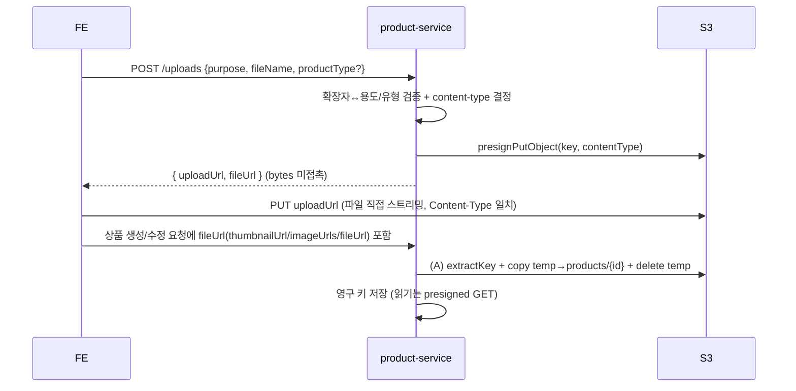

# presigned PUT 업로드 전환 (Spec B: heap fix)

- 작성일: 2026-07-13
- 대상 서비스: product-service
- 상태: 설계 확정 대기(사용자 리뷰)
- 이슈: #308
- 선행: Spec A(#306, 유형별 필드 `file_url`/`external_url`) — 브랜치 `feat/#306-product-type-fields`에서 이어서 진행
- 관련 분할 spec: C(#309, 구매자 산출물 gRPC 전달)

## 1. 배경 / 목적

현재 판매자 파일 업로드는 서버 경유 multipart 방식이다. `FileUploadController.uploadImage`가
`MultipartFile`을 받아 `file.getBytes()`로 **파일 전체를 JVM heap에 `byte[]`로 올리고**
`storageClient.upload(key, bytes, contentType)`로 S3에 전송한다. 대용량(ppt/excel)·동시 업로드 시
heap이 배수로 커지고 humongous object로 잡혀 GC 부담을 준다(= product-service만 heap을 크게 쓰던
원인).

이 spec은 업로드를 **presigned PUT 방식으로 전환**해, 백엔드가 파일 bytes를 만지지 않고 URL만
발급하고 FE가 S3로 직접 스트리밍 PUT하도록 바꾼다. 서버 경유 byte 업로드(`upload(byte[])`,
`MultipartFile`)를 **완전히 제거**한다.

## 2. 범위

### 이 spec(B)이 다루는 것
- 이미지·산출물 파일 업로드를 presigned PUT 발급 방식으로 전환(서버 경유 byte 업로드 제거)
- 통합 발급 엔드포인트 신설, 발급 시점의 확장자·content-type 검증
- `StorageClient`에 presigned 업로드 URL 발급 추가, `upload(byte[])` 제거
- `S3StorageAdapter`에 `presignPutObject` 구현
- 업로드 에러 코드, 테스트, docs 동기화

### 이 spec이 다루지 않는 것
- **FE 구현**: 이미지·파일 업로드 흐름이 "multipart POST" → "presign 요청 후 S3로 직접 PUT"으로
  바뀐다. FE repo(`beadv6_6_3JMT_FE`)의 실제 변경은 별도 트랙. 이 spec은 요청/응답 계약을
  문서화하는 데까지만 관여한다.
- **C (별도 spec, #309)**: 구매자 산출물 gRPC 전달.
- 업로드 크기 제한(content-length-range): 이번엔 content-type 서명 강제까지만. 크기 제한이
  필요하면 presigned POST policy로 추후 보강.

### 선행 의존
- 저장(생성/수정) 경로의 `file_url`/`external_url` 필드와 `moveToProductPath` temp→영구 이동은
  Spec A에서 구현됨. B는 그 위에 업로드 **발급 방식만** 교체한다.

## 3. 아키텍처 / 흐름

버킷은 현재처럼 private을 유지한다. 업로드는 presigned PUT, 읽기는 기존 presigned GET.



- 4~5단계(생성/수정 저장 로직)는 **Spec A 구현 그대로 재사용**. B는 1~3단계(발급)만 새로 만든다.
- 백엔드 heap은 파일 크기·동시성과 무관하게 평평(파일 bytes를 안 받음).

## 4. 발급 엔드포인트 (통합)

`POST /api/v2/sellers/me/products/uploads`

### 요청
```json
{ "purpose": "thumbnail | image | file", "fileName": "sample.pptx", "productType": "PPT" }
```

| 필드 | 필수 | 설명 |
|---|---|---|
| purpose | Y | `thumbnail` / `image` / `file` |
| fileName | Y | 원본 파일명(확장자 추출용) |
| productType | 조건부 | `purpose=file`일 때 필수(`PPT` \| `EXCEL`). 이미지 용도엔 불필요 |

### 응답
```json
{ "uploadUrl": "https://<presigned-put-url>", "fileUrl": "https://<bucket>.s3.<region>.amazonaws.com/<key>" }
```

- `uploadUrl`: FE가 파일을 직접 PUT할 대상(만료 있음).
- `fileUrl`: 업로드 후 상품 생성/수정 요청에 넣을 값. object URL 형태라 기존 `extractKey`가 그대로
  키를 파싱한다(생성/수정 로직 무변경).

### 내부 분기 (검증만 분기, 발급은 공통)
```java
String ext = extractExtension(fileName);
String contentType = switch (purpose) {
    case "file" -> switch (productType) {
        case PPT   -> requireExt(ext, "pptx", "ppt")  ? PPTX_MIME : badType();
        case EXCEL -> requireExt(ext, "xlsx", "xls")  ? XLSX_MIME : badType();
        default    -> badType(); // file인데 지원 유형 아님
    };
    case "thumbnail", "image" -> IMAGE_MIME.getOrDefault(ext, null); // 없으면 badType()
    default -> badType();
};
String key = "products/temp/" + purpose + "/" + UUID.randomUUID() + "." + ext;
String uploadUrl = storageClient.generatePresignedUploadUrl(key, contentType);
return new UploadUrlResponse(uploadUrl, objectUrl(key));
```

허용 확장자·MIME(초안, 구현 시 확정):
- `file` / PPT → `pptx`(+`ppt`), MIME `application/vnd.openxmlformats-officedocument.presentationml.presentation`
- `file` / EXCEL → `xlsx`(+`xls`), MIME `application/vnd.openxmlformats-officedocument.spreadsheetml.sheet`
- `thumbnail`/`image` → `jpg/jpeg/png/gif/webp` (기존 `CONTENT_TYPE_MAP` 재사용)

## 5. 컴포넌트 변경

- **`StorageClient`(포트)**: `String generatePresignedUploadUrl(String key, String contentType)` 추가.
  `String upload(String key, byte[] bytes, String contentType)` **제거**(유일 사용처 사라짐).
- **`S3StorageAdapter`**: `presignPutObject` 구현. 이미 주입된 `s3Presigner`로 GET presign과 대칭.
  content-type을 `PutObjectRequest`에 넣어 서명 → FE가 다른 content-type으로 PUT하면 S3가 거부.
- **발급 컨트롤러**: 기존 `FileUploadController.uploadImage`(multipart) → 위 `/uploads` presign 발급으로
  교체. `import MultipartFile` 및 `file.getBytes()` 제거.
- **`DELETE /api/v2/sellers/me/products/images`**(temp 정리)는 유지. 버려진 temp 업로드 청소용.
  (추가로 `products/temp/` 프리픽스에 S3 lifecycle 만료 규칙을 두면 자동 청소 가능 — 운영 메모.)

## 6. temp → 영구 이동 (Spec A 재사용, 무변경)

업로드 발급은 항상 temp 키(`products/temp/{purpose}/{uuid}.{ext}`)를 만든다. 상품 생성/수정 시
`ProductSellerService`의 `moveToProductPath`가 `products/{productId}/{purpose}/{uuid}.{ext}`로
copy 후 temp를 delete한다(S3엔 move가 없어 copy+delete). 이미 영구 키면 그대로 둔다. 이 로직은
B에서 바꾸지 않는다.

## 7. 검증 / 에러 코드

- 지원하지 않는 확장자·용도(`purpose=file`인데 productType 누락/불일치, 이미지에 비이미지 확장자 등)
  → 400. 신규 `ProductErrorCode.INVALID_UPLOAD_FILE_TYPE`("업로드할 수 없는 파일 형식입니다.") 제안.
- presign 발급 실패 → 기존 `S3_PRESIGN_FAILED`.

## 8. 테스트

- **컨트롤러(단위)**: purpose/productType별 확장자 검증(정상 + 위반 400), content-type 매핑, key 형식
  (`products/temp/{purpose}/...`), `s3Presigner`(또는 `StorageClient`) 목킹으로 `uploadUrl` 반환 검증.
- **어댑터**: `presignPutObject`가 content-type을 서명에 포함하는지(목/서명 요청 검증).
- 기존 `FileUploadControllerTest`(multipart 기반)는 presign 발급 기준으로 교체.
- **실제 S3 PUT 왕복은 배포 환경에서만 수동 검증**(로컬 불가). 이 제약을 PR/문서에 명시.
- Build: `product-service` 기준 `.\gradlew.bat clean build --no-daemon`(루트에서 `:product-service:build`).

## 9. FE 계약 (문서화만)

`docs/api-spec/product.md`에 `/uploads` 발급 엔드포인트(요청/응답)와 "presign 요청 → S3 PUT →
생성/수정 요청에 fileUrl 포함" 흐름을 추가한다. 기존 multipart `/images` 설명은 대체한다.

## 10. docs 동기화 대상 (`sync-product-docs`)

- `docs/api-spec/product.md` — `/uploads` 발급 계약(기존 multipart 업로드 대체)
- `docs/error-codes.md` — `INVALID_UPLOAD_FILE_TYPE`(신규 시)

## 11. 작업 순서 (product-service CLAUDE.md 규칙)

이슈(#308) → 같은 브랜치(`feat/#306-product-type-fields`) 계속 → 구현 → 테스트 → docs 동기화 →
규칙 검증 → 커밋. (PR/이슈 close는 A·B·C 완료 후 일괄)
