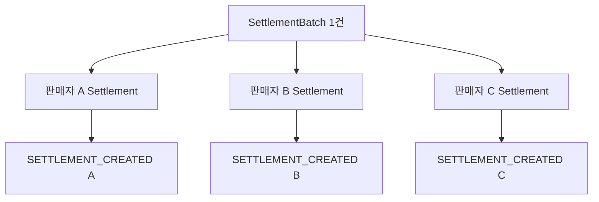
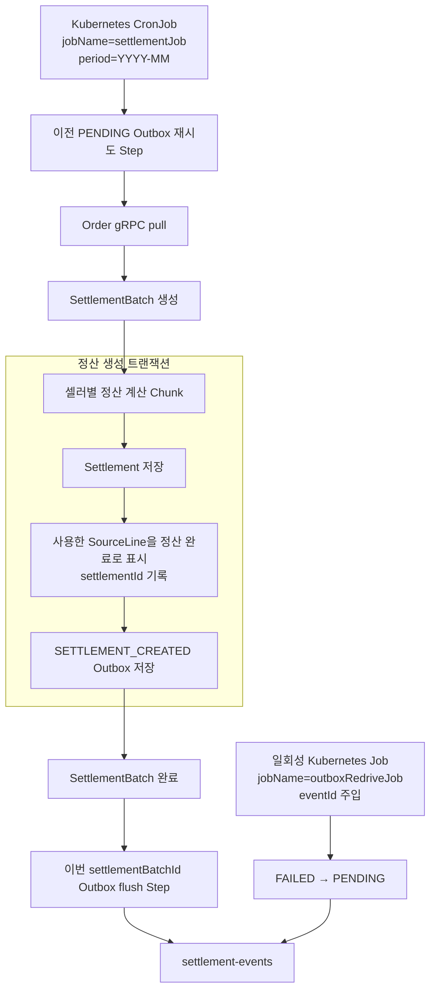
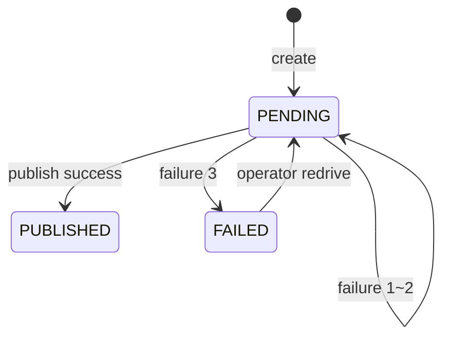

# 정산 생성 이벤트 Transactional Outbox 설계 (#301)

## 1. 배경과 목표

정산 배치는 셀러별 `Settlement`를 만든 뒤 `SETTLEMENT_CREATED` 이벤트를 user-service로 보낸다.
현재 구현은 정산 트랜잭션 커밋 후 `@TransactionalEventListener(AFTER_COMMIT)`가 Kafka로 직접
발행한다. DB 커밋과 Kafka 발행 사이에 프로세스가 종료되면 이벤트가 유실되고, user-service의
`seller_settlement` 초기행도 생성되지 않는다.

이번 작업은 `SETTLEMENT_CREATED` 발행을 Transactional Outbox로 바꾸어 다음을 보장한다.

- `Settlement`와 해당 이벤트가 함께 커밋되거나 함께 롤백된다.
- 저장한 동일 `eventId`로 at-least-once 발행한다.
- 상시 relay 없이 Kubernetes CronJob의 Spring Batch Step에서 Outbox를 flush한다.
- 3회 실패한 이벤트를 `FAILED`로 격리하고 운영자가 별도 Job으로 재처리한다.

## 2. 범위

### 포함

- `SETTLEMENT_CREATED` 정산 1건당 Outbox 1건 적재
- 기존 AFTER_COMMIT 직접 발행 제거
- 일반 정산 Job의 이전 `PENDING` 재시도 Step과 이번 배치 flush Step
- `PENDING → PUBLISHED | FAILED` 상태와 최대 3회 실패 정책
- `eventId`를 입력받는 `outboxRedriveJob`
- 도메인·애플리케이션·영속성·Kafka·Batch 단위/통합 테스트
- 운영 DB 적용용 Outbox 테이블 DDL 문서

### 제외

- Kubernetes manifest와 배포 파이프라인 변경
- 배치 전용 프로세스가 Job 종료 코드로 JVM을 종료시키는 실행 runner
- user-service 컨슈머의 멱등 구현 변경
- `settlement.payout.completed` 등 다른 이벤트의 Outbox 전환
- FAILED 이벤트 조회 화면과 관리자 REST API

현재 저장소에는 Kubernetes manifest와 배치 전용 종료 runner가 없다. 이번 구현은 Spring Batch Job
이름과 Job Parameter 계약을 제공한다. 실제 Kubernetes CronJob/Job은 같은 이미지를 실행하면서 이
계약을 주입하는 후속 배포 작업으로 둔다.

## 3. 결정과 대안

### 선택: 배치 Step flush + 별도 redrive Job

일반 정산은 월 CronJob의 시작과 끝에서 Outbox를 처리하고, 3회 실패 이벤트는 운영자가
`outboxRedriveJob`으로 명시적으로 재처리한다.

이 방식을 선택한 이유는 다음과 같다.

- 상시 프로세스가 없는 순수 CronJob 구조와 맞는다.
- 정산 계산과 이벤트 재처리를 분리해 실패 이벤트 때문에 전체 정산을 다시 계산하지 않는다.
- 영구적인 직렬화·계약 오류를 무한 반복하지 않는다.
- 운영자가 실패 원인을 확인한 뒤 특정 이벤트만 재처리할 수 있다.

### 검토했지만 선택하지 않은 대안

1. **`@Scheduled` 상시 relay**: 정산 서비스가 순수 CronJob이므로 실행할 상시 프로세스가 없다.
2. **관리자 REST redrive API**: 현재 코드에는 REST 서버가 있지만 CronJob 전환 후 호출 지점이
   사라진다.
3. **운영 SQL로 상태 변경**: 구현은 작지만 도메인 전이를 우회하고 실수와 감사 추적 위험이 있다.
4. **FAILED 자동 무한 재시도**: 영구 오류를 매 실행마다 반복하고 운영 격리 의미가 사라진다.

## 4. 이벤트 단위

이벤트는 `SettlementBatch` 1건당 하나가 아니라 생성된 `Settlement` 1건당 하나다.



한 배치에서 100명의 정산이 생성되면 Outbox도 100건 생성된다. 정산 대상 원천 라인이 없는
판매자는 `Settlement`와 Outbox 모두 생성하지 않는다.

- Kafka key와 `aggregateId`: `settlementId`
- Outbox `settlementBatchId`: 이번 배치 이벤트를 마지막 Step에서 묶어 조회하는 내부 상관키
- 멱등키: 저장 시 한 번 생성한 `eventId`

## 5. 전체 실행 흐름



### 일반 정산 Job

1. `retryPendingOutboxStep`이 과거 실행에서 남은 `PENDING`을 이벤트당 한 번 시도한다.
2. 기존 `loadSettlementSourceStep`이 order-service에서 정산 원천을 가져온다.
3. `createSettlementBatchStep`이 `SettlementBatch`를 만든다.
4. `settlementStep`이 셀러별 `Settlement`와 Outbox를 같은 트랜잭션에 저장한다.
5. `completeSettlementBatchStep`이 정산 계산 완료를 기록한다.
6. `flushCurrentBatchOutboxStep`이 이번 `settlementBatchId`의 `PENDING`을 이벤트당 한 번 시도한다.

시작 Step과 마지막 Step의 조회 범위를 분리한다. 시작 Step에서 발행에 실패한 과거 이벤트를 같은
Job의 마지막 Step에서 다시 시도해 재시도 횟수를 빠르게 소진하지 않기 위해서다.

### Outbox redrive Job

1. Job Parameter `eventId`로 Outbox를 조회한다.
2. 상태가 `FAILED`인지 검증한다.
3. 실패·시도 정보를 초기화하고 `PENDING`으로 되돌린다.
4. 저장된 동일 JSON을 즉시 발행한다.
5. 성공하면 `PUBLISHED`, 실패하면 새 재시도 주기의 1회 실패로 `PENDING`을 유지한다.

redrive Job은 order pull, 정산 계산, `SettlementBatch` 생성·완료 Step을 실행하지 않는다.

## 6. Outbox 데이터 모델

테이블 이름은 `settlement_outbox_event`로 한다.

| 필드 | 제약/역할 |
| --- | --- |
| `event_id` | UUID PK, `EventMessage.eventId` |
| `settlement_batch_id` | UUID NOT NULL, 마지막 flush 조회 범위 |
| `aggregate_type` | VARCHAR, `SETTLEMENT` |
| `aggregate_id` | UUID NOT NULL, `settlementId`이자 Kafka key |
| `event_type` | VARCHAR, `SETTLEMENT_CREATED` |
| `topic` | VARCHAR, `settlement-events` |
| `payload` | TEXT NOT NULL, 완성된 `EventMessage<SettlementCreatedPayload>` JSON |
| `status` | VARCHAR, `PENDING`, `PUBLISHED`, `FAILED` |
| `retry_count` | INTEGER NOT NULL, 초기값 0 |
| `occurred_at` | TIMESTAMP NOT NULL, 이벤트 발생 시각 |
| `last_attempted_at` | TIMESTAMP NULL, 마지막 발행 시도 시각 |
| `last_failure_reason` | VARCHAR(1000) NULL, 운영 확인용 요약 |
| `failed_at` | TIMESTAMP NULL, 3회 실패 도달 시각 |
| `published_at` | TIMESTAMP NULL, 발행 성공 시각 |
| `version` | BIGINT, 낙관적 잠금 |
| `created_at`, `updated_at` | `BaseEntity` 감사 시각 |

필수 인덱스는 다음과 같다.

- `(status, last_attempted_at, occurred_at, event_id)`
- `(settlement_batch_id, status, occurred_at, event_id)`
- `(aggregate_id)`

운영 설정은 `ddl-auto: validate`이므로 엔티티만 추가해서는 배포할 수 없다. 저장소에 자동 migration
도구가 없으므로 이번 작업은 `settlement-service/docs/sql/301-settlement-outbox.sql`을 함께 제공하고,
애플리케이션 배포 전에 운영 DB에 적용하는 것을 배포 전제조건으로 둔다. 공통 설정과 배포 스크립트는
수정하지 않는다.

## 7. 도메인 상태와 규칙



`OutboxEvent`가 다음 상태 메서드를 소유한다.

- `create(...)`: 필수값을 검증하고 `PENDING`, `retryCount=0`으로 생성
- `markPublished(publishedAt)`: `PENDING → PUBLISHED`
- `recordPublishFailure(reason, attemptedAt, maxRetryCount)`: 시도 시각과 실패 원인을 기록하고
  실패 횟수가 3에 도달하면 `FAILED`와 `failedAt` 기록
- `requeueForRedrive()`: `FAILED → PENDING`, 재시도·시도·실패 정보를 초기화

`requeueForRedrive()`는 `FAILED`가 아닌 상태에서 호출하면 도메인 예외를 던진다. 실패 원인은
스택트레이스가 아니라 길이를 제한한 운영용 메시지만 저장한다.

## 8. 컴포넌트와 패키지

```text
application/
  port/
    OutboxEventAppender.java
    SettlementEventPublisher.java
  usecase/
    OutboxEventUseCase.java
  service/
    OutboxApplicationService.java
    OutboxEventPublishService.java

domain/
  model/
    OutboxEvent.java
  model/enums/
    OutboxEventStatus.java
  repository/
    OutboxEventRepository.java

infrastructure/
  persistence/outbox/
    JsonOutboxEventAppender.java
    OutboxEventRepositoryAdapter.java
    OutboxEventJpaRepository.java
  messaging/kafka/producer/
    KafkaSettlementEventPublisher.java
  batch/tasklet/
    RetryPendingOutboxTasklet.java
    FlushCurrentBatchOutboxTasklet.java
    RedriveOutboxTasklet.java
  batch/config/
    SettlementJobConfig.java
    SettlementStepConfig.java
    OutboxRedriveJobConfig.java
```

### 역할

- `SettlementCalculationApplicationService`: 정산, SourceLine 처리, Outbox 적재를 조율한다.
- `OutboxEventAppender`: 공통 `EventMessage`를 한 번 만들고 JSON으로 직렬화해 저장한다.
- `OutboxApplicationService`: 조회 범위를 정하고 후보 이벤트를 순회한다.
- `OutboxEventPublishService`: 이벤트 한 건의 발행과 상태 전이를 독립 트랜잭션으로 처리한다.
- Batch Tasklet: Job Parameter와 ExecutionContext에서 범위를 얻어 use case만 호출한다.
- `KafkaSettlementEventPublisher`: 저장된 JSON을 Kafka에 보내고 broker ack를 확인한다.

기존 `SettlementCreatedEventListener`와 `SettlementCalculationApplicationService`의
`ApplicationEventPublisher` 의존은 제거한다. `KafkaSettlementEventPublisher`는 이벤트를 새로 감싸지
않고 Outbox에 저장된 topic, aggregateId, JSON을 발행하도록 변경한다. raw JSON이 문자열로 이중
인코딩되지 않도록 Outbox 발행 전용 `KafkaTemplate<String, String>`을 사용한다.

## 9. 트랜잭션 경계

### 정산 생성

다음 변경은 하나의 `@Transactional` 경계에 있다.

```text
Settlement 저장
+ 사용한 SettlementSourceLine을 정산 완료로 표시
+ 각 SourceLine에 settlementId 기록
+ SETTLEMENT_CREATED Outbox 저장
```

JSON 직렬화나 Outbox 저장이 실패하면 `Settlement`와 SourceLine 변경도 롤백한다. 그러면 해당
원천은 다음 정상 실행에서 다시 정산할 수 있다.

### Outbox 발행

후보 조회와 이벤트 발행을 분리한다. `OutboxEventPublishService`가 이벤트 한 건마다
`REQUIRES_NEW` 트랜잭션을 사용한다.

- 한 이벤트의 실패가 앞서 성공한 이벤트의 `PUBLISHED`를 롤백하지 않는다.
- Job 중간에 파드가 종료돼도 이미 처리한 이벤트 상태는 보존된다.
- Kafka 발행 성공 후 DB 커밋 전에 종료되면 동일 이벤트가 다시 발행될 수 있다.
- 이 중복은 동일 `eventId`와 user-service의 `eventId + consumerGroup` 멱등 처리로 흡수한다.

## 10. 조회와 반복 처리

flush는 설정된 batch size만큼 후보 ID를 조회하고 keyset cursor로 다음 묶음을 처리한다. offset
pagination은 처리 중 상태 변경으로 결과 집합이 줄어 이벤트를 건너뛸 수 있으므로 사용하지 않는다.

- 정렬키: `(occurredAt, eventId)`
- 시작 Step 조건: `status=PENDING`이고 `lastAttemptedAt`이 Step 시작 시각보다 이전이거나 NULL
- 마지막 Step 조건: `status=PENDING`이고 `settlementBatchId=현재 배치 ID`

모든 발행 시도는 `lastAttemptedAt`을 갱신한다. 실패해 `PENDING`으로 남더라도 cursor가 이미 해당
이벤트를 지나고 시작 시각 조건에서도 제외되므로 같은 Step에서는 한 번만 시도한다.

## 11. 실패 처리

| 실패 | 처리 |
| --- | --- |
| EventMessage 직렬화·Outbox 저장 실패 | 정산 생성 트랜잭션 롤백, 정산 Step 실패 |
| Kafka 연결 실패·broker ack timeout | 실패 횟수 증가, 다음 이벤트 계속 처리 |
| Kafka 1~2회 실패 | `PENDING` 유지 |
| Kafka 3회 실패 | `FAILED`, 원인과 실패 시각 기록 |
| Outbox 조회·상태 저장 DB 장애 | flush Step과 Spring Batch Job 실패 |
| redrive eventId 없음 | redrive Job 실패 |
| `FAILED`가 아닌 이벤트 redrive | 도메인 예외로 redrive Job 실패 |

Kafka 발행은 설정한 timeout 동안 `KafkaTemplate.send(...).get(...)`으로 broker ack를 기다린다.
개별 Kafka 실패는 정산 Job을 실패시키지 않지만, Outbox 상태를 기록할 수 없는 DB 장애는 Job을
실패시켜 운영에서 감지하게 한다.

## 12. SettlementBatch와 Spring Batch Job 상태

Job 순서가 `정산 완료 → Outbox flush`이므로 flush의 DB 장애 시 상태는 다음과 같이 갈릴 수 있다.

```text
SettlementBatch.status = COMPLETED
Spring Batch Job status = FAILED
```

이는 계산 완료와 이벤트 전달 인프라 실패를 구분한 결과다. 기존
`SettlementBatchFailureListener`는 `SettlementBatch`가 `PROCESSING`일 때만 실패 전이하도록 보완한다.
이미 `COMPLETED`인 배치를 다시 `FAILED`로 바꾸지 않으며, Spring Batch Job의 실패와 다음 실행의
시작 flush로 전달 장애를 복구한다.

## 13. 동시 실행

- Kubernetes CronJob은 `concurrencyPolicy: Forbid`로 배포하는 것을 권장한다.
- `OutboxEvent`는 `@Version`으로 낙관적 잠금을 적용한다.
- 발행 성공 후 DB 커밋 전 종료나 드문 실행 중첩에 따른 중복 발행은 at-least-once의 정상 범위다.
- consumer가 동일 `eventId`를 멱등 처리하므로 중복 효과는 발생하지 않는다.
- 낙관적 잠금 충돌은 조용히 덮어쓰지 않고 해당 Step/Job의 인프라 실패로 드러낸다.

## 14. Kubernetes 실행 계약

정산 CronJob은 다음 값을 주입한다.

```text
jobName=settlementJob
period=YYYY-MM
triggerType=SCHEDULED
requestedAt=<unique value>
```

운영 redrive용 일회성 Kubernetes Job은 다음 값을 주입한다.

```text
jobName=outboxRedriveJob
eventId=<failed outbox event UUID>
requestedAt=<unique value>
```

두 Job은 같은 애플리케이션 이미지와 DB/Kafka 설정을 사용한다. 상시 `@Scheduled` Outbox relay나
고정 REST endpoint는 요구하지 않는다.

## 15. 테스트 전략

### 도메인

- `OutboxEvent` 생성 시 `PENDING`, retry 0
- 발행 성공 시 `PUBLISHED`, `publishedAt` 기록
- 1~2회 실패 시 `PENDING`, 실패 정보 기록
- 3회 실패 시 `FAILED`, `failedAt` 기록
- `FAILED`만 redrive 가능하고 실패 정보 초기화

### 애플리케이션

- 정산 1건당 Outbox 1건 적재
- 정산 대상이 없으면 Outbox 미적재
- 기존 Spring 내부 이벤트 직접 발행 제거
- 한 이벤트의 Kafka 실패 뒤 다음 이벤트 계속 처리
- 과거 `PENDING`과 이번 `settlementBatchId` 조회 범위 분리

### 영속성·트랜잭션 통합

- `Settlement`, 사용한 SourceLine 처리, Outbox 동시 커밋
- Outbox 저장 실패 시 세 변경 모두 롤백
- 상태·시도 시각·cursor·batchId 조회 조건
- Outbox 테이블 인덱스와 낙관적 잠금

### Kafka·배치

- 저장한 동일 JSON, topic, `settlementId` key 발행
- 성공, timeout, 1회 실패, 3회 실패
- `이전 PENDING → 원천 pull → 정산 → 완료 → 이번 배치 flush` Step 순서
- redrive Job은 지정한 FAILED 이벤트만 처리하고 정산 계산 Step을 실행하지 않음
- flush DB 장애 시 `SettlementBatch=COMPLETED`, Spring Batch Job=`FAILED`
- 다음 실행에서 남은 `PENDING` 재시도

## 16. 완료 조건

- 정산 생성 트랜잭션과 Outbox 저장의 원자성이 통합 테스트로 증명된다.
- 동일 이벤트의 모든 발행과 redrive가 저장된 동일 `eventId`를 사용한다.
- 일반 정산 Job이 과거 실패분과 이번 배치 이벤트를 각각 한 번씩 처리한다.
- 3회 실패 이벤트가 `FAILED`로 남고 `outboxRedriveJob`으로 선택 재처리된다.
- 개별 Kafka 실패는 정산 계산 결과를 되돌리지 않는다.
- 정산 서비스 전체 테스트와 저장소 규칙 검증이 통과한다.
