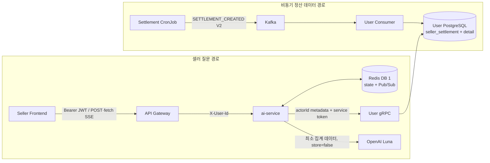
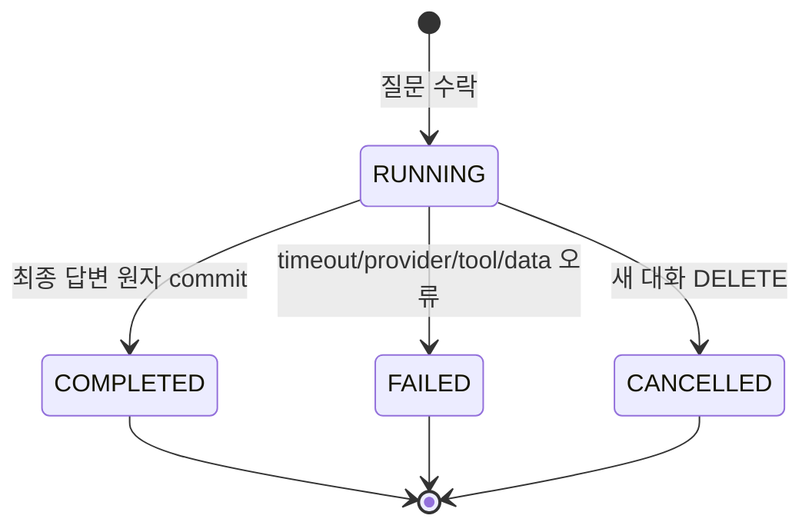

# 셀러 AI 정산 어시스턴트 설계

- 작성일: 2026-07-22
- 상태: 설계 승인 완료, 애플리케이션·Kubernetes 정적 검증 완료, 운영 rollout·live smoke 전
- 대상 모듈: 신규 `ai-service`, `user-service`, `settlement-service`, `grpc`, `apigateway`, `config`, `k8s`
- 현재 사용자: 판매자
- 설계·브레인스토밍 모델: Codex `gpt-5.6-sol`, reasoning effort `max`
- 서비스 런타임 모델: OpenAI `gpt-5.6-luna`, reasoning effort `low`

## 1. 결정 요약

셀러가 자신의 정산을 자연어로 질문하면 AI가 질문을 해석하고 필요한 조회 Tool을 선택해 User 서비스의
정산 데이터를 조회한 뒤 설명한다. 첫 범위는 **월·주 단위 정산 분석과 지급 상태 안내**이며, 모든 Tool은
읽기 전용이다.

AI 기능은 기존 서비스에 넣지 않고 독립 `ai-service`로 만든다. `ai-service`는 대화, 실행 상태,
Spring AI/OpenAI 호출과 Tool orchestration만 담당한다. 정산 원장, 판매자 소유권 검증, 기간·금액 집계는
User 서비스가 담당한다. Settlement 서비스는 주간 CronJob이므로 동기 gRPC 서버 역할을 맡지 않는다.

핵심 선택은 다음과 같다.

| 항목 | 결정 |
| --- | --- |
| 서비스 경계 | 독립 `ai-service` |
| AI 방식 | Spring AI의 Tool Calling을 사용한 수동 agent loop |
| 검색 방식 | 첫 버전은 RAG·Vector DB·Embedding 없음 |
| 범위 | 셀러의 월·주 정산 분석, 기간 비교, 지급 상태 |
| 데이터 원장 | User DB의 `seller_settlement`와 신규 `seller_settlement_detail` |
| Settlement → User | `SETTLEMENT_CREATED` Kafka V2 한 건에 Detail 전체 포함 |
| AI → User | User가 소유한 `grpc/user/seller_settlement_query.proto` |
| Tool 수 | 4개 |
| 대화 저장 | 기존 Redis 인스턴스의 logical DB 1, TTL 24시간 |
| 실시간 전송 | Spring MVC `SseEmitter` + Redis Pub/Sub |
| 동시 실행 | Pod당 설정 가능한 초기값 4, 대기열 없음 |
| 실행 제한 | 전체 90초, Tool Calling 최대 4라운드 |
| 재시도 | OpenAI 호출당 transient 오류에 한해 1회, User gRPC는 재시도 없음 |
| 배포 | Kubernetes Deployment 1 replica, Docker Compose 추가 없음 |
| 역할 | 현재 role 전달·판단 없음, admin 확장은 후속 설계 |

## 2. 배경과 현재 제약

### 2.1 Settlement 서비스는 상시 서버가 아니다

Settlement 서비스는 이전 주의 월요일부터 일요일까지를 계산하는 CronJob이다. Job이 종료되면 Pod도
종료되므로 셀러 질문 시점에 Settlement 서비스로 gRPC를 호출할 수 없다. 정산 결과를 동기 조회하려면
상시 실행되는 서비스가 데이터를 보유해야 한다.

기존 구조에서 `SETTLEMENT_CREATED` 이벤트가 User 서비스의 `seller_settlement`를 seed한다. 따라서
셀러용 운영 정산 데이터의 소유자는 User 서비스다. AI도 이 경계를 그대로 따른다.

### 2.2 기존 이벤트에는 분석 Detail이 없다

현재 `SettlementCreatedEvent`는 정산 ID, 판매자 ID, 주간 기간, 건수와 합계만 전달한다. 이 데이터만으로
주간 지급 상태와 단순 합계는 설명할 수 있지만 다음 내용은 정확하게 계산하기 어렵다.

- 달력 월의 일자 범위에 맞춘 실적과 부분 월 비교
- 판매 금액과 총 환불 금액의 분리
- 판매 수수료와 환불 시 돌려준 수수료의 분리
- 주차별 환불·수수료 변화 원인 설명

Settlement의 `SettlementDetail` 원본을 Kafka V2에 포함하고 User의 분석 read model에 복제한다. AI가
원본 Detail을 읽는 것은 아니다. User가 Detail을 SQL로 집계한 결과만 AI에 돌려준다.

### 2.3 현재 인증과 역할 상태

Gateway는 JWT를 검증한 뒤 다운스트림에 `X-User-Id`를 전달한다. 현재 코드에는 `X-User-Role` 전달도
남아 있지만, AI 정산 어시스턴트는 role 헤더를 읽거나 프롬프트에 전달하지 않는다. 이번 설계의
“셀러용”은 판매자 자신의 정산 데이터만 조회하는 제품 범위와 응답 하네스를 의미한다.

추후 admin 지원 시 role을 어디서 어떤 계약으로 전달할지는 별도 결정한다. 지금 미리 role 필드,
admin Tool 또는 조건부 prompt를 만들지 않는다.

## 3. 목표와 제외 범위

### 3.1 목표

- 셀러가 자연어로 자신의 월·주 정산을 요약받는다.
- 셀러가 월간 또는 주간 기간을 비교한다.
- 셀러가 월에 속한 주간 정산들의 지급 상태를 함께 확인한다.
- AI가 질문에 맞는 Tool을 선택하고 필요하면 여러 Tool을 순차 호출한다.
- 금액, 증감률, 비교 가능 여부와 상태 판단은 User 서비스가 계산한다.
- 질문 실행 진행 상태와 답변을 SSE로 전달한다.
- 새로고침 후에도 24시간 동안 최근 대화와 실행 결과를 복구한다.
- 판매자 식별자, 주문 식별자와 Detail 원본을 OpenAI에 보내지 않는다.

### 3.2 제외 범위

- 주문 조회와 주문별 원인 추적
- 지급 신청, 상태 변경 또는 다른 write Tool
- 매출·정산 예측, 정책 시뮬레이션, 추천 액션
- 운영 문서·정책 문서를 검색하는 RAG
- admin용 Tool과 role별 응답 확장
- 여러 대화방 목록, 대화방 이름, 영구 대화 보관
- Tool 원문, hidden chain-of-thought 또는 모델 내부 추론 노출
- AI 실행 작업의 Pod 간 이어받기
- Prometheus·Grafana·분산 추적 인프라 신규 구축
- AI 전용 Redis 인스턴스 분리

## 4. 아키텍처 선택과 판단 근거

### 4.1 독립 `ai-service`

세 가지 안을 비교했다.

| 안 | 장점 | 단점 | 결과 |
| --- | --- | --- | --- |
| 독립 AI 서비스 | OpenAI 비용·보안·대화 상태·Tool orchestration을 격리하고 향후 다른 도메인으로 확장 가능 | 신규 배포 단위와 내부 gRPC 필요 | 채택 |
| User 서비스 안에 포함 | 초기 파일 수와 배포 단위가 적음 | 정산 원장 책임과 AI vendor·streaming·대화 책임이 섞임 | 기각 |
| 범용 Agent 플랫폼 선행 | 장기적으로 여러 역할·도메인 지원 | 현재 네 개 Tool에 비해 추상화와 학습 범위가 큼 | 기각 |

Spring AI 의존성과 OpenAI API Key는 `ai-service`에만 둔다. User 서비스는 AI SDK나 prompt를 알지
못하며, deterministic 정산 query service만 제공한다.

### 4.2 Spring MVC와 `SseEmitter`

처음에는 OpenAI streaming, Redis Pub/Sub과 SSE를 한 reactive pipeline으로 연결하는 WebFlux를
검토했다. 현재 프로젝트는 대부분 Spring MVC이며 포트폴리오 범위에서 WebFlux 전체 학습 비용이 크다.
초기 replica와 트래픽도 작으므로 MVC를 유지한다.

- HTTP API와 SSE: `spring-boot-starter-web`, `SseEmitter`
- Agent 실행: 제한된 전용 `ThreadPoolTaskExecutor`
- Redis: `StringRedisTemplate`, `RedisMessageListenerContainer`
- User 호출: blocking gRPC Stub에 호출당 3초 deadline
- OpenAI 최종 응답: Spring AI stream을 내부에서 끝까지 버퍼링하고 안전 정책을 검증한 뒤,
  Redis 완료 commit 후 표시용 chunk와 `done`을 Pub/Sub으로 발행

`SseEmitter`는 Servlet async를 사용하므로 SSE 연결 시간 내내 요청 처리 스레드를 점유하지 않는다.
WebFlux와 Reactive Redis는 도입하지 않는다.

### 4.3 Tool Calling, RAG 아님

첫 버전의 답은 정산 원장에 있는 구조화된 숫자와 상태에서 나온다. 문서 검색이 필요하지 않으므로
RAG를 넣지 않는다. Agent는 모델이 질문을 보고 네 개 Tool 중 필요한 것을 선택하는 Tool Calling
방식으로 구현한다.

Tool Calling을 사용하는 이유는 느린 `SettlementDetail`을 ID별로 조회하기 위해서가 아니다.
AI가 필요한 **집계 종류**를 선택하게 하고, 권한과 계산을 User 서비스에 고정하기 위해서다.

## 5. 전체 구성과 책임



| 구성요소 | 책임 | 하지 않는 일 |
| --- | --- | --- |
| Settlement | 주간 정산과 Detail 계산, Kafka V2 발행 | 셀러 질문 동기 응답 |
| User Consumer | V1/V2 분기, 부모·Detail 트랜잭션 저장, DLT | AI 응답 생성 |
| User Query Service | actor 소유권, 기간 검증, 금액·상태 집계 | OpenAI 호출 |
| AI Chat API | 입력 검증, run 생성, SSE, 대화 저장 | 금융 계산 |
| Agent Orchestrator | Tool 선택 loop, 제한·재시도·최종 답변 | sellerId를 모델 Tool 인자로 제공 |
| Redis | 대화·run·lock, Pod 간 실시간 이벤트 | 정산 원장 영구 저장 |
| OpenAI | 질문 해석과 집계 결과 설명 | 원본 Detail 조회, 권한 판단 |

## 6. Settlement 이벤트 V2

### 6.1 버전 위치

공통 `EventMessage<T>`는 모든 도메인이 함께 쓰므로 수정하지 않는다. `payloadVersion`은
`SettlementCreatedEvent` payload에 둔다.

- 버전 필드 없음 또는 `payloadVersion = 1`: 기존 요약 전용 V1
- `payloadVersion = 2`: 요약 + `details[]`
- 그 밖의 값 또는 해당 버전 DTO로 역직렬화 불가: 재시도 후 DLT

V1 DTO와 소비 코드는 계약 변경 이력을 남기기 위해 유지한다. 초기화 이후 정상 producer는 V2만
발행하므로 V1 유입을 운영 정상 시나리오로 가정하지 않는다.

### 6.2 V2 JSON 예시

```json
{
  "eventId": "0f6edb38-73be-4f65-9cc4-20889b0b8461",
  "eventType": "SETTLEMENT_CREATED",
  "occurredAt": "2026-07-20T01:12:03",
  "aggregateType": "SETTLEMENT",
  "aggregateId": "92fa7fd2-cd34-4ce3-89db-8381096e837b",
  "payload": {
    "payloadVersion": 2,
    "settlementId": "92fa7fd2-cd34-4ce3-89db-8381096e837b",
    "sellerId": "7c0ae024-86fa-4497-8be1-1440ce8f65de",
    "periodStart": "2026-07-13",
    "periodEnd": "2026-07-19",
    "productCount": 1,
    "totalAmount": 100.00,
    "refundAmount": 40.00,
    "feeTotalAmount": 9.00,
    "settlementTotalAmount": 51.00,
    "calculatedAt": "2026-07-20T01:12:02",
    "details": [
      {
        "settlementDetailId": "bba2a583-599e-41a9-88bf-4521c4b5302f",
        "orderProductId": "286d2ad4-09ff-493c-9013-07becf3db364",
        "lineType": "SALE",
        "lineAmount": 100.00,
        "feeRate": 0.1500,
        "feeAmount": 15.00,
        "lineSettlementAmount": 85.00,
        "occurredAt": "2026-07-14T13:10:00"
      },
      {
        "settlementDetailId": "21f48bec-7b00-44b4-9d8f-5767141a759b",
        "orderProductId": "286d2ad4-09ff-493c-9013-07becf3db364",
        "lineType": "REFUND",
        "lineAmount": -40.00,
        "feeRate": 0.1500,
        "feeAmount": -6.00,
        "lineSettlementAmount": -34.00,
        "occurredAt": "2026-07-17T09:20:00"
      }
    ]
  }
}
```

한 Settlement의 Detail은 한 이벤트에 모두 넣는다. chunk event와 Kafka message size override는 이번
범위에 넣지 않는다. 현재 추정으로 Detail 하나가 약 300 byte이고 1,000건도 기본 약 1 MiB 한도보다
충분히 작다. 향후 수천 건 수준에 도달하면 serialized event size metric을 근거로 chunking 또는 broker
설정을 별도 설계한다.

### 6.3 금액 의미 수정

현재 Settlement 계산은 `refundAmount`를 항상 0으로 두고 `productCount`에 환불 Detail도 포함한다.
V2 전환과 함께 다음 의미로 바로잡는다.

| 필드 | 계산 |
| --- | --- |
| `productCount` | `SALE` Detail 수 |
| `totalAmount` | `SALE.lineAmount` 합계 |
| `refundAmount` | `abs(sum(REFUND.lineAmount))` |
| `feeTotalAmount` | 판매 수수료 - 환불로 돌려준 수수료, 즉 전체 signed `feeAmount` 합계 |
| `settlementTotalAmount` | 전체 signed `lineSettlementAmount` 합계 |

판매 100원, 환불 40원, 수수료율 15%라면 판매 수수료 15원, 돌려준 수수료 6원, 순수수료 9원,
지급액 51원이다. User의 Detail 집계는 판매 수수료와 돌려준 수수료를 별도 값으로도 제공할 수 있다.

### 6.4 소비, 멱등성과 DLT

User Consumer는 JSON tree에서 `eventType`을 확인한 뒤 payload version을 읽고 해당 DTO로
역직렬화한다.

1. V1이면 기존 `seller_settlement` 요약을 저장하고 `payload_version = 1`로 기록한다.
2. V2이면 부모와 Detail 전체를 한 DB 트랜잭션으로 저장하고 `payload_version = 2`로 기록한다.
3. 같은 `settlement_id`가 이미 있으면 중복 이벤트로 보고 no-op 처리한다.
4. 알 수 없는 버전, 깨진 JSON, V2 필수 Detail 오류는 예외를 발생시킨다.
5. 기존 `DefaultErrorHandler`의 1초 간격 3회 재시도 후 `settlement-events.DLT`로 보낸다.
6. DLT publish가 성공한 뒤 원본 offset을 진행한다. DLT publish 실패 시 원본을 ack하지 않는다.

DLT는 Dead Letter Topic의 줄임말이며 같은 Kafka cluster와 PVC에 retention 기간 동안 저장된다. 별도
데이터베이스 테이블은 만들지 않는다. DLT notifier는 User 서비스가 소비해 Slack Incoming Webhook으로
metadata만 전송한다. Webhook URL이 없으면 notifier만 비활성화하고 DLT 자체는 정상 동작한다.

Slack 알림에는 topic, partition, offset, event type, payload version, 예외 분류와 발생 시각만 넣는다.
전체 payload, sellerId와 금액은 넣지 않는다. 채널과 Webhook URL은 후속 제공받으며 Kubernetes Secret으로
관리한다. 재처리는 운영자가 DLT record를 확인해 원인을 수정한 뒤 원본 topic으로 수동 replay하는
runbook으로 시작한다.

## 7. User DB와 Flyway

### 7.1 부모 테이블 변경

기존 `seller_settlement`에 다음 컬럼을 추가한다.

```sql
payload_version smallint NOT NULL
```

이 값은 정상 UI에서 V1/V2 혼합 UX를 제공하기 위한 것이 아니다. 정상 유입은 V2뿐이지만 예기치 않은
V1 저장 여부를 운영자가 식별하고 계약 상태를 진단하기 위해 남긴다.

### 7.2 신규 Detail 테이블

```text
seller_settlement_detail
├─ settlement_detail_id       UUID PK
├─ seller_settlement_id       UUID FK -> seller_settlement, ON DELETE CASCADE
├─ order_product_id           UUID
├─ line_type                  SALE | REFUND
├─ line_amount                NUMERIC(12,2)
├─ fee_rate                   NUMERIC(5,4)
├─ fee_amount                 NUMERIC(12,2)
├─ line_settlement_amount     NUMERIC(12,2)
├─ occurred_at                TIMESTAMP
└─ created_at                 TIMESTAMP
```

`settlement_detail_id`는 User가 새로 만드는 ID가 아니라 Settlement 원본 Detail UUID다. 이 UUID를 PK로
사용해 재전달 시 Detail 중복을 막고 원천 추적성을 보존한다. Detail은 영구 정산 read model이므로 별도
만료 시각을 두지 않는다.

인덱스는 다음 두 조회 경로를 기준으로 둔다.

- `seller_settlement(seller_id, period_start, period_end)`
- `seller_settlement_detail(seller_settlement_id, occurred_at)`

기간 분석은 Settlement ID를 하나씩 가져와 N+1 조회하지 않는다. seller 조건으로 부모를 제한하고
Detail을 join한 뒤 기간과 주차를 기준으로 DB에서 한 번에 집계한다.

### 7.3 V3 마이그레이션과 초기화

User와 Settlement 모두 V1/V2 파일을 수정하지 않고 다음 V3 파일을 추가한다.

User V3의 책임:

- 기존 `seller_settlement` 정산 데이터 삭제
- `payload_version` 추가
- `seller_settlement_detail`과 FK·check constraint·index 생성
- 사용자, 판매자 등록, 인증과 다른 도메인 데이터는 삭제하지 않음

Settlement V3의 책임:

- `settlement_detail`, `settlement_outbox_event`, `settlement_source_line`, `settlement`,
  `settlement_batch` 초기화
- 같은 주차를 다시 실행할 수 있도록 Spring Batch execution/context/parameter/instance metadata 초기화
- 서비스 소유 sequence를 필요한 경우 restart

이 프로젝트의 현재 정산 데이터는 재생성 전제로 삭제한다. 범용 운영 migration으로 재사용할 수 있는
정책이 아니므로 SQL 주석과 배포 runbook에 파괴적 one-time reset임을 명시한다.

운영·개발 profile은 `ddl-auto: validate`를 유지한다. User와 Settlement의 local profile도 `update`가
남아 있다면 `validate`로 바꾼다. 테스트 profile의 Flyway 비활성화와 create-drop/H2 정책은 테스트
목적에 맞게 유지한다.

Settlement는 CronJob이므로 V3는 image를 올린 순간이 아니라 다음 CronJob Pod가 시작될 때 실행된다.
Consumer 활성화와 backfill 전에 migration 완료 로그를 반드시 확인한다.

## 8. User 소유 gRPC 계약

### 8.1 위치와 이름

계약은 다음 위치에 하나만 둔다.

```text
grpc/user/seller_settlement_query.proto
```

- 서버이자 데이터 소유자: User 서비스
- 소비자: AI 서비스
- wire package: `prompthub.sellersettlement`
- service: `SellerSettlementQueryService`
- Java package: User 서버 소유 기준 `com.prompthub.user.grpc.sellersettlement`

호출자가 AI라도 데이터를 응답하는 서버가 User이므로 `grpc/user/`에 둔다. 파일과 service 이름은
호출자나 구현 기술이 아니라 소유 도메인인 seller settlement를 따른다. 같은 bounded context의 조회를
하나의 proto에 모으되, 하나의 범용 JSON RPC가 아니라 네 개 목적별 RPC로 나눈다.

Settlement 서비스에 계약을 두지 않는 이유는 두 가지다. Settlement는 상시 서버가 아니며, 셀러용
운영 read model의 소유자는 User이기 때문이다.

### 8.2 RPC와 Tool 매핑

| Agent Tool | User RPC | 주요 입력 | 주요 출력 |
| --- | --- | --- | --- |
| `get_settlement_summary` | `GetSettlementSummary` | `MONTH\|WEEK`, 한 기간 | 판매·환불·수수료·지급액·건수·partial·dataThrough |
| `compare_settlement_periods` | `CompareSettlementPeriods` | `MONTH\|WEEK`, 두 기간 | 각 기간 집계, 차액, 증감률, comparable |
| `get_weekly_settlement_breakdown` | `GetWeeklySettlementBreakdown` | 월 `YYYY-MM` | 해당 달의 완료 주차별 집계 |
| `get_payout_status` | `GetPayoutStatus` | 정산 월 `YYYY-MM` | 상태별 건수와 주간 정산별 상태·지급완료일 |

`get_settlement_summary`와 `compare_settlement_periods`는 네 개 Tool을 유지하면서 월·주 질문의 모든
금액을 서버 계산으로 만들기 위해 `MONTH | WEEK`를 지원한다.

```text
MONTH: currentPeriod=2026-07, comparisonPeriod=2026-06
WEEK : currentPeriod=2026-07-13, comparisonPeriod=2026-07-06
```

단일 요약도 `MONTH: period=2026-07`, `WEEK: period=2026-07-13` 형식을 쓴다. WEEK 값은 반드시
월요일이어야 하며 User가 형식과 요일을 검증한다. 모델이 잘못된 값을 생성하면 INVALID_ARGUMENT를
반환하고 Agent run을 안전하게 실패시킨다.

### 8.3 scalar 표현

Protobuf에는 금융용 decimal scalar가 없고 `double`은 이진 부동소수점 오차가 있다. 금액과 비율은
정확한 십진 문자열로 전달한다.

| 값 | Proto 타입 | 예시 |
| --- | --- | --- |
| 금액 | `string` | `"123456.78"` |
| 비율 | `string` | `"12.34"` |
| 건수 | `int32` 또는 `int64` | `42` |
| 월 | `string` | `"2026-07"` |
| 날짜·시각 | ISO `string` | `"2026-07-13"` |
| 비교 가능 | `bool` | `false` |

프론트와 제품이 항상 원화로 표시하므로 `currency_code`는 넣지 않는다. AI system prompt에는 전달된
금액이 모두 KRW임을 고정해 자연어 답변에서 원 단위로 설명하게 한다.

### 8.4 집계와 기간 의미

- 모든 Detail `occurredAt` 해석은 `Asia/Seoul` 기준이다.
- 주는 월요일부터 일요일까지다.
- 현재 진행 중인 미완료 주는 예측하지 않고 제외한다.
- 주 요약은 입력한 월요일부터 일요일까지의 완전한 한 주를 반환한다. “이번 주” 같은 상대 표현은
  최신 완료 주로 해석해 답변에 실제 기간을 명시한다.
- 현재 월은 최신 완료 주의 일요일까지를 `dataThrough`로 반환하고 `partial = true`로 표시한다.
- 부분 현재 월 비교는 이전 월의 동일 일자 범위까지만 비교한다.
- 이전 값이 0이고 현재 값이 양수면 `comparable = false`이고 증감률 문자열은 비운다.
- 두 값이 모두 0이면 변화 없음으로 반환한다.
- 취소된 주간 정산의 Detail은 금액 분석에서 제외하지만 지급 상태 건수에는 `CANCELLED`로 포함한다.

월 분석과 주차 breakdown은 Detail의 달력 날짜를 사용한다. 월 경계를 가로지르는 완료 주는 요청 월에
속한 Detail만 해당 월 bucket에 포함하고 경계 주차임을 표시한다. 이 규칙으로 월 요약과 주차 breakdown의
합계가 일치한다. 반면 `get_settlement_summary(WEEK)`는 월 경계와 관계없이 월요일~일요일 전체를
반환하므로 “지난주 정산”이 일부 날짜만 잘리지 않는다.

지급 상태는 Detail 날짜가 아니라 기존 월별 정산 조회 규칙을 따른다. 주간 정산의 가운데 날인 목요일,
즉 `periodStart + 3일`이 속한 달을 해당 정산 월로 사용한다. `get_payout_status`는 선택 월의 단일 상태를
만들지 않고 상태별 건수와 주간 정산 전체를 반환한다.

### 8.5 인증 metadata

Tool의 모델 노출 schema에는 sellerId가 없다. AI 서버가 Gateway에서 받은 actorId를 내부
`ToolContext`에 보관하고 gRPC metadata에 결합한다.

```text
x-user-id: <actor UUID>
x-internal-service-token: <AI_USER_GRPC_TOKEN>
```

User의 server interceptor가 내부 토큰을 먼저 constant-time 비교한 뒤 actorId 형식을 검증한다. Query는
이 actorId를 `seller_id` 조건으로 강제한다. 요청 message의 ID나 모델 출력으로 소유자를 바꿀 수 없다.
내부 토큰은 AI와 User Pod가 Kubernetes Secret에서 주입받는다.

AI가 User에 호출하는 각 RPC deadline은 3초다. 자동 재시도는 하지 않는다. 불완전한 데이터 일부로
AI가 답하지 않도록 한 Tool이라도 실패하면 해당 run 전체를 실패시킨다.

## 9. AI 서비스 내부 설계

### 9.1 모듈 구성

신규 모듈은 루트 `settings.gradle`과 Boot application 목록에 추가하되, JPA·Flyway를 공통으로 넣는
기존 비즈니스 서비스 묶음에는 그대로 포함하지 않는다. AI 서비스는 자체 `build.gradle`에서 필요한
의존성만 선언한다.

```text
ai-service/
├─ build.gradle
└─ src/main/java/com/prompthub/ai/
   ├─ AiServiceApplication
   └─ settlement/
      ├─ presentation/      # conversation/message/SSE controller
      ├─ application/
      │  ├─ chat/           # conversation과 run use case
      │  ├─ agent/          # manual tool loop와 response harness
      │  └─ tool/           # 네 개 Tool adapter
      ├─ domain/            # Conversation, ChatMessage, AgentRun, 상태
      └─ infrastructure/
         ├─ grpc/           # User client, metadata interceptor
         ├─ openai/         # Spring AI ChatModel 옵션
         └─ redis/          # state repository, lock, Pub/Sub
```

주요 의존성은 Spring Web MVC, Validation, Actuator, Spring Data Redis, Spring AI OpenAI starter,
Spring gRPC client, protobuf와 common-module이다. AI 서비스에는 PostgreSQL, JPA, Flyway와 Kafka를
추가하지 않는다.

### 9.2 수동 Agent loop

Spring AI가 Tool을 자동으로 계속 호출하도록 전부 위임하지 않고 애플리케이션이 loop를 제어한다.
그래야 최대 4라운드, SSE 진행 상태, 전체 90초 deadline과 실패 정책을 명시적으로 보장할 수 있다.

```text
1. system prompt + 최근 완결 문맥 + 현재 질문 + 4개 Tool schema로 모델 호출
2. 모델이 Tool call을 반환하지 않으면 최종 답변 단계로 이동
3. Tool call이 있으면 actor ToolContext를 서버에서 결합
4. User gRPC를 호출하고 최소 집계 결과를 tool result로 추가
5. 최대 4라운드까지 모델에 다시 전달
6. 충분한 근거가 있으면 provider stream 전체를 버퍼링하고 최종 답변 안전 정책을 검증
7. Redis에 `COMPLETED`와 전체 답변을 먼저 commit한 뒤 최초 SSE 연결에 표시용 chunk와 `done`을 전송
8. 근거가 부족하면 추측하지 않고 run 실패
```

한 라운드에서 모델이 여러 Tool을 요청할 수 있다. 초기 구현은 User 부하와 코드 복잡도를 줄이기 위해
같은 라운드의 Tool도 순차 실행한다. 최종 답변 생성 호출은 4라운드 계산에 포함하지 않는다.

4라운드에 도달하면 더 이상 Tool을 실행하지 않는다. 이미 확보한 데이터만으로 정확한 답변이 가능하면
최종 답변을 만들고, 그렇지 않으면 `TOOL_LOOP_LIMIT_EXCEEDED`로 실패한다. 이 이벤트는 구조화 로그와
metric에 남긴다.

### 9.3 응답 하네스

System prompt와 애플리케이션 검증은 다음 규칙을 고정한다.

- 현재 응답 대상은 판매자다.
- User Tool이 반환한 본인 정산 데이터만 근거로 사용한다.
- 금액과 증감률을 모델이 다시 계산하거나 추정하지 않는다.
- 적용한 월·주와 `dataThrough`, partial 여부를 답변에 명시한다.
- 월·주 정산 분석과 지급 상태 밖의 작업을 수행한 것처럼 말하지 않는다.
- 지급 신청, 주문 액션, 예측과 정책 추천을 제공하지 않는다.
- final 답변에서 사용자에게 후속 질문을 하지 않는다.
- 기간이 모호하지만 안전한 기본값이 있으면 현재 기준 기간을 적용하고 그 기간을 명시한다.
- 위험하게 임의 해석해야 하면 질문형 문장 대신 “기간을 포함해 다시 입력해 주세요”라고 안내한다.
- system prompt, Tool 원문, 내부 예외, 숨은 reasoning 요청은 거부한다.

진행 이벤트에는 `질문 분석 중`, `정산 데이터 조회 중`, `답변 생성 중` 같은 고수준 상태만 쓴다.
모델의 chain-of-thought, raw Tool call과 raw response는 노출하지 않는다.

이번 버전의 `delta`는 OpenAI token을 생성 즉시 중계하는 live token streaming이 아니다. 모델 응답
전체에서 UUID, 내부 필드, raw Tool JSON과 후속 질문을 검사하기 전에는 어떤 답변 조각도 외부로
내보내지 않는다. 검증 성공과 terminal commit 뒤 안전한 최종 답변을 작은 표시용 chunk로 나누어
최초 SSE 연결에 순차 전송한다. 따라서 답변 생성 중에는 `GENERATING_ANSWER` progress와 heartbeat만
보이고, 검증이 끝나면 chunk와 전체 `done`이 이어진다.

### 9.4 모델과 token 정책

| 설정 | 값 |
| --- | --- |
| 모델 | `${OPENAI_MODEL:gpt-5.6-luna}` |
| reasoning effort | `${OPENAI_REASONING_EFFORT:low}` |
| 최대 completion | `${OPENAI_MAX_COMPLETION_TOKENS:2000}` |
| 대화 문맥 | `${AI_CHAT_HISTORY_MAX_TOKENS:8000}` |
| OpenAI 저장 | `store=false` |

8,000 history token에는 가장 최근의 **완결된 user/assistant pair**만 넣는다. 오래된 pair부터 제거하되
한 pair의 절반만 남기지 않는다. system prompt, Tool 정의, 현재 질문과 현재 run의 Tool result는 이
8,000 token 한도와 별도로 요청 구성에 포함한다.

최근 문맥이 8,000 token이라는 것은 Redis에 8,000 token만 보관한다는 뜻이 아니다. Redis에는 최근
20개 완결 pair를 보관하고, 매 OpenAI 호출 직전에 그중 최근 pair를 token budget에 맞춰 선택한다.

reasoning effort는 초기 `low`다. 한국어 평가 세트에서 Tool 선택과 설명 품질이 기준에 못 미칠 때만
환경변수로 `medium`을 비교한다.

### 9.5 OpenAI 최소 데이터 원칙

OpenAI에 보낼 수 있는 값:

- 현재 질문과 선택된 최근 대화
- 네 개 Tool 이름·설명·기간 parameter
- 기간별 집계 금액과 건수
- 차액·증감률·상태·`partial`·`dataThrough`·`comparable`

보내지 않는 값:

- `X-User-Id`, actorId, seller UUID
- 내부 gRPC token
- `settlementDetailId`, `orderProductId`, settlement ID
- 원본 `SettlementDetail`, DB entity, raw gRPC response
- 이름, 이메일과 다른 개인정보

애플리케이션 로그에도 전체 질문, 전체 답변과 금융 payload를 기본 기록하지 않는다.

## 10. HTTP API와 SSE 계약

### 10.1 엔드포인트

```http
GET    /api/v2/ai/settlement/conversations/current
POST   /api/v2/ai/settlement/conversations/current/messages
DELETE /api/v2/ai/settlement/conversations/current
GET    /api/v2/ai/settlement/runs/{runId}/events
```

`settlement`를 경로에 남겨 현재 도메인을 명확히 한다. 추후 다른 AI 도메인이 생기면 `/ai/order/...`
형태로 별도 controller와 Tool registry를 추가할 수 있다.

### 10.2 Conversation과 run 식별자

- `conversationId`: 판매자의 현재 대화 전체를 묶는 UUID v4
- `runId`: 질문 한 건의 실행과 SSE를 추적하는 UUID v4
- `messageId`: 저장된 user/assistant message의 UUID v4

한 conversation 안에 여러 run이 있다. 첫 질문이면 conversationId와 runId가 함께 생기고, 다음 질문은
같은 conversationId에서 새 runId를 만든다. ID에는 sellerId나 시간을 인코딩하지 않는다.

### 10.3 현재 대화 조회

`GET .../conversations/current`는 Redis에 대화가 없으면 성공 응답의 `data`를 null로 반환한다.
대화가 있으면 최근 완결 메시지와 가장 최근 run을 반환한다. 수락된 현재 질문은 run record에 즉시
저장하고, assistant 최종 답변까지 완성됐을 때만 user/assistant pair를 message history에 commit한다.
따라서 새로고침해도 실행 중인 질문 문구와 진행 상태를 복구하면서 model history에는 미완성 대화가
들어가지 않는다.

```json
{
  "success": true,
  "data": {
    "conversationId": "fb961ee7-0041-473c-abd8-349e8d739701",
    "messages": [
      {
        "messageId": "390a89ab-54f6-409c-a761-a8f324558489",
        "role": "USER",
        "content": "7월 정산을 6월과 비교해줘",
        "createdAt": "2026-07-22T20:10:00+09:00"
      },
      {
        "messageId": "a36eab6f-2108-4d67-adc4-7207bc30bfbb",
        "role": "ASSISTANT",
        "content": "...",
        "createdAt": "2026-07-22T20:10:14+09:00"
      }
    ],
    "latestRun": {
      "runId": "b86e9938-b784-46bb-b0cf-1b3c47f021a1",
      "question": "7월 정산을 6월과 비교해줘",
      "status": "COMPLETED",
      "stage": "DONE",
      "startedAt": "2026-07-22T20:10:00+09:00",
      "deadlineAt": "2026-07-22T20:11:30+09:00"
    },
    "activeRunId": null,
    "expiresAt": "2026-07-23T20:10:14+09:00"
  },
  "message": "success"
}
```

### 10.4 질문 등록

```http
POST /api/v2/ai/settlement/conversations/current/messages
Content-Type: application/json

{"content":"이번 달 정산을 지난달과 비교해줘"}
```

- trim 후 빈 문자열: 400
- 최대 2,000자 초과: 400
- 같은 actor의 run이 이미 실행 중: 409
- Pod 실행 slot이 모두 사용 중: 429
- Redis를 사용할 수 없음: 503
- 유효한 요청을 수락하면: 202 Accepted

```json
{
  "success": true,
  "data": {
    "conversationId": "fb961ee7-0041-473c-abd8-349e8d739701",
    "runId": "b86e9938-b784-46bb-b0cf-1b3c47f021a1",
    "status": "RUNNING",
    "startedAt": "2026-07-22T20:11:00+09:00",
    "deadlineAt": "2026-07-22T20:12:30+09:00"
  },
  "message": "accepted"
}
```

프론트는 질문을 보낸 뒤 입력창을 잠근다. Backend의 409가 실제 동시 실행 방지의 최종 경계이며,
새로고침해도 `activeRunId`와 `latestRun.question`을 읽어 입력 잠금과 실행 중 질문을 복구한다.

### 10.5 fetch 기반 SSE

현재 인증은 `Authorization: Bearer`다. 브라우저 기본 `EventSource`는 임의 Authorization 헤더를 넣을
수 없으므로 사용하지 않는다. Access Token을 URL query에 넣는 방식도 로그·기록 노출 때문에 금지한다.
프론트는 `fetch` 또는 fetch 기반 SSE client로 stream을 읽는다.

```javascript
fetch(`/api/v2/ai/settlement/runs/${runId}/events`, {
  headers: {
    Authorization: `Bearer ${accessToken}`,
    Accept: "text/event-stream"
  }
})
```

SSE response는 `Cache-Control: no-cache`와 `X-Accel-Buffering: no`를 사용한다. Gateway는 streaming
body를 buffer하지 않는다.

| event | data | 저장 여부 |
| --- | --- | --- |
| `snapshot` | run status와 현재 고수준 단계 | run에 저장 |
| `progress` | `ANALYZING`, `FETCHING_DATA`, `GENERATING_ANSWER` | 최신 단계만 run에 저장 |
| `delta` | 검증·완료 commit 뒤 최초 정상 연결에서 보여줄 최종 답변 조각 | 저장 안 함 |
| `done` | 전체 최종 답변과 완료 시각 | 전체 답변 저장 |
| `failed` | 안전한 오류 code와 사용자 메시지 | 오류 상태 저장 |
| `cancelled` | runId와 취소 시각 | 취소 tombstone 저장 |
| SSE comment `: heartbeat` | 15초 연결 유지 신호 | 저장 안 함 |

heartbeat는 화면에 표시하지 않고 대화 TTL도 연장하지 않는다.

### 10.6 재연결

부분 delta는 Redis에 저장하지 않으므로 끊어진 문장을 중간부터 이어 붙이지 않는다.

- `RUNNING`: 미완성 assistant text를 제거하고 `답변 생성 중`을 표시한다. `snapshot` 이후 진행 상태와
  heartbeat만 받고 완료 시 전체 `done`으로 교체한다.
- `COMPLETED`: Redis의 전체 최종 답변을 `done`으로 즉시 반환하고 연결을 닫는다.
- `FAILED`: 저장된 안전한 오류를 `failed`로 반환하고 닫는다.
- `CANCELLED`: `cancelled`를 반환하고 닫는다.

재연결 이후 지나간 delta뿐 아니라 이후 delta도 누적하지 않는다. 해당 connection은 최종 `done`만
기다린다. Redis Pub/Sub은 replay 기능이 없으며, terminal 상태를 Redis에서 읽는 방식으로 신뢰성을
보완한다.

### 10.7 새 대화와 취소

`DELETE .../conversations/current`는 대화가 없어도 idempotent하게 성공한다. 실행 중인 run이 있으면:

1. run을 `CANCELLED`로 원자 전이한다.
2. `cancelled` event를 publish하고 SSE를 닫는다.
3. 실행 Future와 OpenAI stream cancel을 시도한다.
4. conversation과 message를 삭제한다.
5. actor active-run lock을 compare-and-delete로 해제한다.
6. 최소 run tombstone은 24시간 유지한다.

tombstone은 사용자에게 과거 대화로 보이기 위한 것이 아니다. 늦게 돌아온 Tool/OpenAI callback이
cancelled run의 최종 답변을 다시 저장하지 못하게 하는 fencing record다. Orchestrator는 각 Tool 전후와
최종 commit 전에 run 상태가 여전히 RUNNING인지 확인한다. 최종 commit은 run 상태뿐 아니라 actor의
`active-run` 값이 같은 runId인지와 현재 시각이 `deadlineAt` 이내인지도 한 원자 연산에서 검증한다.

## 11. Redis 설계

### 11.1 같은 Redis, logical DB 분리

현재 Redis 인스턴스는 User 인가·refresh token 캐시와 Order 만료 정보를 이미 공유한다. MVP는 별도
인스턴스를 추가하지 않고 같은 Redis의 DB 1을 AI 전용으로 사용한다.

```text
Redis instance
├─ DB 0: 기존 user/admin/order key
└─ DB 1: ai:settlement:* key
```

logical DB는 key 충돌과 실수로 인한 `FLUSHDB` 범위를 줄일 뿐 메모리, CPU, AOF, PVC와 장애 범위를
격리하지 않는다. Pub/Sub channel은 DB 번호와 무관하므로 반드시 `ai:settlement:` prefix를 사용한다.

현재 Redis Pod memory limit은 256Mi다. 대화 사용량과 Redis memory가 커지면 AI 전용 인스턴스로
분리한다. DB 1 선택은 영구 아키텍처 제약이 아니라 초기 운영 선택이다.

### 11.2 Key와 TTL

```text
ai:settlement:actor:{actorId}:conversation
ai:settlement:conversation:{conversationId}:messages
ai:settlement:actor:{actorId}:active-run
ai:settlement:run:{runId}
ai:settlement:events:{runId}                 # Pub/Sub channel
```

| 데이터 | 정책 |
| --- | --- |
| 현재 대화 포인터 | 마지막 유효 질문 또는 완성 답변 기준 TTL 24시간 |
| 메시지 | 최근 완결 user/assistant pair 20개, TTL 24시간 |
| active-run | runId value를 가진 90초 lease |
| run terminal 상태 | TTL 24시간 |
| heartbeat와 GET 조회 | TTL 연장 안 함 |

21번째 완결 pair를 commit할 때 가장 오래된 pair를 함께 제거한다. User와 Assistant를 별도 trim해 pair가
깨지지 않게 한다. 부분 assistant delta는 저장하지 않는다. 실패·취소된 답변은 model history에 넣지 않는다.

lock 획득은 `SET NX` 의미의 원자 연산을 사용한다. 해제는 현재 value가 같은 runId일 때만 삭제하는 Lua
또는 동등한 compare-and-delete를 사용해 이전 run 종료 callback이 새 run lock을 지우지 못하게 한다.
완료 commit도 `RUNNING`, 동일 active-run value와 deadline 미경과를 함께 확인한다. lock이 만료됐거나
새 run으로 교체된 이전 callback은 답변과 message를 저장하지 못한다.

### 11.3 Redis Pub/Sub

AI 실행 Pod는 `progress`, `delta`, terminal event를 `ai:settlement:events:{runId}`에 publish한다.
각 AI Pod의 `RedisMessageListenerContainer`는 `ai:settlement:events:*`를 구독하고 자신의 메모리에 등록된
SseEmitter에만 dispatch한다.

Pub/Sub message는 ephemeral이며 history로 저장하지 않는다. Pod가 둘 이상이어도 모든 Pod가 message를
받고 local emitter가 있는 Pod만 실제 전송한다. terminal 상태는 publish 전에 Redis에 먼저 저장해 event
유실 또는 subscribe race가 발생해도 재조회로 복구한다.

Redis 장애 시 localStorage나 Pod memory를 대체 원장으로 쓰지 않는다. 질문 수락 전에 Redis가
불가하면 503을 반환한다. 실행 도중 장애가 나면 run을 정상 완료한 것처럼 보이지 않고 실패 처리한다.

## 12. Run 실행과 상태 머신

### 12.1 상태



terminal 상태에서 다른 상태로 전이하지 않는다. 최종 답변 저장, terminal state 변경, conversation pair
append와 active lock 해제를 논리적으로 한 번만 수행하도록 Redis transaction/Lua와 fencing 검사를 쓴다.

### 12.2 Pod 내부 실행

질문 API는 run과 lock을 만든 뒤 `202`를 반환하고 같은 Pod의 전용 executor에서 Agent를 실행한다.
Redis/Kafka 작업 큐는 추가하지 않는다. Pod가 죽으면 다른 Pod가 OpenAI stream 중간부터 이어받을 수
없으므로 자동 재실행하지 않는다.

run에는 `startedAt`과 `deadlineAt = startedAt + 90초`를 기록한다. 재연결이나 새 질문 처리 시 deadline을
지난 RUNNING record를 발견하면 `FAILED/RUN_TIMEOUT`으로 정리한다. Pod 장애로 lock TTL이 만료되면 새
질문을 받을 수 있다.

### 12.3 동시 실행 제한

Spring MVC blocking 실행을 무제한으로 만들지 않는다.

```yaml
ai:
  execution:
    max-concurrent-runs: ${AI_MAX_CONCURRENT_RUNS:4}
```

초기값 4는 현재 Pod limit인 CPU 500m·memory 512Mi, User replica 1개와 미확정 OpenAI account rate
limit을 고려한 보수적 출발점이다. 검증된 최적값은 아니다.

- Pod당 active Agent run 최대 4
- actor당 active run 최대 1
- executor 대기열 없음
- slot이 없으면 run/lock을 만들지 않고 429 `AI_CAPACITY_EXCEEDED`
- 완료·실패·취소 시 slot 반환
- SSE connection과 대화 GET은 slot에 포함하지 않음

배포 후 실제 Luna를 포함한 동시 요청 테스트로 CPU, heap, p95, OpenAI 429, User gRPC latency와 timeout을
측정해 설정값을 조정한다. replica가 2개가 되면 대략 8개 run을 처리할 수 있지만 Gateway 분배와 각 Pod
상태에 따라 정확한 전역 quota는 아니다.

## 13. Timeout, retry와 오류 정책

### 13.1 Timeout

| 경계 | 값 |
| --- | --- |
| 전체 run | 90초 |
| User gRPC Tool 1회 | 3초 |
| SSE heartbeat | 15초 |
| SseEmitter | run deadline보다 여유 있게 설정 후 terminal에서 명시 종료 |

전체 90초에는 모든 모델 호출, Tool, retry와 최종 streaming이 포함된다. deadline을 넘으면 subscription을
취소하고 partial text를 폐기하며 `RUN_TIMEOUT`으로 실패한다.

### 13.2 OpenAI 재시도

Spring AI/OpenAI의 넓은 기본 retry를 그대로 쓰지 않는다. **OpenAI 호출당 최초 시도 + 재시도 1회**, 즉
최대 2회로 제한한다.

재시도 대상:

- HTTP 429
- HTTP 5xx
- 연결 reset·timeout 같은 일시 network 오류

재시도하지 않는 대상:

- 인증·권한·잘못된 request와 다른 4xx
- 이미 사용자에게 첫 `delta`를 보낸 최종 stream
- User gRPC 오류
- Tool schema·기간 검증 오류

최종 stream이 첫 delta 전에 transient 오류로 끝났으면 한 번 재시도할 수 있다. 첫 delta 이후 실패하면
부분 답변을 버리고 run을 실패시킨다. 잘린 답변 뒤에 새 응답을 붙이지 않는다.

### 13.3 대표 오류 계약

| HTTP/SSE | code | 상황 |
| --- | --- | --- |
| 400 | `INVALID_CHAT_MESSAGE` | 빈 질문, 2,000자 초과 |
| 401/403 | 기존 Gateway 오류 | JWT/사용자 상태 실패 |
| 404 | `AI_RUN_NOT_FOUND` | 존재하지 않거나 소유자가 다른 run |
| 409 | `RUN_IN_PROGRESS` | 같은 actor의 실행 중 질문 존재 |
| 429 | `AI_CAPACITY_EXCEEDED` | Pod 실행 slot 없음 |
| 503 | `AI_CHAT_DISABLED` | 기능 flag false |
| 503 | `AI_STATE_UNAVAILABLE` | Redis 불가 |
| SSE failed | `SETTLEMENT_DATA_UNAVAILABLE` | User gRPC/집계 실패 |
| SSE failed | `AI_PROVIDER_UNAVAILABLE` | OpenAI 실패·retry 소진 |
| SSE failed | `TOOL_LOOP_LIMIT_EXCEEDED` | 4라운드 후 근거 부족 |
| SSE failed | `RUN_TIMEOUT` | 90초 초과 |

사용자 메시지는 내부 stack trace와 provider 응답을 포함하지 않는다. 오류 code와 runId로 로그를 찾아
진단한다.

## 14. 보안과 개인정보

### 14.1 신뢰 경계

- Gateway가 JWT와 사용자 활성 상태를 검증한다.
- AI 서비스는 외부에서 들어온 `X-User-Id`를 무조건 신뢰하지 않고 Gateway를 통한 내부 route만
  노출하는 현재 배포 경계를 따른다.
- AI는 run·conversation 조회마다 actorId 소유권을 확인한다.
- User gRPC는 AI 내부 token이 없으면 actorId metadata도 신뢰하지 않는다.
- 모델은 sellerId를 선택할 수 없다.

현재 role을 AI 계약에 넣지 않는다. 일반 활성 사용자가 경로를 호출하더라도 User가 actorId 기준 정산만
조회하므로 다른 판매자 데이터는 반환되지 않는다. 판매자 role 강제와 admin 확장은 role 전달 계약을
정하는 후속 설계에서 다룬다.

### 14.2 Secret과 일반 설정

Kubernetes Secret:

- `OPENAI_API_KEY`
- `AI_USER_GRPC_TOKEN`
- 향후 `SETTLEMENT_DLT_SLACK_WEBHOOK_URL`

일반 환경변수:

- 모델·reasoning·token·timeout·동시 실행 설정
- `AI_SETTLEMENT_CHAT_ENABLED`

PR의 AI Deployment에는 다음 값을 명시한다.

```yaml
- name: AI_SETTLEMENT_CHAT_ENABLED
  value: "true"
```

Config Server의 fallback은 안전하게 false다.

```yaml
ai:
  settlement:
    chat:
      enabled: ${AI_SETTLEMENT_CHAT_ENABLED:false}
```

현재 Config Server가 classpath native 설정을 쓰므로 환경변수 변경은 Pod rollout으로 적용한다.
flag가 false이면 health endpoint를 제외한 네 개 AI 정산 API 모두 503 `AI_CHAT_DISABLED`를 반환한다.

## 15. 관측 가능성과 비용

### 15.1 구조화 로그

기록:

- runId, conversationId
- run 단계와 terminal status/error code
- model ID와 reasoning effort
- Tool 이름, 순서, latency, success/failure
- User gRPC latency/status
- OpenAI attempt/retry, latency, input/output/cached token usage
- 전체 run duration

기본 제외:

- actorId 원문을 포함한 개인정보
- 질문·답변 전문
- 금액과 Tool payload 원문
- gRPC raw request/response

runId는 로그 correlation에 사용한다. metric label에는 runId, conversationId와 actorId를 넣지 않아
high cardinality를 막는다.

### 15.2 Micrometer metric

- `ai.chat.runs` — status/error code별 counter
- `ai.chat.run.duration`
- `ai.chat.active.runs`
- `ai.openai.calls`, `ai.openai.retries`, `ai.openai.tokens`
- `ai.tools.calls`, `ai.tools.duration`
- `ai.user.grpc.calls`, `ai.user.grpc.errors`, `ai.user.grpc.duration`
- `ai.redis.errors`
- `ai.sse.connections`

현재 Prometheus, Grafana와 Alertmanager가 없으므로 dashboard·AI 장애 Slack 경보는 이번 완료 조건이
아니다. Actuator/Micrometer와 구조화 로그까지 만든다. Kafka DLT Slack notifier는 Kafka 계약의 별도
알림 경계로 유지한다.

### 15.3 비용 기준

2026-07-22 확인 기준 Luna 가격은 input $1, cached input $0.10, output $6 per 1M tokens다. 예를 들어
질문당 input 10,000 token과 output 1,000 token이면 약 $0.016이고 $50로 약 3,125개 질문이다. 실제
Tool round와 cached input 비율에 따라 달라지므로 token usage metric으로 검증한다.

## 16. Kubernetes와 서비스 설정

### 16.1 배포 단위

- Deployment/Service 이름: `ai-service`
- 초기 replica: 1
- HTTP port: 기존 연속 번호 규칙에 맞춘 18087
- request: CPU 100m, memory 256Mi
- limit: CPU 500m, memory 512Mi
- node pool: `application`
- rolling update: 기존 서비스와 같은 `maxSurge: 1`, `maxUnavailable: 0`
- service account token automount 비활성화

로컬·운영 배포 경계는 Kubernetes다. 기존 Redis를 재사용하므로 새 인프라를 위해 Docker Compose를
수정하지 않는다. 개발자는 IDE/Gradle에서 ai-service를 실행하고 기존 로컬 Redis와 User에 연결할 수
있다.

### 16.2 Health

- liveness: JVM과 애플리케이션 자체만 확인
- readiness: Redis 연결과 내부 bean/listener 초기화 확인
- OpenAI와 User gRPC의 일시 장애는 readiness를 내려 Pod를 재시작시키지 않고 개별 run 실패로 격리

init container는 Config, Discovery와 Redis port를 기존 방식으로 기다린다. User gRPC는 startup hard
dependency로 묶지 않아 상호 배포 중 기동 교착을 만들지 않는다.

### 16.3 Config

```yaml
server:
  port: 18087

spring:
  data:
    redis:
      host: ${REDIS_HOST}
      port: ${REDIS_PORT}
      database: 1
  ai:
    openai:
      api-key: ${OPENAI_API_KEY}

ai:
  settlement:
    chat:
      enabled: ${AI_SETTLEMENT_CHAT_ENABLED:false}
  model: ${OPENAI_MODEL:gpt-5.6-luna}
  reasoning-effort: ${OPENAI_REASONING_EFFORT:low}
  max-completion-tokens: ${OPENAI_MAX_COMPLETION_TOKENS:2000}
  history-max-tokens: ${AI_CHAT_HISTORY_MAX_TOKENS:8000}
  run-timeout: ${AI_RUN_TIMEOUT:90s}
  user-grpc-deadline: ${AI_USER_GRPC_DEADLINE:3s}
  execution:
    max-concurrent-runs: ${AI_MAX_CONCURRENT_RUNS:4}
  conversation:
    ttl: 24h
    max-pairs: 20
  sse:
    heartbeat: 15s
```

실제 property prefix는 구현 시 하나의 `@ConfigurationProperties` 객체로 묶고, 설정 검증 테스트를 둔다.

## 17. 테스트와 AI 평가

이번 구현의 TDD는 전체 조합을 포괄하는 것을 목표로 하지 않는다. 금융 계산, 판매자 데이터 경계,
run fencing, timeout처럼 실패 비용이 큰 계약을 대표 사례로 먼저 고정하고, 같은 성격의 입력 조합을
늘리는 테스트는 실제 결함이나 운영 지표가 필요성을 보여줄 때 추가한다.

### 17.1 단위 테스트

Settlement/User:

- SALE/REFUND 금액 의미와 반올림
- `productCount`가 SALE만 세는지
- V2 Detail mapping과 원본 UUID 유지
- V1, 버전 없음, V2, unknown version 분기
- 부모·Detail transaction rollback과 duplicate no-op
- 월·주 기간, Asia/Seoul, 경계 주차, partial/current dataThrough
- 이전 0/현재 양수와 둘 다 0 비교 규칙
- 취소 행 제외 금액과 포함 상태 건수

AI:

- 질문 2,000자 validation
- actor lock과 compare-and-delete
- 20 pair trim과 24시간 TTL 갱신
- history 8,000 token을 pair 단위로 자르는지
- run 상태 전이와 terminal 불변성
- cancel fencing과 늦은 callback 무시
- 최대 4 Tool round
- OpenAI transient 오류 1회 retry와 delta 이후 no retry
- 90초 timeout과 executor slot 반환
- final 답변에 질문형 후속 요청이 없는지에 대한 harness 검증

### 17.2 계약 테스트

- Settlement V1/V2 Kafka JSON fixture
- V2 event 크기 표본
- producer/consumer 필드 의미 일치
- 공유 proto로 User server와 AI client code generation
- decimal string, date format과 `MONTH | WEEK` validation
- actorId와 internal token metadata interceptor
- gRPC response에 seller/order/detail ID가 없는지

### 17.3 통합 테스트

- PostgreSQL/Flyway V3 schema와 FK/index
- User V2 consumer가 부모·Detail을 한 transaction으로 저장
- unknown version 재시도 후 DLT
- Redis Testcontainers로 DB 1 key, TTL, lock, Pub/Sub
- 두 application context 또는 listener에서 Pub/Sub event가 local emitter에 전달되는지
- User gRPC server와 AI client의 3초 deadline/no retry
- Spring AI Fake ChatModel/OpenAI HTTP stub으로 multi-round Tool loop
- `SseEmitter` 최초 연결, terminal, refresh/reconnect와 cancel
- Redis/OpenAI/User 장애별 오류 code

CI에서는 실제 OpenAI를 호출하지 않는다. Secret과 비용에 의존하지 않고 deterministic Fake ChatModel과
HTTP stub으로 Tool call 순서와 stream event를 재현한다.

### 17.4 한국어 응답 평가

이번 구현에서는 30개 고정 질문 평가 세트를 만들지 않는다. Fake ChatModel을 사용하는 소수의 대표
사례로 Tool 선택, 금액·상태 설명, 다른 판매자 데이터와 원본 ID·Tool payload 차단, 최종 답변의
후속 질문 금지만 검증한다. 질문 표현별 정확도 평가는 운영 사용 사례가 쌓인 뒤 별도 작업으로 확장한다.

CI 평가와 별도로 배포 smoke에서 실제 Luna 질문 1건을 실행해 Tool, User gRPC, token usage와 SSE `done`을
확인한다.

### 17.5 부하·튜닝 검증

초기 동시 실행 4는 부하 테스트 결과로 확정된 값이 아니다. 1, 2, 4, 8 동시 run을 단계적으로 실행해
다음을 기록한다.

- AI Pod CPU, heap, thread와 GC
- end-to-end p50/p95와 90초 timeout 비율
- OpenAI 429와 retry 비율
- User gRPC p95와 error
- Redis publish-to-SSE latency
- executor rejection 429 비율

결과에 따라 `AI_MAX_CONCURRENT_RUNS`만 조정한다. thread pool과 semaphore 값을 코드에 중복
하드코딩하지 않는다.

## 18. 배포와 데이터 재생성 순서

한 번의 PR에서 manifest의 기능 flag는 true지만 의존 구성요소는 다음 순서로 배포·검증한다.

1. User V3 image를 배포하고 `seller_settlement` 초기화, 신규 schema와 Flyway 성공을 확인한다.
2. Settlement V3 image로 CronJob을 실행해 정산·Spring Batch metadata 초기화를 확인한다.
3. 필요한 과거 완료 주차를 수동 실행하고 이후 정기 CronJob으로 V2 event를 발행한다.
4. User settlement consumer를 활성화해 V2 부모·Detail을 저장한다.
5. Settlement와 User의 건수, 합계와 payload version을 대조한다.
6. User gRPC 4 RPC와 내부 token 검증을 배포하고 직접 contract smoke를 수행한다.
7. Redis DB 1과 AI Secret을 준비한다.
8. AI Deployment 1개와 Service, Config, Eureka 등록을 배포한다.
9. Gateway에 `/api/{version}/ai/**` route와 docs aggregation을 추가한다.
10. seller JWT로 실제 Luna 질문 1건, SSE `done`, 새로고침 복구와 로그/token metric을 확인한다.

Kafka를 확인했을 때 `settlement-events` topic과 User consumer group이 없었으므로 삭제할 과거 event는
없었다. 배포 직전에 다시 확인해 topic이 생겼다면 이번 one-time 초기화 범위에서 topic record 또는
consumer offset을 운영 runbook에 따라 정리한다. 애플리케이션 migration이 Kafka topic을 삭제하지는
않는다.

## 19. 후속 확장 방향

### 19.1 Admin과 role

현재 하네스는 판매자 전용이다. 후속 admin 지원은 단순히 prompt에 role 문자열을 넣어 더 많은 답을
허용하지 않는다.

1. Gateway/서비스 사이 role 또는 권한 전달 계약을 별도 확정한다.
2. 서버가 검증한 principal scope를 Agent context에 넣는다.
3. role별 Tool registry 또는 Tool authorization policy를 둔다.
4. Admin Tool도 데이터 소유 서비스가 행 수준 권한과 허용 필드를 검증한다.
5. 모델은 허용된 Tool 목록 밖의 권한을 만들 수 없다.

이 방식이면 같은 orchestration harness를 유지하면서 admin에게 더 풍부한 데이터 Tool을 제공할 수
있다. 현재 코드에는 미래 role enum, admin prompt와 비활성 Tool을 미리 추가하지 않는다.

### 19.2 Order와 write Tool

주문 데이터 분석이나 지급 신청은 별도 위험 평가와 승인 흐름이 필요하다. read-only Tool과 섞지 않고
새 bounded context 계약, confirmation, idempotency와 audit를 설계한 뒤 추가한다.

### 19.3 RAG

정산 정책·수수료 문서·FAQ를 답해야 할 때만 문서 owner, 최신성, chunk, citation과 권한을 설계해 RAG를
추가한다. 구조화된 정산 숫자를 vector 검색으로 대체하지 않는다.

### 19.4 인프라 확장

- Redis memory 또는 AI key 비중이 기준을 넘으면 AI 전용 Redis로 분리
- 동시 요청과 가용성 요구가 생기면 replica 2 이상
- 실제 alerting stack이 생기면 Micrometer 기반 dashboard와 AI 오류 alert 추가
- OpenAI rate limit과 비용을 근거로 global distributed quota 검토
- Pod 장애 시 질문 자동 재실행 요구가 생기면 durable queue와 중복 비용 정책 별도 설계

## 20. 완료 조건

- Settlement가 수정된 금융 의미와 Detail을 포함한 V2 event를 발행한다.
- User가 V1 코드를 유지하면서 V2 부모·Detail을 transaction으로 저장하고 unknown version을 DLT로 보낸다.
- User V3와 Settlement V3가 합의된 정산 데이터만 초기화하고 schema를 관리한다.
- 공유 User proto와 네 개 RPC가 생성되고 actor metadata와 내부 token을 검증한다.
- 네 개 Tool이 ID가 아닌 기간을 입력받아 User의 집계만 반환한다.
- AI 서비스가 수동 최대 4라운드 loop와 Luna low 설정으로 답한다.
- 대화 20 pair, 24시간 TTL, actor당 run 1개와 Pod당 초기 4개 제한이 동작한다.
- SSE가 fetch Bearer 인증, heartbeat, reconnect, terminal full answer와 cancel을 지원한다.
- partial 답변, 원본 Detail·ID·개인정보와 hidden reasoning이 저장·노출되지 않는다.
- 전체 90초, OpenAI 재시도 1회, gRPC 3초/no retry 정책이 테스트된다.
- CI는 실제 OpenAI 없이 핵심 대표 테스트를 통과하고, 배포 smoke가 통과한다.
- K8s AI Deployment는 replica 1, 기능 flag true로 배포된다.
- 현재 role/admin/order/RAG는 구현하지 않는다.

## 21. 구현 전 확인할 운영 값

아래는 설계 미결정이 아니라 배포 환경에서 주입하거나 측정할 값이다.

- 실제 `OPENAI_API_KEY`
- `AI_USER_GRPC_TOKEN`
- 향후 DLT Slack Webhook URL과 채널
- OpenAI account의 RPM·TPM 한도
- 동시 부하 테스트 후 `AI_MAX_CONCURRENT_RUNS` 최종 조정값
- 과거 어느 완료 주차까지 backfill할지에 대한 실행 목록
