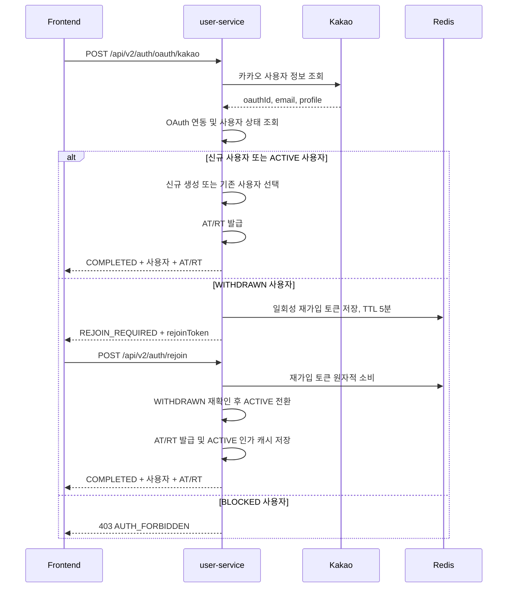

# 탈퇴 계정 재가입 백엔드 설계

- 작성일: 2026-07-30
- 상태: 확정
- 대상: `user-service` OAuth 로그인과 탈퇴 계정 복구 API

## 1. 배경

현재 회원 탈퇴는 사용자 데이터를 삭제하지 않고 `user.status`를 `WITHDRAWN`으로 변경하는
soft delete 방식이다. OAuth 연동 정보, 사용자 ID, 이메일, 역할 및 연관 데이터는 그대로 남는다.

현재 OAuth 로그인은 `(provider, oauthId)`에 해당하는 연동 정보가 있으면 사용자 상태와 관계없이
기존 사용자로 처리한다. 이 때문에 탈퇴 계정에도 Access Token과 Refresh Token이 발급되지만,
authorize 캐시에는 `WITHDRAWN` 상태가 저장되어 Gateway 인가 단계에서 보호 API 접근이 차단된다.

## 2. 목표

- 탈퇴 사용자가 재가입을 명시적으로 확인한 뒤에만 계정을 복구한다.
- 새로운 사용자를 만들지 않고 기존 계정을 `ACTIVE`로 복구한다.
- 기존 사용자 ID, 이메일, 역할 및 연관 데이터를 유지한다.
- 재가입 확인 전에는 서비스용 Access Token과 Refresh Token을 발급하지 않는다.
- 프론트엔드가 신규 가입, 정상 로그인, 재가입 필요 상태를 구분할 수 있게 한다.
- 재가입 확인 정보는 짧은 시간 동안 한 번만 사용할 수 있게 한다.

## 3. 범위 제외

- 탈퇴 데이터 보존 기간이나 영구 삭제 정책 변경
- 탈퇴 시 OAuth 연동 정보 삭제
- `BLOCKED` 계정의 해제 또는 재가입 처리
- 카카오 외 OAuth 공급자 추가
- 기존 사용자 ID, 역할 또는 연관 데이터 초기화
- 진행 중인 주문이 있는 사용자의 탈퇴 제한

## 4. 확정 정책

### 4.1 계정 복구

재가입은 새로운 사용자 생성이 아니라 기존 사용자 복구로 처리한다.

- `user.id`: 유지
- `user.email`: 유지
- `user.roles`: 유지
- 구매, 찜, 판매자 등 기존 연관 데이터: 유지
- `user.status`: `WITHDRAWN`에서 `ACTIVE`로 변경
- `auth` OAuth 연동: 유지

### 4.2 로그인 상태

`isNewUser`는 이번 OAuth 로그인에서 사용자 레코드가 새로 생성됐는지만 나타낸다. 재가입 여부를
판단하는 용도로 사용하지 않는다.

로그인 결과에는 다음 `loginStatus`를 추가한다.

| loginStatus | 의미 | 서비스 토큰 발급 |
|---|---|---|
| `COMPLETED` | 신규 가입 또는 정상 기존 사용자 로그인 완료 | 발급 |
| `REJOIN_REQUIRED` | 탈퇴 계정이며 사용자 확인 필요 | 미발급 |

`BLOCKED` 계정은 `REJOIN_REQUIRED`로 반환하지 않는다. `AUTH_FORBIDDEN(A004)`로 로그인을 거부하고
서비스 토큰을 발급하지 않는다.

## 5. 백엔드 처리 흐름



## 6. API 계약

### 6.1 OAuth 로그인

`POST /api/v2/auth/oauth/kakao`

기존 요청 형식은 유지한다.

```json
{
  "accessToken": "kakao-access-token"
}
```

#### 로그인 완료

기존 성공 응답 필드를 유지하면서 `loginStatus`를 추가한다.

```json
{
  "success": true,
  "data": {
    "loginStatus": "COMPLETED",
    "user": {
      "id": "uuid",
      "name": "카카오사용자",
      "email": "user@example.com",
      "roles": ["BUYER"]
    },
    "accessToken": "access-token",
    "refreshToken": "refresh-token",
    "tokenType": "Bearer",
    "expiresAt": "2026-07-30T12:15:00Z",
    "isNewUser": false
  },
  "message": "success"
}
```

신규 사용자는 `loginStatus=COMPLETED`, `isNewUser=true`로 반환한다.

#### 재가입 확인 필요

`WITHDRAWN` 사용자는 서비스 토큰 대신 재가입 전용 토큰만 받는다.

```json
{
  "success": true,
  "data": {
    "loginStatus": "REJOIN_REQUIRED",
    "isNewUser": false,
    "rejoinToken": "opaque-one-time-token",
    "rejoinExpiresAt": "2026-07-30T12:05:00Z"
  },
  "message": "success"
}
```

이 응답에는 `accessToken`, `refreshToken`, `tokenType`, `expiresAt`을 포함하지 않는다.
응답 필드 존재 여부가 아니라 `loginStatus`가 응답 타입의 판별자다.

### 6.2 재가입 확인

`POST /api/v2/auth/rejoin`

```json
{
  "rejoinToken": "opaque-one-time-token"
}
```

성공하면 기존 사용자 계정을 `ACTIVE`로 복구하고 `loginStatus=COMPLETED`,
`isNewUser=false`인 정상 로그인 응답을 반환한다.

### 6.3 오류 응답

새 오류 코드를 추가한다.

| 오류 코드 | HTTP | 메시지 | 발생 조건 |
|---|---:|---|---|
| `AUTH_REJOIN_TOKEN_INVALID(A014)` | 401 | 재가입 확인 정보가 유효하지 않거나 만료되었습니다. | 만료, 변조, 재사용, 상태 변경 |

프론트엔드가 계정 존재 여부나 내부 상태를 추론하지 못하게 만료, 변조, 재사용 및 이미 복구된 상태를
동일한 오류로 반환한다.

## 7. 재가입 토큰 정책

재가입 토큰은 서비스 API 접근 권한이 없는 일회성 확인 수단이다.

- 암호학적으로 안전한 난수 32바이트 이상을 사용한다.
- URL-safe 문자열로 인코딩한다.
- Redis TTL은 5분으로 설정한다.
- Redis에는 원문이 아닌 토큰의 SHA-256 해시를 키로 저장한다.
- 저장 값은 복구 대상 `userId`로 제한한다.
- 확인 시 조회와 삭제를 하나의 원자적 연산으로 수행한다.
- 로그, 예외 메시지 및 모니터링 태그에 원문 토큰을 기록하지 않는다.
- Access Token이나 Refresh Token으로 사용할 수 없게 별도 형식과 저장소를 사용한다.

Redis 토큰을 먼저 원자적으로 소비한 뒤 DB 복구를 처리한다. 이후 서버 오류가 발생하면 같은 토큰을
재사용하지 않고 OAuth 로그인부터 다시 진행한다. 이는 토큰 중복 사용 방지를 우선하는 fail-closed
정책이다.

## 8. 구현 작업

### 8.1 로그인 결과 모델

- [ ] `OAuthLoginResult`에 `loginStatus` 기반 결과 구분을 추가한다.
- [ ] 정상 로그인 결과와 재가입 필요 결과가 잘못 섞이지 않도록 구분 가능한 응답 타입으로 만든다.
- [ ] 정상 로그인 응답에는 기존 필드를 유지해 기존 프론트엔드 호환성을 보존한다.
- [ ] `REJOIN_REQUIRED` 응답에는 서비스 토큰이 직렬화되지 않게 한다.
- [ ] Swagger에 상태별 응답 예시와 필드 조건을 추가한다.

### 8.2 OAuth 로그인 서비스

- [ ] 기존 OAuth 연동으로 사용자를 조회한 뒤 `UserStatus`를 검사한다.
- [ ] `ACTIVE` 사용자는 기존 로그인 흐름을 유지한다.
- [ ] 신규 사용자는 기존 자동 회원가입 흐름을 유지한다.
- [ ] `WITHDRAWN` 사용자는 재가입 토큰만 생성하고 AT/RT 발급 로직을 실행하지 않는다.
- [ ] `BLOCKED` 사용자는 `AUTH_FORBIDDEN(A004)`로 거부하고 어떤 토큰도 발급하지 않는다.
- [ ] 로그인과 재가입에서 중복되는 AT/RT 발급 로직을 하나의 내부 컴포넌트로 분리한다.

### 8.3 재가입 토큰

- [ ] 재가입 토큰 생성·저장·소비를 위한 포트와 Redis 어댑터를 추가한다.
- [ ] TTL을 5분으로 적용한다.
- [ ] Redis에는 토큰 해시와 복구 대상 사용자 ID만 저장한다.
- [ ] 소비 연산은 동시 요청에서도 하나만 성공하도록 원자적으로 구현한다.
- [ ] Redis 장애 시 재가입을 허용하지 않는 fail-closed 정책을 적용한다.

### 8.4 재가입 유스케이스

- [ ] `POST /api/v2/auth/rejoin` 컨트롤러와 유스케이스를 추가한다.
- [ ] 요청 DTO에서 빈 토큰을 검증한다.
- [ ] 토큰을 원자적으로 소비하고 대상 사용자를 조회한다.
- [ ] 사용자 상태가 여전히 `WITHDRAWN`인지 확인한다.
- [ ] `User.activate()`로 상태만 `ACTIVE`로 변경한다.
- [ ] 사용자 ID, 이메일, 역할 및 연관 데이터를 변경하지 않는다.
- [ ] 새 Refresh Token과 Access Token을 발급한다.
- [ ] 인가 캐시에 `ACTIVE` 상태와 기존 대표 역할을 저장한다.
- [ ] 결과를 `COMPLETED`, `isNewUser=false`로 반환한다.

### 8.5 오류·API 문서

- [ ] `AUTH_REJOIN_TOKEN_INVALID(A014)` 오류 코드를 추가한다.
- [ ] `docs/error-codes.md`에 오류 코드를 반영한다.
- [ ] `docs/api-spec/auth.md`에 로그인 분기와 재가입 API를 반영한다.
- [ ] OpenAPI 명세를 갱신한다.
- [ ] API 변경 내용을 프론트엔드에 공유한다.

## 9. 테스트

### 9.1 OAuth 로그인

- [ ] 신규 사용자는 `COMPLETED`, `isNewUser=true`와 AT/RT를 받는다.
- [ ] 기존 `ACTIVE` 사용자는 `COMPLETED`, `isNewUser=false`와 AT/RT를 받는다.
- [ ] `WITHDRAWN` 사용자는 `REJOIN_REQUIRED`와 재가입 토큰만 받는다.
- [ ] `WITHDRAWN` 로그인 단계에서 Refresh Token 저장소가 호출되지 않는다.
- [ ] `BLOCKED` 사용자는 403을 받고 어떤 토큰도 받지 않는다.

### 9.2 재가입

- [ ] 유효한 재가입 토큰으로 상태가 `ACTIVE`로 변경된다.
- [ ] 재가입 전후 사용자 ID, 이메일 및 역할이 동일하다.
- [ ] 재가입 성공 시 새 AT/RT가 발급되고 ACTIVE 인가 캐시가 저장된다.
- [ ] 만료, 변조, 재사용 토큰은 모두 `A014`로 거부된다.
- [ ] 동시에 같은 토큰을 사용하면 한 요청만 성공한다.
- [ ] 재가입 처리 중 상태가 이미 변경됐으면 `A014`로 거부한다.
- [ ] Redis 장애 시 재가입이 실패하고 계정이 활성화되지 않는다.
- [ ] Controller 테스트에서 상태별 JSON 필드 포함·미포함을 검증한다.

## 10. 배포와 호환성

프론트엔드가 `loginStatus` 분기를 지원한 뒤 백엔드를 배포한다.

- 정상 로그인 응답에는 기존 필드를 유지하면서 `loginStatus`만 추가한다.
- 탈퇴 사용자만 새 `REJOIN_REQUIRED` 분기로 변경한다.
- 백엔드를 먼저 배포하면 기존 프론트엔드가 존재하지 않는 AT/RT를 저장하려 할 수 있다.

다음 지표를 집계하되 사용자 ID와 토큰 원문은 기록하지 않는다.

- `REJOIN_REQUIRED` 발급 수
- 재가입 성공 수
- `A014` 발생 수
- 재가입 API 서버 오류 수
- Redis 토큰 저장·소비 실패 수

## 11. 완료 조건

- 탈퇴 계정 로그인 시 서비스용 AT/RT가 발급되지 않는다.
- 유효한 재가입 확인 요청에서만 기존 계정이 `ACTIVE`로 변경된다.
- 사용자 ID, 이메일, 역할 및 기존 연관 데이터가 유지된다.
- 취소 또는 토큰 만료 시 계정은 `WITHDRAWN` 상태를 유지한다.
- 재가입 성공 후 정상 로그인 세션이 발급되고 보호 API를 이용할 수 있다.
- 동일한 재가입 토큰으로 두 번 복구할 수 없다.
- 신규 가입, 정상 로그인 및 `BLOCKED` 로그인 흐름에 회귀가 없다.
