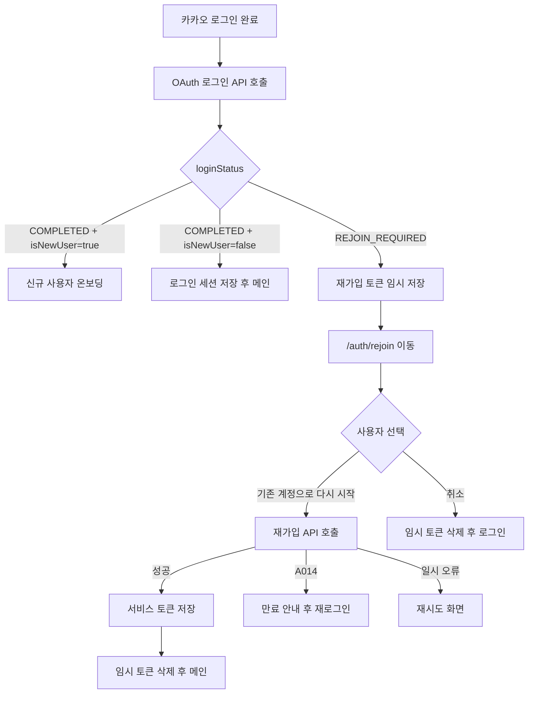

# 탈퇴 계정 재가입 프론트엔드 설계

- 작성일: 2026-07-30
- 상태: 확정
- 대상: OAuth 로그인 콜백, 재가입 확인 화면과 프론트엔드 인증 상태

## 1. 배경

기존 `isNewUser`는 이번 로그인에서 사용자 레코드가 새로 생성됐는지만 나타낸다.
정상 기존 사용자와 탈퇴 사용자는 모두 `isNewUser=false`이므로 이 값만으로 재가입 여부를 판단할 수 없다.

백엔드는 탈퇴 계정 로그인 시 서비스용 Access Token과 Refresh Token을 발급하지 않고
`loginStatus=REJOIN_REQUIRED`와 일회성 재가입 토큰을 반환한다. 프론트엔드는 이 상태를 감지해
전용 재가입 확인 화면으로 이동해야 한다.

## 2. 목표

- 신규 가입, 정상 로그인, 재가입 필요 상태를 명확하게 분기한다.
- 탈퇴 사용자가 명시적으로 확인했을 때만 재가입 API를 호출한다.
- 재가입 확인 전에는 서비스 로그인 세션을 생성하지 않는다.
- 재가입 토큰을 현재 탭에서만 짧게 보관하고 URL이나 로그에 노출하지 않는다.
- 성공, 취소, 만료 및 네트워크 오류를 예측 가능한 화면으로 제공한다.

## 3. 범위 제외

- 탈퇴 계정의 데이터 보존 정책 변경
- `BLOCKED` 계정의 해제 화면
- 카카오 외 OAuth 공급자 추가
- 백엔드의 재가입 토큰 생성·검증 구현
- 기존 로그인 토큰 저장 정책 변경

## 4. 백엔드 API 의존 계약

### 4.1 로그인 완료

`POST /api/v2/auth/oauth/kakao`가 신규 또는 `ACTIVE` 사용자를 처리하면 다음 응답을 반환한다.

```json
{
  "success": true,
  "data": {
    "loginStatus": "COMPLETED",
    "user": {
      "id": "uuid",
      "name": "카카오사용자",
      "email": "user@example.com",
      "roles": ["BUYER"]
    },
    "accessToken": "access-token",
    "refreshToken": "refresh-token",
    "tokenType": "Bearer",
    "expiresAt": "2026-07-30T12:15:00Z",
    "isNewUser": false
  },
  "message": "success"
}
```

### 4.2 재가입 확인 필요

탈퇴 사용자는 서비스 토큰 없이 다음 응답을 받는다.

```json
{
  "success": true,
  "data": {
    "loginStatus": "REJOIN_REQUIRED",
    "isNewUser": false,
    "rejoinToken": "opaque-one-time-token",
    "rejoinExpiresAt": "2026-07-30T12:05:00Z"
  },
  "message": "success"
}
```

`REJOIN_REQUIRED` 응답에는 `accessToken`, `refreshToken`, `tokenType`, `expiresAt`이 없다.

### 4.3 재가입 확인

```http
POST /api/v2/auth/rejoin
Content-Type: application/json
```

```json
{
  "rejoinToken": "opaque-one-time-token"
}
```

성공하면 `loginStatus=COMPLETED`, `isNewUser=false`와 정상 로그인 세션을 반환한다.

만료, 변조, 재사용 또는 이미 상태가 변경된 토큰은 다음 오류로 통일한다.

| 오류 코드 | HTTP | 메시지 |
|---|---:|---|
| `AUTH_REJOIN_TOKEN_INVALID(A014)` | 401 | 재가입 확인 정보가 유효하지 않거나 만료되었습니다. |

`BLOCKED` 계정은 `AUTH_FORBIDDEN(A004)` 403을 받고 재가입 화면으로 이동하지 않는다.

## 5. 로그인 응답 타입

OAuth 로그인 응답을 `loginStatus` 기반의 구분 가능한 유니온 타입으로 정의한다.

```ts
type CompletedLogin = {
  loginStatus: "COMPLETED";
  isNewUser: boolean;
  user: User;
  accessToken: string;
  refreshToken: string;
  tokenType: "Bearer";
  expiresAt: string;
};

type RejoinRequired = {
  loginStatus: "REJOIN_REQUIRED";
  isNewUser: false;
  rejoinToken: string;
  rejoinExpiresAt: string;
};

type OAuthLoginResult = CompletedLogin | RejoinRequired;
```

프론트엔드는 응답 필드 존재 여부가 아니라 `loginStatus`로 타입을 좁힌다.

## 6. 화면 전환 흐름



OAuth 콜백 분기 예시:

```ts
if (result.loginStatus === "REJOIN_REQUIRED") {
  rejoinSession.save(result.rejoinToken, result.rejoinExpiresAt);
  navigate("/auth/rejoin");
  return;
}

authSession.save(result);
navigate(result.isNewUser ? "/onboarding" : "/");
```

## 7. 구성요소 책임

### 7.1 `OAuthCallbackPage`

- 카카오 로그인 API를 호출한다.
- `loginStatus`에 따라 정상 로그인과 재가입 필요 상태를 분기한다.
- `COMPLETED`에서만 서비스 로그인 토큰을 저장한다.
- `REJOIN_REQUIRED`이면 재가입 토큰을 저장하고 전용 화면으로 이동한다.
- `AUTH_FORBIDDEN(A004)`이면 이용 제한 화면으로 이동한다.

### 7.2 `RejoinPage`

- 재가입 안내와 확인·취소 버튼을 렌더링한다.
- 진입 시 재가입 토큰과 만료 시각을 확인한다.
- 확인, 처리 중, 성공 및 오류 상태를 관리한다.
- 화면 진입만으로 재가입 API를 호출하지 않는다.

### 7.3 `authApi.rejoin`

- `POST /api/v2/auth/rejoin` 요청과 응답 매핑을 담당한다.
- UI 컴포넌트에서 HTTP 세부 구현을 분리한다.

### 7.4 `rejoinSession`

- `sessionStorage`의 재가입 토큰과 만료 시각을 저장·조회·삭제한다.
- 토큰 키 이름과 직렬화 형식을 한곳에서 관리한다.
- 성공, 취소, 만료 시 임시 정보를 삭제한다.

## 8. 전용 재가입 화면

경로는 `/auth/rejoin`을 사용한다.

### 8.1 기본 구성

- 제목: `다시 만나 반가워요`
- 설명: `이전에 탈퇴한 계정입니다. 재가입하면 기존 계정을 그대로 이어서 사용할 수 있어요.`
- 유지 항목:
  - 기존 사용자 ID
  - 구매·찜 등 기존 데이터
  - 판매자 역할 등 기존 권한
  - 기존 OAuth 연동
- 주 버튼: `기존 계정으로 다시 시작`
- 보조 버튼: `취소하고 로그인으로 돌아가기`

`새 계정을 만듭니다`, `탈퇴를 취소합니다`, `삭제한 데이터를 복구합니다` 같은 표현은 사용하지 않는다.
정책상 정확한 표현인 `기존 계정을 다시 활성화합니다`로 통일한다.

### 8.2 기본 상태

- 복구되는 항목을 안내한다.
- 확인과 취소 버튼을 활성화한다.
- 취소하면 아무 변경도 발생하지 않는다는 점을 표시한다.

### 8.3 처리 중

- 주 버튼 문구를 `계정을 복구하고 있어요`로 변경한다.
- 확인과 취소 버튼을 비활성화한다.
- 중복 클릭과 중복 API 요청을 차단한다.
- 처리 상태를 스크린 리더에 알린다.

### 8.4 성공

- 반환된 Access Token과 Refresh Token을 기존 로그인 저장 방식으로 저장한다.
- `sessionStorage`의 재가입 정보를 삭제한다.
- `계정이 다시 활성화되었습니다` 토스트를 표시한다.
- 메인 화면으로 이동한다.

### 8.5 토큰 만료·무효

`A014`를 받거나 저장된 만료 시각이 지난 경우 다음 화면을 표시한다.

```text
재가입 확인 시간이 만료되었어요
안전한 계정 복구를 위해 다시 로그인해주세요.

[카카오로 다시 로그인]
```

임시 토큰을 삭제하고 카카오 인증부터 다시 시작하게 한다.

### 8.6 네트워크·일시 오류

```text
계정을 복구하지 못했어요
잠시 후 다시 시도해주세요.

[다시 시도] [로그인으로 돌아가기]
```

네트워크 오류에서는 유효기간이 남은 재가입 토큰을 유지해 다시 시도할 수 있게 한다.

## 9. 임시 토큰 보관

- 재가입 토큰과 만료 시각은 현재 탭의 `sessionStorage`에만 보관한다.
- `localStorage`, URL, 쿼리 파라미터 및 라우터 path state에 원문 토큰을 넣지 않는다.
- 콘솔 로그, 오류 수집 도구 및 분석 이벤트에 원문 토큰을 기록하지 않는다.
- 새로고침 후에도 유효한 토큰이면 재가입 화면을 유지한다.
- 다른 탭과 토큰을 공유하지 않는다.
- 성공, 취소, 만료 또는 `A014` 수신 시 즉시 삭제한다.
- 토큰 없이 `/auth/rejoin`에 직접 접근하면 로그인 화면으로 이동한다.

## 10. 구현 작업

### 10.1 API와 타입

- [ ] OAuth 로그인 응답 타입을 `loginStatus` 기반 유니온으로 변경한다.
- [ ] `COMPLETED`에서만 사용자와 AT/RT 필드에 접근할 수 있게 한다.
- [ ] `REJOIN_REQUIRED`에서만 재가입 토큰과 만료 시각에 접근할 수 있게 한다.
- [ ] 재가입 API 호출 함수를 추가한다.
- [ ] `A014`와 `A004` 오류 매핑을 추가한다.
- [ ] 백엔드 전환 기간에는 `loginStatus`가 없는 기존 응답을 `COMPLETED`로 취급한다.

### 10.2 로그인 콜백

- [ ] `REJOIN_REQUIRED`이면 서비스 토큰 저장 로직을 실행하지 않는다.
- [ ] 재가입 토큰과 만료 시각을 임시 저장한다.
- [ ] `/auth/rejoin`으로 이동한다.
- [ ] `COMPLETED + isNewUser=true`이면 신규 사용자 온보딩으로 이동한다.
- [ ] `COMPLETED + isNewUser=false`이면 메인 화면으로 이동한다.
- [ ] `AUTH_FORBIDDEN(A004)`은 이용 제한 화면으로 이동한다.

### 10.3 재가입 세션

- [ ] `rejoinSession` 모듈을 만든다.
- [ ] 저장·조회·삭제와 만료 여부 확인을 제공한다.
- [ ] URL, 로그 및 분석 이벤트에 토큰이 노출되지 않게 한다.
- [ ] 성공, 취소, 만료 및 `A014` 처리에서 토큰을 삭제한다.

### 10.4 재가입 화면

- [ ] `/auth/rejoin` 경로와 페이지를 추가한다.
- [ ] 확정된 제목, 설명, 유지 항목과 버튼 문구를 적용한다.
- [ ] 토큰 없이 직접 접근하면 로그인 화면으로 이동한다.
- [ ] 확인 버튼을 눌렀을 때만 재가입 API를 호출한다.
- [ ] 기본, 처리 중, 성공, 만료 및 일시 오류 상태를 구현한다.
- [ ] 중복 클릭으로 API가 여러 번 호출되지 않게 한다.
- [ ] 취소하면 임시 토큰만 삭제하고 로그인 화면으로 이동한다.

### 10.5 접근성

- [ ] 페이지 진입 시 제목으로 포커스를 이동하거나 스크린 리더가 제목을 인식하게 한다.
- [ ] 처리 중과 오류 상태를 `aria-live`로 알린다.
- [ ] 버튼 비활성화 여부를 색상만으로 표현하지 않는다.
- [ ] 키보드만으로 확인, 취소 및 재시도 동작을 수행할 수 있게 한다.

## 11. 테스트

### 11.1 로그인 분기

- [ ] `COMPLETED + isNewUser=true`이면 온보딩으로 이동한다.
- [ ] `COMPLETED + isNewUser=false`이면 메인 화면으로 이동한다.
- [ ] `REJOIN_REQUIRED`이면 서비스 토큰을 저장하지 않고 재가입 화면으로 이동한다.
- [ ] `AUTH_FORBIDDEN(A004)`이면 재가입 화면으로 이동하지 않는다.
- [ ] `loginStatus`가 없는 기존 응답을 전환 기간 동안 정상 로그인으로 처리한다.

### 11.2 재가입 화면

- [ ] 재가입 토큰이 없으면 로그인 화면으로 이동한다.
- [ ] 저장된 토큰이 만료됐으면 재로그인 안내를 표시한다.
- [ ] 확인 버튼을 여러 번 눌러도 재가입 API는 한 번만 호출된다.
- [ ] 성공하면 서비스 토큰 저장, 임시 토큰 삭제 및 메인 이동이 실행된다.
- [ ] 취소하면 임시 토큰 삭제와 로그인 이동만 실행된다.
- [ ] `A014`이면 임시 토큰을 삭제하고 만료 안내를 표시한다.
- [ ] 네트워크 오류이면 유효한 임시 토큰을 유지하고 재시도 버튼을 표시한다.
- [ ] 새로고침 후 유효한 `sessionStorage` 토큰으로 화면을 유지한다.

### 11.3 보안·접근성

- [ ] URL과 브라우저 로그에 재가입 토큰이 포함되지 않는다.
- [ ] 처리 중 중복 제출이 차단된다.
- [ ] 스크린 리더가 처리 중과 오류 상태를 인식한다.
- [ ] 키보드로 모든 주요 동작을 수행할 수 있다.

## 12. 배포 순서

프론트엔드를 백엔드보다 먼저 배포한다.

1. `loginStatus`가 있으면 새 분기를 사용한다.
2. 필드가 없는 기존 백엔드 응답은 `COMPLETED`로 처리한다.
3. 백엔드 배포 후 탈퇴 사용자에게 `REJOIN_REQUIRED` 흐름이 활성화된다.
4. 배포 안정화 후 기존 응답 fallback 제거 여부를 별도 릴리스에서 결정한다.

다음 익명 지표를 수집할 수 있다.

- 재가입 화면 진입 수
- 재가입 확인 클릭 수
- 취소 수
- 재가입 성공 수
- 만료 안내 노출 수
- 일시 오류 및 재시도 수

사용자 ID와 재가입 토큰 원문은 분석 이벤트에 포함하지 않는다.

## 13. 완료 조건

- 탈퇴 계정 로그인 시 전용 재가입 화면이 표시된다.
- 재가입 확인 전에는 서비스 로그인 세션이 저장되지 않는다.
- 사용자가 확인 버튼을 누른 경우에만 재가입 API가 호출된다.
- 성공하면 기존 로그인 방식으로 세션을 저장하고 메인 화면으로 이동한다.
- 취소, 만료 및 무효 토큰은 계정 복구 없이 안전하게 로그인 화면으로 돌아간다.
- 신규 가입, 정상 로그인 및 `BLOCKED` 로그인 분기가 서로 혼동되지 않는다.
- 토큰 원문이 URL, 로그 및 분석 이벤트에 노출되지 않는다.
