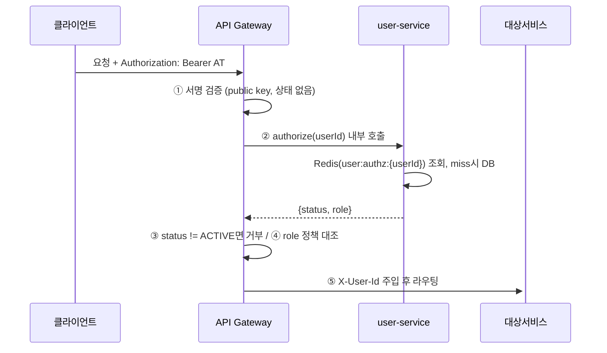
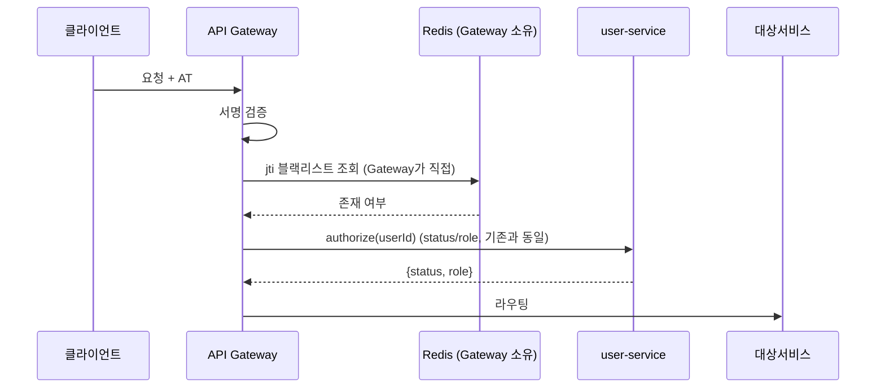
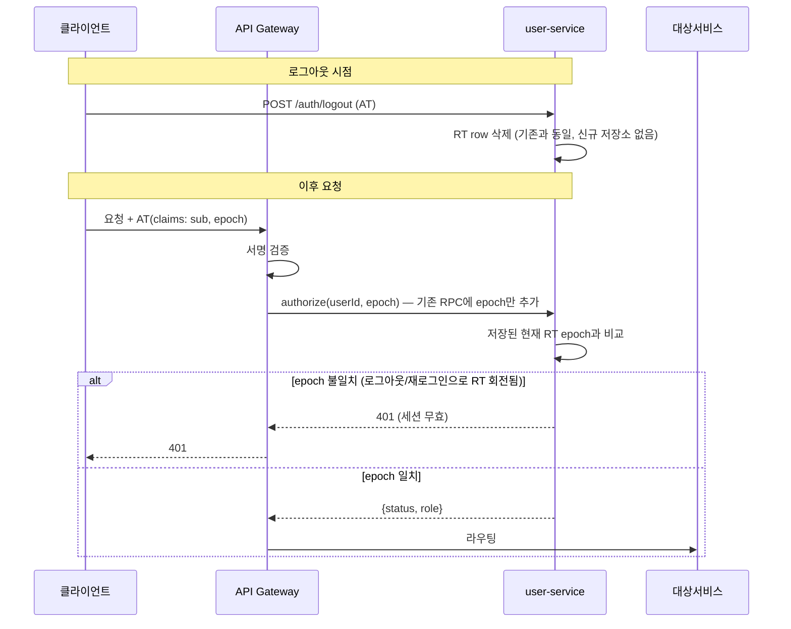

# 로그아웃 시 AT 즉시 무효화 — 설계 방향 검토

- 상태: **결정 완료 (2026-07-11, 멘토 확인)**. 옵션 B 채택 — `docs/adr/0008-user-service-forward-auth.md` §8-1로 반영됨.
  블랙리스트(옵션 A)는 폐기, 여러 기기 동시 로그인 지원 시 재검토. 이 문서는 결정에 이른 과정 기록으로 남긴다.
- 관련: `docs/adr/0008-user-service-forward-auth.md`(이하 ADR-0008),
`user-service/docs/frontend-notice-kakao-login-change.md` §5
- 이 문서가 건드리는 범위: ADR-0008 §8의 딱 한 줄 —
  > 일반 로그아웃: RT 삭제만. AT는 만료까지(≤15분) 유효 — 기존 API 스펙 유지.

  **ADR-0008 §9("블랙리스트 폐기")를 뒤집자는 문서가 아니다.** §9가 폐기한 블랙리스트는
  "정지·탈퇴 계정을 즉시 차단"용이었고, 그 문제는 forward-auth(§5)로 이미 해결된다.
  이 문서가 다루는 건 그것과 별개인 "정상 로그아웃한 세션의 AT"를 즉시 죽일지 말지다.

---

## 1. 문제 재확인

로그아웃은 RT만 지운다. AT는 서명 검증만으로 통과되므로, 로그아웃 직후에도 그 AT의
사본(다른 탭, 브라우저 재실행, 유출된 사본 등)은 만료 시각(≤15분)까지 계속 인증된다.
프론트가 로컬 스토리지의 AT를 지워도 이 문제는 없어지지 않는다 — 서버가 "로그아웃 여부"를
AT 검증에 반영할 방법 자체가 없기 때문이다.

## 2. 왜 "그냥 AT도 지우면 되지 않나"가 답이 안 되는가

|             | RT                          | AT                                 |
| ----------- | --------------------------- | ---------------------------------- |
| 서버에 저장돼 있는가 | O (`refresh_token` 테이블 row) | X (발급 후 서버는 다시 들고 있지 않음)           |
| "삭제"의 의미    | 그 row를 DELETE               | **정의 자체가 없음** — 지울 대상이 없다          |
| 무효화하려면      | 있는 row를 지우면 끝               | **새로 "거부 기록"을 만들고, 매 검증마다 조회**해야 함 |

AT를 무효화하려면 결국 "이 AT(또는 그 식별자)는 거부"라는 레코드를 어딘가에 새로 만들고,
매 요청마다 그걸 조회해야 한다. 이름을 뭐라고 부르든 **그 구조 자체가 블랙리스트**다.
피해 갈 수 있는 제3의 방법은 없다 — 비대칭키 회전도 안 된다(공유 키 회전은 전체 유저를
강제 로그아웃시키고, 유저별 키는 결국 "이 유저 키가 뭐였지" 조회가 필요해 블랙리스트와
같은 부담이 생긴다).

## 3. 이미 정해진 것 — ADR-0008 §9가 "블랙리스트"를 폐기한 이유

> 기각된 대안: gateway가 Redis를 직접 읽는 중앙 인가(블랙리스트/role 캐시) — 기각 사유:
> **gateway를 상태 저장소 의존 없이 순수하게 유지하는 팀 방침**

이 방침은 여전히 유효하다고 보고 있음. 그래서 "Gateway가 직접 Redis를 보는" 형태는
피하고 싶다는 게 지금 느끼는 감(feeling)이고, 이 문서 3번째 헷갈림의 근원이다.

---

## 3.5 지금 흐름 (ADR-0008 목표 설계, 세션 체크 없이)

- 이 왕복(②)은 **로그아웃 문제와 무관하게 이미 ADR-0008에 포함돼 있다.**
(결과 항목 4: "매 인증 요청에 내부 왕복 1회(수 ms)가 추가된다" — 이미 수용한 비용)
- 즉 "매번 요청을 보내야 한다"는 부담은 **세션 체크를 추가하든 안 하든 이미 존재**한다.
옵션 B가 이 왕복에 검사 하나를 얹는 건 **새 비용이 아니라 이미 지불한 비용의 재사용**이다.

---

## 4. 옵션 비교

### 옵션 A — Gateway가 직접 Redis 블랙리스트 조회

- Gateway가 **직접** Redis 상태를 소유·조회 → ADR-0008 §9가 명시적으로 기각한 형태
(구 ADR-0002)를 정면으로 되살리는 것.
- 팀 방침("Gateway 상태 없음") 위반. **되돌리려면 ADR-0008을 공식적으로 개정**해야 함.

### 옵션 B — user-service의 authorize() 응답에 세션 유효성을 얹는다

- **핵심 아이디어**: RTR(§ADR-0008 결정2)에서 "저장된 현재 RT"는 이미 유저당 1개만
추적된다(재사용 감지 로직이 단수로 비교). 그러니 AT에 "이 AT가 발급될 때의 RT epoch"만
실어두면, **로그아웃이 지금처럼 RT를 지우는 순간 그 epoch은 자동으로 무효**가 된다.
블랙리스트처럼 "거부 목록"을 새로 만들 필요 없이, **이미 있는 RT 상태를 재사용**하는 것.
- Gateway는 지금처럼 상태 없음 유지. 상태(=epoch 비교)는 이미 상태를 갖고 있던
user-service 안에서 처리.
- 왕복 비용은 3.5의 기존 authorize() 호출에 얹히므로 **신규 네트워크 홉 없음**.
- 대신 AT 클레임에 `epoch` 하나가 추가됨 → ADR-0008 결정2 "클레임은 sub만"을 살짝 건드림
(§6 "열린 질문" 참고).

### 옵션 C — 현행 유지 (ADR-0008 결과 항목 5 그대로)

- 아무것도 안 바꾼다. 로그아웃 후 AT는 최대 15분 유효 리스크를 계속 수용.
- 비용 0, 팀 방침도 안 건드림. 대신 원래 문제(다른 탭/유출 사본 최대 15분 노출)는 안 풀림.

|               | 옵션 A (Gateway 블랙리스트) | 옵션 B (authorize()에 세션 검증)    | 옵션 C (현행 유지) |
| ------------- | -------------------- | ---------------------------- | ------------ |
| Gateway 상태 보유 | O (위반)               | X (유지)                       | X            |
| 신규 네트워크 홉     | O (Gateway↔Redis 추가) | X (기존 authorize 호출 재사용)      | -            |
| 신규 저장소        | O (블랙리스트)            | X (기존 RT 상태 재사용)             | -            |
| AT 클레임 변경     | 불필요                  | `epoch` 추가 필요                | -            |
| ADR-0008과의 관계 | §9 정면 반박 (개정 필요)     | §8 한 줄만 좁게 수정                | 변경 없음        |
| 로그아웃 즉시성      | 즉시                   | 즉시(다음 요청부터, authorize 호출 시점) | 최대 15분 노출    |

---

## 5. "Gateway = 인증, user-service = 인가"라는 프레임이 헷갈림을 푸는가?

이 프레임을 적용하면 지금 느끼는 불편함이 왜 생기는지 설명은 된다:

- **인증(Authentication)** = "이 서명이 유효한가, 이 사람이 주장하는 신원이 맞는가."
이건 정적(static) 판단이라 상태 없이(공개키만으로) 완결된다. Gateway가 이 역할이라면
상태가 없는 게 맞다.
- **인가(Authorization)** = "이 신원이 **지금** 이 행동을 할 자격이 있는가." 이건 본질적으로
동적(dynamic) 판단이다 — "지금"이라는 말 자체가 어딘가에 저장된 현재 상태를 봐야 한다는
뜻이다. user-service가 이 역할이라면 상태(Redis/DB)를 갖는 게 자연스럽다.
- **로그아웃 = "이 세션은 이제 인가되지 않는다"는 선언**이다. 이건 "서명이 맞냐"의
문제가 아니라 "지금도 유효하냐"의 문제이므로, 이 프레임에서는 **인가 쪽(user-service)
소관이 맞다.** 그래서 옵션 B가 이 프레임과 자연스럽게 들어맞는다.

즉 이 프레임은 "왜 Gateway는 상태가 없어도 되고 user-service는 있어야 하는지"를
설명해주는 데는 유효하다. 다만 이게 실무적으로 100% 깔끔하게 정리되는 것은 아니고,
아래 열린 질문들이 남는다.

---

## 6. 열린 질문 — 멘토에게 물어볼 것

1. **클레임 확장 범위.** ADR-0008 결정2는 "클레임은 sub만"을 꽤 단호하게 못박았다
role/status를 뺀 이유: 발급 시점 스냅샷이라 최대 15분 stale). `epoch`(세션 버전)은
ole/status와 성격이 다르다 — "언젠가 바뀌는 비즈니스 값"이 아니라 "이 토큰이 몇 번째
션인지"를 가리키는 단조 증가 값이라 stale 문제가 없다. 그래도 이걸 "sub만" 원칙의
외로 넣는 게 맞는지, 아니면 이것도 남용의 시작인지 판단이 필요하다.
2. **실패 정책.** ADR-0008은 실패 모드를 이미 두 갈래로 나눠뒀다 — status 불일치는 ail-closed(거부), authz 캐시 자체의 Redis 장애는 fail-soft(DB 폴백). `epoch` 비교는   
어느 쪽이어야 하나? (개인적으로는 fail-closed 쪽이 맞다고 생각하는데 — 인가는 값이 으면 통과시킬 수 없다는 ADR-0008 결정5의 논리를 그대로 따르면 그렇다.)
3. **"유저당 세션 1개" 가정이 계속 유효한가.** 옵션 B는 RTR의 "저장된 현재 RT는 유저당
개"라는 전제에 올라타 있다. 나중에 "여러 기기 동시 로그인"을 지원하게 되면 이 전제가
지고, epoch은 유저 단위가 아니라 세션(디바이스) 단위로 다시 설계해야 한다. 지금
위에서 이걸 미리 대비해야 하는지, 필요할 때 다시 설계해도 되는지.
4. **이 문서가 ADR-0008을 개정하는 범위가 맞는지.** 이 문서는 §8의 한 줄만 좁게
정하자는 제안이고 §9(블랙리스트 폐기)는 그대로 둔다고 보는데, 이 구분이
리적인지, 아니면 애초에 "그냥 현행 유지(옵션 C)"가 이 시점엔 더 맞는지.

## 7. 결론

옵션 B 채택. §6 열린 질문 답변: (1) `epoch`는 "sub만" 원칙의 예외로 명시, (2) epoch 불일치는
fail-closed(401), (3) "유저당 세션 1개" 전제는 유지하고 여러 기기 동시 로그인 지원 시 재설계,
(4) 이 문서는 ADR-0008 §8 한 줄만 좁게 수정하는 범위이며 §9(블랙리스트 폐기)는 유지·강화됨.
반영 결과는 `docs/adr/0008-user-service-forward-auth.md` §8-1 참고.